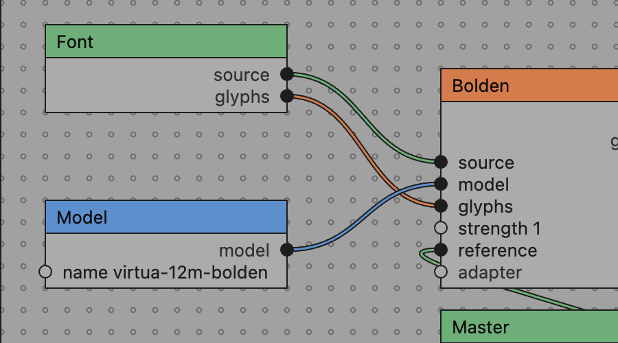
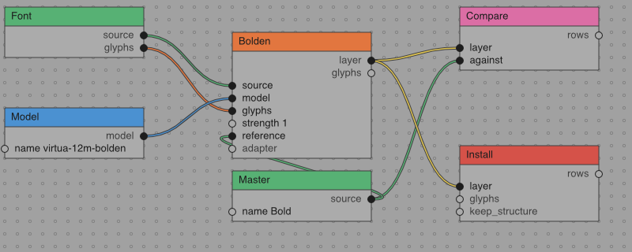

import Callout from '../../../components/Callout.astro'

<Callout variant="warning" title="Work in progress">
This post is a draft. Parts of it were written with AI assistance and
have not been edited yet. Numbers and code names are from the day the
work was done.
</Callout>

Runebender is a font editor with local models built in. Until this
week the models sat behind buttons: pick a model, run a task on this
glyph or every glyph, install or discard the result. That is enough
for one task. It is not enough to train an adapter, apply it, run the
model, compare against a hand-drawn master, and install, in one go,
and see what each step gave. ComfyUI solved that problem for image
models with a node graph. This post is about building the same thing
for fonts, and about what building it twice showed.



### Section Index

<nav class="section-index" aria-label="Contents">
<ol>
<li><a href="#01-what-comfyui-does-and-what-we-took"><span class="n">01</span>What ComfyUI Does, and What We Took</a></li>
<li><a href="#02-one-file-and-a-headless-run"><span class="n">02</span>One File, and a Headless Run</a></li>
<li><a href="#03-adapters-the-way-loraloader-does-them"><span class="n">03</span>Adapters, the Way LoraLoader Does Them</a></li>
<li><a href="#04-the-canvas-on-the-editors-own-parts"><span class="n">04</span>The Canvas on the Editor's Own Parts</a></li>
<li><a href="#05-colour-from-the-grid-marks"><span class="n">05</span>Colour from the Grid Marks</a></li>
<li><a href="#06-a-grid-of-rings"><span class="n">06</span>A Grid of Rings</a></li>
<li><a href="#07-the-jaggies-and-where-they-come-from"><span class="n">07</span>The Jaggies, and Where They Come From</a></li>
<li><a href="#08-the-same-canvas-in-vello"><span class="n">08</span>The Same Canvas in Vello</a></li>
<li><a href="#09-squares-not-circles"><span class="n">09</span>Squares, Not Circles</a></li>
<li><a href="#10-what-the-split-bought"><span class="n">10</span>What the Split Bought</a></li>
</ol>
</nav>

### 01. What ComfyUI Does, and What We Took

ComfyUI is six things: a node registry, a workflow file, a headless
run, a cache, a model folder, and a community. A font editor needs the
first five. I checked each one against the ComfyUI docs and its
`nodes.py` before writing anything, and mapped it onto what Runebender
already had.

The registry was already there. Runebender's model runtime is a
separate program, `font-ml`, and `font-ml tasks --json` returns every
task it runs with typed inputs and outputs. A type is a short word:
`source`, `model`, `glyphs`, `number`, `layer`, `rows`. That list is
what ComfyUI's `/object_info` gives, with `INPUT_TYPES` and
`RETURN_TYPES`. So a node type is one task, and the editor never
names a task in its own code. A task the tool gains is a node the
editor can add, with no change to the editor.

Core adds nine node types of its own: the open font, a master by
name, a model, an adapter, a layer, install, compare, proof, and a
note. Those are the parts that read or change the font, and the
editor's core library already knew how to do each of them.

### 02. One File, and a Headless Run

ComfyUI keeps two file formats. The workflow file has node positions
and widget values. The "API format" strips the positions so a script
can post it to the server. We keep one file, `<name>.nodes.json`. It
has a version and two lists. The nodes carry a type, a position and
the values typed into them. The links are four-element arrays:

```json
[3, "layer", 5, "layer"]
```

That is node 3's `layer` output into node 5's `layer` input. A
headless run reads the same file and ignores the positions.

The run is a command, not a server:

```sh
runebender-core nodes run bolden.nodes.json --font VirtuaGrotesk.designspace --glyphs H,O,n
```

It validates first. A file that will not run says why. There are
eleven kinds of problem. The common ones are an unknown type, a link
into a port that does not exist, two kinds that do not match, a
required input with no wire and no value, and a cycle. Then it runs
each node in dependency order. A tool node runs `font-ml` as a subprocess. Progress lines come
back on stderr in the same `progress 12/397 H` form the panel already
parsed, so the editor shows per-node progress with no new protocol.

ComfyUI re-runs a node only when its inputs changed. We do the same
with a cache file beside the graph. Before a node runs, its inputs are
hashed: the typed values, the hashes of the nodes it reads from, and
for a font or a layer the glyph files themselves. For a model, the
digest in its manifest. A node whose hash has not moved is skipped
and its outputs reused. Install is never skipped, because it changes
the font, and the cache does not know what the designer did to the
foreground since.

On a copy of the demo font, the whole bolden graph on three glyphs
took 3.4 seconds the first time and re-ran only what had to re-run the
second time. Install had changed the Regular on disk, so the font hash
moved and Bolden ran again. That was correct, and it was also a lesson:
a graph with an Install node contaminates the copy it runs on. Run
those last, and reset between takes.

### 03. Adapters, the Way LoraLoader Does Them

ComfyUI's `LoraLoader` takes a model, a LoRA file and a strength, and
returns a patched model. Two in a row both take. That shape was worth
copying exactly, because it is the shape a workshop needs: train a
small delta over a base model in minutes, then apply it at a strength
and see.

`font-ml` gained two things. `run train` trains a bolden model in
candle from two masters of one family. It follows the training lab's
recipe: interleaved pairs, weight-labelled singles, contour rotation,
name dropout, and a validation split that picks the checkpoint. And
`--init <base> --adapter-out <dir> --rank 8` trains an adapter over a
frozen base instead: two thin matrices per attention projection, the
same as a LoRA. Applying one is arithmetic on the base weights at
load, `W += strength * alpha / rank * B·A`, so inference costs
nothing extra and two stack.

The demo graph does all of it: Font and Bold into Train, the adapter
into Adapter with the base model, that into Bolden, Bolden into
Compare against Bold. On the 12M base the adapter run took 6.4
minutes on the CPU for 200 steps and 147 thousand parameters. It did
not beat its starting point on the validation split. So the loop now
scores the starting point first, and a run that never improves keeps
the no-op adapter rather than writing a worse one. Compare on eight
glyphs gave model 36.1 against 47.5 for a mean shift and 51.7 for
doing nothing, with 6 of 8 glyphs closer than the shift. `font-ml
eval` on the same glyphs, which shifts by the model's own training
centre instead, put the shift at 23.5 and the model at 37.9. The two
baselines are different questions, and on those eight glyphs they
give opposite answers. The graph shows whichever one you wire in.

### 04. The Canvas on the Editor's Own Parts

The first plan for the canvas was a separate crate, grown from a small
GPUI node demo I had. That was the wrong plan. The editor already has
a canvas for editing glyphs.

It had everything the node canvas needs. Core's `ViewPort` does pan
and zoom about the cursor, and it is shared by every shell. The
editor's `build_path` turns a kurbo `BezPath` into a GPUI path through
one affine, and every outline, handle and metric line goes through
it. So the node canvas became a paint function and a drag state
machine over that. Boxes, ports and wires are kurbo geometry in canvas
units. The affine is the viewport's with one Y flip. The same function
draws them all. Nothing on the node canvas is a `div`. A box and
its wires scale together, and one paint pass draws the lot.

The layout itself moved into core, in `ui/nodes.rs`. That file holds
the grid pitch, the box width, the header height, one row per port,
where each dot sits, what colour a kind wears, the cubic a wire
follows, and what is under a point. It is about 330 lines with four
tests, and it has no toolkit in it.

### 05. Colour from the Grid Marks

The editor's glyph grid colours cells by their mark, seven colours
from the theme file. The node canvas uses the same seven and nothing
else. A header wears the mark of what the node is. Green is a master, blue
a model, purple an adapter, orange a tool task, red Install, pink
Compare, and yellow a layer. A wire
wears the mark of what it carries, so a green wire is a master, a
blue one a model, a yellow one a layer. A value typed by hand carries
no colour. Selection is inversion, the rule the whole editor follows,
so a selected header turns to ink and its title to the ground.

Each wire is drawn twice: a keyline the colour of a cell outline, one
stroke wider on each side, then the colour on top. On a mid grey
canvas a coloured line alone is hard to see. The keyline is what a
grid cell has, and it does the same job.

### 06. A Grid of Rings

Nodes snap to a grid, and the grid is drawn as small hollow rings,
not dots. The pitch is 16 canvas units. The box width is 176, the
header 24, a port row 16 and the padding 8. All of those are multiples
of 16. So every edge of every box runs through the centres of a row or
column of rings. A dragged node snaps its top-left corner to the nearest
ring, and the rest follows. The rings are 1.75 units across and drawn
in the outline colour mixed most of the way into the ground, so they
read without competing with the boxes.

### 07. The Jaggies, and Where They Come From

The first version of the canvas looked rough. The ring grid was
eight-sided polygons and the wires were hand-built beziers in pixel
space, so I moved both onto kurbo and the shared `build_path`. It
still looked rough. So I read GPUI's source.

GPUI's `PathBuilder` tessellates every stroke and fill into triangles
with lyon. The renderer draws those triangles with no edge coverage
and no multisampling. There is no anti-aliasing to turn on. The glyph
editor's outlines have the same edges. They are thinner, so it shows
less, but it is the same rasterizer. Nothing done with geometry
changes that.

There is one way to get Vello quality inside a GPUI app. Rasterize
the canvas with `vello_cpu` into an image every frame, let GPUI draw
the image, and draw the text with GPUI on top. That works. It is
also a preview path, not a drawing surface: a full-window raster and
a texture upload on every pan, zoom and drag.

### 08. The Same Canvas in Vello

Runebender has a second shell on Xilem, the Linebender UI stack, where
Vello is the renderer. With the layout in core, the Xilem version of
the canvas was a Masonry widget with a paint method and a pointer
handler. It has the same drag enum, the same viewport and the same
hit test. Where GPUI has `paint_path`, it has `Painter::stroke` and
`Painter::fill`. Text goes through Parley, the way the editor's measure
labels already did. The widget is about 600 lines, and it took one
session.



The figure above is the Xilem shell's own headless render at one
pixel per canvas unit. The figure at the top of the post is the GPUI
shell at the same zoom, captured from the screen at two pixels per
unit. Look at the diagonal of any wire, and at the rings. Vello
rasterizes paths with coverage, so the edges are smooth. GPUI's are
stair-steps. This is the one place the Xilem shell wins outright. It is not a
small place for a drawing tool. A font editor is a canvas with some
panels around it.

The Xilem version is behind the GPUI one in two ways that are the
framework's, not the canvas's. There is no right-click menu, because
a menu is a Masonry layer and a view tree cannot close one cleanly,
so node types to add are a row of chips. And there is no file dialog,
because that shell has none yet.

### 09. Squares, Not Circles

The glyph editor got a dot grid this week: a dot at each 8-unit
intersection, and the lines are left to the eye. The dots are
squares. That was not a design choice. A circle from kurbo is twelve
or more segments after flattening, and a square is four vertices. A
grid at 1x has about twenty thousand dots on a laptop screen. GPUI
caps the vertices in one path, so the dots go out in runs of two
thousand. GPUI has no anti-aliasing either, so a 2 px circle is a
ragged blob and a 2 px square is crisp. Squares were the shape that
looked right under that renderer.

In Vello none of this comes up. A circle is a circle in the scene,
the rasterizer covers its edge, and twenty thousand of them are one
fill pass. The renderer decided what the grid can look like. In a
tool for drawing curves, that call belongs to the designer.

The split that suggests itself is Vello for every canvas and GPUI for
the chrome: the panels, the menus, the fields. Section 07 says how,
with `vello_cpu` into an image that GPUI paints. The cost is a full
raster and a texture upload on each frame of a drag. That is a trade
to measure, not to guess, and it is the next thing to measure.

### 10. What the Split Bought

The rule under all of this is the one that made the second shell
cheap: no drawing logic in a shell that is not drawing. The file
format, the validator, the runner, the cache, the layout and the hit
test live in core. `font-ml` is a separate binary, so the model
runtime never enters an editor build. Each shell adds the paint calls
and the mouse.

So the second canvas was a paint function over the same `NodeBox`
list. The two shells draw the same file the same way, down to the row
a port sits on. When one shell falls behind, the port is a diff
you can read side by side. And when the question is which renderer to
live with, the canvas can answer it, because the same graph is on
both screens.
