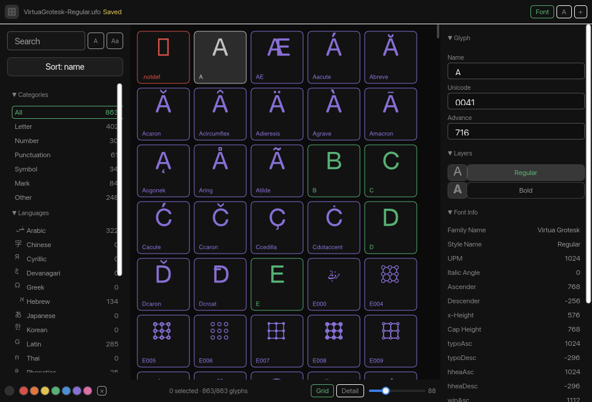
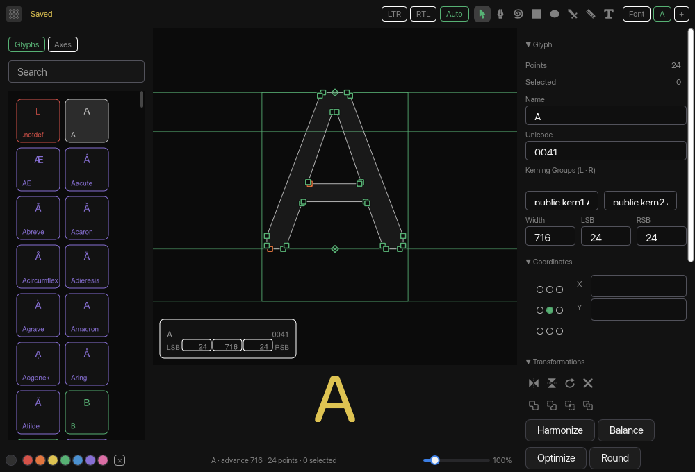

import Callout from '../../../components/Callout.astro'

<Callout variant="warning" title="Work in progress">
This post merges two drafts from August and a build log. Parts of it
were drafted with AI assistance and have not been edited yet. Numbers
are from the day they were measured. Comments and corrections are
welcome, especially corrections.
</Callout>

This post is for the people who work on Xilem, and after them for
anyone watching Rust GUI. The short version: do not give up on Xilem.
I have built the same font editor twice on the same engine, once on
[Xilem](https://xilem.dev/) and once on [GPUI](https://gpui.rs/), the
framework Zed extracted. GPUI was faster to ship on and it looks
better. It is also the wrong renderer for a drawing tool, and the
list of things it cannot do is longer than its reputation says. The
things Xilem lacks are almost all product work. Product work needs
designers, design engineers and product people, and the project does
not have them. That is the gap I want to help close.


## 1. Two shells, one engine

I maintain a font editor called Runebender. One build is on upstream
Xilem, pinned at upstream `b81d8d7a` from late August. The other is on GPUI from Zed's
repository. Both share `runebender-core`, so the outline math, the
shaping, the kerning, the measure analyses, the node graph runner,
the layout of the node canvas and the theme file are identical. What
differs is the framework and nothing else, which is the only reason
any of the numbers below mean anything.

The rule that made the second shell cheap: no drawing logic in a
shell that is not drawing. The file formats, the validators, the
editing operations, the viewport math and the hit tests live in core.
Each shell adds the paint calls and the mouse. When the node canvas
was ported from GPUI to Xilem it was a paint function over the same
box list, about 600 lines, and it took one session.

Everything here is a snapshot of late summer 2026. Xilem is moving,
and some of this will be wrong by the time you read it. I would
rather be corrected than vague.

## 2. What Xilem gets right

Masonry is the good part, and it is good in ways that are easy to miss
from outside.

The widget tree is an arena addressed by id, not a graph of pointers.
Passes walk it in a defined order. Properties are typed values attached
per widget, with a stack of selectors that includes user-defined class
strings and the pseudo-classes you would expect, and a per-widget cache
that records *which* selector inputs a resolution depended on, so a
hover change invalidates only the widgets whose appearance actually
depended on hover. That is a small cascade with precise invalidation,
already built, and I do not think it is advertised enough.

It is on every part of the stack the ecosystem converged on this year:
wgpu, parley with harfrust underneath, AccessKit. The GPUI build's
accessibility is unreleased and disabled, and its text quality differs
per operating system. For a font editor that is not a detail.

It builds on stable Rust with no toolchain opinions. The GPUI port
needed a pinned toolchain because a transitive dependency breaks on
current nightlies.

And there is a layer system: a widget can put another widget above the
tree in window coordinates, receiving pointer events first. Masonry's
own tooltip and selector menu use it.

## 3. Where GPUI is worse

To keep this honest, since I ship on both. Some of this is small.
The first item is not.

**The renderer.** The first version of the node canvas looked rough. The ring grid was
eight-sided polygons and the wires were hand-built beziers in pixel
space, so I moved both onto kurbo and the shared `build_path`. It
still looked rough. So I read GPUI's source.

GPUI's `PathBuilder` tessellates every stroke and fill into triangles
with lyon. The renderer draws those triangles with no edge coverage
and no multisampling. There is no anti-aliasing to turn on. The glyph
editor's outlines have the same edges. They are thinner, so it shows
less, but it is the same rasterizer. Nothing done with geometry
changes that.

There is one way to get Vello quality inside a GPUI app. Rasterize
the canvas with `vello_cpu` into an image every frame, let GPUI draw
the image, and draw the text with GPUI on top. That works. It is
also a preview path, not a drawing surface: a full-window raster and
a texture upload on every pan, zoom and drag.

**The same canvas in Vello.** Runebender has a second shell on Xilem, the Linebender UI stack, where
Vello is the renderer. With the layout in core, the Xilem version of
the canvas was a Masonry widget with a paint method and a pointer
handler. It has the same drag enum, the same viewport and the same
hit test. Where GPUI has `paint_path`, it has `Painter::stroke` and
`Painter::fill`. Text goes through Parley, the way the editor's measure
labels already did. The widget is about 600 lines, and it took one
session.


The figure above is the Xilem shell's own headless render at one
pixel per canvas unit. The figure at the top of the post is the GPUI
shell at the same zoom, captured from the screen at two pixels per
unit. Look at the diagonal of any wire, and at the rings. Vello
rasterizes paths with coverage, so the edges are smooth. GPUI's are
stair-steps. This is the one place the Xilem shell wins outright. It is not a
small place for a drawing tool. A font editor is a canvas with some
panels around it.

The Xilem version is behind the GPUI one in two ways that are the
framework's, not the canvas's. There is no right-click menu, because
a menu is a Masonry layer and a view tree cannot close one cleanly,
so node types to add are a row of chips. And there is no file dialog,
because that shell has none yet.

**Squares, not circles.** The glyph editor got a dot grid this week: a dot at each 8-unit
intersection, and the lines are left to the eye. The dots are
squares. That was not a design choice. A circle from kurbo is twelve
or more segments after flattening, and a square is four vertices. A
grid at 1x has about twenty thousand dots on a laptop screen. GPUI
caps the vertices in one path, so the dots go out in runs of two
thousand. GPUI has no anti-aliasing either, so a 2 px circle is a
ragged blob and a 2 px square is crisp. Squares were the shape that
looked right under that renderer.

In Vello none of this comes up. A circle is a circle in the scene,
the rasterizer covers its edge, and twenty thousand of them are one
fill pass. The renderer decided what the grid can look like. In a
tool for drawing curves, that call belongs to the designer.

**GPUI cannot share its GPU with Vello.** Its wgpu device is private,
and so is the web backend's. There is no way to hand it a texture
Vello drew. The only mix is `vello_cpu` into an RGBA buffer that
GPUI paints as an image, a full raster and a texture upload on every
frame of a drag. That is a preview path, not a drawing surface, and
it is the next thing I measure, because the split it would give is
the one I want: Vello for every canvas, GPUI for the chrome.

**The geometry boundary.** The engine does all of its geometry in
kurbo `BezPath`, font units, Y-up. Masonry paints through Vello, and
Vello takes kurbo shapes directly, so the Xilem paint code is lines
like `painter.fill(&(affine * sort.path), color)`: the same path the
engine computed, with one affine for the zoom and the Y flip. GPUI
has its own path type, `f32`, pixels, Y-down, built through a
`PathBuilder` and tessellated with lyon. So the GPUI build carries a
conversion layer, 372 lines, and the editing canvas calls it at 31
sites to turn every outline into a `gpui::Path` each frame. Strokes
are widths we expand ourselves first. It has been fast and stable.
The cost is one program with two geometry vocabularies and a seam
where a reader must know which side they are on. GPUI treats vector
paths as one more UI primitive. Vello treats them as the point.

**There is no text field.** GPUI is a renderer and a layout tree. Its
own field, `ui_input`, needs an erased editor, and the only
implementation is Zed's `editor` crate with the buffer, language and
settings crates behind it. The third-party `gpui-component` field is
about 22,000 lines because it carries a code editor, and the crate
depends on gpui by bare git URL, so the moment I pinned gpui to a
revision it built a second copy of every gpui type. I dropped it. The
fields in my build are about 900 lines on parley's `PlainEditor`,
painted through the same outline path as the canvas. That is the
Linebender stack again, inside the other framework, because it was
the smallest thing that worked.

**No headless render.** Every visual decision in this project is made
by rendering a PNG and looking at it, and most of the code is written
by agents under review, so this is not a testing nicety. GPUI has
nothing. I drive the browser build in headless Chrome over WebGPU
instead, which needs a nightly toolchain and `build-std` for the wasm
target, and which stops issuing frames after a few renders under
virtual time. Masonry's render root is a function call.

**The rest.** GPUI moved the whole object graph to runtime-checked
shared ownership: everything lives in one `App` with entity handles,
and reentrant updates are a hazard the team watches for by hand. Its
accessibility support is unreleased and disabled in Zed. Its text
layout is its own, and quality differs per operating system, while
Xilem is on parley and harfrust with the rest of the ecosystem. Its
native build needs a pinned stable toolchain because a transitive
dependency breaks on current nightlies. It has no canvas primitive
either, so both of my builds hand-write the same viewport,
screen-to-document conversion and drag state machine, roughly 150
lines each, which is the largest gap the two frameworks share. And it
is a Zed internal that tracks Zed main.

## 4. The pain points in Xilem

In the order I would fix them.

### 1. There is no menu bar, and no way to build one

Xilem is on winit, which has no menu API of any kind, so Masonry never
inherited menus and neither did Xilem. That is one half. The other half
is that there is no action layer: key events go to the focused widget
and bubble up the ancestor chain, so there is nowhere to register a
window-level shortcut.

The application therefore invents one. Mine is a widget that wraps the
entire interface, catches whatever the focused widget did not consume,
matches a keymap, and submits an action. It is 263 lines and it is a
fake.

The native menu bar is now working in my build, through `muda`, and it
only works because of an accident: on macOS `init_for_nsapp` attaches
the menu to the *application* rather than to a window, and Xilem hands
out no window handle. Windows needs the HWND and Linux needs a GTK
window, so those platforms need an in-window menu bar instead, drawn on
the layer system. Menu clicks also do not arrive through winit's event
loop, so a `task` view has to drain muda's channel and post them back.

A font editor with no File menu and no working Cmd+S is not a font
editor anyone will use. This is the single largest difference in how the
two builds feel.

### 2. There is no headless render path, and the obvious substitute lies

Every visual decision in this project is made by rendering a PNG and
looking at it. It is also the only way an agent can see what it built,
which matters to me because most of this code is written by agents under
review.

Xilem offers nothing here, so the application builds its own: create a
`ViewCtx`, build the root view, hand the widget to something that can
rasterize, run one rebuild so views that fill their scene during rebuild
are drawn, then render with Vello CPU.

The obvious way to do that is `masonry_testing::TestHarness`, and it is
subtly wrong. The harness creates its `RenderRoot` with
`use_system_fonts: false` and a fixed test font, because a snapshot test
wants to be deterministic. The real window sets it to `true`.

So the screenshots render different text than the running application,
silently. I found this by adding script icons to a sidebar. The Arabic
and Hebrew ones came out as nothing at all, and I was one commit away
from writing up a font-fallback bug in Xilem that does not exist. The
tool I was using to look for bugs was the bug.

The fix in my build is to drive a `RenderRoot` directly with the winit
runner's options. Everything needed is public, so this is not a
capability gap. It is a missing convenience with a trap where the
convenience should be.

### 3. Popups are reachable from widget code only

I wrote in an earlier draft that Masonry could not do in-window popups.
That was wrong, and the correction is more interesting than the mistake.
`create_layer` exists and works: my right-click menu is now a real
layer, rooted in window space, so it can hang past the edge of the
canvas it belongs to.

But `create_layer` is a method on the widget context. Only a
hand-written Masonry widget can call it. There is no Xilem view for
layers, so an application assembled out of views cannot open a popup at
all. Mine manages only because its canvas is already a custom widget.

Two smaller edges come with it. A layer is not a child of its creator,
so it cannot report a choice with an ordinary action: it has to reach
back through `mutate_later` and a downcast to the creating widget's
type. Dismissal is a second round trip of the same shape.

### 4. Every measurement is a raw number, so applications drift

This is the one I care about most, because it is about what the output
looks like rather than what it can do.

Xilem takes an `f64` wherever a measurement is needed. Every gap, inset,
corner and text size is therefore a decision, made separately, by
whoever or whatever is typing. A person makes those decisions
consistently for about a hundred lines. An agent does not make them
consistently at all.

Measured on my own port: it drifted to **twenty distinct spacing values
and four text sizes** before I noticed. Nothing looked wrong in any
single line. The screen looked unfinished.

The GPUI build does not drift, and not because I was more careful there.
Its vocabulary is closed: `px_1` to `px_4`, `text_xs`, `text_sm`,
`rounded_md`. There is no value between the steps to land on by
accident. That is an API difference, and it is copyable.

What I did about it is the interesting part. I added a scale, and then a
second layer that removes the remaining choice: a container states what
it *is* (`column(Region::Panel, ..)`, `row(Region::Toolbar, ..)`,
`column(Region::List, rows)`) and its gap and inset follow from that.
How much space a toolbar puts between its buttons does not vary from
screen to screen, so asking is what produces drift. Rebuilding the
panels on it took the number of places that state a gap or an inset
**from 54 to 4**, and all four survivors say "no gap".

The cost of not having this, in my build, is 410 lines of design system
in application code, none of it about fonts, and about 996 lines of
scaffolding in total that exist only because the framework does not
carry them. The equivalent files do not exist in the GPUI build.

### 5. Composing views can fail to build, and the failures are opaque

Views are monomorphized and nest their types, so the type of a root view
is the whole tree written out. Two failures come from that, and both are
found by hitting them.

The first is a link error. Three ordinary combinators around an
application-sized tree, a file watcher around a menu pump around a
shortcut host, produced this:

```
ld: Assertion failed: (name.size() <= maxLength),
    function makeSymbolStringInPlace, file SymbolString.cpp, line 74.
```

Not a compile error. A link error, on a clean build, after everything
compiled. The mangled symbol name grew past what the macOS linker
accepts. `.boxed()` on the root fixes it in one line, and you have to
work that out from a linker assertion.

The second is worse, and it is why this pain point moved up. I wanted a
metrics panel floating over the canvas, the way the GPUI build has one.
In view-land that is a `zstack` around the editor pane: one container,
two children. That build ran **over thirty-five minutes** on a single
`rustc` process at full CPU and never finished. I killed it. The same
tree without the `zstack` builds in well under a minute.

So one extra container around an application-sized view tree took the
build from under a minute to unbounded. There was no diagnostic, because
nothing failed. It simply did not stop.

What I did instead is the part worth reporting. The metrics panel is now
painted inside the editor's Masonry widget, in screen coordinates, in
about sixty lines. It looks right and it costs nothing. But the way I
got there was to leave view-land, and that is the same pressure that
produced the 996 lines of hand-written widgets in this build. When
composition is the expensive path, applications stop composing.

### 6. The layout model has sharp edges that are found by looking

None of these are hard once known. All of them cost an afternoon.

- A child with `Dim::Stretch` inside a flex row claims the whole width
  and pushes its siblings off the edge. I lost a button that way, then
  lost the same button again because a control-sized version of it put
  the row's intrinsic width past the sidebar and clipped it.
- A text input sizes to its content and nothing constrains it to its
  parent. A kerning group name like `public.kern1.A` pushed my entire
  inspector past its 250px column and clipped every row to its right.
- The flex child tuple runs out at sixteen. The seventeenth is a type
  error with no useful message, and the fix is to nest a container for
  no reason.
- Style props are order sensitive: `.color()` before `.text_size()`
  does not compile, because the first property wrapper hides the
  inherent methods of the widget under it.
- Writing a reusable container helper fails on a missing bound, and the
  bound is `Seq: Send + Sync`. The error lists unrelated types that
  implement the trait and never says that.
- A helper that takes children cannot be a closure, because closures
  cannot be generic and every group of children has its own type. My
  sidebar has three folding groups holding three different row types, so
  the helper had to be a named generic function with the bound above.
  That is two obstacles in front of the smallest possible abstraction.
- Nothing clips. There is no way to say "shrink below your content and
  cut what is left over": a `Dim::Stretch` child with a flex factor
  still refuses to go under the intrinsic width of its own text. So an
  over-wide file name in my title bar pushed the tab strip off the end
  of the window instead of being cut, and the application now truncates
  the string by character count. The GPUI build writes `flex_1` and
  `overflow_hidden` on the same element.
- A border is one width on all four sides. There is no bottom-only
  border, so the rule under my header is a one pixel box with a
  background colour. GPUI writes `border_b_1`.

Those last two matter more than they look. If an application cannot
cheaply write its own vocabulary of containers, it will inline the flex
calls at every site instead, and then the numbers drift, which is
pain point 4 again.

### 7. Views must be `Send + Sync`, which the ecosystem does not always allow

Runebender's text engine holds a shaping-font cache and a run cache
behind `Rc` and `RefCell`. It is neither `Send` nor `Sync`, and a Xilem
view must be both. So the view carries plain data and the widget builds
the buffer on the other side.

That split is fine, and arguably better. It was forced rather than
chosen, and it is worth knowing that any library holding an `Rc` cannot
travel through a view.

### 8. There is no list row, field, section, panel, dialog, or table

Xilem has a widget set, not an application parts list. The GPUI build
imported sixty-plus components from `gpui-component` and spent its lines
on font editing. Mine hand-builds six of them. An icon button, a square
tile that paints a vector icon and reports clicks, is 175 lines here
because the stock button brings its own padding and minimum size and
has to be fought.

Every stock widget also has to be undone before it can be used as a
part. A collapsing section header, which is a triangle and a word at the
left edge of a panel, is a button with its padding zeroed, its border
removed, and a stretched row inside it, because the stock button centres
its child. None of those three lines is about a font editor.

I want to be careful here, because I checked this rather than assuming.
The GPUI port imports **four** things from `gpui-component`: text input,
slider, one resizable split, and the native menu bar. Everything else,
175 separate `div()` compositions, is hand-written. So the parts library
is not where GPUI's advantage comes from. The advantage is that `div()`
is a styled, clickable box by default, and the scale is closed.

## 5. Why it still does not look the same

I have spent days on this and the two builds still do not look alike.
That is the most useful thing in this post, so here is the whole
diagnosis.

**Nothing here is broken in the crash sense.** The widgets work. Layout
runs. The application does what a font editor does. What is missing is
the last twenty percent of control over how things look, and that
twenty percent is the whole difference between an application that
reads as finished and one that reads as a prototype.

**Every small adjustment costs more, so I make fewer of them.** That is
the mechanism, and it is worth being concrete. In one working session I
wanted five ordinary things:

| What I wanted | GPUI | Xilem |
| --- | --- | --- |
| A panel floating over the canvas | absolute positioning | `zstack`, which never finished compiling; painted by hand instead |
| A title that gives way when the bar is full | `flex_1` + `overflow_hidden` | nothing clips; truncate the string by character count |
| A rule under the header | `border_b_1` | one border width for all four sides; a one pixel box instead |
| A chip in a toolbar | `px_2` | undo the stock button's padding, border and centring |
| A collapsing section header | `div()` with a click handler | a button with three properties removed and a stretched row inside |

Not one of those is hard. Each is between one and five extra lines, in
application code, about nothing. But a person adjusting a screen makes
twenty of those decisions an hour, and if each costs an afternoon, or
turns out to be impossible, you ship the six you could afford. Six
adjustments where twenty were needed is exactly what "unfinished" looks
like.

**Four things that are hard to design with, specifically.** These came
out of one session of closing the gap, and each one shows up over and
over rather than once.

*Nothing clips, and nothing scrolls politely.* There is no
`overflow: hidden`. A child that is too wide is not cut, it is placed
past the edge of the window. And a portal draws its scroll bar over its
own content rather than beside it, so anything flush right sits under
the bar. Between them, my sidebar counts, my inspector values and my
filter buttons were all half eaten, and the fix is a fixed spacer at the
end of every row plus hand-truncating strings by character count. Three
separate workarounds for one missing idea.

*Borders are one width on all four sides.* A rule under a header is a
one pixel box with a background colour.

*A new option on a hand-written widget costs five edits.* The widget
struct, the view struct, `build`, `rebuild`, and the constructor's
signature. I wanted a boolean for a detail view on my glyph grid and
smuggled it inside an existing `Copy` struct that was already being
passed through, because five edits for a bool is the kind of tax that
stops you trying things. It stops you twice over: the GPUI build's
floating metrics panel shows the glyph's kerning groups, and mine does
not, because those two strings live in the font model and I could not
justify five edits to move them. I added the codepoint instead, which
was free because the session already carried it. That is the tax
choosing what the application shows.

*A repeated structure cannot be abstracted, so a change to it is N
edits.* My inspector has ten sections, each a tuple of a header and its
body. Making them fold means every sibling after the header becomes
conditional, at all ten sites, because a helper cannot be generic over a
tuple whose members have different view types. I ended up writing a
script that parses Rust well enough to split a tuple on its top-level
commas without tripping over comments, to apply a change that is one
line in a framework with a component boundary. That script is the
clearest evidence I have that the abstraction is missing.

*Padding compounds silently.* My sidebar is a panel, and the scrolling
column inside it was also a panel. Two panel insets took 48 pixels out
of a 200 pixel column, which is where all the counts had gone. Nothing
warns you; the column just looks wrong and you go hunting. A design
system with named regions makes this better and does not make it go
away, because the mistake is nesting two of the same thing.

**The defaults point the wrong way.** `div()` is a styled, clickable box
with no padding, no border, no minimum size and no opinion. You compose
upward from nothing. Masonry's widgets each arrive with an opinion, and
the opinion is usually "form control". So Xilem work is subtraction, and
subtraction is more code and is never quite complete. My icon button is
175 lines because the stock button had to be fought; my section header
is a button with three things removed.

**A missing primitive can cost a feature, and then cost it twice.** The
GPUI build's floating metrics panel has editable fields: you set the
sidebearings and the width in the panel, over the drawing. Getting that
in my build was a chain. The panel floats, so in view code it wants a
`zstack`, and the `zstack` never finished compiling. So it is painted
inside the canvas widget instead. Painted content cannot hold a text
input, and there is no view for a layer, so the only route left was to
hand-write text editing inside the widget.

Which is what I did. The panel now has three boxes you click and type
in, with Tab between them, Enter to apply and Escape to drop the edit.
It is about a hundred and thirty lines, and it includes a caret that I
draw myself, a focus rule, a commit rule, and one set of rectangles
shared by the painting and the hit testing so the box you click stays
the box you can see. Xilem has a text input. Masonry has a text area
with parley behind it, with selection and IME and everything else. None
of it can be used four pixels above a canvas, so the application ships
its own, worse one.

That is the shape of the whole problem in a single feature. Nothing was
impossible. Nothing was even hard. It just cost a hundred and thirty
lines and a day, and the result is a text field that does less than the
one already in the framework.

**The workarounds are design decisions in disguise.** This is the part
that surprised me. When the title bar ran out of room, the fix
available to me was to delete the file name from it. That is not a
layout tweak, it is a change to what the application shows the user,
forced by the fact that nothing clips. Every missing primitive turns
into a small design compromise, and the compromises are what you see.

**And I have been matching the wrong thing.** For most of this work I
was reading the GPUI source and matching it line by line: the same
header order, the same 24 pixel tiles, the same label block of 4 over, 2
between, 8 under. I never put the two screenshots side by side, because
I do not have a way to render the GPUI build headlessly and the tools
for looking at a Xilem application are ones I wrote myself. Matching
source is not matching pixels. That gap is mine, and it is also the
gap pain point 2 is about: an application that cannot see itself is
built blind, and blind work drifts.

Then I got the screenshots and found out how right that was. The single
most visible difference between the two builds was the window skeleton:
their title bar runs across the whole width with the three columns under
it, and mine had the sidebar running full height with the search box
sitting above where the header ended. Days of matching their source
never showed me that, and one look at a picture did. It was a twenty
line change.

The screenshots also produced a new Xilem finding in ten minutes. A
portal draws its scroll bar over its own content rather than beside it,
so anything flush with the right edge is cut in half. Every count in my
sidebar was sitting under the scroll bar. The fix is a fixed spacer at
the end of each row, which is the third workaround in this post for
something the layout should handle.

The honest summary is that Xilem can express almost everything the GPUI
build does. It costs three to five times the lines, some of it is
unreachable from view code, one of it did not compile, and the total of
those small costs is a screen that looks like nobody finished it.
Closing that is not one feature. It is a parts list, a closed scale,
clipping, per-side borders, a working overlay, and a way to see the
result. Most of those are small on their own.

## 6. Reading this against the project's own review

I wrote most of this before I read Olivier Faure's critical review of
Xilem in 2026 and the RustWeek notes that go with it. Those say the
project is on the backburner, that the DX is poor, that the View
architecture has deep flaws, that scope should be cut, and that the plan
is a new architecture built on first-class components. From outside, the
same problems show up as the eight above. Four places where the view
from an application is worth having.

**On menus.** The notes say adoption is held back by missing features,
and name menus. I can confirm that from the only angle that counts.
Menus are the single largest difference between my two builds, and the
missing piece is not just the menu bar: it is that there is no
window-level place to put an action at all, so the keymap has to be
faked too.

**On styling.** The notes say it is unclear how many people know Xilem
has styling now. I did not know. I found the property system, the
selectors and the per-widget property cache by reading Masonry's source
while looking for something else. It is one of the best things in the
project and it is invisible from outside. Announcing it costs nothing
and is worth more than a feature.

**On the testing framework.** The plan is a thin wrapper around
`masonry_testing::TestHarness`. Please make it more than a testing
framework, or at least do not let it inherit the harness's defaults
silently. Applications need a headless render for reasons that have
nothing to do with tests, and the harness's fixed test font is a trap
when it is used that way. Two named constructors, one that renders like
the window and one that renders deterministically, would have saved me
the bug in pain point 2.

**On components.** My compile blowup in pain point 5 is a
monomorphization failure: the type of a root view is the whole tree
written out, and one more container was enough to make `rustc` never
finish. If `Component` is one concrete type, that whole class of failure
goes away, and so does the linker assertion. That is a benefit of the
proposal worth stating alongside the DX arguments, and it is a question
worth answering early: if components keep nesting types, the compile
cliff comes with them.

**On dogfooding.** Keeping Placehero is right. But Placehero is a feed
reader, and a feed reader never asks for a menu bar, a canvas, a context
menu, a tool palette, or a document with a save state. Every pain point
in this post comes from the parts of an application a feed reader does
not have. If there is room for a second dogfood, make it a document
editor of some kind. Failing that, this build is Apache-2.0 and carries
a `XILEM-GAPS.md` ledger of exactly these blockers, and it is an outside
data point that costs the project nothing to read.

**On cutting scope.** I cannot tell you what to cut, and I can tell you
what this application would lose. It leans on the property system and
its selectors, the layer system, AccessKit, and parley. Everything else
it uses, it could hand-write, and largely has.

## 7. The problem is people, not architecture

Read the eight pain points again and sort them. A parts list. A
closed scale. Clipping. Per-side borders. A working overlay from view
code. A headless render that shows what the window shows. A menu bar
and a place to put an action. Not one of them is the reactive layer.
Not one needs the new component architecture to land first. Each is
the kind of thing a designer or a design engineer notices in the first
hour of building a real screen. They file it and fix it, because it is
in the way of the thing they are trying to ship.

That is what GPUI has and Xilem does not. GPUI is not a better design
than Masonry. Its layout vocabulary is closed because Zed's designers
needed it closed. `div()` is a styled, clickable box with no opinion
because Zed's engineers build every screen from it every day. The
framework carries the opinions of a product team, and an application
built on it inherits them for free. Xilem carries the opinions of
people building a framework, and they are good opinions, about
arenas and passes and properties and invalidation. What it does not
carry is a week of somebody trying to make a window look finished
and refusing to stop until it did.

So the ask is not a rewrite. It is people: designers, design
engineers and product people, using Masonry for something with a
menu bar, a canvas, a tool palette and a save state, and sending
back what they hit. My own attempt at that is
[Xix](/blog/xix-architecture-and-rationale/), a fork that keeps
Masonry and puts a closed scale, regions and a theme in the type
system so an agent cannot drift. The best outcome for it is that
nothing in it stays a fork.

## 8. What I would ask for

Small and additive, in the order that would help most.

1. **A headless render on the application builder**, with system fonts
   on, so that the tool people use to look at their own work shows what
   the window shows.
2. **A view for layers**, so an application built from views can open a
   popup without hand-writing a widget.
3. **A window-level action and keymap layer**, and a shell facade
   outside Xilem for menus, tray and hotkeys. The ecosystem survey this
   month reached the same conclusion independently: a maintained
   winit-compatible facade "would give every winit-based framework that
   for free". This is not an Xilem problem, it is the ecosystem's
   missing layer, and Xilem is the framework best placed to define it.
4. **A closed scale for measurements**, even a small one, taken by the
   styling APIs in place of a number. This is the cheapest change on the
   list and the one that changes what applications look like.
5. **A bound on how much a view tree can cost to build.** The
   `Send + Sync` bound on view sequences needs a better message, the
   linker assertion needs to be a diagnostic, and the compile time of a
   deep tree needs a ceiling. A container that never finishes compiling
   is the hardest failure on this list to work out from the outside.

None of this touches the reactive layer, which is where the interesting
disagreement is and where I have no strong opinion worth publishing yet.

## 9. The state of my build





Both builds share `runebender-core`, and both are on GitHub as
[runebender-xilem](https://github.com/eliheuer/runebender-xilem) and
[runebender-gpui](https://github.com/eliheuer/runebender-gpui). The Xilem one has the grid, the
editor with eight tools, point editing, undo, save, boolean operations,
anchors, components, designspace masters with live interpolation, marks,
the sidebar with folding groups, an inspector whose sections fold, font
info, a detail view on the grid, glyph renaming and metrics editing from
the overview, tabs with independent sessions,
native menus on macOS, `.glyphs` and `.glyphspackage` import, file-watch
reload, the curve and measure analyses, and a text tool on the shared
engine.

The GPUI one is further along and, more to the point, it looks better.
It still looks better after several days of closing the gap on purpose,
which is the subject of the section above.

Since that snapshot the GPUI build became the daily driver and got a
UI pass: a title bar of its own on macOS, one interface font (the demo
font, Virtua Grotesk), a dot grid, a theme with a recipe for points
and one for marks, and text fields on parley. The Xilem build waits
for that pass to settle. Chasing a reference that changes every day
is wasted work, and the point of the shared engine is that catching
up later is cheap.
