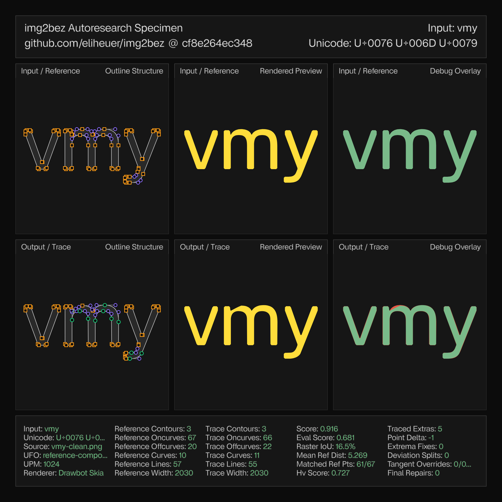

img2bez is an open-source Rust crate and CLI tool that traces bitmap glyph images into cubic Bézier outlines and writes them directly into [UFO](https://unifiedfontobject.org/) font sources. It is built on the [Linebender](https://linebender.org) ecosystem—[kurbo](https://crates.io/crates/kurbo) for curve math and [norad](https://crates.io/crates/norad) for UFO handling—and the source is at [github.com/eliheuer/img2bez](https://github.com/eliheuer/img2bez).

### The problem

Raster-to-vector tracing is an old problem with lots of existing solutions, so a new tracer needs a justification. Mine is that the existing solutions—the classical ones, and newer ones like differentiable tracing—optimize the wrong objective for what I need: pipelines and data engineering for AI-automated type design.

I'm working on a delusionally ambitious project in this space, [font.garden](https://font.garden), aimed at making local, open-source AI a viable path for font development. In those pipelines, letterforms keep showing up as raster images—scans of lettering, renders from image models, screenshots of old specimens. Image models have gotten good at drawing letters, but they output pixels, and the gap between "a picture of a letter" and "a font you can edit, interpolate, and compile" is tracing.

The catch is that a font source is judged by its *structure*, not just its silhouette. Type design has strong drawing conventions (Ohno Type's ["Drawing Vectors"](https://ohnotype.co/blog/drawing-vectors) is a good summary), and they exist for mechanical reasons—editing cost, interpolation compatibility, rendering quality:

- **Minimum points.** Every extra on-curve point is something a designer manages on every edit, in every master of a variable font.
- **Points at extrema**, with handles leaving exactly horizontally or vertically.
- **Lines are lines**, not flat curves with vestigial handles.
- **Points at inflections**, where a curve changes directional bias—the spine of an `s`.
- **Deliberate junction detail.** In the typeface I evaluate against, every stroke junction—the crotch of a `v`, the saddles between `m`'s arches, all four crossings of an `x`—is drawn with a tiny axis-aligned flat, eight units wide. That's a design decision, repeated everywhere, and a trace that misses it is structurally wrong even when it's geometrically close.

An outline can match the bitmap to a tenth of a pixel and fail all of these. A trace with forty points where a designer used twenty, diagonal handles at the extrema, and curves where lines should be isn't a head start on a font—cleaning it up takes longer than redrawing. So the goal of img2bez is: **the output should look like a perfect trace that a type designer then drew over, with structure winning wherever the two conflict.**

### Prior art, and why it solves a different problem

**Potrace.** Peter Selinger's [Potrace](https://potrace.sourceforge.net/potrace.pdf) (2003) is the gold standard of classical tracing—it's inside Inkscape and FontForge, and the paper is a model of clarity. The pipeline: threshold the image to black and white, trace the pixel boundary, approximate it with an optimal polygon, label each corner as sharp or smooth (via a parameter called *alpha*), then fit curves. img2bez includes a Rust reimplementation and still routes 1-bit and aliased sources through it, because Potrace's staircase handling is genuinely good for that kind of input.

For anti-aliased renders of type, though, it has two structural mismatches. The first is thresholding itself. Anti-aliasing encodes the boundary position to a fraction of a pixel; thresholding throws that away and rounds to the nearest whole pixel. Every later decision—straight or curved, corner or smooth, where exactly the extremum sits—then has to survive that half-pixel of noise, and the heuristics get shakiest exactly where type cares most: flat extrema, shallow joins, overshoots.

The second is what *alpha* measures. It judges a corner by how far it strays from its neighbors' chord—which confuses *deviation* with *sharpness*. On a big smooth arc the chords are long, so a point in the middle strays a lot even though the curve is barely turning. The result is false corners at the flattest part of an `o`—precisely where a designer wants one smooth extremum with horizontal handles. And even when Potrace traces cleanly, nothing in its objective *asks* for extrema, H/V handles, or junction flats, so it won't produce them except by accident.

**The curve-fitting literature.** Fitting a cubic to a set of points is essentially a solved problem—Philip Schneider's Graphics Gems fitter and, going further, Raph Levien's [fitting work](https://raphlinus.github.io/curves/2021/03/11/bezier-fitting.html) in kurbo, which img2bez leans on directly as a fallback. But fitting is the *last* step. The hard part of tracing type is everything upstream: deciding where the structural points go and what kind of point each one is. No fitter answers that.

**Differentiable rasterization.** The research frontier went a different way: [diffvg](https://people.csail.mit.edu/tzumao/diffvg/) backpropagates an image-space loss through the rasterizer into the curve's control points, and a family of learned vectorizers builds on it. I find this work genuinely useful—img2bez borrows its central trick, below—but a gradient can only slide control points around a *fixed* structure. It can't decide that a designer would have drawn one tense cubic instead of two timid ones, or that this valley should become a tiny flat with two new points. Those decisions are discrete. And the learned systems need training data and GPUs, while still producing outlines with the same structural problems as everything else.

### How img2bez works

The pipeline is a sequence of stages, each making one decision a designer makes without thinking about it. I'll keep the numbers light here; the exact thresholds and rationale are in [docs/autotracing-research.md](https://github.com/eliheuer/img2bez/blob/main/docs/autotracing-research.md).

**1. Sub-pixel boundary extraction.** Rather than threshold to black-and-white and trace the staircase—Potrace's first compromise—img2bez reads the boundary straight out of the gray anti-aliased pixels (marching squares at the ink level). The anti-aliasing *is* sub-pixel position information, so recovering the boundary from it lands the contour to under 0.35px on a test disk. One subtlety bit me here: the contour's starting point has to be chosen deterministically, or tiny shifts flip decisions much further down the pipeline.

**2. Adaptive smoothing.** The raw boundary is resampled to even spacing and lightly smoothed. If it still doesn't read as clean type geometry—too much wiggle, or more corners than any real glyph has—the smoothing strengthens and tries again. Clean renders are left alone; only degraded sources get the heavier treatment, each at its own noise scale.

**3. Structure detection.** Now the pipeline places the structural points, all from the turn-angle signal along the smoothed boundary:

- A **corner** is a *concentrated* burst of turning—an impulse, not a gentle bend. Testing for the impulse, rather than how far the outline strays from a chord (what Potrace's *alpha* does), is what keeps a sharp serif join from being mistaken for a tight smooth arc.
- A **straight run** is a stretch that stays within a hair of its own chord, with the tolerance growing with length on purpose: a real line's wander stays flat at any length, while an arc bows away from its chord faster the longer it gets—so a single rule separates lines from arcs at every scale.
- **Extrema** (the top of an `o`) and **inflections** (the spine of an `s`) fall out of sign changes in the curvature, each pinned to within a pixel of where a designer would put the point.

The output of this stage is, by construction, the point set a designer would place.

**4. Constrained fitting.** Each curved section gets a least-squares cubic—but with its end *directions* pinned: exactly horizontal or vertical at an extremum, along the neighboring line at a tangent point. Only the two handle lengths are free to move. The handles come out perfectly H/V because nothing else is even representable, not because of a snap-to-grid pass afterward. If a section won't fit, it splits at its inflection first, and only then lets the fitter subdivide freely.

**5. Continuity passes.** Corners that rasterization rounded off are rebuilt as sharp intersections, and smooth joins are aligned so the curvature matches across them—the G2 "harmonization" rule from the Glyphs and FontLab editors. Concretely, for two cubics meeting at $a_3 = b_0$, you intersect their handle lines at $d$, form the ratios

$$
p_0 = \frac{|a_1 a_2|}{|a_2 d|}, \qquad p_1 = \frac{|d\, b_1|}{|b_1 b_2|}, \qquad p = \sqrt{p_0\, p_1},
$$

and slide the join point to the fraction $t = p/(p+1)$ of the way along $a_2 \to b_1$. That evens out the curvature on both sides of the join.

**6. Raster-loss refinement.** This is where the diffvg idea pays off, in a form cheap enough for a CLI tool. Near an outline, a pixel's ink coverage is basically a linear ramp in its signed distance to the path:

$$
c(x) \;\approx\; \operatorname{clamp}\!\left(\tfrac{1}{2} + s(x),\; 0,\; 1\right),
$$

with $s(x)$ in pixels, signed toward the ink. So any candidate outline $\Gamma$ can be scored by how well its predicted coverage matches the source over a thin band $B$ of pixels around the boundary:

$$
L(\Gamma) \;=\; \frac{1}{|B|} \sum_{x \in B} \bigl(c_\Gamma(x) - c_{\mathrm{src}}(x)\bigr)^2.
$$

That's an honest score for *any* candidate—including one with different structure than the current outline—which is exactly what lets it act as a judge. And because stages 1–5 already land sub-pixel-accurate, there's nothing to backpropagate—no autodiff, no GPU, no training run, just a line search over a handful of variables.

One amusing wrinkle: tuning a cubic's two handle lengths independently stalls on arcs, because the loss runs along a narrow diagonal valley—the two handles trade tension between themselves almost freely. Searching along the valley (their sum and difference) before the individual handles fixes it. The differentiable-rasterization papers handle this with momentum; with only two variables, you can just look at the valley and aim along it.

The refinement makes three structural judgments, each framed as *candidates competing on that band score*:

- **Junction flats.** At each sharp valley, three shapes compete: the outline as fitted, a sharp vertex, and a tiny axis-aligned flat. The flat wins only when it clearly beats *both*—and since a genuinely sharp corner ties the sharp-vertex candidate, the flat can never win on a real corner, only where the ink truly is flat-bottomed. This one mechanism recovered the eight-unit junction flats across the whole alphabet.
- **Merges.** Two adjacent cubics that a fit happened to split—but that aren't a real feature—get replaced by the single tense cubic a designer would have drawn, whenever that reproduces the image just as well. The pair gets re-optimized too before the comparison, so a merge has to win fair.
- **Polish.** Handle lengths get one last nudge against the image, but only where the current fit is clearly poor and the gain is real—no fiddling with handles that are already right.

Structure is otherwise protected by construction—handle directions never change, on-curve points never move—and this whole stage runs *before* the final harmonization pass, so the type-design conventions get the last word.

A war story, because it changed where I think the difficulty lives. While tuning the junction judge, every V-shaped candidate scored absurdly badly. The cause wasn't the candidates—it was the score. The signed-distance function was mis-signing about half the pixels in the sharp outer corner of a vertex, where the nearest thing is the vertex itself. The fix is the textbook one (sign against the angle-bisecting pseudo-normal), plus catching a degenerate case where duplicated join points quietly broke it. Fixing that one function improved seven glyphs at once. The lesson: when your optimizer's verdicts look insane, audit the score before the candidates.

### Measuring "draws like a designer"

The part of this project I'd defend hardest isn't the tracer, it's the evaluation. "Draws like a designer" sounds unfalsifiable; the harness turns it into a number.

img2bez is developed against a reference font I drew—[Virtua Grotesk](/fonts/virtua-grotesk)—in a loop: render each hand-drawn glyph to a bitmap, trace it back, and compare the result to the original *structurally* (point counts and placement, lines vs. curves, H/V handles, how many reference points the trace hit). The specimen sheets in this post are that comparison made visible, and a stress gate fails the build if any glyph drifts too far.

Across basic Latin (a–z, A–Z, 0–9) the mean structural score is currently **0.967**, with 14 glyphs reproducing their reference outlines exactly and all 62 passing the gate. Per-glyph numbers are in [docs/quality.md](https://github.com/eliheuer/img2bez/blob/main/docs/quality.md).

The harness is also what makes agentic development work. Most of the recent progress came from autoresearch loops: an agent proposes a mechanism, the harness scores all 62 glyphs against the references, regressions are rejected outright, and the specimen sheets make failures obvious at a glance. The junction-flat idea took about a dozen propose–measure–reject rounds in an afternoon—two of which scored well for bad reasons and got caught by the per-glyph diff. I don't think I'd have reached this quality by judgment alone; I'd have shipped at least two of the bad versions.

### Limitations, and an invitation

What doesn't work yet, honestly stated. Two glyphs (`7`, `y`) draw a short straight segment where the trace runs the neighboring curve straight through—a line/curve boundary the same candidates-compete-on-the-raster machinery should be able to judge, but doesn't yet. Low-resolution and heavily degraded sources still over-segment. The harmonization pass only equalizes curvature one join at a time; a global curvature-energy polish would do better across long multi-segment curves. And everything is tuned against one reference design, so the conventions it has learned (the eight-unit junction flats, for instance) are *that typeface's* conventions—more reference fonts are needed to see which parts generalize.

If you work on font tooling, curve fitting, or tracing, I'd genuinely like your feedback—on the approach, the code, or the parts I've gotten wrong. The repo is [github.com/eliheuer/img2bez](https://github.com/eliheuer/img2bez), issues and PRs are welcome, and I'm around the [Linebender Zulip](https://xi.zulipchat.com).
