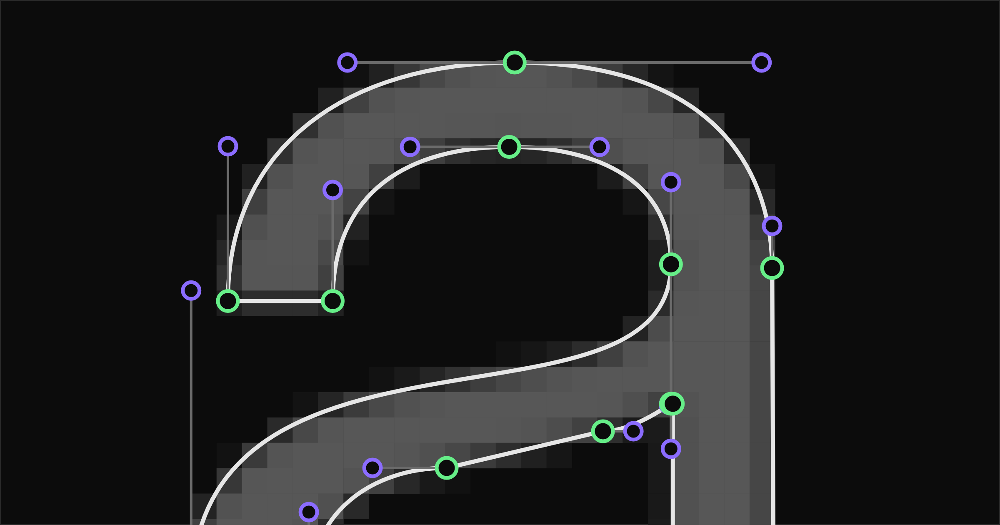

import TraceDemo from '../../../components/TraceDemoIsland.astro'

Note: this is a draft that is still being edited; I am open to feedback.

img2bez is a Rust crate that traces raster images into cubic bézier outlines and writes them directly into [UFO](https://unifiedfontobject.org/) font sources. It is built on the [Linebender](https://linebender.org) ecosystem: [kurbo](https://crates.io/crates/kurbo) for curve math and [norad](https://crates.io/crates/norad) for UFO handling. The source is at [github.com/eliheuer/img2bez](https://github.com/eliheuer/img2bez).



Here is img2bez running entirely in your browser, compiled to WebAssembly. The bitmap sits behind the work area as a dimmed template, the way you trace over an image in a font editor. Click **Trace** to vectorize it and see the outline img2bez produces, with the on-curve points (green) and off-curve handles (purple) it places. Scroll to zoom and drag to pan. To try your own glyph, drop an image onto the app (or use the picker in the corner) and trace that instead.

<TraceDemo image="/demos/img2bez/a.png" glyph="a" unicode="0061" />

### Installation & Setup

Install it and trace a glyph:

```bash
# install the CLI
cargo install --git https://github.com/eliheuer/img2bez

# trace a glyph image into a UFO (created if it doesn't exist)
img2bez --input glyph.png --output MyFont.ufo --name A --unicode 0041
```

Or use it as a Rust library:

```rust
use img2bez::{trace, TracingConfig};
use std::path::Path;

let result = trace(Path::new("glyph.png"), &TracingConfig::default())?;

// result.paths is a Vec<kurbo::BezPath>; print each contour as an SVG path
for path in &result.paths {
    println!("{}", path.to_svg());
}
```

### The Problem

Procedural raster-to-vector tracing has had many open-source options available for a long time, but remains a somewhat unsolved problem. The quality of the autotraced outlines using previous methods is often much worse than if a human did the tracing, and requires a second pass of cleanup by a human or AI. For font outline sources, there is skill and craft in outline construction similar to low-polygon 3D mesh construction in video games. Keeping the point count minimal and placing points with movement and interpolation in mind is important.   

What I want with img2bez is more specific than a general-purpose tracer:

- **Integration.** A Rust library I can easily embed in Rust-based font editors like Runebender.
- **Tunable with agent loops.** Something I can push toward concrete goals automatically, with alongutoresearch and agent loops (more on that below).
- **Source-ready output.** Output that needs minimal manual or AI adjustment to work as a high-quality font source.
- **Type Design style outline structure.** Something I can edit manually that interpolates well.

Pure LLM approaches to this problem also exist and are getting better, but they are currently slow and expensive via cloud or require good local AI hardware setups. This procedural autotracer in designed to be used in AI workflows where the tracer can quickly and cheapy do 90% of the work, then let a AI agent handle the next 9%, and a human designer the last 1% if needed. 

### Structure, Not Just Silhouette

A font source is often judged by its *structre*, not just its silhouette. Type design has strong drawing conventions (Ohno Type's ["Drawing Vectors"](https://ohnotype.co/blog/drawing-vectors) is a good summary), and they exist for mechanical reasons (editing cost, interpolation compatibility, rendering quality, etc):

- **Minimum points.** Every extra on-curve point is something a designer or AI manages on every edit, in every master of a variable font.
- **Points at extrema**, with handles leaving exactly horizontally or vertically.
- **Lines are lines**, not flat curves with vestigial handles.
- **Points at inflections**, where a curve changes directional bias, the spine of an "s" for example.
- **Deliberate junction detail.** Inktraps and small details like that. 

An outline can match the bitmap to a tenth of a pixel and fail all of these. There is quite a bit of cargo culting in the culture of manual hard drawn type design, so when developing tools like this that try to automate and speedup that process, a lot of attention and reserch is need to sperate the wheat from the chaff.

### Existing Approaches, and Why They Solve a Different Problem

**Potrace.** Peter Selinger's [Potrace](https://potrace.sourceforge.net/potrace.pdf) (2003) is the best known example of classical tracing. It's inside Inkscape and FontForge, and the paper is clear and concise. The pipeline: threshold the image to black and white, trace the pixel boundary, approximate it with an optimal polygon, label each corner as sharp or smooth (via a parameter called *alpha*), then fit curves.

**The curve-fitting literature.** Curve fitting is the step that turns a dense run of traced points into a few smooth Bézier curves: take a stretch of the finely-sampled outline and find the single cubic whose handles hug those points within a set tolerance, subdividing only when one cubic cannot. This part is essentially solved, by Philip Schneider's curve fitter from *Graphics Gems* (1990) and, going further, Raph Levien's [fitting work](https://raphlinus.github.io/curves/2021/03/11/bezier-fitting.html) in kurbo, which img2bez leans on directly as a fallback. But it is the *last* step. Both algorithms nail it, and neither decides the anchors: where the on-curve points sit and what kind each one is, a corner, a smooth extremum, an inflection. The fitter only draws the curve between anchors you have already placed. That upstream structure is the hard part of tracing type, and no fitter answers it.

And it is not only fitting. Raph Levien has produced much of the curve work this field stands on, from [path simplification](https://raphlinus.github.io/curves/2023/04/18/bezpath-simplify.html) and [parallel curves](https://raphlinus.github.io/curves/2022/09/09/parallel-beziers.html) to curve-design systems like [Spiro](http://levien.com/spiro/) and his [later splines](https://raphlinus.github.io/curves/2018/12/21/new-spline.html), and img2bez builds on it directly through kurbo. But all of it operates on curves you already have, or helps a person draw better ones. Spiro, the closest to this problem, assumes a designer tracing over a scanned glyph by hand: it makes the curves smooth, it does not find them in the pixels. None of it crosses from a raster to a structured outline, which is the gap img2bez fills.

Concretely, img2bez does not reimplement the fitting. It implements kurbo's `ParamCurveFit` trait over its traced points (a way to sample a position and tangent anywhere along the source), then hands that to kurbo's `fit_to_bezpath_opt`, which returns the fewest cubics for a given accuracy. It is a few lines in [`typefit.rs`](https://github.com/eliheuer/img2bez/blob/main/src/vectorize/typefit.rs):

```rust
// img2bez exposes its traced polyline to kurbo's fitter (Raph's algorithm)...
impl ParamCurveFit for PolylineSource<'_> {
    fn sample_pt_tangent(&self, t: f64, _sign: f64) -> CurveFitSample {
        let (p, tangent) = self.eval(t);
        CurveFitSample { p, tangent }
    }
    // ...plus sample_pt_deriv and break_cusp
}

// ...and kurbo returns the minimal set of cubics for the accuracy:
let path = fit_to_bezpath_opt(&source, accuracy);
```

**Optimization and generative approaches.** Research interest has moved to learning, built on one enabling tool: the *differentiable rasterizer*, a renderer that reports how to nudge a vector outline's control points to better match a target image, so you can vectorize by optimization. [diffvg](https://github.com/BachiLi/diffvg) (2020) is the standard one, and img2bez borrows its central trick, scoring a candidate outline against the pixels (more below). Methods like [LIVE](https://github.com/Picsart-AI-Research/LIVE-Layerwise-Image-Vectorization) build on it to add paths layer by layer, and newer rasterizers like [Bézier Splatting](https://arxiv.org/abs/2503.16424) run an order of magnitude faster.

**The current frontier is generative.** Vision-language models now write SVG code straight from an image: [StarVector](https://github.com/joanrod/star-vector) and [OmniSVG](https://github.com/OmniSVG/OmniSVG) are the strongest open-source examples, and [PyTorch-SVGRender](https://github.com/ximinng/PyTorch-SVGRender) collects most of the diffusion-based methods in one library. All of it optimizes for image fidelity and general compactness, not for what a font needs: points at extrema with horizontal or vertical handles, lines kept straight, minimal points placed for interpolation. And tellingly, even the newest pipelines lean on a fast classical tracer for the actual conversion. [LayerTracer](https://arxiv.org/abs/2502.01105) (2025) generates layered rasters with a diffusion transformer, then hands them to [vtracer](https://github.com/visioncortex/vtracer) to produce the paths, and notes that it inherits vtracer's limits. That gap is what img2bez is for.

### How img2bez Works

img2bez works in three stages. (Fuller detail is in the source code and  [docs/autotracing-research.md](https://github.com/eliheuer/img2bez/blob/main/docs/autotracing-research.md).)

**1. Find the edge precisely.** Most tracers first threshold the image to pure black and white, which throws away the soft anti-aliased pixels along the edge. img2bez reads the outline straight from those gray pixels instead, which recovers the boundary to a fraction of a pixel.

**2. Place the points, then fit the curves.** It walks that boundary and uses the way it turns to decide where the structural points go: sharp corners where the direction snaps, straight runs where the edge is genuinely straight, and smooth points at the extrema (the top of an "o" for example) and inflections (the spine of an "s"). Then it fits cubic curves between those points, with the handles pinned horizontal or vertical at the extrema, with some basic logic for exceptions. Because the directions are fixed up front, the outline follows type-drawing conventions by construction, not by a cleanup pass afterward.

**3. Refine against the image.** An optional final pass re-scores the curves against the original pixels, the same idea diffvg uses, but with no training and no GPU: it just searches the few remaining degrees of freedom for the closest match. This nudges handles that are clearly off, merges two timid curves into the single one a designer would have drawn, and restores small design details like the tiny flats at stroke junctions.

Turn this pass off with `--no-refine`:

```bash
img2bez --input glyph.png --output MyFont.ufo --name A --no-refine
```

Those three stages have a lot of knobs: how sharp a turn has to be to count as a corner, how tight a fit has to be, the margins that gate the refinement pass. I tuned almost none of them by hand. They came out of an automated research loop that scores every candidate change against a reference font, which is the next section.

### Measuring "Draws Like a Designer"

The part of this project I'd defend hardest isn't the tracer, it's the evaluation. "Draws like a designer" sounds unfalsifiable; the harness turns it into a number.

img2bez is developed against a reference font I drew, [Virtua Grotesk](/fonts/virtua-grotesk), in a loop: render each hand-drawn glyph to a bitmap, trace it back, and compare the result to the original *structurally* (point counts and placement, lines vs. curves, H/V handles, how many reference points the trace hit). The specimen sheets in this post are that comparison made visible, and a stress gate fails the build if any glyph drifts too far.


Across basic Latin (a–z, A–Z, 0–9) the mean structural score is currently **0.967**, with 14 glyphs reproducing their reference outlines exactly and all 62 passing the gate. Per-glyph numbers are in [docs/quality.md](https://github.com/eliheuer/img2bez/blob/main/docs/quality.md).

The harness is also what makes agentic development work, and most of the recent progress came from running it in a loop. The mechanism is simple: an agent proposes one change (a new threshold, or a tweak to the fitting code), then a script reruns the whole reference font, rendering each glyph to a bitmap, tracing it back, and scoring it on both raster overlap and structural match. If the mean improves, the change is kept and committed; if it regresses or errors out, it is reverted; either way the run is logged. The specimen sheets make failures obvious at a glance. The junction-flat idea took about a dozen propose–measure–reject rounds in an afternoon, two of which scored well for bad reasons and got caught by the per-glyph diff. I don't think I'd have reached this quality by judgment alone; I'd have shipped at least two of the bad versions.

Running it yourself is a few commands from the repo root:

```sh
./autoresearch/setup.sh            # one-time env setup
./autoresearch/run_experiment.sh   # score all glyphs
./render-specimen.sh --text "a"    # specimen for one glyph
```

### Limitations, and an Invitation

What doesn't work yet, honestly stated. Two glyphs (`7`, `y`) draw a short straight segment where the trace runs the neighboring curve straight through, a line/curve boundary the same candidates-compete-on-the-raster machinery should be able to judge, but doesn't yet. Low-resolution and heavily degraded sources still over-segment. The harmonization pass only equalizes curvature one join at a time; a global curvature-energy polish would do better across long multi-segment curves. And everything is tuned against one reference design, so the conventions it has learned (the eight-unit junction flats, for instance) are *that typeface's* conventions; more reference fonts are needed to see which parts generalize.

If you work on font tooling, curve fitting, or tracing, I'd genuinely like your feedback on the approach, the code, or the parts I've gotten wrong. The repo is [github.com/eliheuer/img2bez](https://github.com/eliheuer/img2bez), issues and PRs are welcome, and I'm around the [Linebender Zulip](https://xi.zulipchat.com). This post itself is [a file on GitHub](https://github.com/eliheuer/elih.net/blob/main/src/content/blog/img2bez/index.mdx), so if you have any corrections, suggestions, or feedback, feel free to open a PR updating this post.
