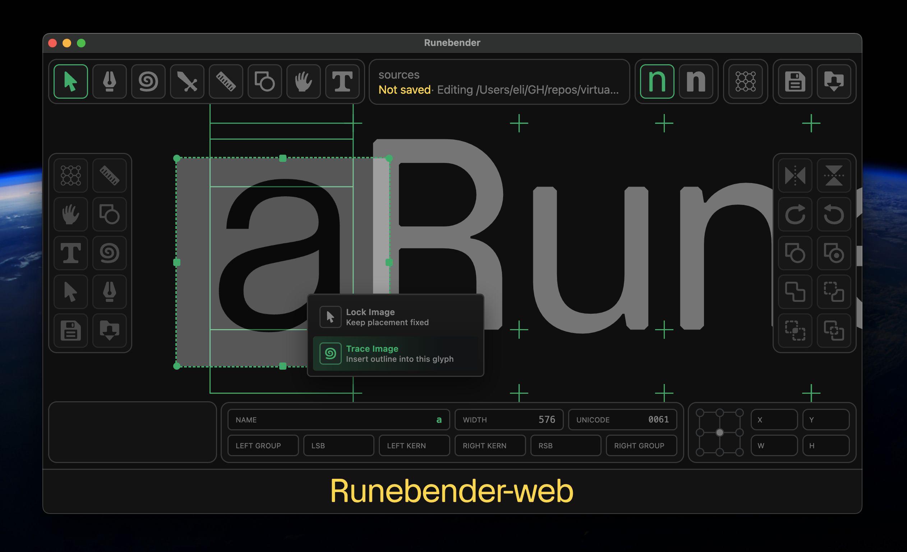

import TraceDemo from '../../../components/TraceDemoIsland.astro'

img2bez is a Rust crate that traces raster images into cubic bézier outlines and writes them directly into [UFO](https://unifiedfontobject.org/) font sources. The project is on GitHub here: [github.com/eliheuer/img2bez](https://github.com/eliheuer/img2bez), dual-licensed under Apache-2.0 or MIT.


Below is an interactive demo of img2bez compiled from Rust to WASM. Click **Trace** to vectorize a raster image and see the outline it produces. To try your own glyph, drop an image onto the application.

<TraceDemo image="/demos/img2bez/a.png" glyph="a" unicode="0061" />

### Section Index

<nav class="section-index" aria-label="Contents">
<ol>
<li><a href="#01-installation--setup"><span class="n">01</span>Installation &amp; Setup</a></li>
<li><a href="#02-the-problem-structure-not-just-silhouette"><span class="n">02</span>The Problem: Structure, Not Just Silhouette</a></li>
<li><a href="#03-why-structure-matters-with-no-human-in-the-loop"><span class="n">03</span>Why Structure Matters With No Human in the Loop</a></li>
<li><a href="#04-existing-approaches-and-why-they-solve-a-different-problem"><span class="n">04</span>Existing Approaches, and Why They Solve a Different Problem</a></li>
<li><a href="#05-how-img2bez-works"><span class="n">05</span>How img2bez Works</a></li>
<li><a href="#06-tuning-for-different-inputs"><span class="n">06</span>Tuning for Different Inputs</a></li>
<li><a href="#07-design-constraint-modes"><span class="n">07</span>Design-Constraint Modes</a></li>
<li><a href="#08-variable-fonts-masters-that-interpolate"><span class="n">08</span>Variable Fonts: Masters that Interpolate</a></li>
<li><a href="#09-an-api-for-other-peoples-tools"><span class="n">09</span>An API for Other People's Tools</a></li>
<li><a href="#10-measuring-draws-like-a-designer"><span class="n">10</span>Measuring &ldquo;Draws Like a Designer&rdquo;</a></li>
<li><a href="#11-judging-a-trace-without-a-reference"><span class="n">11</span>Judging a Trace Without a Reference</a></li>
<li><a href="#12-how-small-is-the-model"><span class="n">12</span>How Small Is the Model?</a></li>
<li><a href="#13-learning-the-cleanup-from-designers"><span class="n">13</span>Learning the Cleanup From Designers</a></li>
<li><a href="#14-the-data-engine"><span class="n">14</span>The Data Engine</a></li>
<li><a href="#15-early-days-and-an-invitation"><span class="n">15</span>Early Days, and an Invitation</a></li>
</ol>
</nav>

### 01. Installation & Setup

Install the Rust CLI tool and trace a raster image:

```bash
# install the CLI tool
cargo install --git https://github.com/eliheuer/img2bez

# trace a glyph image into a UFO (creates the UFO if it doesn't exist)
img2bez --input glyph.png --output MyFont.ufo --name A --unicode 0041
```

Or use it as a Rust library:

```rust
use img2bez::{trace, TraceOptions};

let bytes = std::fs::read("glyph.png")?;
let outline = trace(&bytes, &TraceOptions::default())?;

for path in outline.to_bezpaths() {
    println!("{}", path.to_svg());
}
```

You can also use it inside a font editor like [Runebender-Xilem](https://github.com/eliheuer/runebender-xilem) or [Runebender-Web](https://github.com/eliheuer/runebender-web). The simplest path is the browser. Open [runebender.org](https://runebender.org), drag and drop an image into the edit view, then right-click it and choose **Trace Image**.




### 02. The Problem: Structure, Not Just Silhouette

Procedural raster-to-vector tracing is an old problem with many open-source tools available, but for type design it remains largely unsolved. Outlines from existing tracers are usually lower quality than what a person would draw, and need a second cleanup pass by a human or an AI.

The reason is that a font source's *structure*, not just its silhouette, is what makes it usable. Drawing an outline is less like tracing a shape than like building a low-polygon 3D mesh for a video game: the points have to be placed so the structure holds together and interpolates cleanly.

Most existing autotracers optimize for the silhouette and leave the structure to a human, and cleaning that up is sometimes more work than drawing the glyph from scratch. They work this way because the software has historically been built by engineers solving the general tracing problem, and type-design conventions are specialized knowledge well outside that scope. Those conventions are also easy to dismiss: a lot of design dogma really is nonsense, and it can take years to sort the wheat from the chaff.

AI generation raises a sharper version of this problem. An image model makes one raster at a time, so a variable font means generating several related rasters (a glyph's weights or styles) and tracing each. To interpolate, those masters must be *compatible*: the same points, in the same order, each on the same feature. img2bez produces this by construction: it places points only at structural features (extrema, corners, inflections) by a fixed rule, so masters of the same glyph come out compatible. When they don't, a reconciliation pass aligns the contours and fills in any missing points.

img2bez is designed to be fast and cheap enough to embed directly in a font editor or a SaaS product. You could instead hand the whole job to a large AI model, and pure generative approaches are getting better, but they are slow and expensive to run. A procedural tracer is the opposite: fast, cheap, and deterministic. So img2bez does the bulk of the work up front: the tracer gets roughly 90% of the way, a lightweight AI harness the harder 9%, and a human designer the final 1%. The AI stays small and local: discriminative models for the cleanup today (more on those below), with img2bez-specific LoRAs for open-weight image models planned next.

### 03. Why Structure Matters With No Human in the Loop

Interpolation is where structure matters most. A variable font does not store a separate drawing for each weight. It stores one master outline plus, for each point, a delta to the next master, and it renders an intermediate weight by moving every point independently along the line between the two masters. Nothing in that process looks at the curve as a whole. So matching point counts is only the precondition for interpolation, not a guarantee: compatible masters fix which points correspond, but not where each one travels, and they can still produce broken instances.

<video src="/demos/img2bez/g-interp.mp4" autoplay loop muted playsinline aria-label="The point structure of an img2bez-traced capital G interpolating between its Regular and Bold masters. Each on-curve point and off-curve handle moves independently along a straight line between the two masters, and the outline stays coherent because the points sit on the letter's extrema." style="display:block;margin-inline:auto;width:100%;max-width:520px;"></video>

Both G masters here were traced by img2bez from a Regular and a Bold image, reconciled into one shared point structure. Every square (on-curve point) and circle (off-curve handle) travels in a straight line between its two positions, yet the letter stays coherent because those points sit on the glyph's extrema.

The canonical failure is a kink: a smooth join collapses into a corner at some intermediate weight when three collinear points differ in both angle and spacing ratio between the masters. A point at a true extremum is immune. Its tangent is horizontal or vertical, a direction identical in every master, so the angle cannot differ. The extremum also stays on a real point instead of drifting off the curve as the geometry around it interpolates. This is the reasoning behind the drawing conventions: points sit on extrema to pin those tangents, point counts stay minimal because every extra point is one more motion that can disagree with its neighbors, and lines and inflections stay clean because they are the same three-in-a-line case the kink rule governs. Point placement is the only thing holding the shape together across the whole design space, including the in-between weights that ship without ever being drawn or reviewed.

The other reasons are secondary but real. Hinting needs an on-curve point at each extreme to snap it to the pixel grid. The cubic-to-quadratic conversion that ships TrueType fonts preserves whatever structure it is given and never adds a missing extremum. Integer rounding on export displaces a near-straight segment unevenly at its two ends, producing a kink. And every point is another delta in gvar, the largest table in a variable font. None of these is as strict as interpolation, and some matter less on high-resolution displays, but in a fully automated pipeline nothing reviews the result before it ships. Every stage that consumes the outline reads its point structure, not its silhouette.

The conventions do have exceptions. Marking inflection points is the most contested: some editors restructure a curve to avoid an inflection node rather than add one. Others break down in edge cases, like a segment so short that forcing an extremum just rounds onto its endpoint, which is why img2bez collapses vestigial micro-lines instead of pinning extrema everywhere. But the core holds regardless of what drew the outline: interpolation compatibility, lines that stay straight under rounding, and structure that survives conversion.

### 04. Existing Approaches, and Why They Solve a Different Problem

**Potrace.** Peter Selinger's [Potrace](https://potrace.sourceforge.net/potrace.pdf) (2003) is the best-known classical tracer, used in Inkscape and FontForge. Its pipeline thresholds the image to black and white, traces the pixel boundary, approximates it with an optimal polygon, classifies each polygon vertex as a sharp corner or a smooth point (thresholded by the *alphamax* parameter), then fits Bézier curves.

**vtracer.** [vtracer](https://github.com/visioncortex/vtracer) (VisionCortex) is the fast, modern successor to Potrace, and, like img2bez, it is written in Rust: it runs in linear time and handles full color and high-resolution input. But it is built for general images (photographs, scans, logos, pixel art), and by design it "favours fidelity over simplification," tracing each region's silhouette into dense points that follow the pixels. It has no notion of glyph structure: no points at extrema, no horizontal or vertical handles, nothing placed for interpolation. For general artwork that is the right trade-off; for a font source it is the wrong one, and the contours would need structural cleanup before they behave like type. vtracer is built to reproduce an image; img2bez is built to produce a font source.

**The curve-fitting literature.** Curve fitting reduces a dense run of traced points to a few cubic Bézier segments, each fit to within a tolerance. This step is well understood, with reliable algorithms from Philip Schneider's fitter in *Graphics Gems* (1990) to Raph Levien's [fitting work](https://raphlinus.github.io/curves/2021/03/11/bezier-fitting.html) in kurbo, which img2bez uses as a fallback. But a fitter places its points to minimize error, adding one wherever a single cubic strays too far from the outline. Those are rarely the points type design needs: on-curve points at the extrema and inflections, with handles leaving horizontal or vertical. Deciding that structure is the hard part of tracing type.

Levien's contribution extends beyond fitting. He has produced much of the underlying curve work in this area: [path simplification](https://raphlinus.github.io/curves/2023/04/18/bezpath-simplify.html), [parallel curves](https://raphlinus.github.io/curves/2022/09/09/parallel-beziers.html), and the [Spiro](http://levien.com/spiro/) curve-design system. All of it operates on curves that already exist, or assists a designer drawing new ones. Spiro, the closest to this problem, assumes a designer tracing over a scanned glyph by hand: it smooths the curves but does not locate them in the pixels. None of this work crosses from a raster to a structured outline, which is where img2bez begins.

Classical tracing and curve fitting are the established approaches, and they share a limitation: each reconstructs the silhouette but leaves the structure to a human. The newer, learning-based approaches fall into two categories: optimization and generation.

**Optimization.** The first family treats vectorization as an optimization problem, enabled by the *differentiable rasterizer*: a renderer that reports how to move each control point of a vector outline so it renders closer to a target image. The differentiability is what makes this work: because you can backpropagate through the renderer, the outline's control points become parameters that gradient descent can optimize, or that a neural network can be trained to produce, the same way it learns its weights. [diffvg](https://github.com/BachiLi/diffvg) (2020) is the standard implementation, shipped as a PyTorch operator; img2bez adopts its objective of scoring a candidate outline against the pixels (more below). [LIVE](https://github.com/Picsart-AI-Research/LIVE-Layerwise-Image-Vectorization) builds on diffvg to add paths layer by layer, and newer rasterizers such as [Bézier Splatting](https://arxiv.org/abs/2503.16424) run more than an order of magnitude faster.

None of this fits a font editor like Runebender. Differentiable optimization runs on a GPU with an iterative, stochastic solver, where an editor needs a trace that is fast, deterministic, and embeddable. img2bez is a pure-Rust crate Runebender calls directly, with no GPU or Python in the loop. It even runs client-side in the browser, which is what the demo at the top of this page does.

**Generation.** The second family has the model emit SVG directly. Vision-language models now generate SVG code from an image; [StarVector](https://github.com/joanrod/star-vector) and [OmniSVG](https://github.com/OmniSVG/OmniSVG) are the strongest open-source examples, and [PyTorch-SVGRender](https://github.com/ximinng/PyTorch-SVGRender) collects most of the diffusion-based methods in one library. These optimize for image fidelity and general compactness, not for what a font requires: points at extrema with horizontal or vertical handles, straight lines kept straight, and minimal points placed for interpolation. Even the newest pipelines rely on a fast classical tracer for the conversion itself: [LayerTracer](https://arxiv.org/abs/2502.01105) (2025) generates layered rasters with a diffusion transformer, then passes them to vtracer to produce the paths, and notes that it inherits vtracer's limitations. That is the gap img2bez addresses.

Runebender supports the generative side too: it can trace through the QuiverAI API, and [runebender-comfy](https://github.com/eliheuer/runebender-comfy), a version of runebender-web that runs as a ComfyUI node, wires it up to local models. img2bez is the default procedural path, and these generative options sit alongside it for the jobs that want them.

### 05. How img2bez Works

img2bez works in four stages. (Fuller detail is in the [img2bez git repo](https://github.com/eliheuer/img2bez).)

**1. Find the edge precisely.** Most tracers first threshold the image to pure black and white, which throws away the soft anti-aliased pixels along the edge. img2bez runs marching squares at the threshold's iso-level instead, reading the boundary straight from the gray pixels, which recovers it to a fraction of a pixel. Contours that span the whole image frame or are too small to be ink are discarded as artifacts.

**2. Place the points, then fit the curves.** First it resamples the boundary to even ~1px spacing and applies a light Gaussian smooth: the marching-squares boundary is accurate to ~0.1px, so a small smooth removes sampling jitter without moving features, and the amount rises adaptively for noisy sources. This stabilizes the curvature signal the next step reads. It then walks the boundary and uses the way it turns to decide where the structural points go: sharp corners where the direction snaps, straight runs where the edge is genuinely straight, and smooth points at the extrema (the top of an "o" for example) and inflections (the spine of an "s"). Then it fits cubic curves between those points, with the handles pinned horizontal or vertical at the extrema, with some basic logic for exceptions. Because the directions are fixed up front, the outline follows type-drawing conventions by construction, not by a cleanup pass afterward.

That constraint is what separates it from a general-purpose fitter. kurbo derives each endpoint tangent straight from the curve data, whatever direction the outline happens to have at that parameter:

```rust
// in kurbo/src/fit.rs, fit_to_cubic reads the endpoint tangents from source:
pub fn fit_to_cubic(source: &impl ParamCurveFit, range: Range<f64>, accuracy: f64)
    -> Option<(CubicBez, f64)>
{
    let start = source.sample_pt_tangent(range.start, 1.0); // tangent from the data
    let end = source.sample_pt_tangent(range.end, -1.0);    // tangent from the data
    let d = end.p - start.p;
    // ...solve for the cubic through those points in those directions...
}
```

img2bez overrides that direction at each structural point, forcing it to the axis at an extremum *before* any cubic is fit:

```rust
// in img2bez/src/vectorize/fit.rs, constrained_end_tangent pins the tangent:
fn constrained_end_tangent(
    samples: &[Point],
    kind: SplitKind,
    at_start: bool,
) -> Vec2 {
    // ...measure the raw outgoing direction from the section's samples...
    match kind {
        // left/right extremum -> tangent forced vertical
        SplitKind::ExtremumX => Vec2::new(0.0, raw.y.signum()),
        // top/bottom extremum -> tangent forced horizontal
        SplitKind::ExtremumY => Vec2::new(raw.x.signum(), 0.0),
        // corner or inflection -> tangent kept as measured
        _ => raw,
    }
}

// the directions are fixed; the fit solves only the handle lengths:
let (single, err) = constrained_cubic_fit(&samples, start_tangent, end_tangent);
```

The `match` is the type-design model itself. Each arm dispatches on a `SplitKind` (corner, X-extremum, Y-extremum, inflection) that the structure pass assigned upstream. kurbo's fitter has no such notion, so there is nothing for it to switch on; it reads the tangent uniformly from the data. This is also why the constraint cannot be a flag on a general-purpose fitter: forcing handles horizontal or vertical at extrema presupposes the extrema have already been found and labeled, which is the upstream work a general fitter does not do.

Only when a section cannot be represented that way (even after splitting at an inflection) does img2bez fall back to kurbo's `fit_to_bezpath_opt`, which returns the fewest cubics for a given accuracy but does not constrain the tangents. img2bez exposes its traced points to kurbo through the `ParamCurveFit` trait; that fallback is a few lines in [`fit.rs`](https://github.com/eliheuer/img2bez/blob/main/src/vectorize/fit.rs):

```rust
// img2bez exposes its traced polyline to kurbo's fitter (Raph's algorithm)...
impl ParamCurveFit for PolylineSource<'_> {
    fn sample_pt_tangent(&self, t: f64, _sign: f64) -> CurveFitSample {
        let (p, tangent) = self.eval(t);
        CurveFitSample { p, tangent }
    }
    // ...plus sample_pt_deriv and break_cusp
}

// ...and kurbo returns the minimal set of cubics for the accuracy:
let path = fit_to_bezpath_opt(&source, accuracy);
```

A cleanup pass then conforms the joins to type-design rules. Collinear line segments are merged, and a sharp corner that anti-aliasing rounded off is rebuilt. At each smooth (non-corner) join the two handles are made colinear so the tangent is continuous (G1), and the on-curve point is nudged to the position where curvature matches on both sides (G2), the "harmonize" operation Glyphs and FontLab expose as a manual command. Corners, extrema, and lines are left fixed.

**3. Refine against the image.** An optional pass re-scores the curves against the original pixels, the same idea diffvg uses, but with no training and no GPU: it just searches the few remaining degrees of freedom for the closest match. This nudges handles that are clearly off, merges two timid curves into the single one a designer would have drawn, and restores small design details like the tiny flats at stroke junctions.

Turn this pass off with `--no-refine`:

```bash
img2bez --input glyph.png --output MyFont.ufo --name A --no-refine
```

**4. Snap to font conventions.** Finally the outline is conformed to what a font source expects. Contour directions are set so outer contours and counters wind in opposite directions, which the fill rule requires. On-curve points are snapped to an even-integer grid and the handles rounded to integers, so the coordinates stay clean; any handle left within a few degrees of an axis is snapped exactly horizontal or vertical. An optional chamfer can cut inktrap-style flats at sharp line corners.

These stages have a lot of knobs: how sharp a turn has to be to count as a corner, how tight a fit has to be, the margins that gate the refinement pass. I tuned almost none of them by hand. They came out of an eval harness that scores every candidate change against a reference font and is built to be driven by coding agents like Codex, Claude Code, and Hermes. (The harness gets its own section below.)

### 06. Tuning for Different Inputs

A trace is tuned along three independent axes that compose freely: the **profile** (what the source image is), the **style** (what the drawing is), and the output **mode** (the next section).

The **profile** matches the input's image quality. img2bez ships three:

- **`wild`** (the default) targets unknown rasters, such as a ~1024×1024 image from an AI image API, the case the demo above runs. It uses a looser curve-fit tolerance, which avoids adding extra on-curve points to track anti-aliasing noise in the source.
- **`clean`** targets high-resolution renders of existing fonts. It uses a tighter tolerance so the trace follows sharp edges closely.
- **`photo`** targets soft, low-contrast scans of printed type. It blurs the *image* before the boundary is extracted, so a rough inky edge is traced through a clean edge instead of through every wobble of the ink.

The profile is **auto-detected** by default, and forced with `--profile`. Detection reads a few cheap, no-reference features from the image (resolution, an edge-sharpness measure like the [variance of the Laplacian](https://opencv.org/blog/autofocus-using-opencv-a-comparative-study-of-focus-measures-for-sharpness-assessment/), a noise estimate, and how close to bilevel it is, all printed by `img2bez stats <image>`) and recognizes the soft-scan class by its low sharpness and low contrast, far from the crisp-render regime. The effect is concrete: a soft letterpress `a` traces to about 69 on-curve points under the base settings, and to a clean 23 once it is detected as `photo`.

The **style** is the drawing style of the letterform, layered on top of the base. The base already traces a grotesk (a Helvetica-class monolinear sans) well, since that is the most common and important case, and the named styles (`grotesk`, `old-style`, `geometric`, `brush`, `nib`, `qalam`) add design-specific refinements on top as each is developed. Unlike the profile, the style is **declared, not detected**: a drawing style is design intent, not something measurable from one raster.

```bash
img2bez --input glyph.png --output MyFont.ufo --name a --profile photo --style old-style
```

In Runebender the same controls sit in the image's trace menu (a Profile selector, a Style dropdown, and an output Mode), so a trace is tuned and re-run without leaving the editor.

Independent of the profile, the pipeline normalizes two common input conditions before fitting:

- **Nearest-neighbor upscales.** An image enlarged with nearest-neighbor sampling has its anti-aliasing quantized into uniform pixel blocks. img2bez detects this and downscales to the original resolution before tracing.
- **Low-resolution glyphs.** A small glyph is smooth-upscaled first, so the sub-pixel tracer reads anti-aliased edges rather than hard pixel steps.

The individual settings behind the profiles stay exposed as knobs, for tuning by hand or by an agent: `--smoothing` and `--corner-threshold` adjust how hard the boundary is smoothed and how sharp a turn must be to count as a corner, and `--pre-blur` sets the image blur the `photo` profile applies automatically. Raise them for noisy or degraded sources, lower them to track clean art tightly.

The soft-scan detection is the first piece of a broader `auto` mode, and widening it across the whole space of inputs is the next real piece of research. The plan rests on one observation: choosing settings well requires a way to *measure* the choice, which means a corpus with known answers. The eval harness already scores traces against a hand-drawn reference; extending it with controlled *degradation* (taking known-good outlines and rendering them downscaled, blurred, JPEG-compressed, noised, bilevel, and halftoned) produces (degraded image → known-correct outline) pairs across the whole space of input quality. Because each image is generated from a known outline, the right answer is known, which is exactly what lets a setting-selector be tuned and validated.

On that foundation a default `auto` mode reads a few cheap, no-reference signals from the image (glyph resolution, an edge-sharpness measure like the [variance of the Laplacian](https://opencv.org/blog/autofocus-using-opencv-a-comparative-study-of-focus-measures-for-sharpness-assessment/), a noise estimate, and how close to bilevel it is) and maps them to the fit tolerance, smoothing, and corner sensitivity that scored best for that kind of input. The mapping starts as plain rules derived from the corpus (not hand-guessed) and graduates to a tiny learned selector (the [small parameter-prediction networks](https://arxiv.org/pdf/2112.09318) used in camera pipelines are the same shape) only if rules leave quality on the table. Either way it stays a *selector*: it chooses settings for the deterministic tracer; it never becomes a model that draws the outline. That keeps img2bez fast, deterministic, and embeddable: the properties the whole tool is built on, and the reason it can run client-side in the browser.

Two honest limits. At production time there is no reference, so the selector predicts from measured features and self-checks against the input raster (does the trace reproduce it?) plus intrinsic structure (point count, horizontal/vertical handles), a confidence signal, not a guarantee. And *drawing style* (inktraps, sharp versus rounded terminals) is design intent, not image quality, which is why it is a declared *style* rather than something inferred from a single raster. The AI harness does the heavy thinking offline (searching the settings space, tuning the rules against the corpus); the tracer in the loop stays a fast procedural step.

### 07. Design-Constraint Modes

Sometimes the constraint is not the input but the *output*. A design may call for one point style throughout, regardless of what the source suggests, so img2bez has trace modes that re-shape the finished outline under a constraint.

`--mode smooth` makes every on-curve point a smooth point and every segment a curve: no corners, no straight lines. The trick is that it keeps the *fitted* curve and only aligns the two handles at each vertex to a continuous tangent, so corners round into the flow instead of the shape distorting into a wavy blob. The result is the consistent, organic outline a soft or rounded design wants, drawn the same way everywhere.

`--mode line` does the opposite: it flattens every curve to straight line segments with no off-curve points, for a polygonal outline.

Both run as a post-pass on the finished trace, so they compose with everything else, like `--mode smooth` on a pre-blurred old-style scan. More modes are the same shape of transform (all-quadratic for TrueType, or monoline), and a mode pairs naturally with a per-design-class style preset.

### 08. Variable Fonts: Masters that Interpolate

A variable font is built from masters (a Regular and a Bold drawing of each glyph, say) and the renderer interpolates between them by moving every point independently along its delta. That only works if the masters are *compatible*: the same contours, the same number of points, in the same order, of the same type. Generating a variable font from images means producing one raster per master and tracing each, and those traces are made independently, so nothing guarantees they line up.

Most of the time they do. Because img2bez places points by structural rule (extrema, corners, inflections, in a consistent order), the same letter traced at two weights usually comes out with the same point structure already; an `o` or an `a` needs no further work. The cases that don't line up are the ones where the shape itself changed: an inflection present at one weight and flat at another, a feature one master picks up that the other lacks.

For those, img2bez has an explicit reconcile pass. Given a set of independently traced outlines, it matches their contours, normalizes the winding direction and start point, and where one master is missing an on-curve point another has, inserts the corresponding point by splitting that segment at the same position along the outline. It also unifies segment types (if a side is a straight line in one weight and a slight curve in another, both become curves), so the on/off-curve pattern matches everywhere. The one thing it will not do is bridge a different *number* of contours: that would mean inventing a counter, which is a generation error rather than a reconciliation, so it is reported incompatible instead.

The pass always emits compatible structure, but it also reports its confidence. When the point counts already match, the correspondence is exact. When it has to insert points, it is guessing correspondence by position, so it flags those contours low-confidence. That flag is the point for an unsupervised pipeline: an agent can trust the clean cases and route the flagged ones back for review or regeneration, instead of silently shipping a master that interpolates into a mess at the in-between weights.

Headlessly it is one command per glyph, no editor in the loop. It reads the masters and their metrics from the font's [designspace](https://fonttools.readthedocs.io/en/latest/designspaceLib/index.html), so you hand it a folder with one image per master (each file named for its master) and the target band in the font's own terms:

```bash
img2bez masters VirtuaGrotesk.designspace \
  --glyph germandbls --unicode 00DF \
  --images germandbls/ \
  --fit descender:cap
```

It matches each master to its image (`Regular.png`, `Bold.png`, and so on, by the master's name, so the same flag works whether a font has two masters or twenty), fits each into the `descender:cap` band the font's metrics define, reconciles them into one shared point structure, and writes the glyph into every master UFO with that weight's own advance width: interpolation-compatible, ready to compile. Pass `--format json` and it returns the outlines and the compatibility report instead of writing, for a pipeline that wants to place them itself; and a sibling `new-font` command scaffolds the designspace and master sources from scratch, so an agent can take a font from nothing to interpolating masters without opening an editor.

For an automated loop the exit status and report are the contract: a non-zero exit means the masters could not be reconciled (a different contour count, say): regenerate the failing image and retry; a `lowConfidence` flag in the report means a point was placed by a guessed correspondence: accept but review, or regenerate; otherwise the masters are compatible and ready to compile.

### 09. An API for Other People's Tools

img2bez is most useful as a dependency inside something else: a desktop or web font editor, a font-production script, or an AI agent building sources on its own. So the API is built around one rule: **tracing a shape and placing it into a font are two separate jobs, and you should be able to do the first without committing to the second.**

The pipeline is three explicit stages. `trace()` answers *what contours are in this image?* and returns just the outline, drawn at a standard em scale but not yet positioned. `place()` answers *where does it belong in this font?* It never guesses: you tell it which part of the image is the glyph (the whole canvas, or just the detected ink), which vertical band the ink should fill (baseline-to-cap, descender-to-ascender, or a custom range), and how to set the sidebearings and advance (explicit numbers, a fixed advance, centered, or copied from a neighboring glyph). A final stage attaches the name and codepoints and hands back a UFO-faithful glyph. img2bez never infers typography from a codepoint; placement is a decision, and it stays yours.

Keeping the stages apart is what lets each caller place in its own terms. A font editor positions glyphs against the metrics already open in the document; an agent regenerating one glyph copies the vertical fit and sidebearings from its neighbors. It also fixes the case that breaks a naive tracer: a generated image arrives with arbitrary padding around the letter, so mapping the whole canvas into the em puts the glyph at the wrong size and off the baseline. Fitting *detected ink* into an explicit band instead is resolution- and padding-independent (the same letter lands in the same place whether it came in tightly cropped or floating in whitespace), and every placement returns a report (the ink box it found, the scale and offset it applied, the resulting bounds and sidebearings) so a headless caller can check the result without rendering it.

Everything the tracer produces is one type that follows the [UFO point model](https://unifiedfontobject.org/). UFO is the core open font-source format, and img2bez is font-specific, so parity with it is the goal. A glyph is just contours of points, each with a position, a UFO point type, and a smoothness flag. It's plain data with no library-specific types, so it serializes straight to JSON and converts losslessly to whatever a consumer needs: `kurbo` paths for Rust, GLIF for font pipelines, an SVG path for a preview. One model, many front ends, and it keeps the smoothness flag a raw bézier path can't.

The same core is exposed four ways, running the identical pipeline so the output is byte-for-byte the same no matter how you reach it:

- a **Rust crate** for native tools,
- a **WASM build** with JavaScript bindings (`traceToJson`, `traceToSvg`, `traceToGlif`, plus `tracePlaceToJson` for the trace-and-place path) for the browser,
- a **CLI** that can emit UFO, GLIF, JSON, or SVG to a file or stdout, with flags to fit detected ink into a target band and copy metrics from a reference glyph, for scripts, and
- an **[MCP](https://modelcontextprotocol.io) server** (in [`mcp/`](https://github.com/eliheuer/img2bez/tree/main/mcp), stdio JSON-RPC) exposing a `trace_glyph` tool, so an AI agent can call the tracer natively ("trace this image, fit it like the *b*, and give me the outline").

For a web editor the integration is small. You hand the WASM the image bytes and get back the glyph as JSON, with codepoints as a `unicodes` array, an `advance`, and an `outline` of contours of points, where on-curve points carry a `type` and off-curve points omit it:

```json
{
  "name": "Q",
  "unicodes": ["0051"],
  "advance": { "width": 896 },
  "unitsPerEm": 1024,
  "outline": {
    "contours": [
      { "points": [
        { "x": 448, "y": 752, "type": "curve", "smooth": true },
        { "x": 208, "y": 752 },
        { "x": 64,  "y": 576 },
        { "x": 64,  "y": 336, "type": "curve" }
      ] }
    ]
  }
}
```

Map those points into your editor's own point model, place the glyph with your own metrics, and you are done: no XML parsing, no bézier math, no UFO dependency on the client. And because the JSON is a one-to-one projection of UFO, anything you build against it speaks the same structure as the rest of the font ecosystem.

None of this is free. One canonical model plus four surfaces is more to maintain than a single function that returns whatever was convenient, and the indirection costs a little ceremony for the simplest "just trace a file" case. The bet is that the alternative, a tracer welded to one application's coordinate system and one output format, is exactly what makes every other tool write its own tracer instead of adopting yours. The whole point of img2bez is to be the shared one, so it is worth the extra surface to make it embeddable everywhere.

That is also the pitch to anyone building a font tool. img2bez is open source under the permissive Apache-2.0/MIT license shared by the [`kurbo`](https://github.com/linebender/kurbo) and [Linebender](https://linebender.org) ecosystem it builds on, so adopting it carries no lock-in. The tracer is one piece of the AI type-design startup I'm building, and it gets better for everyone's glyphs as it gets better for any one tool's, so if you're building something serious on it, I'd rather build the parts you need with you than have you fork it.

### 10. Measuring "Draws Like a Designer"

Evaluation, not the tracer, is the hard part of this project. "Draws like a designer" is hard to quantify, so the eval harness measures it: it scores each traced outline against a hand-drawn reference font.

img2bez is developed against a reference font I drew, [Virtua Grotesk](https://github.com/eliheuer/virtua-grotesk) (the typeface this post is set in), in a loop: render each hand-drawn glyph to a bitmap, trace it back, and compare the result to the original *structurally* (point counts and placement, lines vs. curves, H/V handles, how many reference points the trace hit). The specimen sheet below is that comparison made visible and is used for human review of the eval loop. An automated gate rejects any change that drops a glyph's structural score below its baseline.


Across basic Latin (a–z, A–Z, 0–9) the mean structural score is currently **0.967**, with 14 glyphs reproducing their reference outlines exactly and all 62 passing the gate. Per-glyph numbers are in [docs/quality.md](https://github.com/eliheuer/img2bez/blob/main/docs/quality.md).

The eval harness is also what makes agentic development work, and most of the recent progress came from running it in a loop. An agent proposes one change (a new threshold, or a tweak to the fitting code), a script re-scores the whole reference font on raster overlap and structural match, and the change is committed if the mean improves or reverted if it regresses. The junction-flat idea took about a dozen of these rounds in an afternoon. Two of them scored well for the wrong reasons and were caught by the per-glyph diff; without the harness I would have shipped those bad versions.

Because the loop is fully automated, you can point an AI agent at it (cloud tokens or a local model) and let it run overnight or on a cloud machine, improving the tracer while you work on something else. I had been developing img2bez for a while before Fable 5 was briefly available, and running these loops with it overnight produced some of the biggest gains.

Running it yourself is a few commands from the repo root:

```sh
./eval-harness/setup.sh            # one-time env setup
./eval-harness/run_experiment.sh   # score all glyphs
./render-specimen.sh --text "a"    # specimen for one glyph
```

Because the harness reports a single score, it makes a good target for agentic goal-setting like Codex's `/goal` command, which can run the loop toward it on its own.

### 11. Judging a Trace Without a Reference

The eval harness scores a trace by comparing it to a known reference outline. At production time there is no reference: the input is an arbitrary image, and the question is still "is this trace good?" Answering that without a ground truth is what makes input adaptation possible, because choosing settings well requires a way to measure the choice.

img2bez scores a candidate trace two ways, both reference-free. The first is reproduction: render the traced outline back to a bitmap and take its intersection-over-union against the thresholded input. This is the same objective the refinement pass uses, and it measures whether the outline covers the right pixels. The second is structure: regularizers that encode the type-design rules with no reference needed. The fraction of handles leaving exactly horizontal or vertical, a penalty for vestigial micro-segments (the cluster of points that litters an over-traced terminal), and a parsimony term against too many points per unit of outline.

The two have to be balanced, because the interesting failure mode scores well on one and badly on the other. A trace that chases every wobble in a soft scan reproduces the pixels almost perfectly, but with three times the points a designer would use. On a soft photographic `a`, the over-segmented 69-point trace scores *higher* on reproduction than the clean 23-point one, and lower overall, because the structure terms catch what the pixel score rewards. That combined score is the judge.

A reference-free judge changes how settings get chosen. Instead of predicting the right preset from image features, the tracer can trace under a few candidate presets, judge each, and keep the best. Search beats prediction when the search is cheap, and a deterministic trace is cheap. The judge also runs offline against a corpus of degraded glyphs with known answers, which is how the fast procedural rule that ships in the hot path gets calibrated: the expensive search happens during development, not on every trace.

None of this puts a model in the loop that draws the outline. The judge, and any learned selector built on it, only scores results or picks settings for the deterministic tracer. A selector small enough for this job is a few kilobytes of weights and a short matrix multiply, which compiles to the same fast, dependency-free code as a hand-written rule. The distinction that matters is not procedural versus learned, it is whether the model draws or only decides. Here it only decides.

### 12. How Small Is the Model?

When people hear "machine learning" next to "AI image to font," they reasonably picture something large. The models img2bez trains are the opposite. They are small enough to count the parameters by hand, and they ship as constants inside the binary rather than as files loaded at runtime.

There are three roles, and only one of them would ever be large. The first is the selector: it reads a cheap summary of the input image and chooses the trace settings. Its input is four numbers (edge sharpness, noise, how anti-aliased the edges are, and the glyph's size in pixels) and its output is a few more (how much to pre-blur, how hard to smooth, how tightly to fit). Mapping four numbers to four numbers is a tiny function. Written as a rule it is a handful of thresholds. Learned, it is a two-layer network of about seventy-five weights, a few hundred bytes, or a small decision tree of a few kilobytes. Either form compiles to the same short matrix multiply: microseconds to run, no dependencies, and it works in the browser.

The second role is the judge from the previous section, which scores a finished trace with no reference. It is the same scale, a handful of weights balancing reproduction against structure.

The third role is the one that would be large, a model that draws the outline itself, and it is exactly the one img2bez keeps out of the loop. A network that emits curves is stochastic and heavy, the opposite of what a type designer needs from a tracing tool, where the same input has to give the same output every time and run locally. So the drawing stays procedural and the learned parts only decide.

The decider can be small because the hard work is already done. The tracer turns pixels into clean curves on its own; what is left for a model is a low-dimensional nudge of a few settings from a cheap description of the image. The contrast is worth stating plainly: the image you drop in may have been generated by a model with billions of parameters, and the model that decides how to trace it has a few hundred. One is a probabilistic artist, the other a deterministic dispatcher, and keeping them on opposite sides of that line is the point.

There is a standard name for this distinction. A model that produces new content is generative; a model that takes content and returns a label, a score, or a choice is discriminative. The learned parts of img2bez are all discriminative. The selector reads image features and returns settings; the judge of the previous section reads a trace and returns a quality number. The judge is an instance of what the AI-engineering literature calls an AI judge or evaluator model, the familiar idea of using one model to grade another's output, scaled down here to a few weights and a fixed rubric. Naming it this way sets expectations: discriminative models are smaller, cheaper, and deterministic in a way generative ones are not, which is precisely what lets them ride inside a tracer that has to give the same answer every time. The shorthand for the whole approach is small discriminative models, a selector and a judge, never a generator.

What is left is data, not model size. A table this small still has to be fit to real examples, and the examples that matter most, soft scans of printed type where the edge is textured rather than clean, are the ones synthetic degradations fail to reproduce. So the current work is deliberately unglamorous: trace real images under a range of settings, keep the ones that come out right, and let each kept result become one row of the table the model will eventually fit. Until that table is full enough, the procedural rule is the selector, and making that rule better is its own reward.

### 13. Learning the Cleanup From Designers

Tracing a clean printed letter is easy. The judgment comes in on a rough one. When the source is a soft scan, its inked edge is bumpy, and the tracer faithfully puts a point at every bump. A cleanup pass removes the obvious noise, but the last point or two are a real decision: a redundant point that should go and a useful point that should stay can look identical to the math. Both are smooth, both sit about the same tiny distance off the ideal curve. The only thing that tells them apart is what a designer intends, and no fixed rule can see intent.

So the plan is to learn that intent from designers instead of guessing at it. When you trace an image and then clean up the result by hand, your cleaned version is an example: every point you kept is a "keep," every point you removed is a "remove." A small model can learn from those examples to answer one narrow question. Given a point like this, in a context like this, would a designer keep it? It reads the same simple measurements the cleanup already computes, how far off the curve the point sits, how sharp the turn is, where it falls in the letter, and predicts the call.

In practice the loop is small. You trace an image, open the result in a font editor, and fix the points the way you would want them, dropping the few the tracer left behind and nudging any that sit wrong. Save, and that cleaned outline is one example. There is no separate labelling step, because the cleanup is the label. A few dozen of these, across a range of letters and scan qualities, is enough for the model to start predicting the call.

This keeps the same shape as everything else in the tool. The model decides which points to keep; it never draws the letter. It stays tiny and runs locally, and it learns from your own work rather than from a guess baked into the code. It is the opposite of the generative approach, where a large model tries to draw the whole glyph and, for Latin type at least, mostly produces something blurry. We leave the drawing to the procedural tracer, which is good at it, and only learn the small decisions it cannot make on its own.

The data comes for free. Every time a designer cleans up a trace, that is a new example, and the tool gets a little better at the kind of letters that designer works on. The hard part a fixed rule cannot reach is exactly what a few dozen hand-cleaned examples can teach.

### 14. The Data Engine

Every learned part of the tool, the selector that picks settings, the judge that scores a trace, the classifier that decides which points to keep, is only as good as the examples it learns from. Early on I assumed those examples could be synthetic: take a clean reference glyph, degrade it with blur and noise and low contrast, and trace the result. It did not work. The degradations a script can apply are smooth, and a real scan of printed type is not. Its edge carries ink texture and paper grain, and that texture is exactly what makes the hard cases hard. A synthetic corpus taught the model to handle problems it would never meet and to miss the one it always would. The bottleneck was never the model. It was the data.

So the tool collects real data as a side effect of being used, in three streams that feed each other.

The first is a trace log. Every trace can append one line recording what it saw and what it did: the cheap image measurements (edge sharpness, noise, how anti-aliased the edges are, the glyph's size in pixels), the settings it ran with, and the resulting point counts. Across a real tracing session this builds a record of which kinds of input got which treatment, the raw material for learning the selector. It stays opt-in and off by default; the aim is to learn from real work, not to record everything.

The second is hand-cleaned targets. When a designer traces an image and cleans up the outline, that cleaned version is a labeled example, as the previous section described. These are the gold data: a human's judgment of what the trace should have been, on a specific real image. A few dozen, spread across letters and scan qualities, is enough to start training the keep classifier, and they are the only source for the judgment a fixed rule cannot encode.

The third is an eval loop that measures progress against those targets. Given a target, the harness scores any trace against it: how close the point count is, how far each point sits from where the designer put it, how well the two filled shapes overlap. That turns "is this better?" from an argument into a number, and every change to the tracer or the cleanup is scored against the whole set, so a tweak that helps one letter and quietly breaks another is caught instead of shipped. It is the same loop that drove the development above; pointing it at human targets instead of a reference font only changes what "correct" means.

Together these are a flywheel. Using the tool produces traces and cleanups, those become data, the data improves the models, and better models mean less cleanup, which makes the tool more useful, which brings more use. None of it changes the shape of the system. The models that come out the far end are still tiny, still deterministic, and still only decide. The data engine is just how they learn what a designer would do, from designers doing it.

### 15. Early Days, and an Invitation

img2bez is early, alpha-stage software. It still over-segments low-resolution sources and is tuned against a single reference font, so how much of what it has learned generalizes is unproven. Its scope is also deliberately narrow: it traces one glyph from a single luma channel, with no color, no composite glyphs (accented letters assembled from component references), and no hinting. I plan to keep improving it: I'm building a startup in AI type design, and this Rust library is a core part of its data-engineering pipeline. If you work on font tooling, curve fitting, or tracing, I'd welcome your feedback. The repo is [github.com/eliheuer/img2bez](https://github.com/eliheuer/img2bez), issues and PRs are welcome, and I'm on the [Linebender Zulip](https://xi.zulipchat.com); this post is [a file on GitHub](https://github.com/eliheuer/elih.net/blob/main/src/content/blog/img2bez/index.mdx) too, so suggestions can come as a PR.
