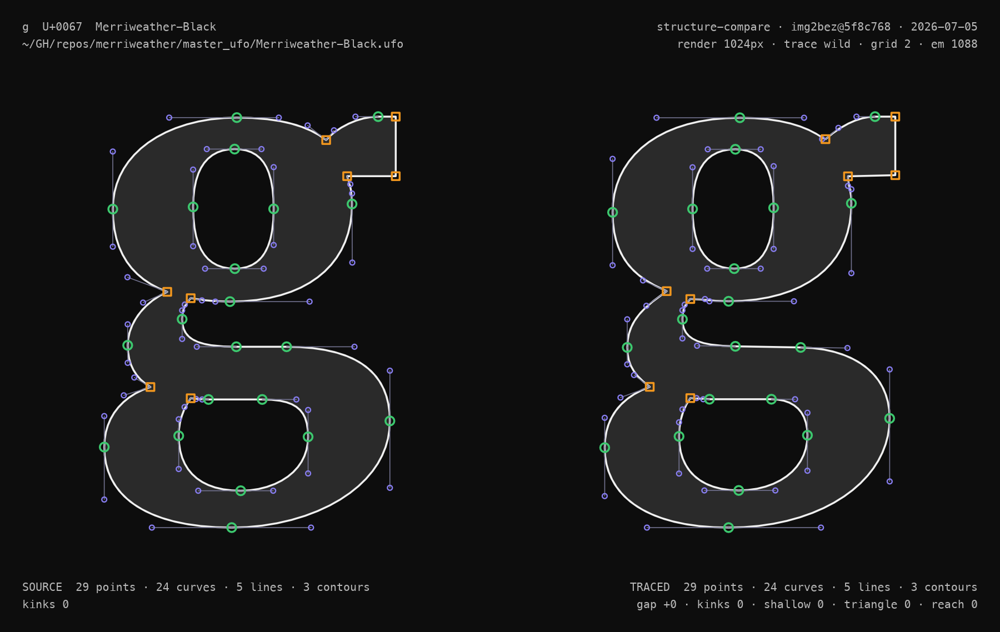

import TraceDemo from '../../../components/TraceDemoIsland.astro'
import gCompareVideo from './g-compare.mp4'

img2bez is a Rust crate that traces raster images into bézier outlines and writes them directly into [UFO](https://unifiedfontobject.org/) font sources. The project is on GitHub here: [github.com/eliheuer/img2bez](https://github.com/eliheuer/img2bez), dual-licensed under Apache-2.0 or MIT.


Below is an interactive demo of img2bez compiled from Rust to WASM. Click "Trace" to vectorize a raster image and see the outline it produces, and drop an image onto the application to try your own glyph. The settings change the output when you click "Trace", but the ones to watch are the **Rules vs Learned** toggles, which swap a structural decision from the procedural rule to a trained ML model. These are tiny, task-specific models small enough to compile straight into the binary and run client-side in your browser. Flipping one lets you watch a model change a structural call live, deterministically and with no server in the loop.

Note: img2bez is built for tracing high-resolution AI-generated raster images, so a 1024x1024 generated glyph is what it handles best. Scans and photos work too, and a few settings help with them, but they are not what the tool is tuned for.

<TraceDemo image="/demos/img2bez/a.png" glyph="a" unicode="0061" />

### Section Index

<nav class="section-index" aria-label="Contents">
<ol>
<li><a href="#01-installation--setup"><span class="n">01</span>Installation &amp; Setup</a></li>
<li><a href="#02-the-problem-structure-not-just-silhouette"><span class="n">02</span>The Problem: Structure, Not Just Silhouette</a></li>
<li><a href="#03-existing-approaches-and-why-they-solve-a-different-problem"><span class="n">03</span>Existing Approaches, and Why They Solve a Different Problem</a></li>
<li><a href="#04-how-img2bez-works"><span class="n">04</span>How img2bez Works</a></li>
<li><a href="#05-tuning-for-different-inputs"><span class="n">05</span>Tuning for Different Inputs</a></li>
<li><a href="#06-design-constraint-modes"><span class="n">06</span>Design-Constraint Modes</a></li>
<li><a href="#07-variable-fonts-masters-that-interpolate"><span class="n">07</span>Variable Fonts: Masters that Interpolate</a></li>
<li><a href="#08-an-api-for-other-peoples-tools"><span class="n">08</span>An API for Other People's Tools</a></li>
<li><a href="#09-measuring-draws-like-a-designer"><span class="n">09</span>Measuring &ldquo;Draws Like a Designer&rdquo;</a></li>
<li><a href="#10-judging-a-trace-without-a-reference"><span class="n">10</span>Judging a Trace Without a Reference</a></li>
<li><a href="#11-how-small-is-the-model"><span class="n">11</span>How Small Is the Model?</a></li>
<li><a href="#12-early-days-and-an-invitation"><span class="n">12</span>Early Days, and an Invitation</a></li>
</ol>
</nav>

### 01. Installation & Setup

Install the Rust CLI tool and trace a raster image:

```bash
# install the CLI tool
cargo install --git https://github.com/eliheuer/img2bez

# trace a glyph image into a UFO (creates the UFO if it doesn't exist)
img2bez --input glyph.png --output MyFont.ufo --name A --unicode 0041
```

Or use it as a Rust library:

```rust
use img2bez::{trace, TraceOptions};

let bytes = std::fs::read("glyph.png")?;
let outline = trace(&bytes, &TraceOptions::default())?;

for path in outline.to_bezpaths() {
    println!("{}", path.to_svg());
}
```

You can also use it inside a font editor like [Runebender-Xilem](https://github.com/eliheuer/runebender-xilem) or [Runebender-Web](https://github.com/eliheuer/runebender-web). The simplest path is the browser. Open [runebender.org](https://runebender.org), drag and drop an image into the edit view, then right-click it and choose **Trace Image**. Runebender supports generative tracing too, through the QuiverAI API and [runebender-comfy](https://github.com/eliheuer/runebender-comfy), a ComfyUI-node version of runebender-web that wires it to local models; img2bez is the default procedural path alongside them.


### 02. The Problem: Structure, Not Just Silhouette

Procedural raster-to-vector tracing is an old problem with many open-source tools available, but for type design it remains largely unsolved. Outlines from existing tracers are usually lower quality than what a person would draw, and need a second cleanup pass by a human or an AI.

The reason is that a font source's *structure*, not just its silhouette, is what makes it usable. Drawing an outline is less like tracing a shape than like building a low-polygon 3D mesh for a video game: the points have to be placed so the structure holds together and interpolates cleanly.

Most existing autotracers optimize for the silhouette and leave the structure to a human, and cleaning that up is sometimes more work than drawing the glyph from scratch. They work this way because the software has historically been built by engineers solving the general tracing problem, and type-design conventions are specialized knowledge well outside that scope. Those conventions are also easy to dismiss: a lot of design dogma really is nonsense, and it can take years to sort the wheat from the chaff.

Variable fonts are where structure matters most, and img2bez is designed specifically for creating variable fonts from AI-generated raster images. An image model makes one raster at a time, so you generate a raster for each master (a glyph's weights or styles) and trace them into sources. To interpolate, the masters have to be *compatible*: the same points in the same order. Because img2bez always puts points at the same structural features (extrema, corners, inflections), masters of one glyph usually come out compatible on their own. For the cases that don't, img2bez has a multi-master mode: you tell it a set of images are the masters of one variable font, and it traces them together, deciding on one point structure across the whole set and running an interpolation-reconciliation pass that aligns the contours and fills in any missing points (more below).

<video src={gCompareVideo} autoplay loop muted playsinline aria-label="A capital G, at Regular and Bold weights, traced two ways and interpolated between them, both shown in the same point language. Left: vtracer, a general-purpose tracer at its cleanest settings, produces a smooth outline but scatters a couple hundred points along the pixels (210 for this frame), none on the letter's structure, so its corners soften. Right: img2bez places 32 points on the extrema and corners, keeping the crossbar and terminal crisp and the two masters interpolation-compatible." style="display:block;margin-inline:auto;width:100%;"></video>

img2bez is designed to be fast and cheap enough to embed directly in a font editor or a SaaS product. You could instead hand the whole job to a large generative model, and pure generative approaches are getting better, but they are slow and expensive to run. img2bez is built to be the opposite: fast, cheap, and deterministic even where it uses ML. Most of it is a procedural tracer, and where a call is too subtle for a fixed rule a small learned model makes it instead. Those models are tiny and compiled into the binary, so they keep the same properties as the procedural code: the same input gives the same output, in milliseconds, with no GPU and no server. So img2bez does the bulk of the work up front: the tracer gets roughly 90% of the way, small learned models and a refinement pass the harder 9%, and a human designer the final 1%. The AI stays small and local: discriminative models that decide rather than generate, the first of which now ships (more below), with img2bez-specific LoRAs for open-weight image models planned next.

### 03. Existing Approaches, and Why They Solve a Different Problem

**Classical tracers.** [Potrace](https://potrace.sourceforge.net/potrace.pdf) (2003, used in Inkscape and FontForge) and its faster Rust successor [vtracer](https://github.com/visioncortex/vtracer) both reconstruct a shape's silhouette: they trace the pixel boundary and fit curves to it, with no notion of glyph structure, no points at extrema, no horizontal or vertical handles, nothing placed for interpolation. vtracer even says it "favours fidelity over simplification." They are built to reproduce an image; img2bez is built to produce a font source.

**Curve fitting.** Reducing a dense run of points to a few Bézier segments is a well-understood step, from Philip Schneider's fitter in *Graphics Gems* (1990) to Raph Levien's [work](https://raphlinus.github.io/curves/2021/03/11/bezier-fitting.html) in kurbo that img2bez builds on. But a fitter adds a point wherever a curve strays too far, which are rarely the points type wants (the extrema and inflections, handles on-axis). Even [Spiro](http://levien.com/spiro/), the closest tool to this problem, smooths curves for a designer tracing by hand; it does not find them in the pixels. Deciding the structure is the part none of these do, and where img2bez begins.

Newer, learning-based methods come in two kinds, and both miss what type needs. **Optimization** methods move control points by gradient descent until the rendered curves match the target image, using the differentiable rasterizer [diffvg](https://github.com/BachiLi/diffvg) (whose pixel-scoring objective img2bez borrows). But they run on a GPU with a stochastic solver, the opposite of the fast, deterministic, embeddable trace an editor needs. **Generation** methods have a model emit SVG directly ([StarVector](https://github.com/joanrod/star-vector), [OmniSVG](https://github.com/OmniSVG/OmniSVG)), aiming for image fidelity rather than the conventions type requires. Tellingly, the newest generative pipelines still hand the actual conversion to a classical tracer: [LayerTracer](https://arxiv.org/abs/2502.01105) (2025) generates a raster and then passes it to vtracer, inheriting its limitations. That is the gap img2bez addresses.

### 04. How img2bez Works

img2bez works in four stages. (Fuller detail, including the point-classification model at the core of stage 2, is in the [git repo](https://github.com/eliheuer/img2bez).)

**1. Find the edge precisely.** Most tracers first flatten the image to pure black and white, throwing away the soft edge pixels. img2bez reads the edge straight from the gray, following the line where the pixels cross from ink to paper, like a contour line on a map. That locates it to a fraction of a pixel.

**2. Place the points, then fit the curves.** It walks the edge and marks the points that matter: corners where the direction snaps, the extremes of each curve (the top of an "o", the sides of a bowl), and the inflections where an "s" changes direction. At each one it locks the handle horizontal or vertical the way a type designer would, then fits curves between them. Deciding the structure first is the whole trick: the outline follows type-drawing conventions by default, instead of needing a human to fix it afterward.

**3. Refine against the image.** An optional pass compares the curves back to the original pixels and nudges the ones that are off, merges two timid curves into the single one a designer would draw, and restores small details like the flats where strokes meet. Turn it off with `--no-refine`.

**4. Clean up for a font.** Last comes the housekeeping a font source needs: winding directions set so counters cut holes, points snapped to a clean integer grid, and near-vertical or near-horizontal handles made exact.

Almost none of the thresholds behind these stages were tuned by hand. They came out of an eval harness that scores every candidate change against a reference font and is built to be driven by coding agents like Codex, Claude Code, and Hermes. (The harness gets its own section below.)

### 05. Tuning for Different Inputs

A trace is tuned along three independent axes: the **profile** (what the source image is), the **style** (what the drawing is), and the output **mode** (a point-style constraint forced onto the finished outline, like making every point smooth).

The profile matches image quality, and img2bez ships three. **`wild`** (the default) is for unknown rasters like an AI image API's output, the case the demo runs; it fits loosely so it does not chase anti-aliasing noise. **`clean`** is for sharp renders of existing fonts and fits tightly. **`photo`** is for soft scans of printed type; it blurs the image first so the trace follows a clean edge instead of every wobble of the ink. The profile is auto-detected and can be forced with `--profile`.

The style is the drawing style of the letterform (`grotesk`, `old-style`, `geometric`, `brush`, `nib`, `qalam`), layered on a base that already traces a neo-grotesk sans well. Unlike the profile, style is declared, not detected.

### 06. Design-Constraint Modes

Sometimes the constraint is not the input but the *output*. A design may call for one point style throughout, regardless of what the source suggests, so img2bez has trace modes that re-shape the finished outline under a constraint. `--mode smooth` makes every on-curve point smooth and every segment a curve: it keeps the fitted curve and only aligns the handles to a continuous tangent, so the outline comes out worn smooth, like a stone in a river, every corner rounding into the flow. It's the organic look a soft or rounded design wants. `--mode line` does the opposite, flattening every curve to straight segments for a polygonal outline. Both run as a post-pass on the finished trace, so they compose with everything else.

### 07. Variable Fonts: Masters that Interpolate

A variable font interpolates between masters, which only works if the masters are *compatible*: the same points, in the same order. Tracing each master from a separate image gives no guarantee of that.

Usually it works out anyway. Because img2bez places points by rule, the same letter traced at two weights normally comes out with the same structure already. When it doesn't, a reconcile pass matches the masters up and inserts the points one is missing.

It also reports its confidence: exact where the points already matched, low where it had to guess. That flag is what lets an unsupervised pipeline trust the clean cases and route the doubtful ones back for review, instead of shipping a master that interpolates into a mess. Headlessly it is one command per glyph, reading the masters from the font's designspace; a non-zero exit means they could not be reconciled, so the pipeline regenerates the failing image and retries.

### 08. An API for Other People's Tools

img2bez is most useful inside something else: a font editor, a SaaS product, a production script, or an AI agent building sources on its own. So it is built around one rule: **tracing a shape and placing it into a font are two separate jobs.** `trace()` tells you what contours are in the image; `place()` puts them in a font, and it never guesses, you tell it where the glyph sits and how to set its spacing. That split lets a browser editor place against its open document while an agent copies the fit from a neighboring glyph. It also handles the case that breaks naive tracers: a generated image with arbitrary padding, which img2bez fits by detected ink rather than raw canvas, so the letter lands right whether it arrives cropped or floating in whitespace.

Everything it produces is one data model that mirrors the [UFO point model](https://unifiedfontobject.org/): plain contours of points, no library-specific types, so it serializes straight to JSON and converts losslessly to kurbo paths, GLIF, or SVG. The same core is exposed four ways, all running the identical pipeline for byte-for-byte identical output: a Rust crate, a WASM build with JavaScript bindings (what the demo above calls), a CLI, and an [MCP](https://modelcontextprotocol.io) server so an agent can call the tracer natively ("trace this image, fit it like the *b*").

One model behind four surfaces is more to maintain than a function that returns whatever is convenient. The bet is that the alternative, a tracer welded to one app's coordinate system, is exactly why every tool writes its own instead of sharing one. img2bez is open under the permissive Apache-2.0/MIT license of the [Linebender](https://linebender.org) ecosystem it builds on. It is one piece of the AI type-design startup I am building, and it improves for everyone's glyphs as it improves for any one tool's, so if you are building something serious on it, I would rather build the parts you need with you than have you fork it.

### 09. Measuring "Draws Like a Designer"

Evaluation, not the tracer, is the hard part of this project. "Draws like a designer" resists a single number, so the eval measures it directly: take a font a designer already drew, render each glyph to a bitmap, trace it back, and compare the trace to the original *structurally* (point counts and placement, lines versus curves, on-axis handles). The designer's outline already records where every point should go, so it is ground truth for free.

The tool that does this is `structure-compare`. Point it at any font and it renders every glyph, traces the renders with the img2bez library in-process, and writes a side-by-side sheet per glyph: the source outline on the left, img2bez's trace on the right, with point structure, counts, and handle scans on both. Where they disagree is a lead on a tracer bug.



Running it on one font takes two commands, from an img2bez checkout (with a [designbot](https://github.com/eliheuer/designbot) checkout alongside it for the drawing):

```sh
cargo install --path eval-harness/structure-compare
structure-compare path/to/Font.ufo
```

The sheets and a machine-readable `summary.tsv` (per-glyph point counts, plus kink, shallow-corner, and handle-geometry scans) land in `~/Desktop/structure-compare/<font>/`, ranked worst-first so the biggest structural misses sit at the top.

That ranking is what makes agentic development work, and most of the recent progress came from running it in a loop. The summary is just text, so you point an AI agent at it: read the worst rows, change one thing in the tracer, re-install, re-run, and keep the change only if the structure scores improve. An agent can grind that loop overnight while you work on something else. It runs against any OFL or CC0 font, or your own private synthetic data, spanning as many families and scripts (Latin, Arabic, Hebrew) as you point it at, under a hard rule that no change may improve one family by trading away another. This same eval is also what trained img2bez's first shipped ML model: a tiny model that makes one structural call too subtle for a fixed rule, described below.

### 10. Judging a Trace Without a Reference

The eval harness scores a trace against a known reference. At production time there is no reference, just an arbitrary image, and the question is still "is this trace good?" img2bez answers it two ways, both reference-free. Reproduction: render the traced outline back to a bitmap and measure how well it covers the input's pixels. Structure: regularizers that encode the type-design rules directly, like the fraction of handles leaving horizontal or vertical and a penalty for the cluster of stray points that litters an over-traced terminal.

The two have to be balanced, because the interesting failure scores well on one and badly on the other. A trace that chases every wobble in a soft scan reproduces the pixels almost perfectly with far more points than a designer would use: it wins on reproduction but loses on structure, so the combined score catches it. That combined score is the **judge**, and it ships in the binary and the browser; the `judge` value under the demo above is exactly this. A reference-free score also changes how settings get chosen: rather than predict the right preset, the tracer can try a few, judge each, and keep the best, since a deterministic trace is cheap to run.

### 11. How Small Is the Model?

When people hear "machine learning" next to "AI image to font" they picture something large. img2bez's models are the opposite: small enough to count the parameters by hand, shipped as constants inside the binary rather than files loaded at runtime, a few nanoseconds per call and bit-for-bit deterministic, with no GPU and no ML runtime dependency. They are tiny decision heads, one at each pipeline gate that used to be a bare threshold: keep or drop a corner, weld a cusp or leave it, anchor a point at an inflection or not. Each is a few thousand parameters at most, and the whole set is budgeted under 100 KB. Each ships opt-in behind a flag while it is measured against the rule it might replace, and with every head off the output is byte-identical to the hand-tuned pipeline.

The first now ships: a corner keep/drop head, trained offline against real font outlines and exported as a `const` array of shallow trees. "The model" is a header file. You can compare it to the rule yourself, since the demo above has a **Corners** control that switches between them on every trace, and the structure view shows where they disagree.

The point of keeping them this small is the line it draws. The image you drop in may have come from a model with billions of parameters; the models that decide how to trace it have a few thousand. One is a probabilistic artist, the others are deterministic dispatchers that only ever decide, never draw. A network that emits curves would be stochastic and heavy, the opposite of what a tracing tool needs, so the drawing stays procedural and the learned parts only choose. They can be that small because the hard work is already done: the tracer turns pixels into clean curves on its own, and all that is left for a model is a low-dimensional nudge.

### 12. Early Days, and an Invitation

img2bez is early, alpha-stage software, and the ML is new: a couple of small models ship so far, each behind a flag while it proves itself against the rule it might replace. I'm also training img2bez-specific LoRAs for open-weight image models, so by the end of the summer this should be a fully open-source pipeline you can run locally on a high-end gaming GPU: generate the glyph rasters and trace them into a font source, with no cloud in the loop, fully ready to be onboarded to Google Fonts and passing all the QA requirements.

I plan to keep pushing it. I'm building a startup in AI type design, and this Rust library is the core of its data pipeline. I'm also currently unemployed, so if your company wants font AI tech built, you can hire me to build it.

A note on the obvious objection: I have no moral qualms about automating type design with AI. Type design as a profession was itself created by a world changing automation machine. The printing press put the manuscript scribes out of work five hundred years ago; anyone who takes the craft of type design seriously has to have some appreciation for disruptive technology. I've argued at length that this kind of disruption spreads value out rather than erasing it in [Diffuse Value Capture](/blog/diffuse-value-capture).

If you work on font tooling, curve fitting, or tracing, I'd genuinely like your feedback. The repo is [github.com/eliheuer/img2bez](https://github.com/eliheuer/img2bez); issues and PRs are welcome, I'm on the [Linebender Zulip](https://xi.zulipchat.com), and this post is itself [a file on GitHub](https://github.com/eliheuer/elih.net/blob/main/src/content/blog/img2bez/index.mdx), so a suggestion can come as a PR.
