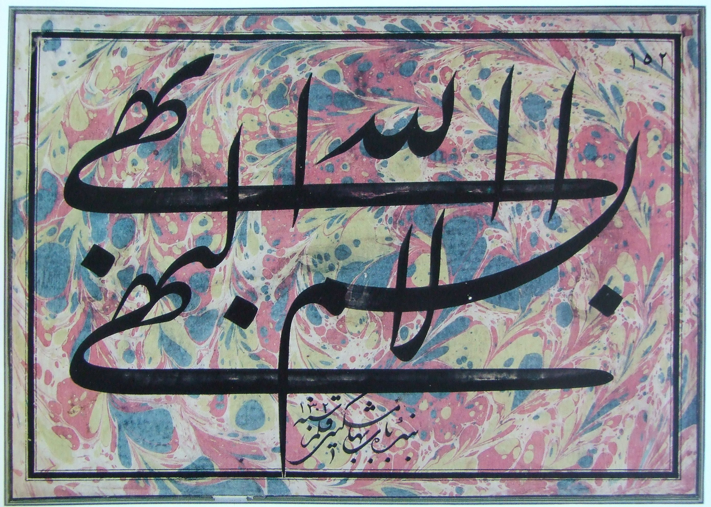
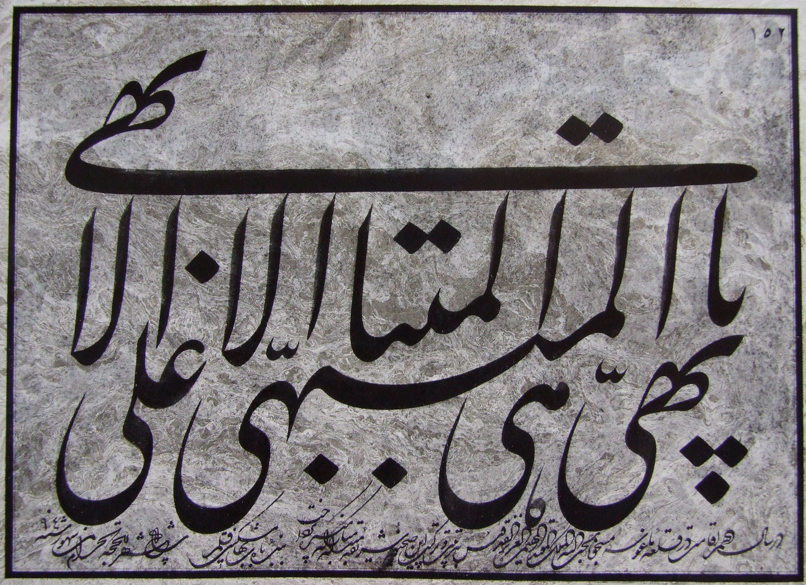
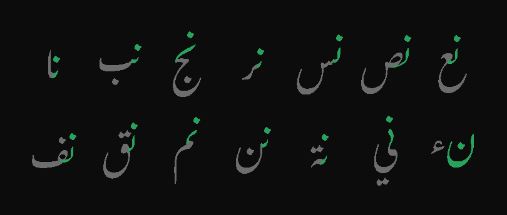
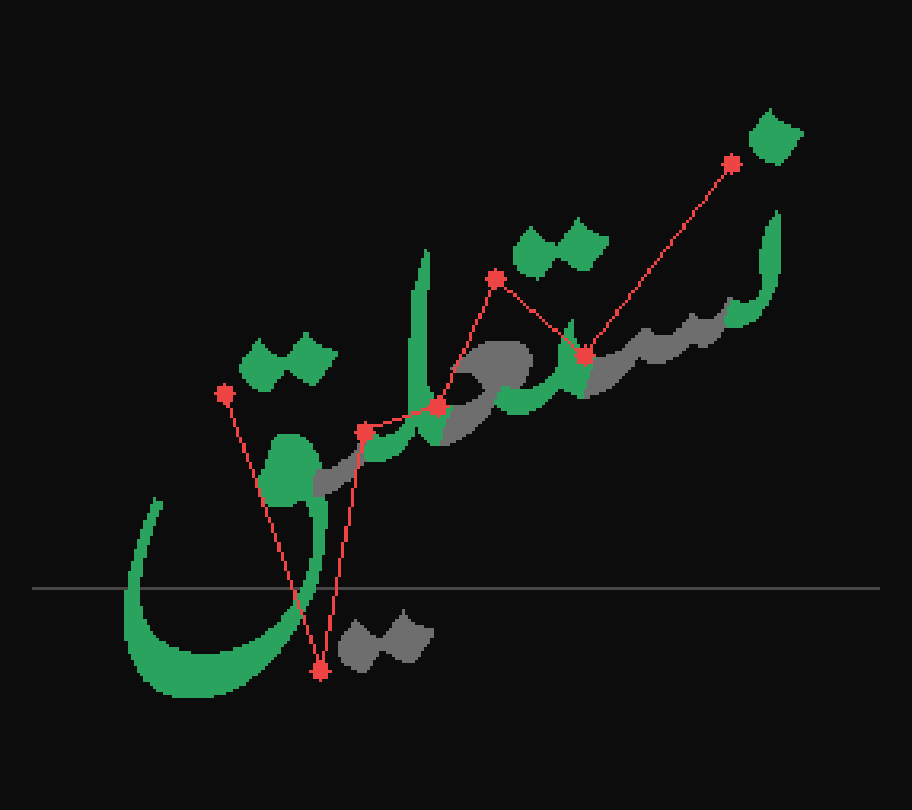
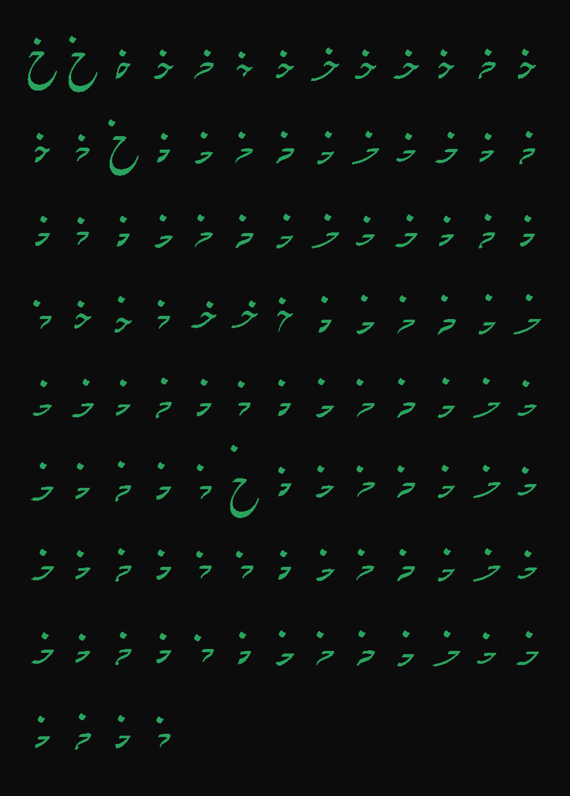
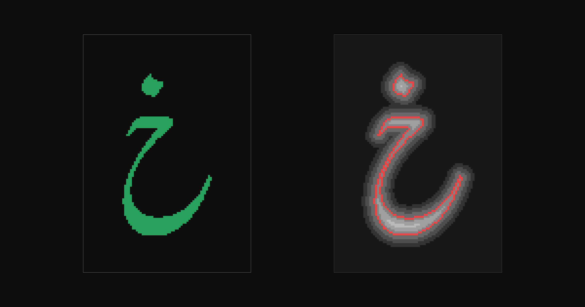
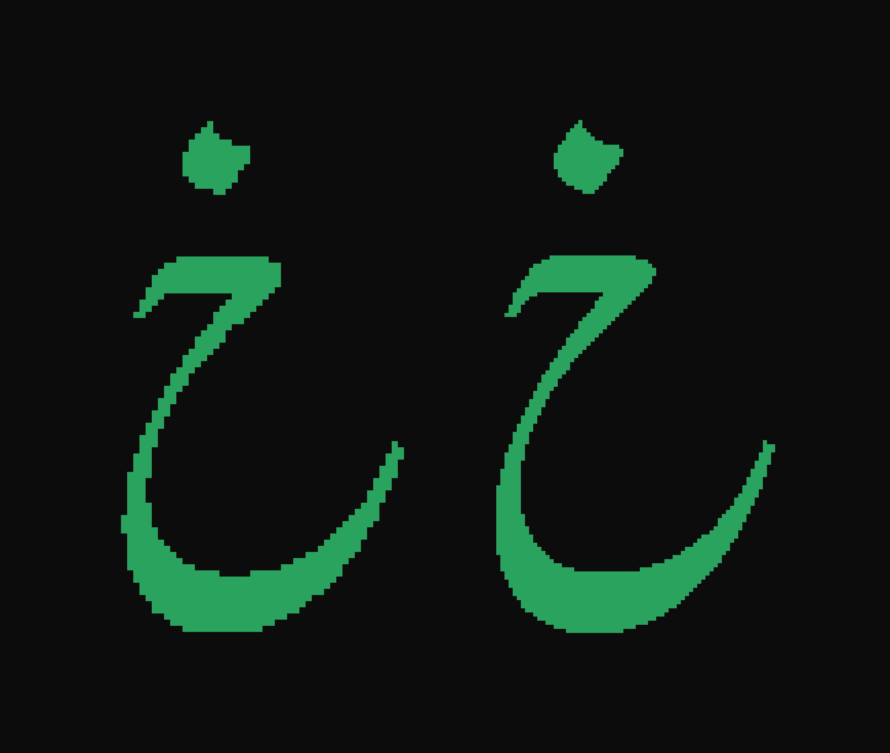
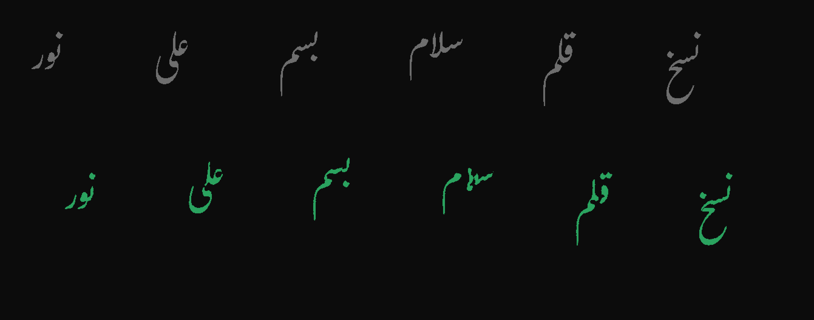

import NeuralTypeDemo from '../../../components/NeuralTypeDemoIsland.astro'
import { nastaliqDemo } from '../../../components/demo-presets'

A previous post introduced the [NeuralType](/blog/neuraltype)
concept: a font can be a small neural network instead of a table of
outlines. The first .ntf font used [square Kufic](https://en.wikipedia.org/wiki/Kufic#Square_Kufic), a style that lives
on a binary grid and resembles low-resolution pixel art. On its own, that is easy to write off as a neat
trick, not a serious challenge to the OpenType format. This post is
the next step. It makes the case that a neural font can do the work
of a real OpenType font. We convert one into a .ntf neural font, in
the style that OpenType serves worst: nastaliq. The target
is [Gulzar](https://github.com/googlefonts/Gulzar), an OFL nastaliq
by Borna Izadpanah, Fiona Ross, Alice Savoie, and Simon Cozens.

<NeuralTypeDemo {...nastaliqDemo} />

Nastaliq is the correct target because it is the style that
OpenType limits the most. It is a cursive, flowing style: letters
join or break by the rules of the Arabic script, and a word is a
chain of connected runs. Within a run, each letter hangs below the letter before it, and
a long run curves far down before the word lands on the line. A
baseline grid barely exists in this style. Words land on the line,
but the letterforms, dots, and swashes sit in free space around it.
OpenType approximates this behavior with more than
one thousand glyphs and cursive-attachment rules. Even so, no
OpenType nastaliq font has come anywhere near the style as it
developed in manuscript and calligraphy culture. If a neural font
has value anywhere, it has value here.

Calligraphy by <a href="https://en.wikipedia.org/wiki/Mishk%C3%ADn-Qalam">Mishkín-Qalam</a> (1826–1912). Public domain, via <a href="https://commons.wikimedia.org/wiki/File:Mishkin-Qalam-09.JPG">Wikimedia Commons</a>.

The demo above runs the full pipeline in your browser. The font is
a model with 1.36 million parameters, stored as a 5.4 MB .ntf file.
Rust code, compiled to WASM, runs the model, places each letter in
the cascade, and traces the contours. The result is real text: click
the canvas, place the cursor, select, copy, and paste. One caveat:
the corpus is still small. It covers every word up to three letters,
plus a small set of real words that includes the basmala. Words
outside the corpus render rough. The demo font is a live training
checkpoint, so it improves as training runs.

The goal of the NeuralType format is not to reproduce existing
OpenType nastaliq fonts. The goal is fonts that do justice to the
manuscript tradition that nastaliq comes from, and no OpenType font
does. I think the best type designers and font engineers working on
nastaliq today will agree. If you think I am wrong, send me an email
or a pull request.

Distillation of an existing OFL nastaliq font is a technical
exercise. If the distilled font matches its teacher, the format
works. After that, the next step is new nastaliq fonts, designed to
show what a NeuralType font can do that an OpenType font cannot. Distillation also answers
the file-size question early: how many parameters does nastaliq
need?

Calligraphy by <a href="https://en.wikipedia.org/wiki/Mishk%C3%ADn-Qalam">Mishkín-Qalam</a> (1826–1912). Public domain, via <a href="https://commons.wikimedia.org/wiki/File:Mishkin-Qalam-48.JPG">Wikimedia Commons</a>.

### The Distillation Process: Measuring Gulzar

The first step toward a nastaliq .ntf font is to measure the
problem: how much contextual behavior does Gulzar contain? To answer
this, we shaped every ordered pair of Arabic letters through Gulzar
with [harfrust](https://github.com/harfbuzz/harfrust). Then we
counted the distinct glyphs that each letter takes for each
neighbor:

- ن takes 16 different first-position glyphs. The letter that follows
  selects the glyph. ي takes 15. م takes 14.
- Across 31 letters, the pairs produce 344 distinct first-position
  variants. Amiri, a naskh with rich contextual behavior, produces
  150 on the same test.

The figure below shows word-initial ن in green, with the following
letter in gray. The follower selects the shape.

We also measured the cascade directly. The shaped word نستعليق
places glyphs at vertical offsets up to **1.38 em above the
baseline**. One word spans more than a full em of vertical travel.
That number does not fit in the metal-type box that digital font
formats still emulate. This is why a new format is needed.

The figure below shows the shaped word نستعليق. The letters
alternate green and gray, the red chain joins the letter origins, and
the gray rule is the baseline.

A .ntf font takes a different path. OpenType stores every variant as
a separate glyph and selects between them with rules, like sorts in a
case of metal type. A .ntf font stores no variants at all. The
neighboring letters are inputs to the model, and the model draws the
correct shape for that context directly. The cascade works the same
way. It is not an attachment rule between stored pieces. It is
geometry that the model generates, one displacement at a time.

### Extraction

The teacher is Gulzar plus its shaping engine. For any text, HarfBuzz
consults the rule tables of the font and answers: these glyphs, at
these positions. The answers are deterministic, and the questions are
free. That is what makes distillation cheap.

The extraction tool (`crates/neuraltype-distill`) asks every short
question. The corpus is every single letter, every ordered pair, and
every ordered triple: 30,783 small words. Triples matter because a
triple is the shortest text where a letter has a neighbor on each
side. Those neighbors produce the medial forms. A second pass added
24 real words: the basmala, Al-Fatiha, Al-Ikhlas, and نستعليق. The
full corpus is 30,807 words.

For every letter in every word, the tool records two facts. The first
fact is the composed shape: the base letterform and its dots, as one
unit. The second fact is the displacement of the letter from the
previous letter. The chain of displacements is the cascade. A list of
small vectors captures all the nastaliq-specific geometry.

The dataset holds 91,390 letter-in-context records, 416 unique
glyphs, and **1,150 unique composed shapes**. More than 100 of those
shapes belong to خ alone. Between adjacent letters, the cascade drops
as much as 1.66 em.

The figure below shows every composed shape of خ in the dataset, 108
in total.

One measurement decided the design of the model. With one letter of
context on each side, 358 contexts were ambiguous: the same three
letters produced different shapes. The rules of Gulzar look further
than one letter. With two letters of context on each side, the
ambiguity is **zero**. Five letters of context fully determine the
choice that Gulzar makes. So the model does not approximate a fuzzy
relationship. It compresses an exact function. The square Kufic
font was the same problem at one thousandth the size.

### Fields

We render each of the 1,150 shapes to a signed-distance field. A
signed-distance field is a grayscale grid. Each cell holds the
distance to the edge of the shape, positive inside and negative
outside. This field is the continuous version of the binary grid in
the first NeuralType font. The project settled on fields for a reason: a field is
figure and ground, black and white, with no stroke or skeleton
assumptions.

The image below shows the isolated خ from the training set. On the
left is the shape. On the right is its signed-distance field, with
the zero contour in red. The model learns to paint the picture on
the right.

We rendered test shapes at two resolutions and looked. At 64 pixels
per em, the tapers and hairlines of Gulzar survive the threshold. At
96 pixels per em, the result looks the same at reading size, but the
model must output 2.3 times more pixels. So the resolution is 64. The
shared canvas is 155×219 pixels. The canvas is large because nastaliq
is large: swash tails and dots extend far from the origin of each
letter.

Below is the isolated خ at both resolutions, shown at the same size:
64 pixels per em on the left, 96 on the right. The threshold keeps
the tapers at both resolutions.

### Training

The model is small. Five context embeddings feed a multilayer
perceptron. The perceptron feeds a stack of five transposed
convolutions, and the convolutions paint the field. A separate
two-value head predicts the displacement. The total is 1.36 million
parameters: 5.4 MB in f32, against the 963 KB TTF of Gulzar.

The model card:

| nastaliq-gulzar .ntf, v0 (working name) |   |
| --- | --- |
| architecture | 5 context embeddings (24 dims) → MLP (120 → 256) → 5 transposed convolutions (128 → 64 → 32 → 16 → 8 → 1 channels, 4×4 kernels, stride 2) + a 2-value displacement head |
| parameters | 1,357,995 |
| file | 5,433,100 bytes: f32 weights + a 1.1 KB JSON header |
| output | one 155×219 signed-distance field at 64 px/em, plus one displacement vector |
| vocabulary | 34 tokens: 31 letters, the لا and لله ligatures, and a boundary token |
| corpus | 30,807 words from the teacher: 91,390 letter-in-context records, 1,150 composed shapes |
| teacher | Gulzar Regular shaped by HarfBuzz ([harfrust](https://github.com/harfbuzz/harfrust)) |
| optimizer | AdamW, lr 3e-4, then a 1e-4 decay pass; batch 128; every 20th record held out |
| compute | one Apple M4 Mac laptop, CPU ([candle](https://github.com/huggingface/candle) accelerate backend), about 8 minutes per epoch |

Training runs in [candle](https://github.com/huggingface/candle), so
the same code trains on CPU, Metal, or CUDA. Inference in the engine
is hand-rolled Rust without a framework, because a .ntf file is only
weights.

The first night produced one surprise. The same training run learns
about twenty times faster per epoch on CPU than on the Metal backend
of candle. Same code, same data. At equal epochs, the CPU run reached
a contour overlap (IoU) of 0.21 against 0.01 for Metal. We moved the
overnight run to CPU, and words became legible by epoch 12.

Thin vertical strokes form last, and the loss explains this: a
hairline is worth tens of pixels, and a bowl is worth thousands.

Build-log status, 2026-08-02: training is complete at contour IoU
0.94. The corpus grew because of one word: الله. Gulzar draws this
word with a dedicated ligature, and no word in the first corpus was
long enough to trigger it. The extended corpus added the basmala and
other real words, but the new rows were a sliver of the gradient and
learned slowly. The fix was to oversample them: the trainer repeats
the long-word rows dozens of times per epoch, and the ligature
converged in eight epochs. A decayed learning rate pass finished the
run, the same schedule that took the Kufic font from almost correct
to exact. The basmala now renders exactly, ligature included.

The sheet below compares the teacher with the final model. Gulzar is
gray on top. The model is green below.

### Tracing with img2bez

The model outputs a field, but text needs outlines. The demo uses
two tracers. While you type, a fast sub-pixel tracer draws each word
with no added latency. When input settles, each word upgrades to a
quality outline from [img2bez](/blog/img2bez), the autotracer I
built for turning rasters into font-grade bézier curves. The upgrade
runs in a Web Worker, so the editor never blocks.

The .ntf pipeline pushed one new capability back into img2bez. Its
sub-pixel stage already treated an image as a signed field, so we
removed the image: `trace_sdf` traces the model's distance field
directly. It samples the field lazily, takes exact iso-crossings,
and fits curves in Smooth mode, where every segment is a
tangent-continuous cubic. No raster exists anywhere in the render
path: the model paints a field, and the field becomes curves.

### Status

1. Extract: **complete.** Corpus, cluster records, displacements.
2. Fields: **complete.** SDFs at 64 px/em on a shared canvas.
3. Train: **complete.** The model outputs a field plus a
   displacement. The engine chains the displacements, and that chain
   is the cascade. Final contour IoU: 0.94.
4. Trace: **complete.** A fast sub-pixel tracer for live typing,
   and [img2bez](/blog/img2bez) as the quality pass. See the section
   above.
5. Measure: held-out IoU per epoch exists. Worst-case proof sheets
   and tests on real Urdu and Persian text remain.
6. Demo: **live above**, in the same editor island as the NeuralType
   post.

The work happens
in the [post-opentype repo](https://github.com/eliheuer/post-opentype).
The plan lives in
[docs/DISTILL.md](https://github.com/eliheuer/post-opentype/blob/main/docs/DISTILL.md).
The distilled font ships under the OFL, with Gulzar's copyright
notice and credit.
