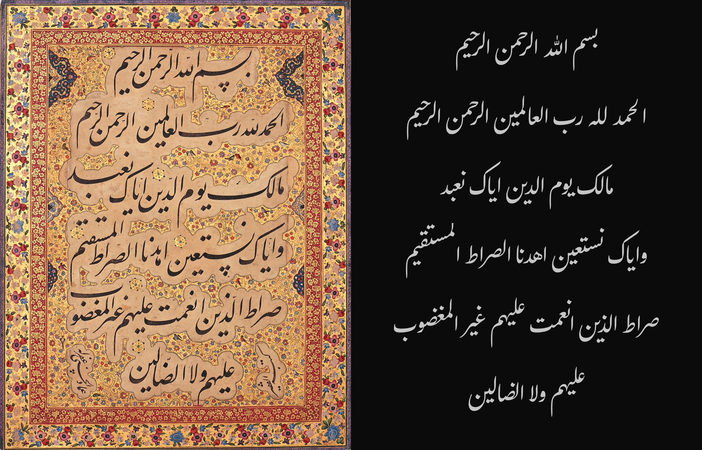
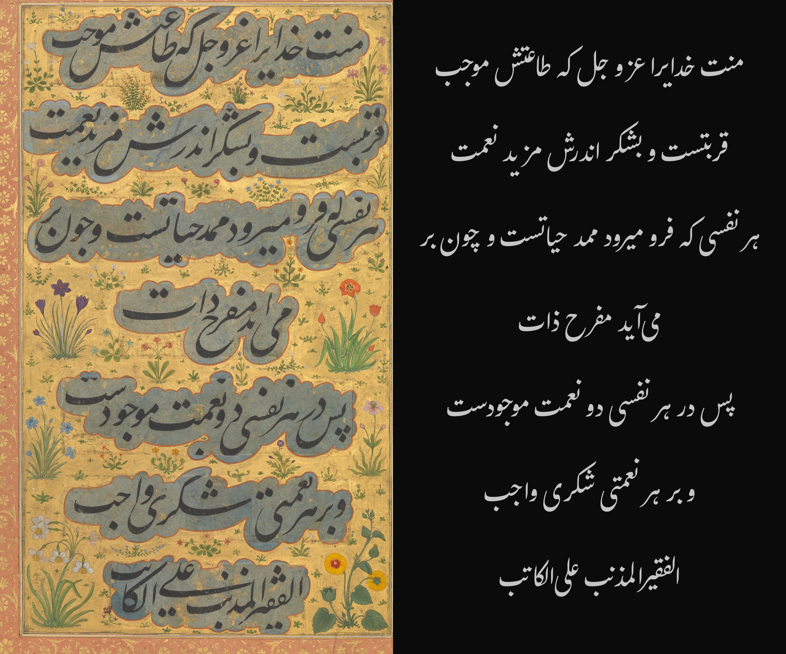
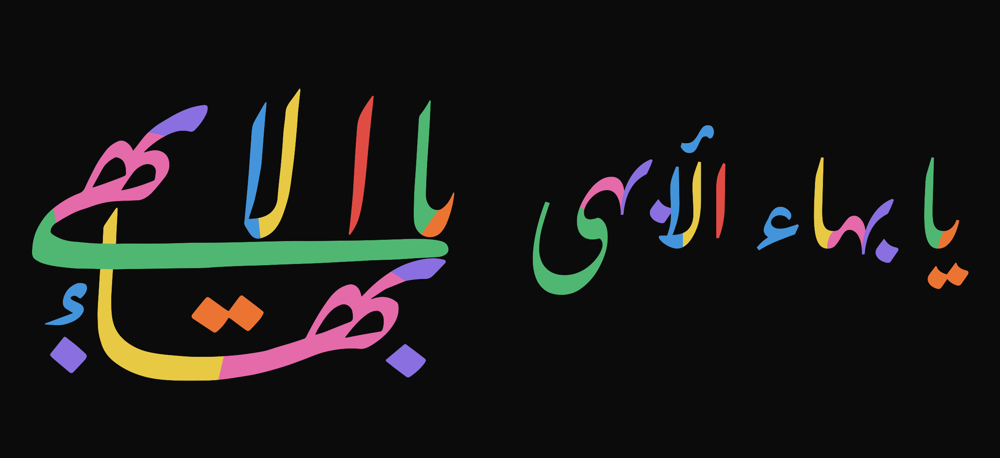
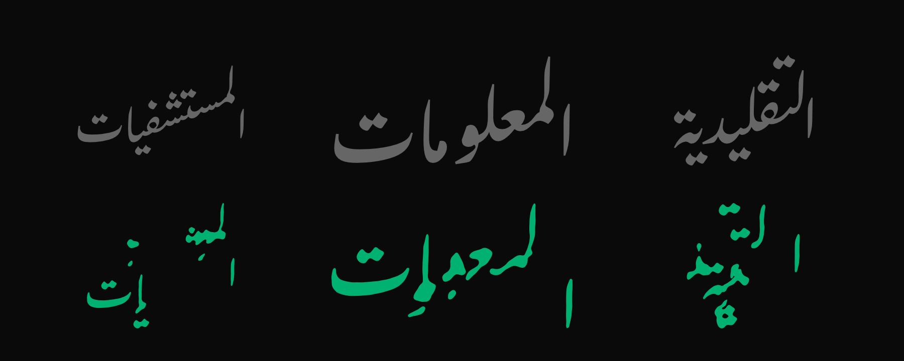
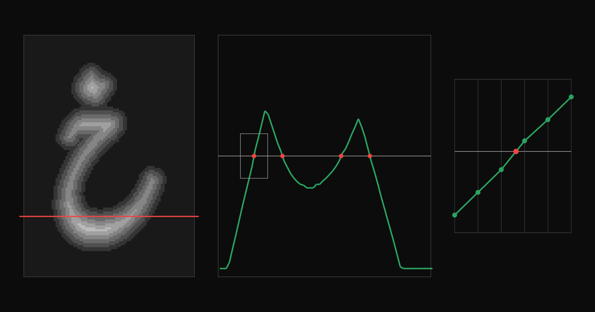
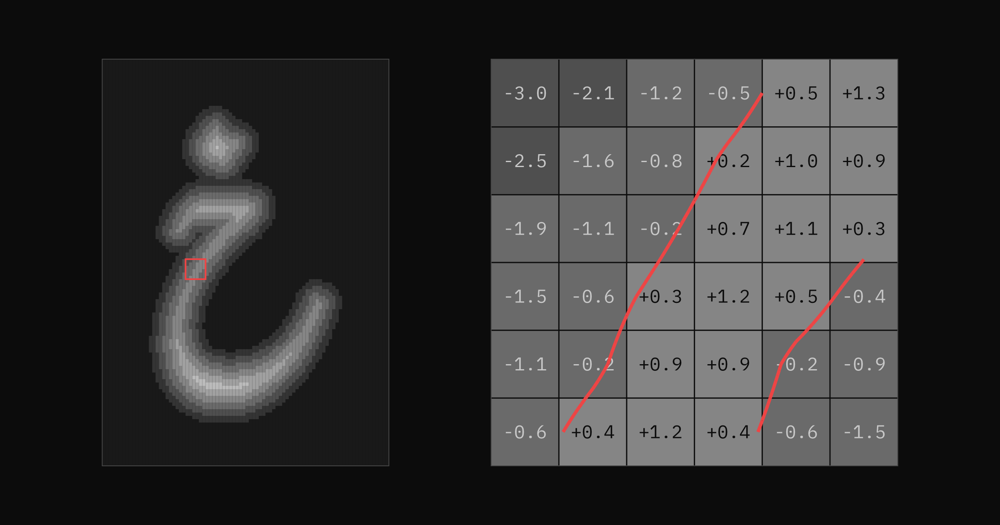
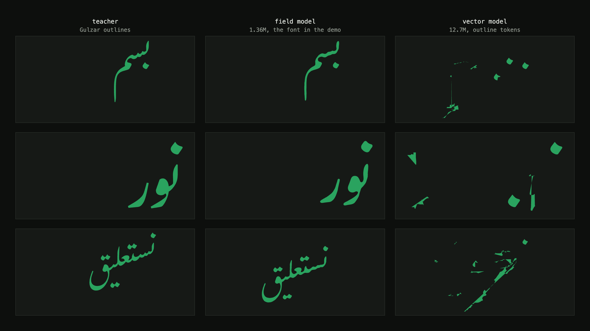

import { Image } from 'astro:assets'
import NeuralTypeDemo from '../../../components/NeuralTypeDemoIsland.astro'
import TraceDemo from '../../../components/TraceDemoIsland.astro'
import { nastaliqDemo } from '../../../components/demo-presets'
import BahramGurImage from './bahram-gur-red-palace.jpg'
import TrainingImage from './train.png'

A previous post introduced the [NeuralType (.ntf)](/blog/neuraltype) font
format. An .ntf font is a small neural network with a short header, not a system
that emulates Gutenberg’s movable type with virtual metal rectangles containing
predefined glyph shapes. The first .ntf font was
[square Kufic](https://en.wikipedia.org/wiki/Kufic#Square_Kufic), a
style that resembles low-resolution pixel art. That font was a simple test of
the concept and was easy to dismiss as a toy tech demo. This post is the next
step. It tries to prove that neural fonts can be a viable alternative to
OpenType.

I distilled [Gulzar](https://github.com/googlefonts/Gulzar), an OpenType
Nasta’liq font, into a .ntf. The resulting 1.36-million-parameter neural font
can reproduce much of Gulzar’s output. It still fails on many unseen words and
does not treat a whole line as one composition. Try it in the interactive demo
below. Type, copy, paste, or move the cursor with the arrow keys. Press space to
separate joined letters. Click and drag to select several letters at once.

<NeuralTypeDemo {...nastaliqDemo} />

The model above has 1.36 million parameters. With 8-bit weights,
the .ntf file is 1.38 MB.
The NeuralType engine is written in Rust, compiled to WASM, and built with
[Linebender](https://linebender.org/) libraries. The demo does not use
OpenType shaping at runtime. During training on an inexpensive local GPU, the
model learned to reproduce the shaped output produced by Gulzar and
[HarfRust](https://github.com/harfbuzz/harfrust), a Rust port of the HarfBuzz
text-shaping engine.

### Why Nasta’liq

Calligraphy by <a href="https://en.wikipedia.org/wiki/Mishk%C3%ADn-Qalam">Mishkín-Qalam</a> (1826–1912). Public domain, via <a href="https://commons.wikimedia.org/wiki/File:Mishkin-Qalam-09.JPG">Wikimedia Commons</a>.

Nasta’liq is a relatively nonlinear style of the Perso-Arabic script. Its
traditional calligraphic compositions allow more freedom than many
other styles. A calligrapher
can stack words, extend strokes, and adjust the positions of letters and dots
to balance black and white space.

The limits of OpenType fonts are easier to see when the same text is shown two
ways.
The next two figures place historical calligraphy beside the same text set in
Gulzar. You do not need to read Nasta’liq to compare them. Just look at the forms and try to find differences between the two sides. Pay attention to the negative space between the forms.

Left: <em>Al-Fatiha</em> in Nasta’liq by Mir Emad Hassani (1554–1615), National Museum of Iran. Public domain, via <a href="https://commons.wikimedia.org/wiki/File:Nasta%27liq_calligraphy_style_-_Mir_Emad_Hassani_09.png">Wikimedia Commons</a>. Right: the same text set in <a href="https://github.com/googlefonts/Gulzar">Gulzar</a>.

Left: the opening prose passage of the preface to Saadi’s <em>Golestan</em>. Calligraphy by Mir Ali Haravi (died ca. 1550), ca. 1530–50, from a folio in the Shah Jahan Album. Public domain, The Metropolitan Museum of Art, via <a href="https://commons.wikimedia.org/wiki/File:%22Shah_Jahan_on_Horseback%22,_Folio_from_the_Shah_Jahan_Album_MET_DP235886.jpg">Wikimedia Commons</a>. Right: the same text set in <a href="https://github.com/googlefonts/Gulzar">Gulzar</a>.

One short phrase shows how freeform and nonlinear Nasta’liq can be. The calligrapher separates, stacks, and repositions letters that follow one another in the text. This is an extreme example, but the compositions above use the same principle more subtly,
moving letters and dots away from their expected positions to balance the composition and negative space.

Left: <em>Yá Bahá’u’l-Abhá</em>, original calligraphy by <a href="https://en.wikipedia.org/wiki/Mishk%C3%ADn-Qalam">Mishkín-Qalam</a> (1826–1912). Color diagram by Любослов Езыкин, September–October 2015, <a href="https://creativecommons.org/licenses/by-sa/4.0/">CC BY-SA 4.0</a>, via <a href="https://commons.wikimedia.org/wiki/File:Arabic_letters_in_the_Greatest_Name.svg">Wikimedia Commons</a>. Right: the same text set in <a href="https://github.com/googlefonts/Gulzar">Gulzar</a>.

An OpenType font could include this exact composition as a ligature glyph. A
shaping engine could substitute it for the phrase while preserving the
underlying text. But the font would contain only one finished design for one
phrase. It would not learn how to compose other text. A neural-network-based
font could learn a style and use it to make new compositions. A whole line or
page could adjust to the available space. This is a goal for a future font
designed from the ground up as a neural network. The distilled Gulzar model
does not do this.

Calligraphy by <a href="https://en.wikipedia.org/wiki/Mishk%C3%ADn-Qalam">Mishkín-Qalam</a> (1826–1912). Public domain, via <a href="https://commons.wikimedia.org/wiki/File:Mishkin-Qalam-48.JPG">Wikimedia Commons</a>.

<Image
  src={BahramGurImage}
  alt="A calligraphic folio showing Bahram Gur in the Red Palace, with blocks of Nasta’liq above and below the painted scene."
  layout="full-width"
  class="rounded-md"
/>

“Bahram Gur in the Red Palace on Tuesday,” folio 220 from Nizami’s <em>Khamsa</em>. Calligraphy by Sultan Muhammad Nur (ca. 1472–ca. 1536) and Mahmud Muzahib (ca. 1500–1560); painting by Shaikh Zada (active 1510–1550). Herat, 1524–25. Public domain, The Metropolitan Museum of Art, via <a href="https://commons.wikimedia.org/wiki/File:%22Bahram_Gur_in_the_Red_Palace_on_Tuesday%22,_Folio_220_from_a_Khamsa_(Quintet)_of_Nizami_of_Ganja_MET_DP-22880-001.jpg">Wikimedia Commons</a>.

### Other Approaches

I used [Gulzar](https://gulzarfont.org/) because it is the best current
OFL licensed Nasta’liq font I found that uses OpenType Layout. [Noto Nastaliq
Urdu](https://notofonts.github.io/noto-docs/specimen/NotoNastaliqUrdu/) is the
only comparable option I could verify and, in my view, is slightly worse.
[Awami Nastaliq](https://software.sil.org/awami/resources/) uses
[Graphite](https://graphite.sil.org/), while SIL’s older [Nastaliq
Navees](https://scripts.sil.org/cms/scripts/page.php?id=nastaliq_download&site_id=nrsi)
relies on the obsolete QuickDraw GX system.

Other systems have tried to move beyond OpenType Layout. Graphite lets a font
supply more complex shaping rules. [DecoType’s](https://decotype.com/) Advanced
Composition Engine powered
[Tasmeem](https://decotype.com/pdfs/Tasmeem_Manual.pdf), a proprietary InDesign
extension with greater control over Arabic composition. Both approaches are
procedural: designers define the behavior through rules rather than training a
model from examples. Both depend on support outside the usual OpenType shaping
path, which limits where they can be used.

Neural fonts also need engine support. Their advantage is that a learned model
can produce behavior that would be impractical to encode by hand. My long-term
goal is a format that could replace OpenType, not another specialist extension.
It could support new kinds of typography for branding, advertising, and
cultural production, and those applications could make adoption economically
viable. The gains must be large enough to justify the switch.

### Measuring Gulzar

To distill Gulzar into a neural font, I first measured how much its output
changes with context.

I shaped every possible two-letter sequence with Gulzar and HarfBuzz. For each
first letter, I counted the distinct glyph IDs in the shaped output. Across the
31 letters, these contextual-variant counts total 344, or about 11 glyph IDs
per letter on average. The same test gives 150
for Amiri, a Naskh font with rich contextual behavior.

The figure below shows initial ن in green, with the following
letter in gray. Each following letter produces a different initial form.

The figure below shows the vertical cascade in نستعليق. The letters alternate
between green and gray. The red points mark the origins of the main letterforms,
which span 0.95 em vertically.

### Building the Dataset

In this kind of training, the teacher is the existing system whose output the
model learns to reproduce. Here, the teacher is Gulzar shaped by HarfBuzz. For
each input string, HarfBuzz uses its Arabic shaping logic to apply Gulzar’s
OpenType Layout tables. It returns glyph IDs with advances and offsets. The
extraction code uses these values to place the glyph outlines. Because the
shaping settings do not change, the same input string always produces the same
result. That result becomes the model’s training target. This is a property of
the teacher, not a limit of neural fonts.

The
[`crates/neuraltype-distill`](https://github.com/eliheuer/post-opentype/tree/main/crates/neuraltype-distill)
tool shapes every possible string of one, two, or three letters, for a total of
30,783 strings. Three-letter strings include cases where the middle letter
joins on both sides. The corpus also includes 24 real words from the bismillah,
the surahs Al-Fatiha and Al-Ikhlas, and the word نستعليق.

The tool groups the output by HarfBuzz cluster. A cluster links one or more
input characters to the glyphs that represent them. The tool writes one record
for each cluster. A record contains the cluster’s text context, composed shape,
and position. The first cluster keeps its position relative to the word origin.
Each later cluster keeps its offset from the previous cluster. These offsets
place the predicted shapes along Gulzar’s cascade.

The corpus contains 91,390 cluster records and **1,150 distinct composed
shapes**. The letter خ uses 108 of them.

The figure below shows all 108 shapes used for خ.

The corpus covers short strings exhaustively but only 24 longer words. The
three unseen words below use only supported letters, yet the model breaks their
shapes and placement. Gulzar is gray; the model is green.

More training text would barely change the font’s file size. The .ntf stores
the trained weights, not the training examples. New words made from the current
letters and ligatures add no parameters. A new ligature or cluster token adds
24 8-bit weights and a short name, about 30 bytes. Even 100 new tokens would add
only about 3 KB. If the current network can learn the new examples, the font
stays almost the same size. If it cannot, we would need a larger network. Each
additional million 8-bit parameters would add about 1 MB.

An OpenType shaper applies the same script logic and font tables to new input
strings. A neural font must learn behavior that transfers to sequences absent
from its training data. Brute-force coverage for this model would require about
28.6 million five-letter contexts, and it would still miss effects beyond two
neighboring letters. A better method is to train on a large real corpus, test
generated strings against Gulzar and HarfBuzz, and add the failures to the
training set. A variable-length model could use the whole word or line as
context. A production NeuralType engine could also enforce basic rules for
joins and mark attachment, then use simpler forms when the model produces
invalid output.

### Signed-Distance Fields

We convert each composed shape into a signed-distance field. This lets the
model predict a grid of numbers instead of a sequence of Bézier drawing
commands.

A grayscale rasterization records the coverage of each pixel. A signed-distance
field instead records each cell’s distance to the nearest edge.
Values are positive inside the shape and negative outside. The edge is where
the values cross zero. These distances let us place the edge between grid
cells.

The image below shows the isolated خ from the training set. On the left is the
shape. On the right is its signed-distance field, with the zero contour in red.
The model learns to reproduce this field.

A [2007 paper from Valve](https://steamcdn-a.akamaihd.net/apps/valve/2007/SIGGRAPH2007_AlphaTestedMagnification.pdf)
used this representation to render sharp vector graphics from low-resolution
textures in the Source game engine.

The figure below follows one horizontal row through خ. The red line in the left panel
marks the row. The middle panel plots its values. Each red dot marks a zero
crossing where the row passes through an edge of the letter.

The right panel enlarges one crossing. It falls between two cells, and its
position is calculated from their values. The outline is therefore not limited
to the grid. A small prediction error moves the nearby edge. It does not break
the rest of the outline like outline prediction would. The tracer follows the
zero crossings to construct a new Bézier outline.

The next figure shows a small patch of the field cell by cell. Each cell lists
its distance in pixels: negative outside and positive inside. The red outline
passes through the interpolated zero crossings. This patch contains a thin
stroke, so the outline crosses it twice.

Each shape uses a shared 155×219-pixel canvas at 64 pixels per em. Nasta’liq
needs this large canvas because swash tails and dots extend far from each
cluster’s origin.

### How the Neural Network Works

The current network is feed-forward: information passes through its layers once,
from input to output. It does not loop or refine the result in repeated steps.

To draw a letter or ligature, the model looks at it and up to two letters on
each side. It combines what it learned about those letters into a description
of the shape it needs to draw.

From this description, the model predicts the shape and where it belongs. The
first cluster origin is measured from the start of the word. Each later origin
is measured from the previous cluster origin. To draw the shape,
[five layers](https://github.com/eliheuer/post-opentype/blob/main/crates/neuraltype-train/src/main.rs#L177-L216)
turn a small set of grids into the final 155×219 signed-distance field.

This simple model works because it copies one existing font. The same strokes,
curves, and dots appear in many shapes, so the model can learn them once and
reuse them. It does not need to understand the language or invent a new design.

A future model could look at a whole word, line, or page instead of only nearby
letters. It could also calculate the field only where the renderer needs it.
That would allow more detail around thin strokes and sharp edges without making
the whole grid larger.

### Training

The model begins with random internal values, called weights. For each group of
examples, it predicts a field and an origin displacement. We compare both
predictions with the teacher targets and combine the differences into one error
score. The training code changes the weights slightly to lower that score.
Repeating this process teaches one set of weights to produce every field and
displacement.

We use [Candle](https://github.com/huggingface/candle) to train the model because
it provides tools in Rust and runs on CPU, Metal, or CUDA.

AI training is often associated with corporate data centers. NeuralType models
are much smaller and more specialized. I trained this model locally on a Linux
PC with an NVIDIA RTX 2060 SUPER, an inexpensive consumer graphics card with 8
GB of memory. One epoch takes about 100 seconds. Inference also runs locally,
including in the browser demo above. This puts neural font development within
reach of independent type designers and small foundries. I expect local model
training to become a common part of font development.

<Image
  src={TrainingImage}
  alt="A terminal dashboard showing NeuralType training progress, falling loss, validation IoU, GPU use, and memory use."
  layout="full-width"
  class="rounded-md"
/>

Training the larger 96 px/em experiment on a local Linux PC. The model uses 2.9 GB of the NVIDIA RTX 2060 SUPER’s 8 GB of memory and takes about 100 seconds per epoch.

After the model learned the main forms, I reduced how much the weights changed
in each step. These smaller changes improved fine details without disrupting
the larger shapes.

Shape accuracy is measured with intersection over union (IoU). It divides the
area where the model output and target shape overlap by the total area covered
by either shape. Identical shapes score 1.0. Shapes with no overlap score 0.
The final model scored 0.945 on examples excluded from training. This score
does not measure how the model handles new words: the held-out examples come
from the same mostly short-string corpus as the training examples. It also
measures shape only, not position. It does not reflect a known placement
problem: when the same local context has different positions in different
teacher examples, the current training step averages those positions. The
result may match none of the examples.

### Rendering the Output

The model outputs a field. The demo converts it to a Bézier outline before
drawing it. It uses two tracers. While you type, a fast subpixel tracer draws
each word. When input settles,
[img2bez](/blog/img2bez) replaces it with a higher-quality outline. img2bez is a
Rust crate I built specifically for tracing AI-generated glyph images. It finds
the edge, fits Bézier curves to it, and produces an outline that can be used in
a font. Its settings can favor accuracy, smoother curves, or fewer points. The
demo uses the Clean profile with a tight, faithful fit. It applies light
smoothing and uses SmoothG2 mode to keep the joins between curves smooth.

The slower tracer runs in a Web Worker, separate from the thread that handles
typing and drawing. The editor stays responsive, and each new outline appears
when it is ready.

For this project, I added direct distance-field input to img2bez. It traces the
model’s field directly, without first converting it to a conventional grayscale
image.

The demo below shows img2bez tracing a raster glyph. This project gives it the
model’s distance field instead, but uses the same tracing controls and
curve-fitting code.

<TraceDemo image="/demos/img2bez/a.png" glyph="a" unicode="0061" />

### Results

The sheet below compares the teacher with the final model. Gulzar is
gray on top. The model is green below.

The final model has 1.36 million parameters and takes 1.38 MB, compared with 963
KB for the Gulzar TTF. It stores the weights as 8-bit values. The same weights
take 5.4 MB when stored as 32-bit values. The precision controls in the demo let
you compare the 32-bit, 16-bit, and 8-bit versions.

The two files do not perform exactly the same job. Gulzar stores glyph outlines
and OpenType Layout tables for substitution (GSUB) and positioning (GPOS). A
shaping engine such as HarfBuzz applies those tables using its Arabic shaping
model. The .ntf stores a learned approximation of the resulting shapes and
positions, but it also requires the NeuralType engine. The comparison therefore
measures font data, not the complete software stack.

The 8-bit output is close to the original. Some strokes and letter positions
shift. Fine-tuning while simulating 8-bit weights may reduce these differences.

Further file-size reductions are possible. We have not spent much time on
optimization yet. One part of the model contains 84 percent of its weights. We
could replace it with two smaller layers, for example.

The model card:

| `gulzar-int8.ntf` | |
| --- | --- |
| size | 1,380,371 bytes |
| parameters | 1,357,995 |
| output | one 155×219 signed-distance field at 64 px/em, plus the cluster’s position relative to the word origin or previous cluster |
| coverage | 31 Arabic letters, plus the لا and لله ligatures |
| training data | 30,807 input strings, 91,390 cluster records, and 1,150 shapes |
| teacher | Gulzar Regular shaped with HarfRust, the Rust port of HarfBuzz |
| compute | about 8 minutes per epoch on an Apple M4 CPU; about 100 seconds on an NVIDIA RTX 2060 SUPER |
| validation | IoU 0.945 |

### Failed Scaling Attempts

I tested three quick changes. These were exploratory runs, not controlled
scaling tests, and I did not retune the training settings for each model.
Increasing the field resolution made the model larger but did not improve the
letters. A wider network performed worse with the reused settings. Training a
transformer to draw outlines directly produced fragments instead of complete
shapes.

The first test rendered the fields at two resolutions. At 64 pixels per em,
Gulzar’s tapers and hairlines remain visible in the resulting outline. At 96
pixels per em, the result looks the same at reading size, but the model must
output 2.3 times more pixels.

Below is the isolated خ at both resolutions, shown at the same size: 64 px/em
on the left and 96 px/em on the right.

The direct-outline model failed more visibly.

| | trainable parameters | f32 export | result |
| --- | --- | --- | --- |
| field, 64 px/em | 1,357,995 | 5.4 MB | IoU 0.945, compressed to 1.38 MB in the demo |
| field, 96 px/em | 3,101,483 | 12.4 MB | IoU 0.825, no visible gain |
| field, 64 px/em, wide | 5,357,091 | 21.4 MB | IoU 0.809, strokes merge |
| vector, outline tokens | 12,693,639 | 53.3 MB | accuracy 0.482, fragments |

The smallest model is the one used in the demo, but it is incomplete. At an IoU
of 0.945, it rounds sharp features and weakens or omits small ones. Some
smoothing is acceptable, but the missing detail still needs to be recovered.
None of the three larger designs addressed this problem.

This vector run rules out the simple implementation tested here, not direct
outline prediction itself.
[DeepVecFont](https://arxiv.org/abs/2110.06688) generated outlines as command
sequences but needed image-guided refinement to produce usable curves.
[DeepVecFont-v2](https://arxiv.org/abs/2303.14585) redesigned the outline
representation to make the sequences learnable.
[VecFontSDF](https://arxiv.org/abs/2303.12675) instead based vector font
synthesis on signed-distance functions, the representation used here.

### Beyond This Model

The next model should be designed around composition rather than distillation.
I would test three changes.

First, it should place a whole line at once. The inputs would include the text
and the available width and height. A small
[Transformer](https://arxiv.org/abs/1706.03762) could compare every part of the
line before assigning positions. Placement would become one decision about the
complete composition instead of a chain of local offsets.

Second, the training data should keep alternative placements as separate
targets. When the same shape has different positions in different teacher
examples, the model should choose among those positions using the rest of the
line. It should not average them into a position that may occur nowhere in the
source.

Third, the model could calculate a continuous distance field instead of
returning a fixed 155×219 grid. The renderer would give the model an x/y
coordinate and receive the distance to the edge at that point. It could sample
the field coarsely, find the outline, and then take more samples around
hairlines and tapers. Research on
[continuous signed-distance functions](https://arxiv.org/abs/1901.05103),
[SIREN](https://arxiv.org/abs/2006.09661), and
[Fourier features](https://arxiv.org/abs/2006.10739) provides several methods to
test.

These changes do not require every .ntf font to use the same network. The file
header identifies the model type and its dimensions. A later engine can use
that information to load a new architecture.

The file size is not yet known. Whole-line processing would add weights, while
removing the fixed-grid output layer could remove most of the current model’s
weights. These changes pull in opposite directions. The result needs to be
measured rather than inferred from this distilled model.

I would start with another feed-forward model, not a diffusion model. Diffusion
usually requires repeated passes to produce one result. A text editor needs the
same result quickly after every change. The first experiment should therefore
be a small whole-line model with a continuous distance-field decoder.

### Project Status

The current distillation pipeline runs end to end. Work now focuses on a larger
corpus, model quality, worst-case proof sheets, and tests with real Urdu and
Persian text. New fonts also need editing software built for training neural
networks. I plan to have a prototype of this software and the first Nasta’liq
font designed for the format ready for ATypI 2026 in Sharjah, where I will be
available to demo the work and answer questions from companies, independent
designers, and engineers interested in exploring this approach. [Get in
touch](mailto:eli@elih.net) if you want to discuss the project.

Development happens
in the [post-opentype repo](https://github.com/eliheuer/post-opentype).
The plan lives in
[docs/DISTILL.md](https://github.com/eliheuer/post-opentype/blob/main/docs/DISTILL.md).
The distilled font is licensed under the OFL and retains Gulzar’s copyright
notice and credit.
