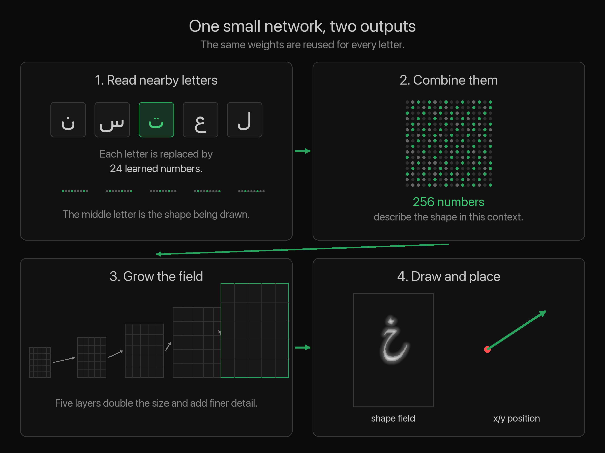
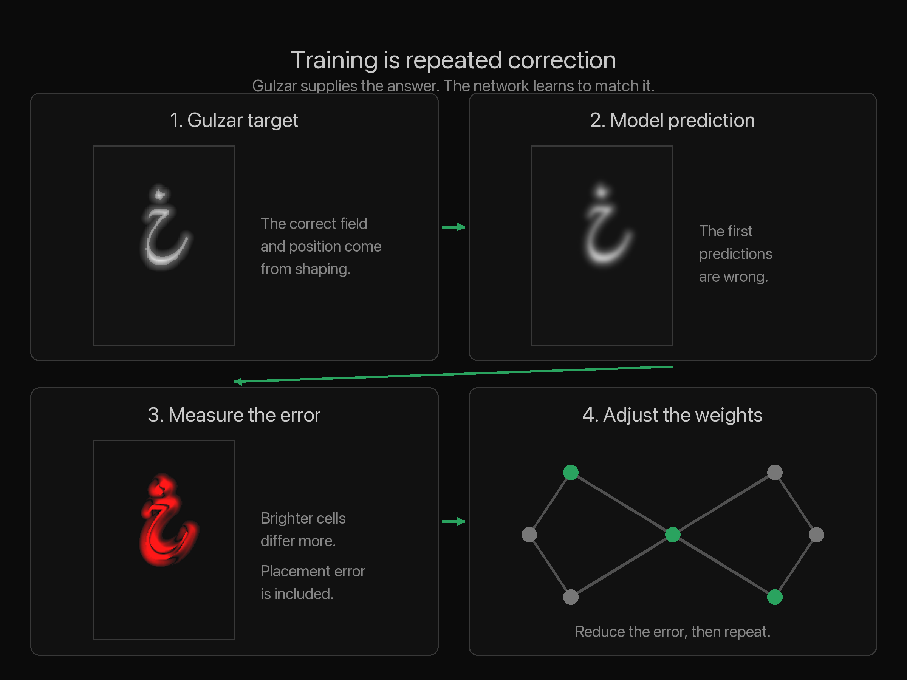
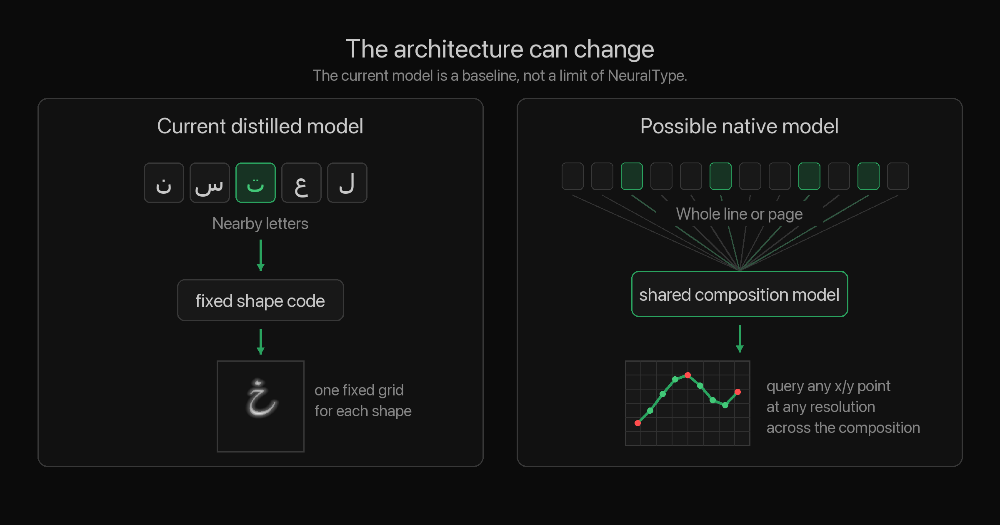

import { Image } from 'astro:assets'
import NeuralTypeDemo from '../../../components/NeuralTypeDemoIsland.astro'
import { nastaliqDemo } from '../../../components/demo-presets'
import BahramGurImage from './bahram-gur-red-palace.jpg'

A previous post introduced the [NeuralType (.ntf)](/blog/neuraltype) font
format. An .ntf font is a small neural network with a short header, not a system
that emulates Gutenberg’s movable type with virtual metal rectangles containing
fixed glyph shapes. The first .ntf font was
[square Kufic](https://en.wikipedia.org/wiki/Kufic#Square_Kufic), a
style that resembles low-resolution pixel art. That font was a simple test of
the concept and was easy to dismiss as a toy tech demo. This post tests whether a neural network based font can serve as a practical alternative to OpenType.

I distilled [Gulzar](https://github.com/googlefonts/Gulzar), an OpenType
Nasta’liq font, into a .ntf. The result is in the interactive demo below. Type,
copy, paste, or move the cursor with the arrow keys. Press space to separate
joined letters. Click and drag to select several letters at once.

<NeuralTypeDemo {...nastaliqDemo} />

The demo uses the neural network to shape and render text entirely in the browser. The model has 1.36 million
parameters. With 8-bit weights, the .ntf file is 1.38 MB. The rendering engine
is written in Rust, compiled to WASM, and built with
[Linebender](https://linebender.org/) libraries. The demo does not use an
OpenType shaping engine. During training on an inexpensive local GPU, the model
learned to reproduce Gulzar as shaped by
[HarfRust](https://github.com/harfbuzz/harfrust), a Rust port of HarfBuzz.

### Why Nasta’liq

Calligraphy by <a href="https://en.wikipedia.org/wiki/Mishk%C3%ADn-Qalam">Mishkín-Qalam</a> (1826–1912). Public domain, via <a href="https://commons.wikimedia.org/wiki/File:Mishkin-Qalam-09.JPG">Wikimedia Commons</a>.

Nasta’liq is a relatively nonlinear style of the Perso-Arabic script. Its
traditional calligraphic compositions allow more freedom than those of many
other styles. A calligrapher
can stack words, extend strokes, and adjust the positions of letters and dots
to balance black and white space.

The limits of OpenType are easier to see when the same text is shown two ways.
The next two figures place historical calligraphy beside the same text set in
Gulzar. You do not need to read Nasta’liq to compare them. Just look at the forms and try to find differences between the two sides.

Left: <em>Al-Fatiha</em> in Nasta’liq by Mir Emad Hassani (1554–1615), National Museum of Iran. Public domain, via <a href="https://commons.wikimedia.org/wiki/File:Nasta%27liq_calligraphy_style_-_Mir_Emad_Hassani_09.png">Wikimedia Commons</a>. Right: the same text set in <a href="https://github.com/googlefonts/Gulzar">Gulzar</a>.

Left: the opening prose passage of the preface to Saadi’s <em>Golestan</em>. Calligraphy by Mir Ali Haravi (died ca. 1550), ca. 1530–50, from a folio in the Shah Jahan Album. Public domain, The Metropolitan Museum of Art, via <a href="https://commons.wikimedia.org/wiki/File:%22Shah_Jahan_on_Horseback%22,_Folio_from_the_Shah_Jahan_Album_MET_DP235886.jpg">Wikimedia Commons</a>. Right: the same text set in <a href="https://github.com/googlefonts/Gulzar">Gulzar</a>.

[Gulzar](https://gulzarfont.org/) is a contemporary Urdu Nasta’liq typeface
intended for sustained reading. It is not a perfect match for either
historical example, but it is the best available open option for this
comparison. I could not find another usable OpenType Nasta’liq font under the
OFL license.

One short phrase shows how far this freedom can go. The calligrapher separates,
stacks, and repositions letters that follow one another in the text. This is an
extreme example. The compositions above use the same principle more subtly,
moving letters and dots away from their expected positions to balance the page.

Left: <em>Yá Bahá’u’l-Abhá</em>, original calligraphy by <a href="https://en.wikipedia.org/wiki/Mishk%C3%ADn-Qalam">Mishkín-Qalam</a> (1826–1912). Color diagram by Любослов Езыкин, September–October 2015, <a href="https://creativecommons.org/licenses/by-sa/4.0/">CC BY-SA 4.0</a>, via <a href="https://commons.wikimedia.org/wiki/File:Arabic_letters_in_the_Greatest_Name.svg">Wikimedia Commons</a>. Right: the same text set in <a href="https://github.com/googlefonts/Gulzar">Gulzar</a>.

OpenType could reproduce this exact composition with a ligature glyph while
preserving the underlying text. But that would store one finished design for
one phrase. It would not teach the font how to compose other text. A Nasta’liq
font designed as a neural network could instead use the whole passage and the
available space to generate an arrangement in a learned style. That is a goal
for a future font designed from the ground up as a neural network, not a feature of this distilled Gulzar model.

Calligraphy by <a href="https://en.wikipedia.org/wiki/Mishk%C3%ADn-Qalam">Mishkín-Qalam</a> (1826–1912). Public domain, via <a href="https://commons.wikimedia.org/wiki/File:Mishkin-Qalam-48.JPG">Wikimedia Commons</a>.

<Image
  src={BahramGurImage}
  alt="A calligraphic folio showing Bahram Gur in the Red Palace, with blocks of Nasta’liq above and below the painted scene."
  layout="full-width"
  class="rounded-md"
/>

“Bahram Gur in the Red Palace on Tuesday,” folio 220 from Nizami’s <em>Khamsa</em>. Calligraphy by Sultan Muhammad Nur (ca. 1472–ca. 1536) and Mahmud Muzahib (ca. 1500–1560); painting by Shaikh Zada (active 1510–1550). Herat, 1524–25. Public domain, The Metropolitan Museum of Art, via <a href="https://commons.wikimedia.org/wiki/File:%22Bahram_Gur_in_the_Red_Palace_on_Tuesday%22,_Folio_220_from_a_Khamsa_(Quintet)_of_Nizami_of_Ganja_MET_DP-22880-001.jpg">Wikimedia Commons</a>.

### Measuring Gulzar

To distill Gulzar into a neural font, I first measured how much its output
changes with context.

I shaped every possible two-letter sequence in Gulzar with HarfBuzz and counted
how many distinct glyphs it uses for the first letter. The form varies with the
following letter. Gulzar uses 16 initial forms for ن, 15 for ي, and 14 for م.
Across all 31 letters, it uses 344 distinct word-initial glyphs. Amiri, a Naskh
font with rich contextual behavior, uses 150 in the same test.

The figure below shows initial ن in green, with the following
letter in gray. Each following letter produces a different initial form.

The figure below shows the word نستعليق shaped by Gulzar. Glyphs reach **1.38 em above the baseline**. The word spans more than one em vertically. The
letters alternate between green and gray, and the gray rule marks the baseline.
Each red dot marks the origin of one letter cluster. The red line connects these
origins in writing order. The model must learn the offset from one to the next.

### Building the Dataset

Gulzar is the teacher. HarfBuzz applies Gulzar’s OpenType rules to each input
string and returns glyphs and positions. The new model learns to copy that
output.

With this teacher, the same text always produces the same result. That is a
property of Gulzar’s OpenType rules, not a limit of neural fonts. Shaping one
string takes a fraction of a millisecond, so the extractor can generate a large
dataset quickly.

The
[`crates/neuraltype-distill`](https://github.com/eliheuer/post-opentype/tree/main/crates/neuraltype-distill)
extraction tool shapes every possible one-, two-, and three-letter sequence, for
a total of 30,783. Three-letter sequences are the shortest strings in which a
letter has a neighbor on both sides. These contexts produce medial forms. The
corpus also includes 24 real words from the bismillah, the surahs Al-Fatiha and
Al-Ikhlas, and the word نستعليق.

The corpus also explains the demo’s limits. Longer words can contain letter
contexts absent from the training data, so the model must guess and often
renders them poorly. A larger corpus of real Urdu and Persian text should
reduce these failures.

During extraction, each output cluster is stored with its composed shape and
position. The first cluster keeps its position relative to the word origin.
Each later cluster keeps its offset from the previous one. These offsets are
the red steps in the figure above.

The corpus contains 91,390 cluster records and **1,150 distinct composed
shapes**. The letter خ uses 108 of them.

The figure below shows all 108 shapes used for خ.

### Signed-Distance Fields

We convert each composed shape into a signed-distance field. This lets the
model predict a grid of numbers instead of a sequence of Bézier drawing
commands.

A grayscale image records the coverage of each pixel. A signed-distance field
instead records each cell’s distance to the nearest edge. Values are positive
inside the shape and negative outside. The edge is where the values cross zero.
These distances let us place the edge between grid cells.

The image below shows the isolated خ from the training set. On the left is the
shape. On the right is its signed-distance field, with the zero contour in red.
The model learns to reproduce this field.

A [2007 paper from Valve](https://steamcdn-a.akamaihd.net/apps/valve/2007/SIGGRAPH2007_AlphaTestedMagnification.pdf)
used this representation to render sharp vector graphics from low-resolution
textures in the Source game engine.

The figure follows one horizontal row through خ. The red line in the left panel
marks the row. The middle panel plots its values. Each red dot marks a zero
crossing where the row passes through an edge of the letter.

The right panel enlarges one crossing. It falls between two cells, and its
position is calculated from their values. The outline is therefore not limited
to the grid. A small prediction error moves the nearby edge. It does not break
the rest of the outline. The renderer follows the zero crossings to recover the
Bézier curves.

The next figure shows a small patch of the field cell by cell. Each cell lists
its distance in pixels: negative outside and positive inside. The red outline
passes through the interpolated zero crossings. This patch contains a thin
stroke, so the outline crosses it twice.

Each shape uses a shared 155×219-pixel canvas at 64 pixels per em. Nasta’liq
needs this large canvas because swash tails and dots extend far from each
cluster’s origin.

### How the Neural Network Works

The network learns to copy Gulzar. It takes letters and their context as input,
then predicts the shapes and positions that Gulzar would use.

The current model reads the target letter and up to two letters on either side.
This limit belongs to this distilled model, not to NeuralType. A lookup table
turns each letter into 24 numbers learned during training. The network combines
these numbers into a 256-number description of the target shape.

This description feeds two outputs. A small branch predicts the shape’s
position relative to the previous shape. For the first shape in a word, it
predicts the starting position. The main branch expands the description into
128 small 7×5 maps. Five upscaling layers combine and enlarge them until they
form one 155×219 signed-distance field.

The model is simple because the task is closer to compression than invention.
It only has to reproduce the output of a fixed teacher. The decoder can reuse
what it learns about strokes, curves, and dots across the target shapes. It
does not use attention, diffusion, or a language model. One pass through a few
ordinary layers produces each shape and position.

### Training

Training starts with random weights, so the first predictions are wrong. For
each group of examples, the model predicts a field and a position. Training
compares every field cell with Gulzar’s field and compares the two positions.
It combines these differences into one error score. Candle then adjusts the
weights to reduce that score. Repeating this process teaches one set of weights
to produce all of the shapes.

We use [Candle](https://github.com/huggingface/candle) to train the model because
it provides tools in Rust and runs on CPU, Metal, or CUDA.

Progress is measured with intersection over union (IoU), a standard score for
shape agreement. It divides the overlapping ink area by the total area covered
by either shape. Identical shapes score 1.0. Shapes with no overlap score 0.

Training finished at an IoU of 0.945. Fine-tuning at lower learning rates
refined the remaining details.

### Rendering the Output

The model outputs a field, but text needs outlines. The demo uses two tracers.
While you type, a fast subpixel tracer draws each word. When input settles,
[img2bez](/blog/img2bez) replaces it with a higher-quality outline. img2bez is a
Rust crate I built specifically for tracing AI-generated glyph images. It finds
the edge, fits Bézier curves to it, and produces an outline that can be used in
a font. Its settings can favor accuracy, smoother curves, or fewer points. The
demo uses the Clean profile with a tight, faithful fit. It applies light
smoothing and uses SmoothG2 mode to keep the joins between curves smooth.

The slower tracer runs in a Web Worker, separate from the thread that handles
typing and drawing. The editor stays responsive, and each new outline appears
when it is ready.

For this project, I added direct distance-field input to img2bez. It traces the
model’s field directly, without first turning it into a raster image.

### Results

The sheet below compares the teacher with the final model. Gulzar is
gray on top. The model is green below.

The final model has 1.36 million parameters and takes 1.38 MB, compared with 963
KB for the Gulzar TTF. It stores the weights as 8-bit values. The same weights
take 5.4 MB when stored as 32-bit values. The precision controls in the demo let
you compare the 32-bit, 16-bit, and 8-bit versions.

The 8-bit output is close to the original. Some strokes and letter positions
shift. Fine-tuning while simulating 8-bit weights may reduce these differences.

Further file-size reductions are possible. We have not spent much time on
optimization yet. One part of the model contains 84 percent of its weights. We
could replace it with two smaller layers, for example.

The model card:

| `gulzar-int8.ntf` | |
| --- | --- |
| size | 1,380,371 bytes |
| parameters | 1,357,995 |
| output | one 155×219 signed-distance field at 64 px/em, plus a position relative to the previous shape |
| coverage | 31 Arabic letters, plus the لا and لله ligatures |
| training data | 30,807 input strings, 91,390 training records, and 1,150 shapes |
| teacher | Gulzar Regular shaped by HarfBuzz |
| compute | about 8 minutes per epoch on an Apple M4 CPU; about 100 seconds on an NVIDIA RTX 2060 SUPER |
| validation | IoU 0.945 |

### Failed Scaling Attempts

I tested three ways to improve the model. Increasing the field resolution made
the model larger but did not improve the letters. Widening the network made the
results worse. Training a transformer to draw outlines directly produced
fragments instead of complete shapes.

The first test rendered the fields at two resolutions. At 64 pixels per em,
Gulzar’s tapers and hairlines remain visible in the resulting outline. At 96
pixels per em, the result looks the same at reading size, but the model must
output 2.3 times more pixels.

Below is the isolated خ at both resolutions, shown at the same size: 64 px/em
on the left and 96 px/em on the right.

The direct-outline model failed more visibly.

| | trainable parameters | f32 export | result |
| --- | --- | --- | --- |
| field, 64 px/em | 1,357,995 | 5.4 MB | IoU 0.945, compressed to 1.38 MB in the demo |
| field, 96 px/em | 3,101,483 | 12.4 MB | IoU 0.825, no visible gain |
| field, 64 px/em, wide | 5,357,091 | 21.4 MB | IoU 0.809, strokes merge |
| vector, outline tokens | 12,693,639 | 53.3 MB | accuracy 0.482, fragments |

The smallest model is the one used in the demo, but it is incomplete. At an IoU
of 0.945, it rounds sharp features and weakens or omits small ones. Some
smoothing is acceptable, but the missing detail still needs to be recovered.
None of the three larger designs addressed this problem.

The vector result is consistent with previous research.
[DeepVecFont](https://arxiv.org/abs/2110.06688) generated outlines as command
sequences but needed image-guided refinement to produce usable curves.
[DeepVecFont-v2](https://arxiv.org/abs/2303.14585) redesigned the outline
representation to make the sequences learnable.
[VecFontSDF](https://arxiv.org/abs/2303.12675) instead based vector font
synthesis on signed-distance functions, the representation used here.

### Beyond This Model

The network above is a baseline, not a limit of the format. The .ntf file names
its model type and dimensions, so later versions can use different
architectures.

The next step is to improve the data. The corpus needs more real Urdu and
Persian text. It also needs to preserve placement variants. Gulzar can place the
same local letter context differently in different words. The current training
step combines these examples and uses their average position, which may not
match any of them. A future model should keep the variants and use more context
to choose between them.

A native NeuralType font could use a small
[Transformer](https://arxiv.org/abs/1706.03762) to read a whole line or page at
once. Its attention layers would let every letter respond to the rest of the
composition. Page dimensions could also be inputs. The model could then balance
the line as a whole instead of copying Gulzar one local shape at a time.

The fixed grid could also be replaced by a continuous field. Instead of
returning all 33,945 cell values at once, the network would receive an x/y
location and return the distance there. The renderer could ask for more samples
around hairlines and tapers. Work on
[continuous signed-distance functions](https://arxiv.org/abs/1901.05103),
[SIREN](https://arxiv.org/abs/2006.09661), and
[Fourier features](https://arxiv.org/abs/2006.10739) shows several ways to build
this kind of coordinate-based network.

The current model’s size does not predict the size of a font designed for
NeuralType. This model spends its capacity copying Gulzar’s OpenType-derived
shapes. A native design could learn a smaller set of rules, but whole-line
composition could also require a larger model. The native square Kufic
prototype is 215 KB, but it is much simpler than Nasta’liq. About 1 MB is a
useful target for a native Nasta’liq font. Even 5–10 MB could be worthwhile
for a font that can do something other formats cannot.

A diffusion model is not an obvious fit for a font. It usually needs many
passes to produce one result. A text editor needs stable output while the user
types. The next useful experiment is a small whole-line context model with a
continuous distance-field decoder. This is a proposed direction, not part of
the current demo.

### Project Status

The current distillation pipeline runs end to end. Work now focuses on a larger
corpus, model quality, worst-case proof sheets, and tests with real Urdu and
Persian text. Development happens
in the [post-opentype repo](https://github.com/eliheuer/post-opentype).
The plan lives in
[docs/DISTILL.md](https://github.com/eliheuer/post-opentype/blob/main/docs/DISTILL.md).
The distilled font is licensed under the OFL and retains Gulzar’s copyright
notice and credit.
