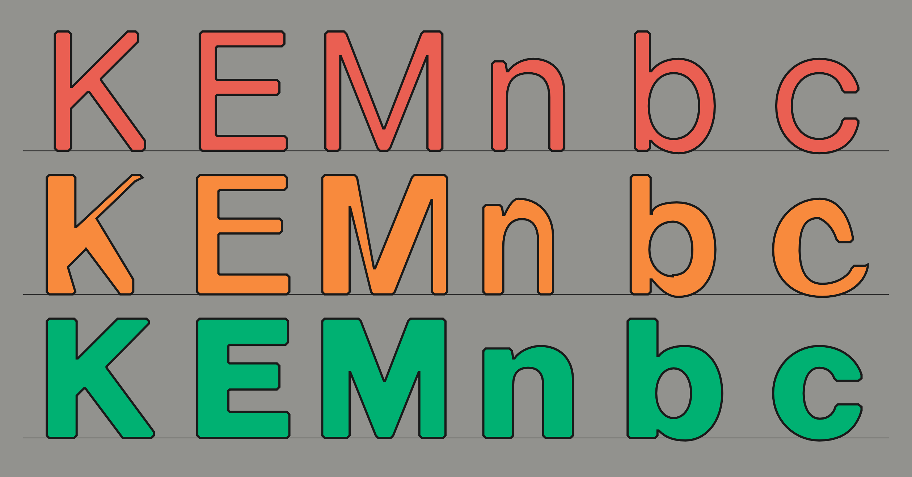

Virtua Grotesk is a typeface drawn on what I call a **hierarchical
semantic grid system**. Points default to an 8-unit grid. Small
optical corrections drop to a 2-unit subgrid. The grids record some
of the drawing intent automatically, so the source files are labeled training data
without extra work. This system makes the font a machine-learning and
data-engineering project as much as a type design project. If you are reading this on [elih.net](/), you are
reading Virtua Grotesk.

A small language model, Virtua-12M-v0.1, is learning to draw using
this grid system. It will soon be on Hugging Face as an open-weight
release that runs locally and can be fine-tuned. The font sources and
harness are already on
[GitHub](https://github.com/eliheuer/virtua-grotesk). Virtua Grotesk
is free and open-source under the SIL Open Font License (OFL) v1.1.


### Section Index

<nav class="section-index" aria-label="Contents">
<ol>
<li><a href="#01-the-modernist-impulse"><span class="n">01</span>The Modernist Impulse</a></li>
<li><a href="#02-replica-and-the-coarse-grid"><span class="n">02</span>Replica and the Coarse Grid</a></li>
<li><a href="#03-hierarchical-semantic-grid-systems"><span class="n">03</span>Hierarchical Semantic Grid Systems</a></li>
<li><a href="#04-aesthetic-discipline--machine-legibility"><span class="n">04</span>Aesthetic Discipline &amp; Machine Legibility</a></li>
<li><a href="#05-glyphs-as-sentences"><span class="n">05</span>Glyphs as Sentences</a></li>
<li><a href="#06-a-small-model-learns-to-draw"><span class="n">06</span>A Small Model Learns to Draw</a></li>
<li><a href="#07-weight-transfer-as-local-prediction"><span class="n">07</span>Weight Transfer as Local Prediction</a></li>
<li><a href="#08-the-designspace-is-a-data-factory"><span class="n">08</span>The Designspace Is a Data Factory</a></li>
<li><a href="#09-the-mathematics-of-2n"><span class="n">09</span>The Mathematics of 2ⁿ</a></li>
</ol>
</nav>

### 01. The Modernist Impulse

Designing the system instead of the final object is an old modernist
impulse. Karl Gerstner argued for it in his 1964 book *Designing
Programmes*, a foundational text of systematic Swiss design. In
practice, the idea ran into limits. Computers were procedural, and
strict rules made type stiff. They missed the optical corrections the
eye needs.

Neural networks might change that. A neural network is not a
procedural program, it interpolates and tolerates nuance where a rule
is brittle. It also
answers a modernist ideal that the rigid version betrayed: technology
people can live in harmony with, not technology that extinguishes human dignity.
The old impulse is worth another look.

Most fonts were never built as training data. Their coordinates land
wherever the designer put them. Their contours are as individual as
handwriting. That is fine for a rasterizer, but it is a problem for
data engineers working with font sources. Many font AI/ML projects
train on exactly this accidental data: scraped fonts and Google
Fonts, heterogeneous in every dimension that matters.

A typeface is not a collection of characters drawn in isolation. It
is many drawings that work as one system, and holding them together
is most of the work. Font datasets need the same discipline. A
collection assembled without it is not training data capable of
delivering useful models in 2026.

### 02. Replica and the Coarse Grid

The clearest precedent for Virtua Grotesk is [LL Replica](https://lineto.com/typefaces/replica)
(Norm: Dimitri Bruni and Manuel Krebs; Lineto, 2008). Norm took the
drawing grid in their font editor and made it ten times coarser.
FontLab's standard cap height is 700 units. Instead of 700 positions
across it they had 70, a step of 10 units, and every node and Bézier
control point had to land on one.

Two details make Replica more than a constraint exercise. First, the
bevels: its corners are cut exactly one grid unit wide, so the grid is
*visible* in the letterforms. Second, the cut diagonals: A, K, and R
have no pointed apexes, so the letters can be set tight. The constraint
produced the aesthetic, and the aesthetic advertises the constraint.

### 03. Hierarchical Semantic Grid Systems

Virtua Grotesk's answer to Replica's flat grid is a nested one, in
powers of two up to the em itself. The em is the coordinate space a
glyph is drawn in, and its size is given in units per em (UPM).
Virtua Grotesk's is 1024, 2^10, rather than the industry's usual
1000. That is less exotic than it sounds. A power-of-two em is the
TrueType convention, 2048 is standard and
[Inter](https://rsms.me/inter/) uses it. Virtua Grotesk extends the
same logic down through every dimension.

Every measurement is a sum of powers of two, each power used once. 64
takes one. 96 takes two, 64 + 32. 112 takes three, 64 + 32 + 16.
Fewer is better. Where two values take the same number, the one whose
powers run consecutively wins: in 96 = 64 + 32 each power is half the
one before it, while 80 = 64 + 16 skips a step.

That count is the value's Hamming weight, or popcount, the number of
1s when it is written in binary. Virtua Grotesk uses it to rank handle
lengths and structural spans. One is a pure power: 64, 128, 256. Two
is an elegant sum: 96 = 64 + 32, or 272 = 256 + 16. Three is
acceptable: 104 = 64 + 32 + 8. Four or more is flagged for review.

A low popcount means a structural value. A high one means the
letterform needed something the round numbers could not give. 64 is
too light for a stem and 128 too heavy, so stems are 96 = 64 + 32;
where 96 is too light, 112 = 64 + 32 + 16. The sums are a second
semantic hierarchy, parallel to the nested grid.

The full specification lives in the repo as
[`DESIGN.md`](https://github.com/eliheuer/virtua-grotesk/blob/main/DESIGN.md),
and it is enforced programmatically. From the repo root, `make
grid-qa` runs [a Python
script](https://github.com/eliheuer/virtua-grotesk/blob/main/scripts/grid_qa.py)
that grades every glyph in both masters for compliance. The report is
what the AI agent harness acts on: it fixes what the script flags,
renders the result, and runs the script again.

The same rule spaces the font. Sidebearings and kerning default to
the 8-unit grid: of Regular's 84 kerning pairs, all but two sit on
it, and the two that drop to the 2-unit grid are, exactly as with
point placement, coordinate-derived optical judgments, free training data.
The coarse default is also what gives the spacing its rhythm, a small
set of recurring intervals instead of 100s of bespoke ones,
snapped tighter only where the eye insists.


Structure lives on the 8-unit grid: stems, sidebearings, chamfers,
and every value a tool generates. Large optical corrections sit there
too. Only corrections finer than 8 units drop to the 2-unit grid, and
for now only a person can judge those. A point on 2 but off 8 can only be a deliberate
correction, so the label is in the coordinate itself. The machine
drafts on 8, a person refines on 2, and the difference between the
two versions is a labeled training set.


### 04. Aesthetic Discipline & Machine Legibility

Andrej Karpathy calls a large language model [a zip file of the
internet](https://www.youtube.com/watch?v=zjkBMFhNj_g): billions of
parameters that compress terabytes of text into a lossy gestalt. A
trained model is a compression of its training data.

Karpathy has
[bet](https://x.com/karpathy/status/1814038096218083497) that models
will get "very very small," and blames their current size on waste:
"we're asking them to memorize the internet and, remarkably, they
do." He calls the small alternative a [cognitive
core](https://x.com/karpathy/status/1938626382248149433), a model
that keeps "the algorithms for thought" and looks the rest up.

Virtua-12M-v0.1 is never asked to remember everything in the Google
Fonts catalog. It is asked to learn one design system: the basic
rules and the grid used to draw in a specific way. That is why 12.54
million parameters is enough, and why the checkpoint is 48 MB.

Font engineers already build compression systems. A variable font is a base
outline plus a set of interpolation deltas, and reconstructs every weight on
demand. A neural network learns its own internal space for the design and can
move through it in directions no one drew. The grid's discipline pays off two
ways:

1. **Consistency is signal.** Same stroke logic, same chamfer size, same
start-point conventions across every glyph: the model spends its capacity
learning the *design system* instead of averaging over hundreds of
designers' bézier habits.
2. **Constraints make outputs checkable.** If every legal coordinate is even,
every structural value is a multiple of 8, and every measurement comes
from a small closed vocabulary, then a
generated glyph can be *verified* mechanically. Quality
stops being an opinion, and an eval loop can grind at it overnight.

The tiers are learnable, and three numbers show it.
Nothing in the encoding mentions the 8-unit grid: every coordinate
token is a 2-grid position, all equally available. Placing points at
random would land on the 8-grid 6 percent of the time. The
human-drawn sources land on it 85 percent of the time. Drawing
held-out glyphs whose Bolds it never saw, Virtua-12M-v0.1 lands on it
68 percent of the time, most of the way from chance to the human
hand. When it leaves the structure grid it tends to land on
correction values rather than at random. Nobody labeled the tiers,
and no auxiliary loss rewards them. The model
learned them as plain statistics. The obvious objection is that a
next-token model reproducing its training statistics is doing exactly
what it should. That is the point. This is not only about frequencies:
where the human sources leave the structure grid, the model tends to
leave it at the same points.

One honest caveat about where the win comes from. The model reads
each coordinate as a single token and never sees digits, so at the
token level base two is invisible to it. What it learns from is
coarseness, regularity, and the nested tiers: a small set of legal
values, each recurring and meaning one thing, corrections rare
against a regular background. That trick would work in base ten too.

A 1000 em would even carry these same power-of-two values: put the
stem at 96 and 192 on a 1000 em and it interpolates just as cleanly,
because the arithmetic is on the stem width, not the em. Base two
pays off further down the pipeline, wherever a coordinate is divided
by the em. 96/1024 is 0.09375, exact in binary; 96/1000 repeats
forever. Normalization and display scaling ride on that division, and
section 09 makes the case that base two is the best choice for it,
and for font UPMs in general.

### 05. Glyphs as Sentences

A glyph is already a kind of sentence: an ordered list of drawing
commands. A transformer predicts sequences. So I give the model each
glyph as the sequence it already is and train it to predict the next
token.

The source files use the [UFO](https://unifiedfontobject.org/) format: a
folder of XML files, one per glyph, with each outline stored as points on
the grid. A transformer cannot read an XML tree. It reads a flat list of
tokens. A small codec therefore rewrites each outline as a single line of
text containing only the drawing commands and coordinates, in order.

A transformer reads and writes a fixed set of tokens: its
*vocabulary*. Virtua-12M's is small. A few conditioning tokens specify
the glyph's name, Unicode codepoint, and weight. Four drawing verbs draw it:
`MOVE`, `LINE`, `CURVE`, `CLOSE`. And one token exists for each legal
position on the grid, so a coordinate is a single token. Here is the
numeral **2** in the Regular weight, exactly as the codec emits it:

```
BOS N_two U_0032 W400 ADV 592
MOVE 48 0
LINE 528 0
LINE 544 16
LINE 544 72
LINE 528 88
LINE 160 88
LINE 152 96
CURVE 152 136 232 216 356 276
CURVE 492 342 560 422 560 552
CURVE 560 676 494 784 304 784
CURVE 150 784 48 680 48 524
LINE 64 508
LINE 136 508
LINE 152 524
CURVE 152 620 210 692 304 692
CURVE 402 692 464 632 464 552
CURVE 464 460 394 390 280 336
CURVE 116 258 32 146 32 32
LINE 32 16
CLOSE
EOS
```

Read it top to bottom. `BOS` opens the sequence and `EOS` ends it.
`N_two` names the glyph, `U_0032` is its Unicode codepoint (the digit
two), `W400` sets the weight (Regular), and `ADV 592` is its advance
width, the distance before the next character. The rest is the outline:
`MOVE` starts a contour at a point, `LINE` draws a straight segment to the next,
`CURVE` draws a cubic Bézier through two control points to an endpoint, and
`CLOSE` shuts the loop. Every bare number is a grid coordinate.

Many carefully drawn fonts are fairly regular. Virtua Grotesk is stricter: a
stem is 96 every time, never 95 or 97. Structural values recur, so
their tokens are common. Corrections sit off the 8-grid, so their
tokens are rare. To the model, a correction is a rare,
high-information token.

The codec runs both ways. For training, it turns every glyph into a
sequence. For generation, you provide the opening tokens, let the model
finish the sequence, and run the codec backward into a real, editable UFO
outline. The round trip is lossless. Snapping loses precision only when a
point falls between legal positions. A grid-native font has no such
points: every coordinate already equals a token. The exactness comes from
committing to the grid, not from its coarseness. A 1-unit grid would
round-trip just as cleanly.

There is no rasterization, no image encoder, no diffusion. The font
source itself, stripped to the drawing, is the training data, about
90 tokens a glyph. Quantize found fonts after the fact and you lose
the designer's intent by an unknowable amount; draw on the grid and
the tokens *are* the intent.

None of the machinery is new.
[SVG-VAE](https://arxiv.org/abs/1904.02632) learned glyphs as command
sequences from a corpus of tens of thousands of fonts in 2019;
[DeepSVG](https://arxiv.org/abs/2007.11301),
[DeepVecFont](https://arxiv.org/abs/2110.06688),
[IconShop](https://arxiv.org/abs/2304.14400), and
[StarVector](https://arxiv.org/abs/2312.11556) all tokenize vector
outlines and learn them with a transformer, several quantizing to a
small integer grid exactly as I do. What none of them can do is start
from data that was grid-native: they train on found fonts snapped to a
grid in preprocessing, a lossy scrape of a thousand disagreeing hands,
and spend much of their capacity absorbing that heterogeneity. This
project inverts the ratio. Design one corpus until it is nearly
homogeneous, then ask how small the model can get.

[Simon Cozens](https://simoncozens.github.io/state-of-ai-font-generation/), surveying
the field, is blunt: "vectorization of glyph images has been historically very
bad," and his own model trained on the Google Fonts dataset "completely failed."
Both failures are data problems, upstream of any model. Grid-native
sources remove the vectorization step entirely. And vectorization
itself turned out to be tractable with the right target:
[img2bez](/blog/img2bez), the tracer I built for this pipeline,
vectorizes rasters straight onto the 2-unit grid, and it now runs
throughout the pipeline and the harness that Virtua Grotesk uses.

### 06. A Small Model Learns to Draw

The model is deliberately small: a 12M-parameter decoder-only transformer
trained from scratch on one machine, without cloud services or a GPU
cluster. The work is early. It runs in two setups: an [MLX](https://github.com/ml-explore/mlx)
build on an M4 Mac and a PyTorch build on a Linux PC with a gaming GPU.
An overnight run takes about 30,000 steps. The corpus began with Virtua
Grotesk's two masters: 427 glyphs, structurally identical between Regular
and Bold. Training now has two stages. The model pretrains on glyphs
traced from OFL fonts in the Google Fonts collection, then fine-tunes on
the Virtua Grotesk sources. Section 07 measures what pretraining added.

The model card:

| Virtua-12M-v0.1 |   |
| --- | --- |
| architecture | decoder-only transformer: 6 layers, 384 dims, 8 heads |
| parameters | 12.54M |
| context | 1,368 tokens |
| vocabulary | 1,784 tokens: commands, names, coordinates, deltas |
| pretraining | 29,000 Regular-Bold pairs traced from Google Fonts |
| fine-tuning | 50 human-graded Virtua Grotesk Bold pairs; 463 glyphs in the corpus |
| optimizer | AdamW, lr 3e-4, 200-step warmup, cosine decay, batch 24, dropout 0.1 |
| compute | one Apple M4 Pro laptop (MLX); both training runs in 3h20m |
| checkpoint | 48 MB fp32 safetensors |

Decoder-only is the GPT architecture. Each token becomes a vector, and a
stack of transformer blocks refines those vectors through *attention*.
Each position looks back at earlier tokens and uses whatever helps predict
the next one. A final layer turns the last vector into a probability over
the vocabulary. Training nudges that probability toward the true next
token, glyph after glyph, until the model learns the grammar of outlines.

The lineage is Karpathy's from-scratch projects: [char-rnn](https://karpathy.github.io/2015/05/21/rnn-effectiveness/)
generating C with balanced braces,
[makemore](https://github.com/karpathy/makemore) spelling names character by
character, [microgpt](https://karpathy.github.io/2026/02/12/microgpt/) training
a tiny GPT over a 27-token vocabulary. This project does the same for glyph outlines, generating a letter's drawing
commands one token at a time. A single training stage takes about 45
minutes on an M4 Pro or a gaming GPU.

Training follows his
[Recipe for Training Neural Networks](https://karpathy.github.io/2019/04/25/recipe/)
more closely than I planned. The first overnight run memorized its
few thousand sequences instead of learning anything general, and the
fixes were the recipe's standard ones: augmentation, dropout, and a
held-out validation set. The recipe's other
commandment, a dumb baseline to beat, is in place too: predict every Bold
offset as the mean delta of the training pairs, no model at all.

The model runs inside
[Runebender](https://runebender.org), a free and open source font
editor I work on. Below, I
sketch an e with a brush, trace the sketch to a draft outline, and have
Virtua-12M-v0.1 redraw it in the font's conventions, with the
green-graded glyphs already in the sources as reference:

<video src="/videos/e-draw.mp4" poster="/videos/e-draw-poster.jpg" controls playsinline preload="metadata" aria-label="Screen recording of the Runebender editor: a lowercase e is sketched with a brush, traced to a draft outline on the grid, and redrawn by Virtua-12M in the font's conventions using the Draft with Virtua tool."></video>

### 07. Weight Transfer as Local Prediction

Weight transfer has immediate production value. Every glyph drawn once
must be drawn again heavier, with the same structure. Given the Regular,
the model draws the Bold. The goal is a workflow
where a designer draws the core control glyphs by hand (H, O, n, o,
e, a, R) and bootstraps a full variable font from them: the model
drafts the remaining glyphs and the second master, and the designer
corrects on the 2-unit grid.

One objection first: font tools already interpolate, and when both
masters exist interpolation is exact and free. The model is for the
case interpolation cannot touch: the second master does not exist
yet. The classical tools for that case are the offset-curve filter,
which thickens mechanically and clogs the joins, and extrapolation or
RMX-style scaling, which approximate a new weight from masters you
already have. The model learns the weight from a corpus instead.
Every result below is scored on the missing-master case, Bolds the
model never saw.

The encoding makes the task local. The two masters are written into one
sequence, point by point: a Regular point, then its Bold value, then the
next Regular point. The model predicts each Bold value from the adjacent
Regular point as a small offset. The Regular points stay fixed. The model
fills in only the Bold values, so the glyph's structure cannot break.

The current model, Virtua-12M-v0.1, beats the baseline. The evidence is
a controlled comparison of two training runs. The first trained
only on the graded corpus: it tied the baseline. The second
pretrained on 29,000 pairs traced from Google Fonts, then fine-tuned
on the same graded corpus: it beats the baseline on all ten held-out
glyphs, on every metric. Cleaning the data kept the tie; other
designers' letterforms broke it.

The test setup: ten glyphs were set aside before training, and their
Bolds were never shown to either run. Every number in the table
is the average of five samples, written as mean ± spread, and errors
are in font units. MAE, the mean absolute error, averages how far
each coordinate lands from the human-drawn value. Chamfer distance
measures the same gap along the drawn outline, so it scores the shape
rather than the point placement. IoU, intersection over union, is the
share of ink the two filled glyphs have in common. FID, the usual
generative-image metric, needs far more than ten samples, so it is
omitted.

| held-out Bold prediction | MAE ↓ | Chamfer ↓ | IoU ↑ |
| --- | --- | --- | --- |
| mean-delta baseline | 31.3 | 37.4 | 0.564 |
| graded corpus only (control) | 31.7 ± 0.5 | 35.3 ± 0.7 | 0.567 ± 0.013 |
| + OFL pretrain (Virtua-12M-v0.1) | **24.0 ± 1.6** | **22.4 ± 1.3** | **0.745 ± 0.016** |

The training curves, parsed from the run log: the pretrained arm
starts the fine-tune below the control's best and stays below it.

How much hand-graded data does the fine-tune need? The same fine-tune
with the corpus cut down: twelve pairs score 28.0 ± 1.9 MAE,
twenty-five 25.5 ± 0.9, fifty 24.0 ± 1.6, every seed of every run
better than the baseline's 31.3. The curve is not yet saturated, and
even twelve graded pairs on pretrained weights beat fifty from
scratch. Grading more of the Bold master is the cheapest next
improvement.

The review sheet shows six held-out glyphs: human Regular in, model
Bold out, human Bold beneath for reference.



One transfer up close, the held-out `n`: the hand-drawn Regular, and
beside it the Bold the model drew from it.


This is a small test: ten glyphs, one font, and one training run per
condition. The numbers will change as the work grows. The output is a
draft, not a finished Bold. A person still corrects it on the 2-unit grid. The
open question is whether the approach holds at a much larger scale,
and that is what the next runs are for. Section 08 reports what the
same model does on fonts it was not tuned for, including a result
that did not work.

### 08. The Designspace Is a Data Factory

Two masters provide more data than they seem to. Every interpolation
between them is a real instance of the family. Multiple Master fonts
have worked this way since 1991. The factory picks a weight between
Regular and Bold, interpolates, snaps to the grid, and labels the glyph with
its exact weight.

An interpolation can land between grid points. Is it worse data than a
master? No. The outline sheet below shows why. Here is the real
`n` at Regular, at the 1/2 interpolation, and at Bold, points colored
by grid level: green on the 8-unit structure grid, red off 8 on the
2-unit correction grid. The middle glyph is not a master, but it is a
clean glyph with every point on the grid. The stem steps 96, 144,
192.

![Three large lowercase n outlines on one continuous 8-unit grid: the n at Regular in red, at the 1/2 interpolation in orange, and at Bold in yellow, translucent fills overlapping, every on-curve and off-curve point marked. Stem dimensions read 96 (64+32), 144 (128+16), 192 (128+64); counter dimensions 272 (256+16), 232 (128+64+32+8), 192 (128+64); purple handle lengths of 64 and 128. Uncrowded points carry bare coordinate labels beside them, like 80,0 at the feet and 328,592 to 432,592 at the apexes, the same apex y with x interpolating. Every interpolated point lands on the grid, so the intermediate weight is a clean, grid-native glyph.](./fig-interp-outlines.png)

The reason is arithmetic. The masters sit on the grid, and their
stems differ by 96, a number that keeps splitting evenly as the
weight is halved, so every interpolated stem lands back on the grid:
96, 144, 192. The glyph between the masters is as clean as the masters
themselves. A decimal design does not close this way, as the figure
below shows. That closure is a property of the power-of-two grid, and
section 09 proves why the em itself must be the power of two, not just
the grid.

![Two aligned number lines drawn with designbot, showing the n stem interpolated from Regular to Bold at binary-fraction weights. The top line is the 1024 em on a 2-unit grid, stem 96 to 192, with the weights 1/8, 1/4, 3/8, 1/2, 5/8, 3/4, 7/8 all landing exactly on grid ticks at 108, 120, 132, 144, 156, 168, 180 in green. The bottom line is the 1000 em on a 10-unit grid, stem 90 to 180, with the same weights falling off the grid: 1/2 lands at 135 between ticks, 1/4 lands at 112.5, not even an integer, both marked in red. Dashed guides connect the same weight on both lines.](./fig-interp.png)

Interpolation cannot invent a new optical correction. It blends the
two masters' corrections in a straight line, and optics are not linear
in weight, so it reproduces structure exactly and only approximates
the corrections. The model learns optical judgment from the two real
masters and the graded corpus, not from the augmentation. One more
augmentation adds scale: any rotation of a closed contour's start
point draws the same shape, which multiplies the batches enough to
stop the model memorizing.

Interpolation gives volume, not variety. Every batch is still one
design. Variety takes more families, which is what
[img2bez](/blog/img2bez) provides: a Rust autotracer that traces any
raster, a rendered font, a scan, an AI-drawn glyph, onto the 2-unit
grid, with [img2ufo](https://github.com/eliheuer/img2ufo) assembling
the results into a UFO source. This is how the model's pretraining
data was made: OFL families traced onto the grid, so it sees many
hands before it meets Virtua Grotesk.

That pretraining data has its own held-out test, with one positive and
one negative result. One percent of the OFL pairs, 290 of 29,000, are
held out. On them, the pretrained model beats the baseline, so the
skill is general: it draws Bolds for glyphs it never saw. (The
held-out unit is the glyph, not the font, so these are new glyphs from
styles it has seen; a font-level split is next.) The fine-tune then
costs that generality. After specializing on Virtua Grotesk, the model
collapses on OFL, from beating the baseline on 74 percent of pairs to
9. This is catastrophic forgetting, the price of fine-tuning a small
model without mixing the old data back in; that mix is queued for
v0.9. Virtua-12M-v0.1 is a Virtua Grotesk specialist, not a general tool:

| held-out OFL pairs, n = 290 | MAE ↓ | Chamfer ↓ | IoU ↑ | beats baseline |
| --- | --- | --- | --- | --- |
| mean-delta baseline (OFL) | 20.8 | 22.9 | 0.61 | |
| after OFL pretrain | **15.0** | **14.8** | **0.75** | 74% |
| after Virtua Grotesk fine-tune | 33.5 | 28.9 | 0.50 | 9% |

Karpathy's [Software 2.0](https://karpathy.medium.com/software-2-0-a64152b37c35)
names the idea: if the weights are the program and training the
compiler, the dataset is the source code. Grid systems as datasets is
that taken seriously. The data gets the tools software gets: a style
guide (`DESIGN.md`), a linter (the grid is checkable), review (mark
colors in the UFOs), and version control (git).

The pieces form one system. [img2bez](/blog/img2bez) traces references
onto the grid. The model completes outlines, draws Bolds, and soon
repairs them. [designbot](https://github.com/eliheuer/designbot)
renders the proofs and figures. [Runebender](https://runebender.org)
is the review surface. A harness runs the report, fix, render loop
against `DESIGN.md`, with mark colors as the human's control. The goal
is to finish Virtua Grotesk and ship it to Google Fonts.

This is a first step. The aim is fonts that are models, not tables of
outlines, freed from the per-glyph boxes digital type inherited from
metal type. An outline font is a compression scheme for the Latin
letter, one fixed shape reused everywhere, and it strains on other
scripts. Arabic in its manuscript forms is one continuous,
context-dependent stroke; the current workaround is thousands of
glyphs and rules faking what a hand does in one motion. A generative
font draws each glyph in context and handles that natively. The first
ones will be built on a grid like this.

<h3 id="09-the-mathematics-of-2n">09. The Mathematics of 2ⁿ</h3>

<div class="pl-6 my-8 [&>*]:text-muted-foreground">
<p>“TeX represents all dimensions internally as an integer multiple of the
tiny units called sp. Since the wavelength of visible light is approximately
100 sp, rounding errors of a few sp make no difference to the eye. However,
TeX does all of its arithmetic very carefully so that identical results will
be obtained on different computers.”</p>

<p>—Donald Knuth, [The TeXbook](https://www-cs-faculty.stanford.edu/~knuth/abcde.html), 1984.
The sp is the scaled point, TeX's atomic unit of distance:
65,536 sp = 2¹⁶ sp = 1 printer's point.</p>
</div>

<div class="pl-6 my-8 [&>*]:text-muted-foreground">
<p>“every good outcome I’ve seen has been from finding a secret and doubling,
tripling down on it in a way that compounds over time. not necessary that it
even remains a secret because nobody ever believes you anyways”</p>

<p>—roon ([@tszzl](https://x.com/tszzl)), 2026.</p>
</div>

When I shared this draft, the most common pushback was: why
powers of two? Concede the narrow point first. Any grid shrinks the
coordinate vocabulary; a decimal grid would tokenize just as cleanly.
The transformer does not care: I can find no evidence that a network
prefers binary bins to decimal ones, and when the field quantizes
coordinates it reaches for
[256 bins](https://arxiv.org/abs/2002.10880) out of habit, not
conviction. If the model were the whole pipeline, the skeptics would
be right.

It is not. The rest of the pipeline imposes five constraints. The
design must normalize exactly. The grid must be closed under its own
drawing operations. The hierarchy must be a chain, so its levels can
carry meaning. The ladder should be as deep as the em allows. And the
grid must meet the machine at every boundary, rendering included.
Each constraint describes software the design has to live inside.
This section takes them in order, then tests the rivals against
them.

**Normalize exactly.** A binary computer stores a fraction exactly
only when its denominator is a power of two: the dyadic rationals,
the machine's native numbers. Everything else is an approximation.
Divide Virtua Grotesk's 96-unit stem by its 1024-unit em: 0.09375, exact.
Divide the same stem by the traditional 1000-unit em: 0.096 has no
finite binary form, so the machine holds 0.09600000000000000200.
Every coordinate in a font is normalized, interpolated, and scaled
thousands of times before anyone sees a letter, and each operation is
either exact or it quietly rounds.

The denominator is the em, not the drawing grid. Keeping a 1000-unit
em and drawing on an 8-unit grid does not help: 8/1000 is 1/125,
which has no finite binary form either. The em itself must be the
power of two, because the em is the denominator of every normalized
coordinate.


Rounding is the mild failure. The sharp one is that some of the
design's own proportions have no integer coordinate. A vertical metric
is a ratio of the em. Virtua Grotesk's cap height is 3/4 of the em and
its x-height is 9/16, which on 1024 are 768 and 576. On a 1000 em the
cap height still lands at 750, but 9/16 of 1000 is 562.5, and no font
stores half a unit. The proportion the designer chose cannot be
written down. A binary proportion is a whole coordinate only on a
binary em, and this holds in the source, before any arithmetic runs.

This is the founding decision of digital typography. Knuth hit it in
TeX, [watching 0.4 print back as 0.39999](https://research.swtch.com/fp-knuth),
and rebuilt the system on scaled points of 2⁻¹⁶ of a printer's point:
"the wavelength of visible light is approximately 100 sp." In
METAFONT every expressible number is a multiple of 2⁻¹⁶, so a
designer who types .1 [gets 6554/65536](https://ctan.org/pkg/mfbook),
the nearest binary fraction. The modern formats agree. TrueType
rasterizers compute in 26.6 fixed point, variable fonts store axis
positions in
[units of 2⁻¹⁴](https://learn.microsoft.com/en-us/typography/opentype/spec/otvarcommonformats),
and the OpenType specification
[recommends a power-of-two em](https://learn.microsoft.com/en-us/typography/opentype/spec/ttch01)
because scaling then reduces to a bit shift. A design on the dyadic
grid is the only design this stack writes down exactly.

Deployment is already dyadic. A variable font cannot express the
weight a third of the way between masters: request t = 1/3 and the
format snaps it to 5461/16384 before interpolating. Dyadic training
weights are the only weights the shipping format can express.

The same arithmetic appears on the ML side. Karpathy, tuning
[nanoGPT](https://github.com/karpathy/nanoGPT), found a 25 percent
speedup by padding the vocabulary from 50,257 to 50,304, the nearest
multiple of 64, and signed off,
["Careful with your Powers of 2."](https://x.com/karpathy/status/1621578354024677377)

| operation | em 1024 | em 1000 |
| --- | --- | --- |
| normalize a 96-unit stem | 0.09375, exact | 0.096, repeats |
| interpolate at t = 1/2, 1/4, 3/8… | exact | float error |
| scale to a pixel size | bit shift | division |
| divide the em in thirds | approximate | approximate |

The last row is the honest one. Binary buys no thirds, and neither does
decimal; the divisions that resist the base are exactly the ones the eye
corrects anyway. The operations that must be exact in font production are
halving, doubling, scaling, and interpolating, and those are the four
things base two does perfectly.

**Close under the operations.** This is the keystone. The numbers you
can reach from the integers by taking midpoints are exactly the
dyadic rationals, nothing more and nothing less. And the midpoint is
the pipeline's own operation. Interpolating halfway between two
masters is a midpoint. Splitting a bézier, the de Casteljau
subdivision every rasterizer performs, is midpoints of midpoints. The
dyadic grid is not a lattice the operations tolerate; it is the
lattice the operations generate. Start from any grid, run the
pipeline's arithmetic, and the points that appear are dyadic.


The figure runs one subdivision on a Virtua Grotesk-style arch. The control
points sit on the 64-grid; the first round of midpoints lands on the
32, the second on the 16, and the split point stays on the 16. A
midpoint of two multiples of 2ᵏ is a multiple of 2ᵏ⁻¹, so each round
descends at most one rung, and a ladder ten rungs deep absorbs the
whole operation. Run the same split on a decimal
grid and the numbers leave the system at the second halving: 10 halves
once, to 5, and dies.

Exactness and closure are half the answer. The other half is where
this system parts ways with Replica. Replica's grid is one flat
layer, every legal point equally legal. A flat grid can say only one
thing about a point, and it forces a choice: keep every point on the
lattice and there is no room for optical correction, or let points
off it and nothing separates a correction from a slip.

A power-of-two em removes the choice, because it halves cleanly all
the way down. The grids that tile a 1024 em run 1024, 512, 256, down
to 2: ten nested levels, each a strict subset of the one above.
Virtua Grotesk assigns them meanings: 64 for vertical metrics, 8 for
structure, 2 for corrections. An optical correction is never
off-grid; it is on the fine grid and off the coarse one, section 03's
rule restated as data design. The ladder is a property of the base:
the powers of two that divide 1000 stop at 8, the ones that divide
Replica's 700 stop at 4. A binary em ladders from the unit to the
em.


**Keep the hierarchy a chain, and make it deep.** Divisor-rich ems
like 720 and 2520, the numbers Babylon built astronomy on, offer
exact thirds and fifths. But their divisors form a lattice, not a
ladder: a point on the 9-grid and the 8-grid at once has no
well-defined level, and the labeling dies of ambiguity. Levels that
carry meaning need a chain, each grid strictly inside the next, which
forces the em to be a power of a single prime. Among primes, depth
favors the smallest: dividing by 3 gives a 729 em six levels;
dividing by 2 gives a 1024 em ten.

The last property is the most literal. Write a coordinate in binary
and its grid level is the number of zeros at the end. 768 ends in
eight zeros, so it sits on the 256-grid; 576 ends in six, the
64-grid; 96 ends in five, the 32-grid; 116 ends in two, the 4-grid,
off the structure grid's 8, which marks it as a correction.
Mathematicians call this the 2-adic valuation. Hardware calls it
count-trailing-zeros, one machine instruction. The hierarchy is not
drawn on top of the coordinates; it *is* their binary representation,
read off the low bits. The labeling function this training scheme
depends on ships inside the numbers themselves.


Now the rivals, each against the constraints.

**Decimal, em 1000.** Fails normalization (0.096, held forever wrong)
and fails closure (10 halves once, to 5, and dies). Its one real
advantage, friendliness to human mental arithmetic, describes the
wrong partner: in this pipeline the human judges curves and the
machine does the arithmetic.

**Balanced ternary, em 729 = 3⁶.** The strongest rival, and Knuth's
favorite. Six clean levels, a chain, a symmetric arithmetic. On
ternary hardware it would win. On the hardware that exists, 1/3 has
no finite binary form, so every normalized coordinate is approximate
and every constraint downstream of the first collapses.

**The divisor-rich and the golden.** Babylon's numbers, 720 and 2520,
buy exact thirds at the price of a lattice hierarchy and a
denominator binary arithmetic cannot hold; the thirds they sell are
the divisions the eye corrects anyway. The modernists' candidate
fails harder: Le Corbusier scaled the Modulor to the golden section,
and φ is irrational, so nothing normalizes exactly. Corbusier matched
his grid to the measure of man. This grid matches the measure of the
machine.

**The learned codebook.** Skip hand-designed grids and let a VQ-VAE
learn the quantization. But a learned codebook cannot be drawn on by
a person, linted by a rule, or held stable across retrainings, and it
quantizes after the fact. The field has been retreating from learned
codebooks toward small fixed uniform grids
([finite scalar quantization](https://arxiv.org/abs/2309.15505))
because the fixed grid trains more stably.

**No grid at all.** Continuous coordinates with a regression head.
But there is no continuous on a computer: a 64-bit float is a dyadic
rational, m·2ᵉ, nothing else. Continuous coordinates means the dyadic
grid at 2⁻⁵², adopted implicitly, with no levels, no linting, and no
meaning in the low bits. You cannot escape the lattice, only choose
whether to design it.

The result: given binary arithmetic end to end, exact normalization,
closure under subdivision, and a hierarchy whose levels carry
meaning, the grid system is forced. It is the dyadic ladder of a
power-of-two em, unique up to one free choice, the exponent. The
exponent is fixed by the eye: four decades of practice say roughly a
thousand units per em is enough for optical judgment, and 1024 is the
power of two that lands there. (2048 with a 4-unit grid is the same
system scaled by two.)

For the machine-learning pipeline, exactness and nesting pay out four
ways:

**The synthetic data is noise-free.** Section 08's factory is
interpolation, `a + t · (b − a)`. With masters on the 2-unit grid and
weights that are binary fractions, every intermediate value is dyadic
and every machine computes the identical result. Run the factory on a
decimal em at arbitrary weights and float error enters every
coordinate before the snap, differently on different hardware: the
model learns the design plus the noise. There is even a right
sampling order: the base-2
[van der Corput sequence](https://en.wikipedia.org/wiki/Van_der_Corput_sequence),
1/2, 1/4, 3/4, 1/8, 5/8, 3/8, 7/8, dyadic at every step and evenly
spread at every prefix.

**The outputs are checkable, and the taste comes labeled.** On this
grid a wrong coordinate is a lintable defect: an odd number, a stem
outside the favored set. And because machine drafts stay on the
8-unit grid, every 2-unit deviation in a glyph I approve is a
recorded human optical correction. The grid is the annotator.

**The differences are a small vocabulary.** Stems, chamfers, and the
Regular-to-Bold deltas of section 07 come from a few dozen values:
machine values with three or more trailing zeros, or recorded ±2 and
±4 hand offsets from one. The lexicon recurs: the Bold stem is the
Regular stem doubled, the Bold curve is the Bold stem plus the same
4. Weight transfer collapses to choosing among familiar offsets.

**Every modality shares the lattice.** Render a 1024-em glyph at 1024
pixels and one font unit is one pixel; the specimen at the top of
this post is drawn that way. The image models that feed img2bez
downsample by eight, so their latent space is a 128 × 128 lattice in
which each cell covers an 8 × 8 block of font units: the structure
grid reappears inside the diffusion model.

Knuth walked this ground forty years ago. METAFONT had to put ideal
curves onto coarse pixel grids, and his chapter about it,
["Discreteness and Discretion,"](https://ctan.org/pkg/mfbook) answers
the analog objection: "the human eye is composed of discrete
receptors, and visible light has a finite wavelength." Then he states
this project's design brief, in 1986: "our goal should not be to make
hand-tuning obsolete; it should rather be to make hand-tuning
tolerable. Let us try to create meta-designs so that we would never
want to change more than a few pixels per character, say half a
dozen, regardless of the resolution." A machine draft correct on the
coarse grid, a human budget of a few touches on the fine one: that is
the 8-grid and the 2-grid, except that here every touch is recorded,
labeled, and learned from. The constraints earn the machine its
8-grid; nothing in the arithmetic earns it the 2-grid. The low bits
belong to the eye.

The claim at its true size: great fonts shipped on decimal ems for
forty years, and when humans run the pipeline the base hardly
matters. Knuth thought base two nothing special aesthetically; his
*Art of Computer Programming* calls balanced ternary "perhaps the
prettiest number system of all." But he built TeX and METAFONT on the
base the machines speak, because they had to produce the identical
page on every machine. Once the pipeline is computational end to end,
base two is the choice where the design's arithmetic and the
machine's arithmetic are the same arithmetic.

When the engineering is settled, the tiebreaker is aesthetics.
Modernism was not innocent of powers of two: A-series paper halves at
every fold. The Swiss creed was truth to materials, and the true
material of the computer is the bit. The same taste runs down the
stack; it is why the sources are UFO, plain one-glyph-per-file XML,
rather than something more opaque. The powers of two would deserve
this job on beauty alone; that they are also the machine's own
numbers is the point of this post. On a binary machine, a design
drawn in powers of two is not encoded. It is simply written down.
