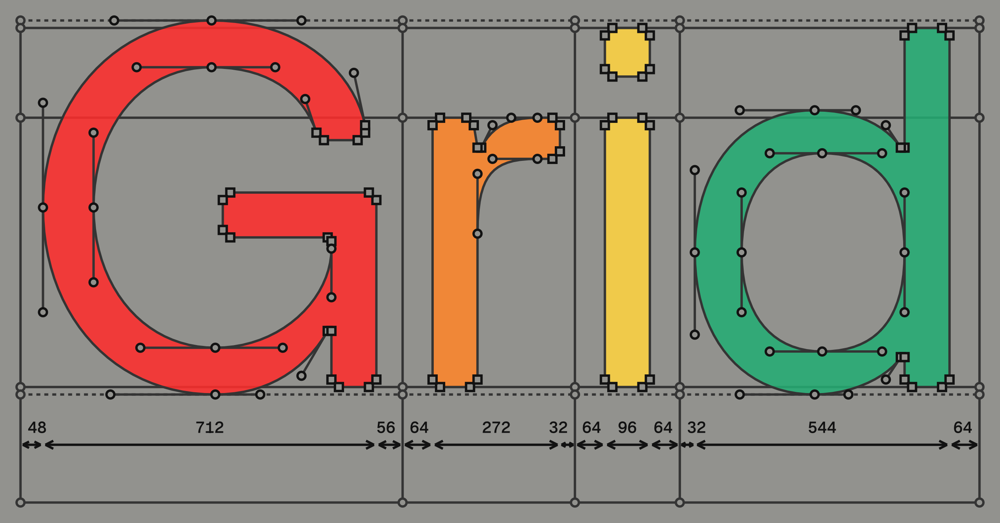

<blockquote class="draft-notice">

**This is a public draft.** I publish drafts to get feedback while the
thinking is still wet. The type design is unfinished, the model is a
prototype, and some figures are placeholder renders from the lab. If you
have opinions about any of this I want to hear them; my contact info is on
the [about page](/about).

</blockquote>

Virtua Grotesk is a typeface I am designing on a powers-of-two grid, and if
you are reading this on [elih.net](/) it is the typeface you are reading right now.
It is also a machine-learning
experiment: the same grid that gives the font its aesthetic makes its source
files unusually good training data, and a small neural network is now learning
to draw it. This post is about both halves and why they are the same idea.
The font sources are on GitHub at
[github.com/eliheuer/virtua-grotesk](https://github.com/eliheuer/virtua-grotesk),
free under the SIL Open Font License.



### Section Index

<nav class="section-index" aria-label="Contents">
<ol>
<li><a href="#01-a-font-is-a-program"><span class="n">01</span>A Font Is a Program</a></li>
<li><a href="#02-replica-and-the-coarse-grid"><span class="n">02</span>Replica and the Coarse Grid</a></li>
<li><a href="#03-the-virtua-grotesk-design-system"><span class="n">03</span>The Virtua Grotesk Design System</a></li>
<li><a href="#04-from-aesthetic-discipline-to-machine-legibility"><span class="n">04</span>From Aesthetic Discipline to Machine Legibility</a></li>
<li><a href="#05-glyphs-as-sentences"><span class="n">05</span>Glyphs as Sentences</a></li>
<li><a href="#06-a-small-model-learns-to-draw"><span class="n">06</span>A Small Model Learns to Draw</a></li>
<li><a href="#07-boldening-as-local-prediction"><span class="n">07</span>Boldening as Local Prediction</a></li>
<li><a href="#08-the-designspace-is-a-data-factory"><span class="n">08</span>The Designspace Is a Data Factory</a></li>
<li><a href="#09-one-pipeline"><span class="n">09</span>One Pipeline</a></li>
<li><a href="#10-what-ships-next"><span class="n">10</span>What Ships Next</a></li>
<li><a href="#11-build-log"><span class="n">11</span>Build Log</a></li>
</ol>
</nav>

### 01. A Font Is a Program

A digital font is not a set of pictures. It is a small program: coordinates,
curve operators, composition rules, executed by a rasterizer millions of times
a day. Massimo Vignelli liked to say design is a language with rules
(semantics, syntax, pragmatics), and he meant it as an analogy. In type the
analogy is literal. A glyph is a sentence in a formal language, and the
question that started this project was simple: if a glyph is a sentence, what
grammar makes the language easiest for a machine to learn?

Most fonts answer that question by accident. Their coordinates land wherever
a designer's hand put them, at whatever unit resolution their editor
defaulted to, with contour structures as individual as handwriting. That's
fine, the rasterizer doesn't care. But a neural network does, and the whole
current wave of font AI is trained on exactly that accidental data: scraped
fonts, or Google Fonts, heterogeneous in every dimension that matters.

Virtua Grotesk answers the question on purpose.

### 02. Replica and the Coarse Grid

The purest precedent is [LL Replica](https://lineto.com/typefaces/replica)
(Norm: Dimitri Bruni and Manuel Krebs; Lineto, 2008). Norm took the drawing
grid their font editor provided and made it ten times coarser: instead of
placing points on a 700-unit grid, they allowed themselves 70. Fewer legal
positions for every node and every bézier handle. Deliberately less freedom.

Two details make Replica more than a constraint stunt. First, the bevels:
Replica's corners are cut, and the cut is exactly one grid unit wide, so the
grid isn't just a discipline, it's *visible* in the letterforms. Second, the
cut diagonals: A, K, R have no pointed apexes, so the letters can be set
tight. The constraint produced the aesthetic; the aesthetic advertises the
constraint.

This sits inside a longer lineage: Helvetica's neo-grotesk neutrality,
Vignelli's conviction that discipline and restraint are what make design
intelligent, the Swiss grid as moral position. I love that tradition. But
every argument for it has been an argument about human perception and human
craft. Replica constrained the grid because constraint focused the design.

I want to make a new argument for the same aesthetic.

### 03. The Virtua Grotesk Design System

Virtua Grotesk is drawn against powers of two, all the way down. The full
normative spec lives in the repo as
[`DESIGN.md`](https://github.com/eliheuer/virtua-grotesk/blob/main/DESIGN.md);
these are the load-bearing numbers:

| measurement | value | note |
| --- | --- | --- |
| UPM | 1024 | 2^10 |
| drawing grid | 2 units | even coordinates strongly preferred |
| ascender | 768 | shared with cap height |
| cap height | 768 | 512 + 256 |
| x-height | 576 | 512 + 64 |
| descender | −256 | |
| chamfers | 16 units | the signature corner cut |
| favored measurements | 2, 4, 8, 16, 32, 64, 128, 256 | or short sums of them |

Strokes are monolinear. Corners are chamfered: like Replica, the cut is a
grid artifact made visible, sized to a power of two. And like Replica's
70-unit grid, the point of the system is what it *forbids*: stems are 96
units (64+32) or they are wrong; a counter is 128 wide or it has a reason
not to be.

One rule keeps it humane: **optical corrections win.** The grid is the
starting point, not a cage. When a curve needs a two-unit nudge to look
right, the eye takes precedence, but corrections are understood as small,
even-numbered deviations *from* a power-of-two intent, so the intent stays
recoverable.

### 04. From Aesthetic Discipline to Machine Legibility

Here is the new argument. Everything Norm did for design discipline turns
out to be exactly what a neural network wants from training data:

**Quantization shrinks the vocabulary.** On a 2-unit grid at UPM 1024, a
coordinate takes one of roughly 900 values instead of effectively continuous
ones. A glyph becomes a short sequence over a small, discrete token set,
which is precisely the kind of data transformers are best at. Language
models eat tokens, not floats.

**Consistency is signal.** Same stroke logic, same chamfer size, same
start-point conventions across every glyph: the model spends its capacity
learning the *design system* instead of averaging over five hundred
designers' bézier habits.

**Constraints make outputs checkable.** If every legal coordinate is even
and every stem is a power-of-two sum, then a generated glyph can be
*verified* mechanically: off-grid points are detectable and snappable,
wrong stem weights are measurable. Generation quality stops being vibes and
becomes a test suite.

Replica made the grid visible to people. Virtua makes it legible to
machines. It's the same modernist move (the system produces the form) with
a 2026 justification stacked on the 1957 one. Sometimes I think of it as
neo-modernism in the most literal sense: the grid is back, and this time the
audience includes the machines.

### 05. Glyphs as Sentences

To train on the font, I serialize each glyph's UFO source into tokens. The
whole vocabulary is 1,336 tokens: a handful of structural markers (`MOVE`,
`LINE`, `CURVE`, `CLOSE`), weight and glyph-name conditioning tokens, and
one token per legal grid coordinate. A glyph reads like this:

```
BOS  N_two  W400  ADV 560
MOVE 64 0
LINE 64 96
CURVE 64 232  148 328  292 328
...
CLOSE
EOS
```

That's the entire trick. No rasterization, no image encoder, no diffusion:
the font source itself, almost verbatim, is the training sequence. A median
glyph is about 80 tokens. The tokenizer round-trips exactly: tokens back to
UFO outlines with zero loss, because the grid already did the quantizing at
design time.

This is the part that training on found fonts can never have. When the data
is quantized *after* the fact, snapping destroys the designer's intent by
some unknowable amount. When the font was *drawn* on the grid, the tokens
are the intent.

A running theme in Andrej Karpathy's work (he wrote a whole minimal
tokenizer, [minbpe](https://github.com/karpathy/minbpe), partly to make this
point) is that much of what's strange about language models traces back to
tokenization. Text has no native quantization, so we impose one after the
fact with byte-pair encoding, and the seams show up as model weirdness. A
grid-native font never has that problem: the quantization happened at design
time, chosen by a designer for design reasons. The tokenizer here is not a
learned compromise. It is a ruler.

### 06. A Small Model Learns to Draw

The model is deliberately small: a 12M-parameter decoder-only transformer,
written in [MLX](https://github.com/ml-explore/mlx), trained on a MacBook.
No cloud, no GPU cluster: an overnight run on an M4 Pro is about 30,000
steps. The corpus is Virtua's two masters: 427 glyphs with their own
contours, structurally identical between Regular and Bold.

The lineage should be obvious to anyone who has followed Karpathy's
from-scratch projects. In 2015,
[char-rnn](https://karpathy.github.io/2015/05/21/rnn-effectiveness/)
generated C code with balanced braces; watching this model learn to close
contours is the same unreasonable effectiveness pointed at bézier space. His
[makemore](https://github.com/karpathy/makemore) generates names character
by character; this generates glyphs point by point. And his latest,
[microgpt](https://karpathy.github.io/2026/02/12/microgpt/), trains a
4,192-parameter GPT over a 27-token vocabulary (32,000 names, one minute on
a MacBook) as the distilled essence of the whole stack. This project is
microgpt's cousin in another alphabet: 1,722 tokens, glyphs in, glyphs out,
forty minutes on an M4 Pro. In fact, the honest origin of this whole design
system is that I got the powers-of-two idea while watching Karpathy videos
and thinking about what a *typeface* would look like if it were designed to
be tokenized.

Training follows his
[Recipe for Training Neural Networks](https://karpathy.github.io/2019/04/25/recipe/)
more closely than I planned. The first-step loss lands where cross-entropy
over a uniform distribution says it should, the recipe's first sanity
check. The first overnight run drove training loss to 0.07, which at ~340
epochs over a few thousand sequences is memorization, not learning; the fix
was the recipe's: augment (continuous interpolation weights, contour-start
rotation), add dropout, and hold out a validation split that gets the final
say. The recipe step I still owe is the dumb baseline: for weight transfer,
"add the average training delta to every point" is the number to beat, and I
haven't measured it yet. When I publish the model, the baseline ships with
it.

The first test is glyph completion: give the model 40% of a held-out glyph's
outline and ask it to finish. Below, the model completes the figure `2`,
a glyph it never saw in any weight during training. It gets the family's
bowl, the proportions, the flat base:


It is not production quality: interior counters come out mangled, and
roughly one sample in three goes somewhere strange. But this is one font
family, a few thousand training sequences, and one night of laptop compute.
The signal is unmistakable, and in machine learning, signal at toy scale is
the thing you scale.

### 07. Boldening as Local Prediction

The second task is the one with immediate production value: given a Regular
glyph, draw the Bold. In font production this is real, tedious work: every
glyph drawn once must be drawn again heavier, with the same structure, or
the variable font breaks.

The encoding is where the design system pays off again. Because Virtua's
masters are point-compatible, I interleave them per point
(`MOVE x_reg y_reg x_bold y_bold`), so every Bold coordinate sits directly
after its Regular partner in the sequence. Boldening stops being a
long-range translation problem and becomes local prediction. Better: at
generation time the Regular coordinates are *forced* from the input, and the
model only fills the Bold slots, so the output Bold cannot structurally
diverge from the Regular. Master compatibility isn't a QA check anymore;
it's a property of the representation.


Current state, honestly: the predicted Bold above has the right mass, stems,
and bottom bowl, but a mangled top counter. Two days ago it was noise. The
next lever is delta-encoding: predicting each Bold coordinate as a small
offset from its Regular twin, which shrinks the effective vocabulary for the
task to a few dozen offsets. On a grid, boldening is almost arithmetic.

### 08. The Designspace Is a Data Factory

Two masters sounds like no data at all. But type design has been quietly
synthesizing valid data for decades: every interpolation between compatible
masters is a legitimate instance of the family. Each training batch samples
a continuous weight between Regular and Bold, snaps it back to the grid, and
gets a "new" glyph, with its exact parameters attached as conditioning
tokens, because synthetic data comes with labels found data can't have.
Add contour-start rotation (any cyclic rotation of a closed contour draws
the same shape) and one family amplifies to effectively unbounded training
sequences.

This generalizes beyond one font. [img2bez](/blog/img2bez), my Rust
autotracer, snaps traced outlines to a 2-unit grid and writes UFO sources,
which makes it a *grid-ifier*: render any OFL font, trace it, and it comes
out speaking Virtua's coordinate language. That is the long-term data plan:
a growing corpus of grid-native families, every one of them OFL, with a
provenance manifest I can publish. No scraping, no gray areas: training
data you could audit glyph by glyph.

Karpathy's [Software 2.0](https://karpathy.medium.com/software-2-0-a64152b37c35)
essay gives this a name. If the weights are the program and gradient descent
is the compiler, then **the dataset is the source code**, and "grid as
dataset" is what happens when you take that seriously from the source-code
side. Write the data the way you'd write software: a style guide
(`DESIGN.md`), a linter (the grid is mechanically checkable), code review
(mark colors in the UFOs), version control (the masters live in git). A
foundry that designs its own training data is just a software shop that
keeps its codebase clean.

### 09. One Pipeline

The pieces are converging into one system: [img2bez](/blog/img2bez) traces
raster references into grid-snapped UFO sources; the glyph model completes,
boldens, and (soon) repairs outlines; [designbot](https://github.com/eliheuer/designbot)
renders proofs and the figures in this post;
[Runebender](/blog/introducing-runebender-xilem) is the visual review
surface; and an agentic harness in the Virtua repo orchestrates all of it
against `DESIGN.md`, with mark colors in the UFO as the human control
channel. The goal of the whole apparatus is unglamorous and concrete:
**finish Virtua Grotesk and ship it to Google Fonts**, with the neural net
doing real production work (the Bold companions, the tedious completions,
the cleanup passes) and a human doing what humans are for.

### 10. What Ships Next

Three deliverables, in order. First, Virtua Grotesk on Google Fonts: the
font has to be real before the system that made it is interesting. Second,
the glyph model on Hugging Face with a proper model card: one family, small
weights, honest limitations, so anyone can reproduce the experiments.
Third, the grid spec as a document other type designers could adopt, because
the thesis only compounds if there is more than one grid-native family in
the world.

And a fourth deliverable is hiding inside this draft. Tariq Rashid's *Make
Your Own Neural Network* taught a generation their first network with
handwritten digits; Karpathy's
[Zero to Hero](https://karpathy.ai/zero-to-hero.html) rebuilt GPT from atoms
with a names dataset. I want to write the type-design version: a
from-scratch introduction to neural networks where the "hello world" is a
font: you train a small model on a laptop, it does real work finishing a
real typeface, and at the end you *install the result*. Digits and names are
good toy domains, but they evaporate when the lesson ends. A font is a toy
domain that ships. As the model and Virtua converge, this draft becomes that
piece.

If any of this is interesting to you (the type design, the grid system, the
tiny models), the repos are open, the font is OFL, and the draft you just
read wants criticism.

### 11. Build Log

This is a running log of the actual work, in plain language, newest entry
last. The sections above describe the ideas; this section is what happened.

**2026-07-08 — One glyph at a time, and a scoreboard.**

The early neural-net experiments taught me a lesson the hard way: when I
pointed the model at all 147 glyphs it had never seen boldened, it produced
mangled garbage. So I simplified. The current rule is: *do one glyph
correctly, then build on it.*

The task is bootstrapping the Bold master. Virtua has a finished Regular
and a Bold that is mostly placeholder copies. The tool that is working now
does **form transfer**: the Regular outline supplies the *structure and
style* (which points exist, which edges are vertical), and a reference
image — a picture of the glyph in some bold typeface, chosen by me, one
glyph at a time — supplies the *form and weight*. The fitter is only
allowed to slide each edge in or out along its own perpendicular. It cannot
rotate an edge, so verticals stay vertical. It cannot move anything off the
baseline or the cap height, because those are pinned. The small corner cuts
that give Virtua its character are never fitted to the image at all — they
are re-cut at their designed size wherever two edges meet, because the
design system outranks the pixel evidence. And everything lands on the
grid, always.

Before trusting the tool on a real image, it has to pass exams where the
answer is known: scramble a glyph's edges by random amounts, render it,
and ask the tool to recover the scramble from the picture alone. It
recovers it exactly — zero error — or it doesn't ship. The exclamation
mark passed first. The figure **4** passed second, and on the way it
exposed a real bug the exams then verified fixed. Two glyphs sounds like
nothing; two *correct* glyphs, with an exam system that catches
regressions, is the whole point.

The other new thing is boring and important: a **skeleton and a
scoreboard**. The skeleton is one command that runs the entire factory
end to end — compile the fonts, run Google Fonts' QA suite, regenerate
reports — today, while most of the font is still debt. The first time it
ran it caught a broken draft glyph that would have silently blocked the
variable font build. The scoreboard reduces the project to one number:
**glyphs finished in both masters, currently 7 of 690**. Every work
session should move that number. When it reads 690, Virtua ships to
Google Fonts, and its sources become the first grid-native training set.
