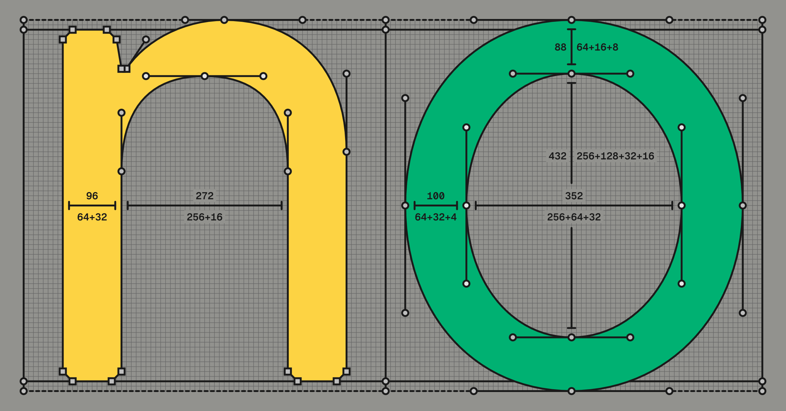
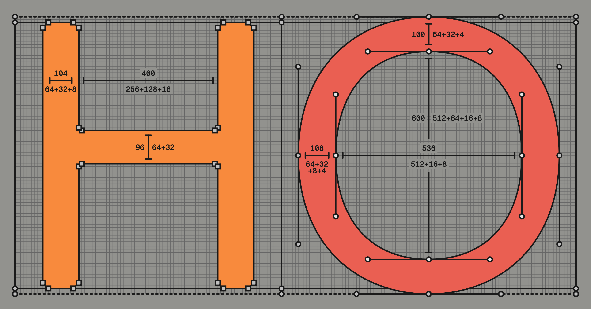
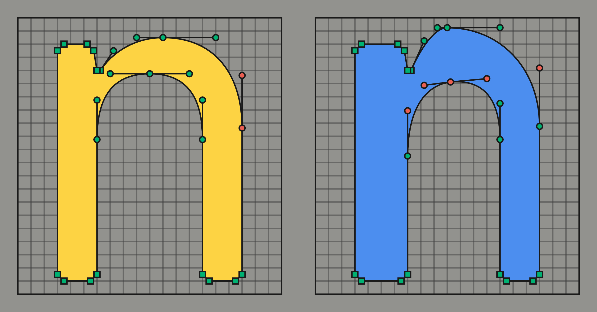
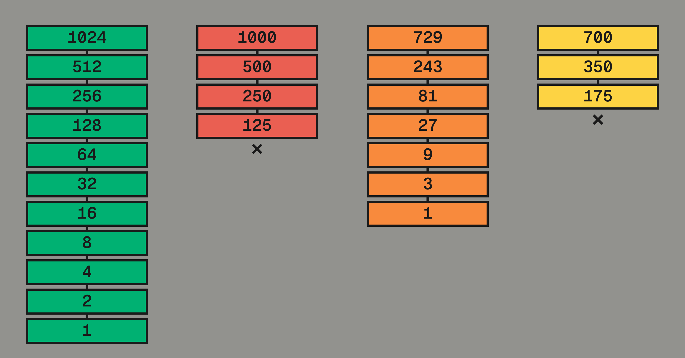
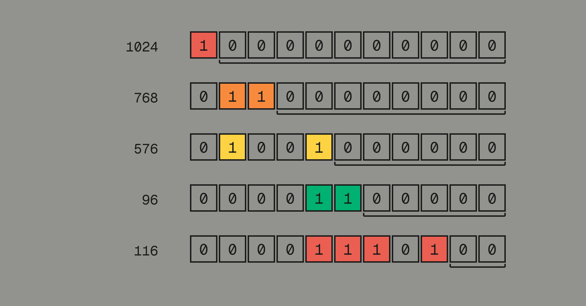

Virtua Grotesk is a typeface drawn on what I call a **hierarchical
semantic grid system**. Points default to an 8-unit grid. Small
optical corrections drop to a 2-unit subgrid. The grids record some
of the drawing intent automatically, so the source files are labeled training data
without extra work. This system makes the font a machine-learning and
data-engineering project as much as a type design project. If you are reading this on [elih.net](/), you are
reading Virtua Grotesk.

A small language model, Virtua-12M-v0.1, is learning to draw using
this grid system. It will soon be on Hugging Face as an open-weight
release that runs locally and can be fine-tuned. The font sources and
harness are already on
[GitHub](https://github.com/eliheuer/virtua-grotesk). Virtua Grotesk
is free and open-source under the SIL Open Font License (OFL) v1.1.


### Section Index

<nav class="section-index" aria-label="Contents">
<ol>
<li><a href="#01-the-modernist-impulse"><span class="n">01</span>The Modernist Impulse</a></li>
<li><a href="#02-replica-and-the-coarse-grid"><span class="n">02</span>Replica and the Coarse Grid</a></li>
<li><a href="#03-hierarchical-semantic-grid-systems"><span class="n">03</span>Hierarchical Semantic Grid Systems</a></li>
<li><a href="#04-aesthetic-discipline--machine-legibility"><span class="n">04</span>Aesthetic Discipline &amp; Machine Legibility</a></li>
<li><a href="#05-glyphs-as-sentences"><span class="n">05</span>Glyphs as Sentences</a></li>
<li><a href="#06-a-small-model-learns-to-draw"><span class="n">06</span>A Small Model Learns to Draw</a></li>
<li><a href="#07-weight-transfer-as-local-prediction"><span class="n">07</span>Weight Transfer as Local Prediction</a></li>
<li><a href="#08-the-designspace-is-a-data-factory"><span class="n">08</span>The Designspace Is a Data Factory</a></li>
<li><a href="#09-the-mathematics-of-2n"><span class="n">09</span>The Mathematics of 2ⁿ</a></li>
</ol>
</nav>

### 01. The Modernist Impulse

Designing the system instead of the final object is an old modernist
impulse. Karl Gerstner argued for it in his 1964 book *Designing
Programmes*, a foundational text of systematic Swiss design. In
practice, the idea ran into limits. Computers were procedural, and
strict rules made type stiff. They missed the optical corrections the
eye needs.

Neural networks might change that. A neural network is not a
procedural program, it interpolates and tolerates nuance where a rule
is brittle. It also
answers a modernist ideal that the rigid version betrayed: technology
people can live in harmony with, not technology that extinguishes human dignity.
The old impulse is worth another look.

Most fonts were never built as training data. Their coordinates land
wherever the designer put them. Their contours are as individual as
handwriting. That is fine for a rasterizer, but it is a problem for
data engineers working with font sources. Many font AI/ML projects
train on exactly this accidental data: scraped fonts and Google
Fonts, heterogeneous in every dimension that matters.

A typeface is not a collection of characters drawn in isolation. It
is many drawings that work as one system, and holding them together
is most of the work. Font datasets need the same discipline. A
collection assembled without it is not training data capable of
delivering useful models in 2026.

Modernist design was born a little more than a century ago out of
similar frustrations in a similar time of technological change. I
think the way forward is not a return to the dogma and rigidity of
modernist design that was rightly rejected (the culture of design that
replaced modernism is equally dogmatic and rigid, just in different
ways), but a rediscovery, with fresh eyes and new technology, of some
of the loftier goals of early modernism that were unachievable with
the technology of the previous century.

### 02. Replica and the Coarse Grid

The clearest precedent for Virtua Grotesk is [LL Replica](https://lineto.com/typefaces/replica)
(Norm: Dimitri Bruni and Manuel Krebs; Lineto, 2008). Norm took the
drawing grid in their font editor and made it ten times coarser.
FontLab's standard cap height is 700 units. Instead of 700 positions
across it they had 70, a step of 10 units, and every node and Bézier
control point had to land on one.

Two details make Replica more than a constraint exercise. First, the
bevels: its corners are cut exactly one grid unit wide, so the grid is
*visible* in the letterforms. Second, the cut diagonals: A, K, and R
have no pointed apexes, so the letters can be set tight. The constraint
produced the aesthetic, and the aesthetic advertises the constraint.

### 03. Hierarchical Semantic Grid Systems

Virtua Grotesk's answer to Replica's flat grid is a nested one, in
powers of two up to the em itself. The em is the coordinate space a
glyph is drawn in, and its size is given in units per em (UPM).
Virtua Grotesk's is 1024, 2^10, rather than the industry's usual
1000. That is less exotic than it sounds. A power-of-two em is the
TrueType convention, 2048 is standard and
[Inter](https://rsms.me/inter/) uses it. Virtua Grotesk extends the
same logic down through every dimension.

Every measurement is a sum of powers of two, each power used once. 64
takes one. 96 takes two, 64 + 32. 112 takes three, 64 + 32 + 16.
Fewer is better. Where two values take the same number, the one whose
powers run consecutively wins: in 96 = 64 + 32 each power is half the
one before it, while 80 = 64 + 16 skips a step.

That count is the value's Hamming weight, or popcount, the number of
1s when it is written in binary. Virtua Grotesk uses it to rank handle
lengths and structural spans. One is a pure power: 64, 128, 256. Two
is an elegant sum: 96 = 64 + 32, or 272 = 256 + 16. Three is
acceptable: 104 = 64 + 32 + 8. Four or more is flagged for review.



A low popcount means a structural value. A high one means the
letterform needed something the round numbers could not give. 64 is
too light for a stem and 128 too heavy, so stems are 96 = 64 + 32;
where 96 is too light, 112 = 64 + 32 + 16. The sums are a second
semantic hierarchy, parallel to the nested grid.

The full specification lives in the repo as
[`DESIGN.md`](https://github.com/eliheuer/virtua-grotesk/blob/main/DESIGN.md),
and it is enforced programmatically. From the repo root, `make
grid-qa` runs [a Python
script](https://github.com/eliheuer/virtua-grotesk/blob/main/scripts/grid_qa.py)
that grades every glyph in both masters for compliance. The report is
what the AI agent harness acts on: it fixes what the script flags,
renders the result, and runs the script again.

The same rule spaces the font. Sidebearings and kerning default to
the 8-unit grid: of Regular's 84 kerning pairs, all but two sit on
it, and the two that drop to the 2-unit grid are, exactly as with
point placement, coordinate-derived optical judgments, free training data.
The coarse default is also what gives the spacing its rhythm, a small
set of recurring intervals instead of 100s of bespoke ones,
snapped tighter only where the eye insists.



Structure lives on the 8-unit grid: stems, sidebearings, chamfers,
and every value a tool generates. Large optical corrections sit there
too. Only corrections finer than 8 units drop to the 2-unit grid, and
for now only a person can judge those. A point on 2 but off 8 can only be a deliberate
correction, so the label is in the coordinate itself. The machine
drafts on 8, a person refines on 2, and the difference between the
two versions is a labeled training set.


### 04. Aesthetic Discipline & Machine Legibility

Andrej Karpathy calls a large language model [a zip file of the
internet](https://www.youtube.com/watch?v=zjkBMFhNj_g): billions of
parameters that compress terabytes of text into a lossy gestalt. A
trained model is a compression of its training data.

Karpathy has
[bet](https://x.com/karpathy/status/1814038096218083497) that models
will get "very very small," and blames their current size on waste:
"we're asking them to memorize the internet and, remarkably, they
do." He calls the small alternative a [cognitive
core](https://x.com/karpathy/status/1938626382248149433), a model
that keeps "the algorithms for thought" and looks the rest up.

Virtua-12M-v0.1 is never asked to remember everything in the Google
Fonts catalog. It is asked to learn one design system: the basic
rules and the grid used to draw in a specific way. That is why 12.54
million parameters is enough, and why the checkpoint is 48 MB.

Font engineers already build compression systems. A variable font is a base
outline plus a set of interpolation deltas, and reconstructs every weight on
demand. A neural network learns its own internal space for the design and can
move through it in directions no one drew. The grid's discipline pays off two
ways:

1. **Consistency is signal.** Same stroke logic, same chamfer size, same
start-point conventions across every glyph: the model spends its capacity
learning the *design system* instead of averaging over hundreds of
designers' bézier habits.
2. **Constraints make outputs checkable.** If every legal coordinate is even,
every structural value is a multiple of 8, and every measurement comes
from a small closed vocabulary, then a
generated glyph can be *verified* mechanically. Quality
stops being an opinion, and an eval loop can grind at it overnight.

The tiers are learnable, and three numbers show it.
Nothing in the encoding mentions the 8-unit grid: every coordinate
token is a 2-grid position, all equally available. Placing points at
random would land on the 8-grid 6 percent of the time. The
human-drawn sources land on it 85 percent of the time. Drawing
held-out glyphs whose Bolds it never saw, Virtua-12M-v0.1 lands on it
68 percent of the time, most of the way from chance to the human
hand. When it leaves the structure grid it tends to land on
correction values rather than at random. Nobody labeled the tiers,
and no auxiliary loss rewards them. The model
learned them as plain statistics. The obvious objection is that a
next-token model reproducing its training statistics is doing exactly
what it should. That is the point. This is not only about frequencies:
where the human sources leave the structure grid, the model tends to
leave it at the same points.

One honest caveat about where the win comes from. The model reads
each coordinate as a single token and never sees digits, so at the
token level base two is invisible to it. What it learns from is
coarseness, regularity, and the nested tiers: a small set of legal
values, each recurring and meaning one thing, corrections rare
against a regular background. That trick would work in base ten too.

A 1000 em would even carry these same power-of-two values: put the
stem at 96 and 192 on a 1000 em and it interpolates just as cleanly,
because the arithmetic is on the stem width, not the em. Base two
pays off further down the pipeline, wherever a coordinate is divided
by the em. 96/1024 is 0.09375, exact in binary; 96/1000 repeats
forever. Normalization and display scaling ride on that division, and
section 09 makes the case that base two is the best choice for it,
and for font UPMs in general.

### 05. Glyphs as Sentences

A glyph is already a sentence: an ordered list of drawing commands.
Transformers predict sequences, so I hand the model each glyph as the
sequence it already is and train it to predict the next token.

The sources are [UFO](https://unifiedfontobject.org/): one XML file per
glyph, each outline stored as points on the grid. A transformer reads a
flat list of tokens, not an XML tree, so a small codec rewrites each
outline as a single line of commands and coordinates, in order.

Virtua-12M's *vocabulary* is small. A few conditioning tokens set the
glyph's name, Unicode codepoint, and weight; four verbs draw it (`MOVE`,
`LINE`, `CURVE`, `CLOSE`); and one token stands for each legal grid
position, so a coordinate is a single token. Here is the numeral **2**
in Regular, exactly as the codec emits it:

```
BOS N_two U_0032 W400 ADV 592
MOVE 48 0
LINE 528 0
LINE 544 16
LINE 544 72
LINE 528 88
LINE 160 88
LINE 152 96
CURVE 152 136 232 216 356 276
CURVE 492 342 560 422 560 552
CURVE 560 676 494 784 304 784
CURVE 150 784 48 680 48 524
LINE 64 508
LINE 136 508
LINE 152 524
CURVE 152 620 210 692 304 692
CURVE 402 692 464 632 464 552
CURVE 464 460 394 390 280 336
CURVE 116 258 32 146 32 32
LINE 32 16
CLOSE
EOS
```

Read it top to bottom. `BOS` and `EOS` bracket the sequence. `N_two`
names the glyph, `U_0032` is its codepoint, `W400` the weight, `ADV 592`
the advance width. The rest is the outline: `MOVE` starts a contour,
`LINE` draws a segment, `CURVE` a cubic Bézier through two controls to an
endpoint, `CLOSE` shuts the loop. Every bare number is a grid coordinate.

Many careful fonts are fairly regular; Virtua Grotesk is stricter: a
stem is 96 every time, never 95 or 97. Structural values recur, so their
tokens are common; corrections sit off the 8-grid, so to the model a
correction is a rare, high-information token.

The codec runs both ways: glyph to sequence for training, and, given the
opening tokens, the model finishes the sequence and the codec runs
backward into a real, editable UFO. The round trip is lossless; snapping
only loses precision when a point falls between legal positions, and a
grid-native font has none: every coordinate already equals a token. The
exactness comes from committing to the grid, not from its coarseness; a
1-unit grid would round-trip just as cleanly.

No rasterization, no image encoder, no diffusion: the source stripped to
the drawing is the training data, about 90 tokens a glyph. Quantize a
found font after the fact and you lose the designer's intent by an
unknowable amount; draw on the grid and the tokens *are* the intent.

None of the machinery is new.
[SVG-VAE](https://arxiv.org/abs/1904.02632) (2019),
[DeepSVG](https://arxiv.org/abs/2007.11301),
[DeepVecFont](https://arxiv.org/abs/2110.06688),
[IconShop](https://arxiv.org/abs/2304.14400), and
[StarVector](https://arxiv.org/abs/2312.11556) all tokenize outlines and
learn them with a transformer, several quantizing to a small integer grid
as I do. What none can do is start from grid-native data: they snap found
fonts to a grid in preprocessing, a lossy scrape of a thousand
disagreeing hands, and spend much of their capacity absorbing that
heterogeneity. This project inverts the ratio: design one corpus until it
is nearly homogeneous, then ask how small the model can get.

[Simon Cozens](https://simoncozens.github.io/state-of-ai-font-generation/),
surveying the field, is blunt: "vectorization of glyph images has been
historically very bad," and his own Google Fonts model "completely
failed." The model failure is a data problem, upstream of any model. I
fixed the bad vectorization with [img2bez](/blog/img2bez), a tracer that
places points on a glyph's structure, not just its silhouette, and puts
outlines straight onto the 2-unit grid. It runs throughout the pipeline
and harness that Virtua Grotesk uses.

### 06. A Small Model Learns to Draw

The model is deliberately small: a 12M-parameter decoder-only transformer
trained from scratch on one machine, with no cloud and no GPU cluster. It runs
two ways, an [MLX](https://github.com/ml-explore/mlx) build on an M4 Mac
and a PyTorch build on a Linux PC with a gaming GPU; an overnight run is
about 30,000 steps. The corpus began with Virtua Grotesk's two masters:
427 glyphs, structurally identical between Regular and Bold. For v0.1,
training has two stages: pretrain on glyphs traced from OFL fonts in
Google Fonts, then fine-tune on the Virtua Grotesk sources. Section 07
measures what pretraining added.

The model card:

| Virtua-12M-v0.1 |   |
| --- | --- |
| architecture | decoder-only transformer: 6 layers, 384 dims, 8 heads |
| parameters | 12.54M |
| context | 1,368 tokens |
| vocabulary | 1,784 tokens: commands, names, coordinates, deltas |
| pretraining | 29,000 Regular-Bold pairs traced from Google Fonts |
| fine-tuning | 50 human-graded Virtua Grotesk Bold pairs; 463 glyphs in the corpus |
| optimizer | AdamW, lr 3e-4, 200-step warmup, cosine decay, batch 24, dropout 0.1 |
| compute | one Apple M4 Pro laptop (MLX); both training runs in 3h20m |
| checkpoint | 48 MB fp32 safetensors |

Decoder-only is the GPT architecture: each token becomes a vector, a
stack of blocks refines those vectors through *attention* (each position
looking back at earlier tokens for whatever helps predict the next), and a
final layer turns the last vector into a probability over the vocabulary.
Training nudges it toward the true next token, glyph after glyph, until
the model learns the grammar of outlines.

The lineage is Karpathy's from-scratch projects:
[char-rnn](https://karpathy.github.io/2015/05/21/rnn-effectiveness/) on C,
[makemore](https://github.com/karpathy/makemore) on names,
[microgpt](https://karpathy.github.io/2026/02/12/microgpt/) on a 27-token
vocabulary. This does the same for glyph outlines, one drawing command at
a time; a stage takes about 45 minutes on an M4 Pro or a gaming GPU.

Training follows his [Recipe for Training Neural
Networks](https://karpathy.github.io/2019/04/25/recipe/) more closely than
I planned: the first overnight run memorized its few thousand sequences,
and the fixes were the standard ones: augmentation, dropout, a held-out
validation set. The recipe's other commandment, a dumb baseline to beat,
is in place too: predict every Bold offset as the mean delta of the
training pairs, no model at all.

The model runs inside [Runebender](https://runebender.org), a free and
open source font editor I work on. Below, I sketch an e with a brush,
trace it to a draft outline, and have Virtua-12M-v0.1 redraw it in the
font's conventions, using the green-graded glyphs in the sources as
reference:

<video src="/videos/e-draw.mp4" poster="/videos/e-draw-poster.jpg" controls playsinline preload="metadata" aria-label="Screen recording of the Runebender editor: a lowercase e is sketched with a brush, traced to a draft outline on the grid, and redrawn by Virtua-12M in the font's conventions using the Draft with Virtua tool."></video>

### 07. Weight Transfer as Local Prediction

Every glyph drawn once must be drawn again heavier, with the same
structure. Given the Regular, the model draws the Bold. When both masters
exist, font tools already interpolate for free; the model is for the case
they can't touch, when the second master doesn't exist yet. The goal is a
workflow where a designer draws a few control glyphs by hand and the model
bootstraps the rest, corrected on the 2-unit grid.

The task is local, which is why it fits a small model. The two masters are
written into one sequence point by point: a Regular point, then its Bold
value. The model predicts each Bold as a small offset from the adjacent
Regular point, and the Regular points stay fixed, so the glyph's structure
cannot break.

It works. Ten glyphs were held out, their Bolds shown to no run. Against a
mean-delta baseline, Virtua-12M-v0.1 wins on every metric (MAE is
coordinate error, Chamfer scores outline shape, IoU shared ink). The
graded corpus alone only tied the baseline; the win came from pretraining
first.

| held-out Bold prediction | MAE ↓ | Chamfer ↓ | IoU ↑ |
| --- | --- | --- | --- |
| mean-delta baseline | 31.3 | 37.4 | 0.564 |
| graded corpus only (control) | 31.7 ± 0.5 | 35.3 ± 0.7 | 0.567 ± 0.013 |
| + OFL pretrain (Virtua-12M-v0.1) | **24.0 ± 1.6** | **22.4 ± 1.3** | **0.745 ± 0.016** |



The output is a draft, not a finished Bold; a person still corrects it on
the 2-unit grid. This is a small test, and the numbers will change as the
work grows. Section 08 reports what the same model does on fonts it wasn't
tuned for, including a result that didn't work.

### 08. The Designspace Is a Data Factory

Two masters hold more data than they seem to: every interpolation between
them is a real instance of the family, as Multiple Master fonts have
exploited since 1991. The factory picks a weight, interpolates, snaps to
the grid, and labels the glyph with its exact weight.

Is an interpolation worse data than a master? No. The sheet below shows
the real `n` at Regular, the 1/2 interpolation, and Bold, points colored
by grid level (green on the 8-unit structure grid, red on the 2-unit
correction grid). The middle glyph isn't a master, but every point is on
the grid; the stem steps 96, 144, 192.


The reason is arithmetic: the stems differ by 96, which keeps splitting
evenly as the weight halves, so every interpolated stem lands back on the
grid. The glyph between the masters is as clean as the masters. A decimal
design doesn't close this way (below), and section 09 proves why the em
itself, not just the grid, must be the power of two.


Interpolation can't invent a new optical correction: it blends the
masters' corrections linearly, and optics aren't linear in weight, so it
reproduces structure exactly and only approximates the corrections. The
model learns optical judgment from the two real masters and the graded
corpus, not the augmentation. One more augmentation adds scale: rotating a
closed contour's start point draws the same shape, multiplying the batches
enough to stop memorizing.

Interpolation gives volume, not variety: every batch is one design.
Variety takes more families, which [img2bez](/blog/img2bez) provides: a
Rust autotracer that puts any raster (a rendered font, a scan, an AI-drawn
glyph) onto the 2-unit grid, with
[img2ufo](https://github.com/eliheuer/img2ufo) assembling a UFO. This is
how v0.1's pretraining data was made: OFL families traced onto the grid,
many hands before it meets Virtua Grotesk.

That pretraining data has its own held-out test: one positive result,
one negative. On 290 held-out OFL pairs (1 percent), the pretrained model
beats the baseline, so the skill is general: it draws Bolds for glyphs it
never saw. (The held-out unit is the glyph, not the font, so these are new
glyphs from styles it *has* seen; a font-level split is next.) The
fine-tune then costs that generality: after specializing on Virtua
Grotesk the model collapses on OFL, from beating the baseline on 74
percent of pairs to 9. This is catastrophic forgetting, the price of
fine-tuning a small model on a narrow corpus. The v0.1 instinct was to mix
the old data back in; the conclusion has since sharpened the other way.
Heterogeneous font collections aren't training data for this at all
(Section 01), so the direction now is to retire the borrowed fonts
entirely and let the Virtua Grotesk family, built out across weights, be
the whole dataset. Virtua-12M-v0.1 is a specialist, not a general tool:

| held-out OFL pairs, n = 290 | MAE ↓ | Chamfer ↓ | IoU ↑ | beats baseline |
| --- | --- | --- | --- | --- |
| mean-delta baseline (OFL) | 20.8 | 22.9 | 0.61 | |
| after OFL pretrain | **15.0** | **14.8** | **0.75** | 74% |
| after Virtua Grotesk fine-tune | 33.5 | 28.9 | 0.50 | 9% |

Karpathy's [Software 2.0](https://karpathy.medium.com/software-2-0-a64152b37c35)
names the idea: if the weights are the program and training the compiler,
the dataset is the source code. Grid systems as datasets takes that
seriously, and the data gets software's tools: a style guide (`DESIGN.md`), a
linter (the grid is checkable), review (mark colors in the UFOs), and
version control.

The pieces form one system: [img2bez](/blog/img2bez) traces references
onto the grid, the model completes outlines and draws Bolds,
[designbot](https://github.com/eliheuer/designbot) renders the proofs,
[Runebender](https://runebender.org) is the review surface, and a harness
runs the report-fix-render loop against `DESIGN.md` with mark colors as
the human's control. The goal is to finish Virtua Grotesk and ship it to
Google Fonts.

This is a first step. The aim is fonts that are models, not tables of
outlines, freed from the per-glyph boxes digital type inherited from
metal. An outline font is a compression scheme for the Latin letter, one
fixed shape reused everywhere, and it strains on other scripts: Arabic in
its manuscript forms is one continuous, context-dependent stroke, and the
current workaround uses thousands of glyphs and substitution rules to fake
what a hand does in one motion. A generative font draws each glyph in
context. The
first ones will be built on a grid like this.

<h3 id="09-the-mathematics-of-2n">09. The Mathematics of 2ⁿ</h3>

<div class="pl-6 my-8 [&>*]:text-muted-foreground">
<p>“TeX represents all dimensions internally as an integer multiple of the
tiny units called sp. Since the wavelength of visible light is approximately
100 sp, rounding errors of a few sp make no difference to the eye. However,
TeX does all of its arithmetic very carefully so that identical results will
be obtained on different computers.”</p>

<p>—Donald Knuth, [The TeXbook](https://www-cs-faculty.stanford.edu/~knuth/abcde.html), 1984.
The sp is the scaled point, TeX's atomic unit of distance:
65,536 sp = 2¹⁶ sp = 1 printer's point.</p>
</div>

<div class="pl-6 my-8 [&>*]:text-muted-foreground">
<p>“every good outcome I’ve seen has been from finding a secret and doubling,
tripling down on it in a way that compounds over time. not necessary that it
even remains a secret because nobody ever believes you anyways”</p>

<p>—roon ([@tszzl](https://x.com/tszzl)), 2026.</p>
</div>

The most common pushback on this draft was: why powers of two? Concede
the narrow point first: any grid shrinks the vocabulary, and a decimal
grid would tokenize just as cleanly. The transformer doesn't care: I find
no evidence a network prefers binary bins to decimal, and when the field
quantizes it reaches for [256 bins](https://arxiv.org/abs/2002.10880) out
of habit. If the model were the whole pipeline, the skeptics would be
right.

It isn't. The rest of the pipeline imposes five constraints: normalize
exactly; be closed under the drawing operations; keep the hierarchy a
chain so its levels carry meaning; make the ladder as deep as the em
allows; and meet the machine at every boundary, rendering included. Each
is software the design has to live inside. This section takes them in
order, then tests the rivals.

**Normalize exactly.** A binary computer stores a fraction exactly only
when its denominator is a power of two: the dyadic rationals, the
machine's native numbers. Divide Virtua Grotesk's 96-unit stem by its 1024
em and you get 0.09375, exact; divide by the traditional 1000 em and 0.096
has no finite binary form, so the machine holds 0.09600000000000000200.
Every coordinate is normalized, interpolated, and scaled thousands of
times before anyone sees a letter, and each step either is exact or
quietly rounds.

The denominator is the em, not the drawing grid: a 1000 em with an 8-unit
grid doesn't help, since 8/1000 = 1/125 has no finite binary form either.
The em itself must be the power of two, because it's the denominator of
every normalized coordinate.


Rounding is the mild failure. The sharp one: some of the design's own
proportions have no integer coordinate. Cap height is 3/4 of the em,
x-height 9/16: on 1024, 768 and 576. On a 1000 em the cap height still
lands at 750, but 9/16 of 1000 is 562.5, and no font stores half a unit;
the proportion the designer chose can't be written down. A binary
proportion is a whole coordinate only on a binary em, in the source,
before any arithmetic runs.

This is the founding decision of digital typography. Knuth hit it in TeX,
[watching 0.4 print back as 0.39999](https://research.swtch.com/fp-knuth),
and rebuilt on scaled points of 2⁻¹⁶ of a printer's point. In METAFONT
every number is a multiple of 2⁻¹⁶, so typing .1
[gets 6554/65536](https://ctan.org/pkg/mfbook). The modern formats agree:
TrueType rasterizes in 26.6 fixed point, variable fonts store axis
positions in
[units of 2⁻¹⁴](https://learn.microsoft.com/en-us/typography/opentype/spec/otvarcommonformats),
and OpenType
[recommends a power-of-two em](https://learn.microsoft.com/en-us/typography/opentype/spec/ttch01)
because scaling is then a bit shift. A design on the dyadic grid is the
only one this stack writes down exactly.

Deployment is already dyadic: a variable font can't express t = 1/3
between masters: the format snaps it to 5461/16384 first. Dyadic training
weights are the only ones the shipping format can express.

The same arithmetic appears on the ML side. Karpathy, tuning
[nanoGPT](https://github.com/karpathy/nanoGPT), found a 25 percent
speedup by padding the vocabulary from 50,257 to 50,304, the nearest
multiple of 64, and signed off,
["Careful with your Powers of 2."](https://x.com/karpathy/status/1621578354024677377)

| operation | em 1024 | em 1000 |
| --- | --- | --- |
| normalize a 96-unit stem | 0.09375, exact | 0.096, repeats |
| interpolate at t = 1/2, 1/4, 3/8… | exact | float error |
| scale to a pixel size | bit shift | division |
| divide the em in thirds | approximate | approximate |

The last row is the honest one: binary buys no thirds, and neither does
decimal; the divisions that resist the base are exactly the ones the
eye corrects anyway. The operations that must be exact (halving,
doubling, scaling, interpolating) are the four base two does perfectly.

**Close under the operations.** The keystone. The numbers reachable from
the integers by taking midpoints are exactly the dyadic rationals, and
the midpoint is the pipeline's own operation. Interpolating halfway
between masters is a midpoint; splitting a bézier (de Casteljau
subdivision, which every rasterizer performs) is midpoints of midpoints.
The dyadic grid isn't a lattice the operations tolerate; it's the lattice
they generate. Start from any grid, run the arithmetic, and the points
that appear are dyadic.


The figure subdivides an arch: control points on the 64-grid, first
midpoints on the 32, second on the 16, split point on the 16. A midpoint
of two multiples of 2ᵏ is a multiple of 2ᵏ⁻¹, so each round descends at
most one rung, and a ten-rung ladder absorbs the whole operation. On a
decimal grid the numbers leave the system at the second halving: 10 halves
once, to 5, and dies.

Exactness and closure are half the answer; the other half is where this
parts ways with Replica. Replica's grid is one flat layer, every legal
point equally legal, so it can say only one thing about a point, and
forces a choice: keep every point on the lattice and there's no room for
optical correction, or allow points off it and nothing separates a
correction from a slip.

A power-of-two em removes the choice, because it halves cleanly all the
way down. The grids tiling a 1024 em run 1024, 512, 256… to 2: ten nested
levels, each a strict subset of the one above. Virtua Grotesk assigns
meanings: 64 for vertical metrics, 8 for structure, 2 for corrections. An
optical correction is never off-grid; it's on the fine grid and off the
coarse one, section 03's rule as data design. The ladder is a property of
the base: powers of two dividing 1000 stop at 8, those dividing Replica's
700 stop at 4; a binary em ladders from the unit to the em.



**Keep the hierarchy a chain, and deep.** Divisor-rich ems like 720 and
2520 (Babylon's astronomy numbers) offer exact thirds and fifths, but
their divisors form a lattice, not a ladder: a point on both the 9-grid
and the 8-grid has no well-defined level, and the labeling dies of
ambiguity. Meaningful levels need a chain, each grid strictly inside the
next, which forces the em to be a power of one prime. Depth favors the
smallest: dividing by 3 gives 729 six levels, dividing by 2 gives 1024
ten.

The last property is the most literal: write a coordinate in binary and
its grid level is its count of trailing zeros. 768 ends in eight zeros
(256-grid); 576 in six (64-grid); 96 in five (32-grid); 116 in two
(4-grid, off the structure grid's 8, a correction). Mathematicians call
this the 2-adic valuation; hardware calls it count-trailing-zeros, one
instruction. The hierarchy isn't drawn on top of the coordinates; it *is*
their binary form, read off the low bits. The labeling function this
scheme depends on ships inside the numbers.




Now the rivals, each against the constraints.

**Decimal, em 1000.** Fails normalization (0.096, held forever wrong) and
closure (10 halves once, to 5, and dies). Its one advantage, human mental
arithmetic, describes the wrong partner: here the human judges curves and
the machine does the arithmetic.

**Balanced ternary, em 729 = 3⁶.** The strongest rival, Knuth's favorite:
six clean levels, a chain, symmetric arithmetic. On ternary hardware it
would win. On the hardware that exists, 1/3 has no finite binary form, so
every normalized coordinate is approximate and every constraint after the
first collapses.

**The divisor-rich and the golden.** Babylon's 720 and 2520 buy exact
thirds at the price of a lattice hierarchy and a denominator binary
arithmetic can't hold, and the thirds they sell are the divisions the eye
corrects anyway. The golden section fails harder: φ is irrational, so
nothing normalizes exactly. Corbusier matched his grid to the measure of
man; this grid matches the measure of the machine.

**The learned codebook.** Let a VQ-VAE learn the quantization. But a
learned codebook can't be drawn on by a person, linted by a rule, or held
stable across retrainings, and it quantizes after the fact. The field has
been retreating from learned codebooks toward small fixed grids
([finite scalar quantization](https://arxiv.org/abs/2309.15505)) because
they train more stably.

**No grid at all.** Continuous coordinates with a regression head. But
there's no continuous on a computer: a 64-bit float is a dyadic rational,
m·2ᵉ. Continuous means the dyadic grid at 2⁻⁵², adopted implicitly: no
levels, no linting, no meaning in the low bits. You can't escape the
lattice, only choose whether to design it.

The result: given binary arithmetic end to end, exact normalization,
closure under subdivision, and a hierarchy whose levels carry meaning, the
grid system is forced: the dyadic ladder of a power-of-two em, unique up
to one free choice, the exponent. The eye fixes it: four decades of
practice say roughly a thousand units per em is enough, and 1024 is the
power of two that lands there. (2048 with a 4-unit grid is the same system
scaled by two.)

For the machine-learning pipeline, exactness and nesting pay out four
ways:

**The synthetic data is noise-free.** Section 08's factory is
interpolation, `a + t · (b − a)`. With masters on the 2-grid and
binary-fraction weights, every intermediate value is dyadic and every
machine computes the identical result; on a decimal em, float error enters
every coordinate before the snap, differently per machine, and the model
learns the design plus the noise. There's even a right sampling order:
the base-2
[van der Corput sequence](https://en.wikipedia.org/wiki/Van_der_Corput_sequence),
1/2, 1/4, 3/4, 1/8…, dyadic and evenly spread at every prefix.

**The outputs are checkable, and the taste comes labeled.** A wrong
coordinate is a lintable defect: an odd number, a stem outside the favored
set. And because machine drafts stay on the 8-unit grid, every 2-unit
deviation in a glyph I approve is a recorded human optical correction. The
grid is the annotator.

**The differences are a small vocabulary.** Stems, chamfers, and section
07's Regular-to-Bold deltas come from a few dozen values: machine values
with three or more trailing zeros, or recorded ±2/±4 hand offsets. The
lexicon recurs: the Bold stem is the Regular stem doubled, the Bold curve
the Bold stem plus the same 4. Weight transfer collapses to choosing among
familiar offsets.

**Every modality shares the lattice.** Render a 1024-em glyph at 1024
pixels and one font unit is one pixel (the specimen atop this post is
drawn that way). The image models feeding img2bez downsample by eight, so
their latent space is a 128 × 128 lattice where each cell covers an 8 × 8
block of font units: the structure grid reappears inside the diffusion
model.

Knuth walked this ground forty years ago. METAFONT had to put ideal curves
onto coarse pixel grids, and his chapter
["Discreteness and Discretion"](https://ctan.org/pkg/mfbook) answers the
analog objection: "the human eye is composed of discrete receptors, and
visible light has a finite wavelength." Then, in 1986, the design brief:
"our goal should not be to make hand-tuning obsolete; it should rather be
to make hand-tuning tolerable. Let us try to create meta-designs so that
we would never want to change more than a few pixels per character, say
half a dozen, regardless of the resolution." A machine draft correct on
the coarse grid, a human budget of a few touches on the fine one: that's
the 8-grid and the 2-grid, except here every touch is recorded, labeled,
and learned from. The constraints earn the machine its 8-grid; nothing
earns it the 2-grid. The low bits belong to the eye.

The claim at its true size: great fonts shipped on decimal ems for
forty years, and when humans run the pipeline the base hardly
matters. Knuth thought base two nothing special aesthetically; his
*Art of Computer Programming* calls balanced ternary "perhaps the
prettiest number system of all." But he built TeX and METAFONT on the
base the machines speak, because they had to produce the identical
page on every machine. Once the pipeline is computational end to end,
base two is the choice where the design's arithmetic and the
machine's arithmetic are the same arithmetic.

When the engineering is settled, the tiebreaker is aesthetics.
Modernism was not innocent of powers of two: A-series paper halves at
every fold. The Swiss creed was truth to materials, and the true
material of the computer is the bit. The same taste runs down the
stack; it is why the sources are UFO, plain one-glyph-per-file XML,
rather than something more opaque. The powers of two would deserve
this job on beauty alone; that they are also the machine's own
numbers is the point of this post. On a binary machine, a design
drawn in powers of two is not encoded. It is simply written down.
