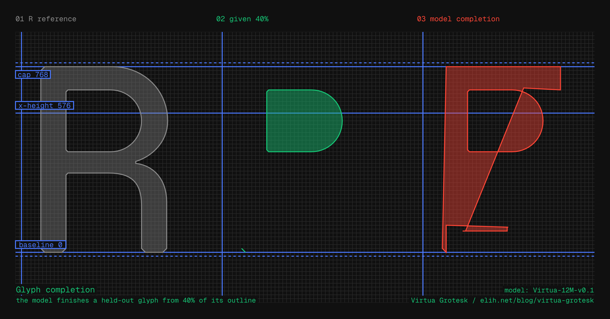

<p class="font-mono text-sm" style="color: #ff4535">NOTE: this post is a draft and still being edited.<br />Feedback welcome: eli@elih.net</p>

Virtua Grotesk is a typeface I am designing on a multi-layer, semantic,
powers-of-two grid system. If you are reading this on [elih.net](/), it
is the typeface you are reading right now. It is also a machine-learning
experiment: the same grid that gives the font its aesthetic makes its
source files unusually good training data, and a small neural network is
now learning to draw it. The model will soon be available on Hugging
Face as an open-weight release that anyone can use and fine-tune on
their own fonts. This post is about the typeface, the neural
network, and why they are the same idea. The font sources are on
[GitHub](https://github.com/eliheuer/virtua-grotesk), free under the
SIL Open Font License (OFL) v1.1.


### Section Index

<nav class="section-index" aria-label="Contents">
<ol>
<li><a href="#01-the-modernist-impulse"><span class="n">01</span>The Modernist Impulse</a></li>
<li><a href="#02-replica-and-the-coarse-grid"><span class="n">02</span>Replica and the Coarse Grid</a></li>
<li><a href="#03-multi-layer-semantic-powers-of-two-grid-systems"><span class="n">03</span>Multi-layer Semantic Powers-of-two Grid Systems</a></li>
<li><a href="#04-from-aesthetic-discipline-to-machine-legibility"><span class="n">04</span>From Aesthetic Discipline to Machine Legibility</a></li>
<li><a href="#05-glyphs-as-sentences"><span class="n">05</span>Glyphs as Sentences</a></li>
<li><a href="#06-a-small-model-learns-to-draw"><span class="n">06</span>A Small Model Learns to Draw</a></li>
<li><a href="#07-boldening-as-local-prediction"><span class="n">07</span>Boldening as Local Prediction</a></li>
<li><a href="#08-the-designspace-is-a-data-factory"><span class="n">08</span>The Designspace Is a Data Factory</a></li>
<li><a href="#09-a-hidden-treasure-the-mysticism-of-2n"><span class="n">09</span>A Hidden Treasure: The Mysticism of 2ⁿ</a></li>
<li><a href="#10-the-mathematics-of-2n"><span class="n">10</span>The Mathematics of 2ⁿ</a></li>
</ol>
</nav>

### 01. The Modernist Impulse

Designing the system instead of the final object is an old modernist
impulse; Karl Gerstner argued it in his 1964 book *Designing Programmes*, a foundational
text of systematic Swiss design. But in practice it kept running into limits. Computers were procedural, and strict rules too rigid:
type drawn by rule comes out stiff, missing the optical corrections the eye
needs.

Neural networks might change that. A model is not really a program; it interpolates
and tolerates nuance where a rule is brittle. It even answers a modernist ideal
the rigid version betrayed: technology people can live in harmony with, not
technology that extinguishes human dignity. The old impulse is worth a
fresh look.

The problem is data. A neural network only knows what it is trained on, and until very
recently most fonts were not built as training data, or to be edited by an agent
through a harness rather than a person in a desktop editor. Their coordinates
land wherever the designer's hand put them, contours as individual as
handwriting. That's fine, the rasterizer doesn't care. But a neural network
does, and today's font AI trains on exactly that accidental data: scraped
fonts, Google Fonts, heterogeneous in every dimension that matters.

### 02. Replica and the Coarse Grid

The purest precedent to what I am doing with Virtua Grotesk is [LL Replica](https://lineto.com/typefaces/replica)
(Norm: Dimitri Bruni and Manuel Krebs; Lineto, 2008). Norm took the drawing
grid their font editor provided and made it ten times coarser. FontLab
provides a 700-unit grid, and instead of drawing on that 700-grid they allowed
themselves a 70-grid. Fewer legal positions for every node and every bézier
handle. Deliberately less freedom.

Two details make Replica more than a constraint stunt. First, the bevels:
Replica's corners are cut, and the cut is exactly one grid unit wide, so the
grid isn't just a discipline, it's *visible* in the letterforms. Second, the
cut diagonals: A, K, R have no pointed apexes, so the letters can be set
tight. The constraint produced the aesthetic; the aesthetic advertises the
constraint.

### 03. Multi-layer Semantic Powers-of-two Grid Systems

Virtua Grotesk is drawn against powers-of-two, not the base-10 grid of Replica,
down to the UPM (units per em) itself: 1024 (2^10) rather than the usual 1000. That is
less exotic than it sounds. A power-of-two em is the TrueType convention (2048
is standard, and [Inter](https://rsms.me/inter/) uses it), so 1024 just extends
the same logic to the rest of the system. The full spec lives in the repo as
[`DESIGN.md`](https://github.com/eliheuer/virtua-grotesk/blob/main/DESIGN.md),
but the system is easier to draw than to tabulate. The four dimension
sheets below are measured directly from the sources, every dimension
line anchored to real outline coordinates, so unlike a table they
cannot drift out of date. They are drawn in the Runebender point
language: circles are smooth on-curve points, squares are corners,
small circles are the bézier handles, and the color of every point is
its grid level. Green points sit on the 8-unit structure grid; red
points sit off 8 on the 2-unit correction grid: the optical
corrections.
Purple numbers are handle lengths from the favored set. First the
whole Latin system, then the lowercase up close, then the two masters
side by side, and the same system carrying Arabic:


One rule keeps it humane: **optical corrections.** The grid is a starting
point, not a cage, and it is hierarchical, with the two levels splitting the
work. The 8-unit grid is the **structure grid**: stems, sidebearings, chamfers,
and every offset a tool fits or generates has to land on a multiple of 8. The
2-unit grid is the **correction grid**: dropping from 8 to 2 is an optical
correction, the small nudge the eye asks for and, for now, only a person can
judge.

The elegant part is that this labels itself. Because everything structural
lives on 8, any point on 2 but off 8 is a deliberate optical correction, with
nothing to annotate. The machine proposes
structure on 8, the human teaches optics on 2, and the difference between a
draft and its corrected version is a clean training set for free, the raw
material for a model that will soon make those corrections on its own if given enough well-crafted example data.


### 04. From Aesthetic Discipline to Machine Legibility

Andrej Karpathy calls a large language model [a zip file of the
internet](https://www.youtube.com/watch?v=zjkBMFhNj_g): billions of parameters
that compress terabytes of text into a lossy gestalt. A trained model is a
compression of its training data.

Font engineers already build compression systems. A variable font is a base
outline plus a set of interpolation deltas, and reconstructs every weight on
demand. A neural network learns its own internal space for the design and can
move through it in directions no one drew. The grid's discipline pays off two
ways:

1. **Consistency is signal.** Same stroke logic, same chamfer size, same
start-point conventions across every glyph: the model spends its capacity
learning the *design system* instead of averaging over five hundred
designers' bézier habits.
2. **Constraints make outputs checkable.** If every legal coordinate is even,
every structural value is a multiple of 8, and every measurement comes
from a small closed vocabulary (a stem is 96, everywhere, always), then a
generated glyph can be *verified* mechanically: off-grid points are
detectable and snappable, wrong stem weights are measurable. Quality
stops being an opinion, and an eval loop can grind at it overnight.

One correction is owed here. An earlier draft called the stems "sums of
powers of two," and Simon Cozens pointed out that every integer is one;
that is what binary means. The property that matters is *trailing
zeros*: 96 is a multiple of 32, 95 is a multiple of nothing. And the
stroke weights that look arbitrary are the two levels at work: the
lowercase curves are 100 and 92, the 96 stem plus and minus 4, the
eye's compensation for round strokes.

This is the **multi-layer semantic grid**, and it, not any single
number, is the core idea of this post. Which layer a value sits on is
its meaning. The n's stem is 96: structure, so it lives on the 8-unit
structure grid. The o's curve is 100: a round stroke needs the eye's
+4, and 4 lives on the 2-unit correction grid. The powers of two
are just the base in which this ladder of layers runs deepest, and,
separately, the numbers I find beautiful.

The layers are also learnable, and that is measurable. The model's
vocabulary enforces only the bottom layer: every coordinate token is a
2-grid position, all equally available, and nothing in the encoding
mentions the 8-grid. A model emitting random legal coordinates would
land 94 percent of its points off the 8-unit grid. On held-out glyphs
whose Bolds it never saw, Virtua-12M-0.8 puts 68 percent of its points
*exactly on* the 8-unit grid (the human-drawn sources: 85 percent),
prefers the correction grid's on-4 values when it leaves, and keeps
the E, a glyph with no optical corrections, on the structure grid at
every point. Nobody labeled
the layers. The model recovered them from the geometry alone.

![The whole argument in one dimension sheet, drawn with designbot. Left: a zoomed crop of the word no sitting on the layered grid itself, the fine 2-unit correction grid, the crisp 8-unit structure grid and brighter 64-lines, with every point colored by its layer, the n's stem chain dimensioned 96, 272, 96 in green and the o's curve wall dimensioned 100 in red. Right: 96 and 100 written in binary with their trailing zeros bracketed, 96 on 32 as structure and 100 on 4 as a correction, the note that 100 equals 96 plus 4, the curve's correction, and bars showing the share of points landing exactly on the 8-unit grid in held-out model output: chance 6 percent, Virtua-12M-0.8 68 percent, human sources 85 percent, with the note that nobody labeled the layers; the model found them](./fig-semantic-grid.png)

One honest caveat: for the model itself, the win is coarseness and
regularity, not base two. It reads each coordinate as a single token and
never sees digits, so it would learn Replica's decimal grid just as
well. A small set of legal values, each one recurring and meaning one
thing, is the whole trick. The machine legibility comes from the grid
being coarse and kept; as far as the model is concerned, the base is a
matter of taste. Section 10 makes the case that the rest of the pipeline
disagrees.

### 05. Glyphs as Sentences

A glyph is already a kind of sentence: an ordered list of drawing commands. That
is exactly what a transformer predicts, a sequence where each symbol follows from
the ones before. So instead of a picture of a letter or a loose set of points, I
give the model each glyph as the sequence it already is and train it to predict
the next token.

The source files are a [UFO](https://unifiedfontobject.org/): a folder of XML,
one file per glyph, each outline stored as points on the grid. A transformer
can't read a tree of XML, it reads a flat list of tokens. So a small codec
rewrites each glyph's outline as a single line of text: the drawing commands and
their coordinates, in order, and nothing else.

A transformer works from a fixed *vocabulary*: the set of tokens it can read and
write, like the words of a language. Here that set holds three kinds of token: the four drawing
verbs (`MOVE`, `LINE`, `CURVE`, `CLOSE`); conditioning tokens that identify the glyph
by name (and Unicode where it has one) and set its weight (the prompt, what to
draw); and one token for each legal
position on the grid. Here is the numeral **2** in the Regular weight:

```
BOS N_two U_0032 W400 ADV 594
MOVE 48 0
LINE 528 0
LINE 544 16
LINE 544 72
LINE 528 88
LINE 160 88
LINE 152 96
CURVE 152 136 232 216 356 276
CURVE 492 342 562 414 562 528
CURVE 562 652 494 760 306 760
CURVE 150 760 50 656 50 500
LINE 66 484
LINE 134 484
LINE 150 500
CURVE 150 596 210 668 306 668
CURVE 402 668 462 608 462 528
CURVE 462 452 394 390 280 336
CURVE 116 258 32 146 32 32
LINE 32 16
CLOSE
EOS
```

Read it top to bottom. `BOS` opens the sequence and `EOS` ends it. `N_two` names
the glyph and `U_0032` gives its Unicode (U+0032, the digit two), `W400` sets
the weight (Regular), and `ADV 594` is its advance width,
how far the pen moves before the next character. The rest is the outline:
`MOVE` starts a contour at a point, `LINE` draws a straight segment to the next,
`CURVE` draws a cubic bézier through two control points to an endpoint, and
`CLOSE` shuts the loop. Every bare number is a grid coordinate.

Many carefully drawn fonts are already fairly regular. What sets Virtua apart is
a stricter, systematic grid: every coordinate lands on it exactly, a stem is 96
every time, never 95 or 97, and where a point lands carries semantic meaning,
which hands a data engineer labeled training data for free.

The two-tier grid splits the tokens the way it splits the drawing. Structural
points sit on the 8-grid, so their coordinate tokens are common; the optical
corrections sit off it, so they stay rare. To the model, a correction is just a rare, high-information token.

The codec runs both ways. To train, it turns every glyph into a sequence and the
model learns to predict the next token. To generate, you give it the opening
tokens (the name and weight you want), let it finish, and run the codec backward
into a UFO outline: a real, editable glyph. The round trip is lossless. Tokenizing only loses precision when a point falls
between two legal positions and gets snapped to the nearer one, and a
grid-native font never has one: the designer drew every point on the grid. So
each coordinate already equals a token exactly, with nothing rounded either way.
(What makes it exact is committing to the grid, not how coarse it is; a 1-unit
grid would round-trip just as cleanly.)

There is no rasterization here, no image encoder, no diffusion. The font source
itself, stripped to the drawing, is the training data, about 80 tokens a glyph.
This is what training on found fonts can never have: quantize the data after the
fact and you lose the designer's intent by some unknowable amount, but draw on
the grid and the tokens *are* the intent.

None of the machinery is new. DeepSVG, DeepVecFont, IconShop, and StarVector all
tokenize outlines and learn them with a transformer, several quantizing to a
small integer grid exactly as I do. What none of them can do is start from data
that was grid-native; they train on found fonts snapped to a grid in
preprocessing, a lossy scrape of a thousand disagreeing hands. [Simon
Cozens](https://simoncozens.github.io/state-of-ai-font-generation/), surveying
the field, is blunt: "vectorization of glyph images has been historically very
bad," and his own model trained on the Google Fonts dataset "completely failed."

### 06. A Small Model Learns to Draw

The model is deliberately small: a 12M-parameter decoder-only transformer
trained from scratch on a single machine, no cloud and no GPU cluster. The work
is early, and it runs on two setups: an [MLX](https://github.com/ml-explore/mlx)
build on an M4 Mac and a PyTorch build on a Linux PC with a gaming GPU. An
overnight run is about 30,000 steps. The corpus began as Virtua's two masters, 427
glyphs, structurally identical between Regular and Bold; since v0.8 the model
also pretrains on glyphs from other OFL fonts before the Virtua finetune,
and section 07 reports what that bought.

Decoder-only is the GPT architecture. Each token becomes a vector, and a stack
of transformer blocks refines those vectors through *attention*: every position
looks back at the tokens before it and pulls in whatever helps predict what
comes next. A final layer turns the last vector into a probability over the whole
vocabulary, the model's guess at the following token. Training nudges that guess
toward the true next token, glyph after glyph, until the model has learned the
grammar of outlines.

The lineage should be clear to anyone who has followed Karpathy's from-scratch
projects: [char-rnn](https://karpathy.github.io/2015/05/21/rnn-effectiveness/)
generating C with balanced braces,
[makemore](https://github.com/karpathy/makemore) spelling names character by
character, [microgpt](https://karpathy.github.io/2026/02/12/microgpt/) training
a tiny GPT over a 27-token vocabulary. This project does the same for glyph outlines, generating a letter's drawing
commands one token at a time, and a full run takes about forty minutes on an M4
Pro or gaming GPU.

Training follows his
[Recipe for Training Neural Networks](https://karpathy.github.io/2019/04/25/recipe/)
more closely than I planned. The first overnight run memorized the data: a few thousand sequences is small
enough that the model fit them almost perfectly (training loss near zero, 0.07)
without learning anything general. The fixes were the recipe's standard ones:
augmentation, dropout, and a held-out validation set. The recipe's other
commandment, a dumb baseline to beat, is in place too: predict every Bold
offset as the mean delta of the training pairs, no model at all. Section 07
reports the model against it.

The first test is glyph completion: give the model 40% of a held-out glyph's
outline and ask it to finish. Below, the model completes the letter `R`,
a glyph it never saw in any weight during training. It gets the stem, the
bowl, and the overall proportions:



It is not production quality: the interior counters come out mangled, and about
one sample in three fails. But this is one font family, a few thousand
sequences, and a single night of compute. That it produces recognizable structure at all, on data and compute this small,
is what justifies scaling both up.

### 07. Boldening as Local Prediction

The second task is the one with immediate production value: given a Regular
glyph, draw the Bold. In font production this is real, tedious work: every
glyph drawn once must be drawn again heavier, with the same structure.

The encoding is where the design system pays off again. Because Virtua's
masters are point-compatible, I interleave them per point
(`MOVE x_reg y_reg x_bold y_bold`), so every Bold coordinate sits directly
after its Regular partner in the sequence. Boldening stops being a
long-range translation problem and becomes local prediction. Better: at
generation time the Regular coordinates are *forced* from the input, and the
model only fills the Bold slots, so the output Bold cannot structurally
diverge from the Regular. The encoding guarantees master compatibility,
so it never has to be checked.


That `g` is a checkpoint from a few days ago, kept here for honesty: the
hardest glyph in the set, and the predicted Bold was mostly noise. Two
things changed since. Delta-encoding shipped: each Bold coordinate is now
predicted as a small offset from its Regular twin, which shrinks the
task's effective vocabulary to a few dozen familiar offsets. And the
sources went through the grid pass, a glyph-by-glyph conforming of both
masters to `DESIGN.md`: the design system doing its data-cleaning job.

The current model, Virtua-12M-0.8, is the first to beat that baseline,
and the experiment that produced it was a clean A/B. Arm one took the
v0.7 recipe and retrained it on a freshly graded corpus (58 approved
Bold pairs, up from 39): it still only tied the baseline, 32.0 font
units of error per coordinate against 31.3. Arm two pretrained the same
architecture on 29,000 glyph pairs traced from OFL fonts, then finetuned
on the graded corpus: 20.9 against 31.3, better on every one of the ten
held-out glyphs. Data cleaning alone kept the tie; other designers'
letterforms broke it, which is section 08's data plan reporting its
first result. The review sheet shows six of those held-out glyphs and
the a: human Regular in, model Bold out, the human Bold beneath for
reference.


The seventh column is the reason to keep going. Virtua's Bold master
never had a real `a`: the slot held an unboldened copy of the Regular,
flagged during the grid pass as the biggest gap in the font. So there is
no reference to ghost in, and the model's `a` is the only Bold `a` the
design has ever had. It is not finished (the eye finds the lumps within
a second), but it is a draft where there was nothing: v0.7's attempt
already sits in the Bold sources as a red-marked draft awaiting the
human 2-unit pass, and the `a` below is v0.8's.


### 08. The Designspace Is a Data Factory

Two masters sounds like no data at all. But type design has been quietly
synthesizing valid data since Adobe's Multiple Master fonts in 1991: every interpolation between compatible
masters is a legitimate instance of the family. Each training batch samples
a continuous weight between Regular and Bold, snaps it back to the grid, and
gets a "new" glyph, with its exact parameters attached as conditioning
tokens, because synthetic data comes with labels found data can't have.
Add contour-start rotation (any cyclic rotation of a closed contour draws
the same shape) and one family amplifies into a practically endless stream of
distinct training batches, enough to keep the model from memorizing.

That covers volume, but every one of those batches is a variation on a single
design. Real variety, other letterforms and other designers' hands, takes more
source families, and that is where [img2bez](/blog/img2bez) comes in. My Rust
autotracer traces any raster, a rendered OFL font, a scan, or an AI-generated
glyph, into bézier outlines snapped to the 2-unit grid;
[img2ufo](https://github.com/eliheuer/img2ufo), built on top of it, assembles
those glyphs into a full UFO font source. Together they are a *grid-ifier*, and
a fast one: I dropped a type specimen image into the pipeline today and had a
grid-native font source about a minute later, already speaking Virtua's
coordinate language. Pointed at OFL fonts, it becomes the long-term data plan:
a growing corpus of grid-native families, every one of them OFL, with a
provenance manifest I can publish. No scraping, no gray areas: training data you
could audit glyph by glyph.

Karpathy's [Software 2.0](https://karpathy.medium.com/software-2-0-a64152b37c35)
essay gives this a name. If the weights are the program and training is the
compiler, then **the dataset is the source code**, and "grid as
dataset" is what happens when you take that seriously from the source-code
side. Write the data the way you'd write software: a style guide
(`DESIGN.md`), a linter (the grid is mechanically checkable), code review
(mark colors in the UFOs), version control (the masters live in git). A
foundry that designs its own training data is just a software shop that
keeps its codebase clean.

The pieces are converging into one system: [img2bez](/blog/img2bez) traces
raster references into grid-snapped UFO sources; the glyph model completes,
boldens, and (soon) repairs outlines; [designbot](https://github.com/eliheuer/designbot)
renders proofs and the figures in this post;
[Runebender](https://runebender.org) is the visual review
surface; and an agentic harness in the Virtua repo orchestrates all of it
against `DESIGN.md`, with mark colors in the UFO as the human control
channel. The goal of the whole apparatus is unglamorous and concrete:
**finish Virtua Grotesk and ship it to Google Fonts**, with the neural net
doing real production work (the Bold companions, the tedious completions,
the cleanup passes) and a human doing what humans are good at.

This is only a first step. What I hope it eventually allows is leaving OpenType
behind entirely, and fonts that are models rather than tables of outlines, no
longer confined to the fixed per-glyph boxes that digital type inherited from
the metal sorts of movable type. An outline font is a compression scheme for
the Latin idea of a letter, a fixed shape reused everywhere, and it strains at
scripts built differently. Arabic in its manuscript forms is a continuous,
context-dependent stroke, and today's workaround is thousands of glyphs and rules
faking what a hand does in one motion. A generative font, a small network that
has compressed the typeface and draws each glyph in context, handles that
natively, and I would bet the first ones are built on a grid like this.

<h3 id="09-a-hidden-treasure-the-mysticism-of-2n">09. A Hidden Treasure: The Mysticism of 2ⁿ</h3>

We taught sand to think: we melt quartz, etch it, and it holds a conversation
with us in natural language. You can't go far into AI without
asking the big questions about consciousness, the nature of reality, and what
other miracles sit in college-level math textbooks waiting to be noticed.

The [I-Ching](https://en.wikipedia.org/wiki/I_Ching) is a set of sixty-four
hexagrams, each one a stack of six lines, and every line is one of two kinds,
broken or whole. Two choices, made six times: two to the sixth is exactly
sixty-four. In 1701
Leibniz recognized his own binary arithmetic in these hexagrams and took the
coincidence as a glimpse of the mind of God. Seekers have always hunted for
God's arithmetic in scripture, from the nineteens of the Quran to the
letter-sums of the Kabbalah.

Typographic modernism was
never especially concerned with powers of two, though
it is not innocent of them either: A-series paper halves at every fold. Had the
computer arrived a little earlier, the Swiss modernists might have fallen for
the powers of two like I have. Their creed was truth to materials, and the true material
of the computer is the bit, powers of two all the way down.

Neural networks are a reminder that mysterious and amazing things sit hidden
in plain sight. For most of human history electricity was a terror
in the sky, or a spark that bit your hand as you brushed animal fur in a tent.
The mathematics of neural networks sat in front of us the same way, complete
for decades before we understood what it could do. I take that as a lesson: never give in to skepticism in the face of a new idea, because the
world is still full of hidden treasures waiting in plain sight.

The engineers arrive at the same arithmetic by their own road, and treat it
with the same reverence. Andrej Karpathy sorts model dimensions into nice ones, 768 and 1024,
and ugly ones like 50,257; tuning
[nanoGPT](https://github.com/karpathy/nanoGPT), he found a 25% speedup just by
padding that ugly number up to 50,304, the nearest multiple of 64, and signed
off, ["Careful with your Powers of
2."](https://x.com/karpathy/status/1621578354024677377)

<h3 id="10-the-mathematics-of-2n">10. The Mathematics of 2ⁿ</h3>

<div class="pl-6 my-8 [&>*]:text-muted-foreground">
<p>“TeX represents all dimensions internally as an integer multiple of the
tiny units called sp. Since the wavelength of visible light is approximately
100 sp, rounding errors of a few sp make no difference to the eye. However,
TeX does all of its arithmetic very carefully so that identical results will
be obtained on different computers.”</p>

<p>—Donald Knuth, [The TeXbook](https://www-cs-faculty.stanford.edu/~knuth/abcde.html), 1984.
The sp is the scaled point, TeX's atomic unit of distance:
65,536 sp = 2¹⁶ sp = 1 printer's point.</p>
</div>

<div class="pl-6 my-8 [&>*]:text-muted-foreground">
<p>“every good outcome I’ve seen has been from finding a secret and doubling,
tripling down on it in a way that compounds over time. not necessary that it
even remains a secret because nobody ever believes you anyways”</p>

<p>—roon ([@tszzl](https://x.com/tszzl)), 2026.</p>
</div>

When I shared this draft, the most common pushback was why powers of
two, so I added this additional section, where I try to mathematically
prove that this is the best possible grid system for AI/ML data
engineering for type design. Any grid shrinks the coordinate vocabulary, so a
decimal grid like Replica's would tokenize just as cleanly, and if the
argument is consistency, the base looks like superstition. Concede the
narrow point first: the transformer does not care. I can find no evidence
that a network prefers binary-spaced bins to decimal ones, and when the
field quantizes coordinates it reaches for
[256 bins](https://arxiv.org/abs/2002.10880) out of habit, not conviction.
If the model were the whole pipeline, the skeptics would be right.

So treat it as a theorem to prove rather than a taste to defend, and
state the hypotheses first, the way Knuth would insist. The pipeline
imposes five constraints. The design must normalize exactly. The grid
must be closed under its own drawing operations. The hierarchy must be
a chain, so its levels can carry meaning. The ladder should be as deep
as the em allows. And the grid must meet the machine at every boundary,
rendering included. None of these is an assumption; each one describes
the software the design has to live inside. Take them in order, then
line up the rival systems and watch each one fail a named constraint.

**Normalize exactly.** The model is the middle of the pipeline, not the whole of it. The grid
is for everything the design has to survive on the way in and the way out,
and all of it runs on binary arithmetic. A binary computer stores a
fraction exactly only when its denominator is a power of two.
Mathematicians call these the dyadic rationals, and they are the machine's
native numbers; everything else is stored as an approximation. Divide
Virtua's 96-unit stem by its 1024-unit em: 0.09375, held verbatim. Divide
the same stem by the industry's traditional 1000-unit em: 0.096 has no
finite binary form, so the machine holds 0.09600000000000000200 instead.
Print it to twenty places and check. Every coordinate in a font is
normalized, interpolated, and scaled thousands of times before anyone sees
a letter, and each of those operations is either exact or it quietly
rounds.

Notice which number sits in the denominator: the em, not the drawing
grid. That kills the tempting hybrid of keeping the industry's 1000-unit
em and simply drawing on an 8-unit grid: 8/1000 reduces to 1/125, and
0.008 has no finite binary form either. No choice of drawing grid can
rescue a decimal em. The em itself must be the power of two, because the
em is the denominator of every normalized coordinate in the font.


This is not a quirk to route around. It is the founding decision of
digital typography. Knuth hit it in TeX,
[watching 0.4 print back as 0.39999](https://research.swtch.com/fp-knuth),
and rebuilt the whole system on scaled points of 2⁻¹⁶ of a printer's
point, units so fine that "the wavelength of visible light is
approximately 100 sp." He went further in METAFONT, his language for
drawing type itself: every number METAFONT can express is a multiple of
2⁻¹⁶, so a designer who types the decimal .1
[gets 6554/65536](https://ctan.org/pkg/mfbook), the nearest binary
fraction. The dyadic grid is not a convention there; it is the semantics
of the language, and decimal values are the approximation. The modern
formats agree: TrueType rasterizers compute in 26.6 fixed point, variable
fonts store every axis position in
[units of 2⁻¹⁴](https://learn.microsoft.com/en-us/typography/opentype/spec/otvarcommonformats),
and the OpenType specification
[recommends a power-of-two em](https://learn.microsoft.com/en-us/typography/opentype/spec/ttch01)
because scaling then reduces to a bit shift. A design drawn on the dyadic
grid is the only design this entire stack writes down exactly rather than
approximates.

The F2Dot14 detail deserves a second look, because it means deployment
is already dyadic whether anyone likes it or not. A variable font
stores its axis positions in units of 2⁻¹⁴, so you cannot ask one for
the weight a third of the way between masters: request t = 1/3 and the
format snaps it to 5461/16384 before any interpolation happens. Dyadic
training weights are not a stylistic preference of this project; they
are the only weights the shipping format can express. Design the data
on any other lattice and it disagrees with its own delivery vehicle.

| operation | em 1024, 2-unit grid | em 1000, 10-unit grid |
| --- | --- | --- |
| normalize a 96-unit stem | 0.09375, exact | 0.096, repeats in binary |
| interpolate masters at t = 1/2, 1/4, 3/8… | exact on every machine | float error before the snap |
| scale outlines to a pixel size | bit shift | division |
| divide the em in thirds | approximate | approximate |

The last row is the honest one. Binary buys no thirds, and neither does
decimal; the divisions that resist the base are exactly the ones the eye
corrects anyway. The operations that must be exact in font production are
halving, doubling, scaling, and interpolating, and those are the four
things base two does perfectly.

**Close under the operations.** Here is the keystone, the fact that
turns a preference into a proof. Ask which numbers you can reach from
the integers by taking midpoints, and the answer is exactly the dyadic
rationals: not a set that happens to include them, but them, precisely,
nothing more and nothing less. Every dyadic rational is a midpoint of
midpoints of integers; every midpoint of dyadics is dyadic. And the
midpoint is not an operation chosen to flatter the conclusion. It is
the pipeline. Interpolating the middle weight between two masters is a
midpoint. Splitting a bézier in half, the de Casteljau subdivision
every rasterizer performs recursively, is nothing but midpoints: the
new control points are averages, averages of averages, and averages of
those. So the dyadic grid is not a lattice I chose that the operations
happen to tolerate. It is the lattice the operations generate. Start
from any grid at all, run the pipeline's own arithmetic on it, and the
points that appear are dyadic. Choosing them from the start is the
unique fixed point of the whole process.


The figure runs one subdivision on a Virtua-style arch. The control
points sit on the 64-grid; the first round of midpoints lands on the
32, the second on the 16, and the split point stays on the 16. A
midpoint of two multiples of 2ᵏ is a multiple of 2ᵏ⁻¹, so each round
descends at most one rung, and a ladder ten rungs deep absorbs the
whole operation with room to spare. Run the same split on a decimal
grid and the numbers leave the system at the second halving: 10 halves
once, to 5, and dies.

Exactness and closure are half the answer. The other half is architecture, and it is
where this system finally parts ways with Replica. Replica's grid is one
flat layer: a single coarse lattice, every legal point equally legal.
That buys regularity, and regularity is most of what a transformer
needs. But a flat grid can say only one thing about a point, and it
forces a bad choice about the eye: keep every point on the lattice and
there is no room for optical correction, or let points off it and
nothing in the data separates a correction from a slip.

A power-of-two em dissolves that choice, because it halves cleanly all
the way down. The grids that tile a 1024 em run 1024, 512, 256, and so
on to 2: ten nested levels, each a strict subset of the one above.
Virtua assigns those levels meanings, 64 for the vertical metrics, 8 for
structure, 2 for corrections, so which level
a coordinate occupies is machine-readable metadata about what kind of
decision it was. An optical correction here is never off-grid; it is on
the fine grid and detectably off the coarse one, the two-tier rule of
section 03 restated as data design. And the ladder itself is a property
of the base. The powers of two that divide 1000 stop at 8; the ones that
divide Replica's 700-unit em stop at 4. A decimal em runs out of rungs
just past the drawing grid; a binary em ladders from the single unit to
the em itself.


**Keep the hierarchy a chain, and make it deep.** There is an old
tradition that would object here: the divisor-rich ems of the
sexagesimal world, numbers like 720 and 2520, the numbers Babylon
built astronomy on, divisible by everything, offering exact thirds and
fifths and sevenths. But look at what their generosity does to the
hierarchy. The divisors of 2520 form a lattice, not a ladder: a point
sitting on the 9-grid and the 8-grid at once has no well-defined
level, and the labeling scheme dies of ambiguity. Semantic levels need
a chain, each grid strictly inside the next, which forces the em to be
a power of a single prime. And among the primes, the subdivisions
compete on depth: dividing by 3 gives a 729 em six levels, dividing by
2 gives a 1024 em ten. Two is the smallest factor a subdivision can
have, so base two builds the deepest ladder any em can carry.

There is a further gift here, almost embarrassing in how literal it
is. Write a coordinate in binary and its grid level is simply the
number of zeros at the end. 768 ends in eight zeros, so it sits on the
256-grid; 576 ends in six, the 64-grid; 96 ends in five, the 32-grid;
116 ends in two, the 4-grid, off the structure grid's 8, which is
exactly what marks it as a correction. Mathematicians call this the 2-adic
valuation. Hardware calls it count-trailing-zeros, one machine
instruction. The nested hierarchy is not drawn on top of the
coordinates; it *is* their binary representation, read off the low
bits. The labeling function this whole training scheme depends on
ships inside the numbers themselves.


That is the proof's positive half. The negative half is the gauntlet:
line up every rival grid system and watch each one fail a named
constraint.

**Decimal, em 1000.** Fails normalization (0.096, held forever wrong)
and fails closure (10 halves once, to 5, and dies). Its one real
advantage, friendliness to human mental arithmetic, describes the
wrong partner: in this pipeline the human judges curves and the
machine does the arithmetic.

**Balanced ternary, em 729 = 3⁶.** The strongest rival in the
abstract, and Knuth's sentimental favorite, as the end of this section
will admit. Six clean levels, a chain, a beautiful symmetric
arithmetic. On ternary hardware it would win. On the hardware that
exists, 1/3 has no finite binary form, so every normalized coordinate
is approximate and every constraint downstream of the first collapses.
Truth to materials cuts against the prettiest base.

**The highly composite ems, 720 and 2520.** Babylon's numbers, and the
reason protractors read to 360. They buy exact thirds at the price of
a hierarchy that is a lattice instead of a chain, and a denominator
binary arithmetic cannot hold. And the thirds they sell are the
divisions the eye corrects anyway.

**The Modulor.** The modernists' own rival system: Le Corbusier scaled
his grid to the golden section and the human body. But φ is
irrational. Nothing normalizes exactly, ever; the first interpolation
leaves the system and never returns. Corbusier matched his grid to the
measure of man. This grid matches the measure of the machine, and
truth to materials, the creed of section 01, decides between them.

**The learned codebook.** The machine-learning native's alternative:
skip hand-designed grids entirely and let a VQ-VAE learn the
quantization. But a learned codebook cannot be drawn on by a person,
linted by a rule, or held stable across retrainings, and it quantizes
after the fact, which is the lossy scrape this whole design exists to
refuse. It fails the chain constraint and the co-design premise at
once. Tellingly, the field has been retreating from learned codebooks
toward small fixed uniform grids (the trick now goes by
[finite scalar quantization](https://arxiv.org/abs/2309.15505))
because the fixed grid trains more stably. The frontier is walking
back toward this post's premise.

**No grid at all.** The deepest rival, continuous coordinates with a
regression head, and it dissolves on contact, because there is no
continuous on a computer. A 64-bit float is a dyadic rational, m·2ᵉ,
nothing else. "Continuous coordinates" means the dyadic grid at 2⁻⁵²,
adopted implicitly, with no levels, no linting, and no meaning in the
low bits. You cannot escape the lattice. You can only choose whether
to design it.

So the result, stated with the care Knuth would demand: given binary
arithmetic end to end, exact normalization, closure under
subdivision, and a hierarchy whose levels carry meaning, the grid
system is forced. It is the dyadic ladder of a power-of-two em, unique
up to one free choice, the exponent. And the exponent is then fixed by
the eye rather than the math: four decades of digital practice say
roughly a thousand units to the em is enough resolution for optical
judgment, and 1024 is the power of two that lands there. (2048 with a
4-unit grid is literally the same system scaled by two, which is
exactly what "unique up to scale" predicts.) Every hypothesis in that
sentence describes the machines the design must pass through. That is
what it means for the answer to be forced rather than preferred.

For the machine-learning pipeline this post is about, exactness and
nesting together pay out four ways:

**The synthetic data is noise-free.** The data factory of section 08 is
interpolation, `a + t · (b − a)`. With masters on the 2-unit grid and
weights that are binary fractions, every intermediate value is dyadic,
every machine computes the identical result, and the only rounding in the
whole pipeline is the final snap back to the grid, the same snap
everywhere. Run the factory on a decimal em at arbitrary weights and float
error enters every coordinate before the snap, differently on different
hardware: the corpus comes out with a faint hiss in it, and a model
trained on it learns the design plus the hiss. There is even a right order
to draw the samples: the base-2
[van der Corput sequence](https://en.wikipedia.org/wiki/Van_der_Corput_sequence),
1/2, 1/4, 3/4, 1/8, 5/8, 3/8, 7/8, is dyadic at every step and evenly
spread at every prefix, so the oldest low-discrepancy sequence in
numerical analysis turns out to be a training schedule for fonts.

**The outputs are checkable, and the taste comes labeled.** On this grid a
wrong coordinate is a lintable defect: an odd number, a stem outside the
favored set. Generation quality stops being vibes and becomes a test
suite, which is what lets a pipeline reject bad samples mechanically
instead of by eye. Better still, because machine drafts stay on the 8-unit
grid, every 2-unit deviation in a glyph I approve is, by definition, a
recorded human optical correction. The grid is the annotator, so the
labeling pass costs nothing.

**The differences are a small vocabulary.** Stems, sidebearings, chamfers,
and the Regular-to-Bold deltas of section 07 are all drawn from a lexicon
of a few dozen values, each one either a machine value with three or more
trailing zero bits or a recorded ±2 or ±4 hand offset from one, and the
lexicon recurs: the Bold stem is the Regular stem doubled, the Bold curve
is the Bold stem plus the same 4. Boldening collapses from predicting
arbitrary integers to choosing among a few dozen familiar offsets.

**Every modality shares the lattice.** Render a 1024-em glyph at 1024
pixels and one font unit is one pixel; the dimension sheet at the top of
this post is drawn that way. The image models that feed img2bez compress
pictures through an autoencoder that downsamples by eight, so their latent
space is a 128 × 128 lattice in which each cell covers exactly an 8 × 8
block of font units: the 8-unit structure grid reappears, uninvited, inside the
diffusion model. Coarse-to-fine is the direction generative models like
to learn, and the ten-rung ladder is the finest one an em can carry.

Knuth walked this exact ground forty years ago. METAFONT had to put ideal
curves onto coarse pixel grids, and the chapter he wrote about it,
["Discreteness and Discretion,"](https://ctan.org/pkg/mfbook) opens by
noting that the objection from analog purity is hollow: "the human eye is
composed of discrete receptors, and visible light has a finite
wavelength." Then he states the design goal for automated letterform work,
and it is worth quoting at length because it is this project's design
brief, written in 1986: "our goal should not be to make hand-tuning obsolete; it
should rather be to make hand-tuning tolerable. Let us try to create
meta-designs so that we would never want to change more than a few pixels
per character, say half a dozen, regardless of the resolution." A machine
draft correct on the coarse grid, a human budget of a half-dozen touches
on the fine one: that is the 8-grid and the 2-grid, except that in
Virtua's pipeline every one of those touches is also recorded, labeled,
and learned from. And note the theorem's own modesty: the constraints
earn the machine its 8-grid; nothing in the arithmetic ever earns it
the 2-grid. The low bits belong to the eye.

So the claim, stated at its true size: great fonts shipped on decimal ems
for forty years, and when humans run the pipeline the base hardly matters.
Knuth himself thought base two was nothing special aesthetically; his
*Art of Computer Programming* calls balanced ternary "perhaps the
prettiest number system of all." But when he built typography systems that
had to produce the identical page on every machine, he did not build them
on the prettiest base. He built them on the base the machines speak. Once
the pipeline is computational end to end, from interpolation to
augmentation to rasterization to latents, base two is the unique choice
where the design's arithmetic and the machine's arithmetic are the same
arithmetic.

And when the engineering is settled, the tiebreaker is the thing that
rules type design anyway: aesthetics. The same taste is at work all the
way down the stack; it is why these sources are UFO, a folder of plain,
readable, one-glyph-per-file XML, rather than something tidier and more
opaque. Aesthetics is the whole game. If it were not, system fonts
already exist and there would be better things to do with a life. The powers of two
would deserve this job on beauty alone; that they are also the machine's
own numbers is the fact this whole post exists to point at. On a binary
machine, a design drawn in powers of two is not encoded. It is simply
written down.
