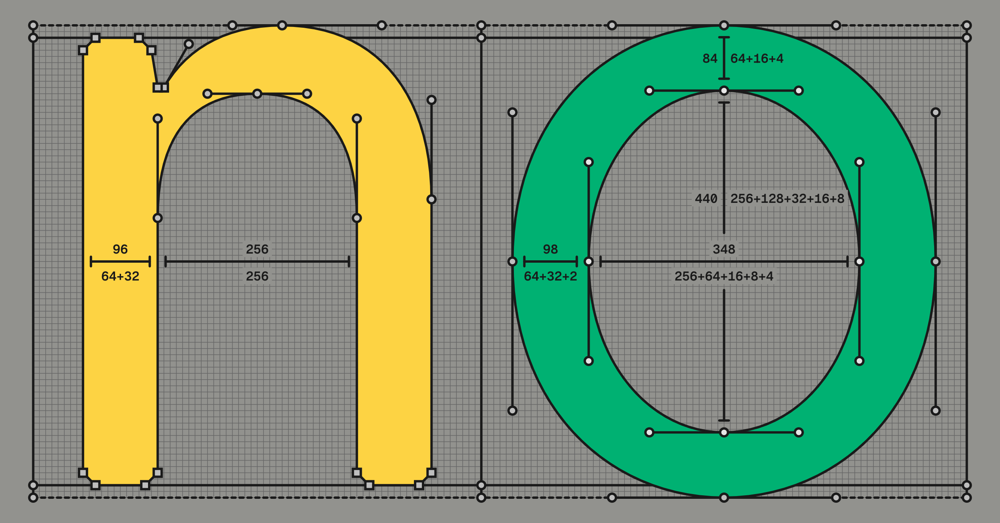
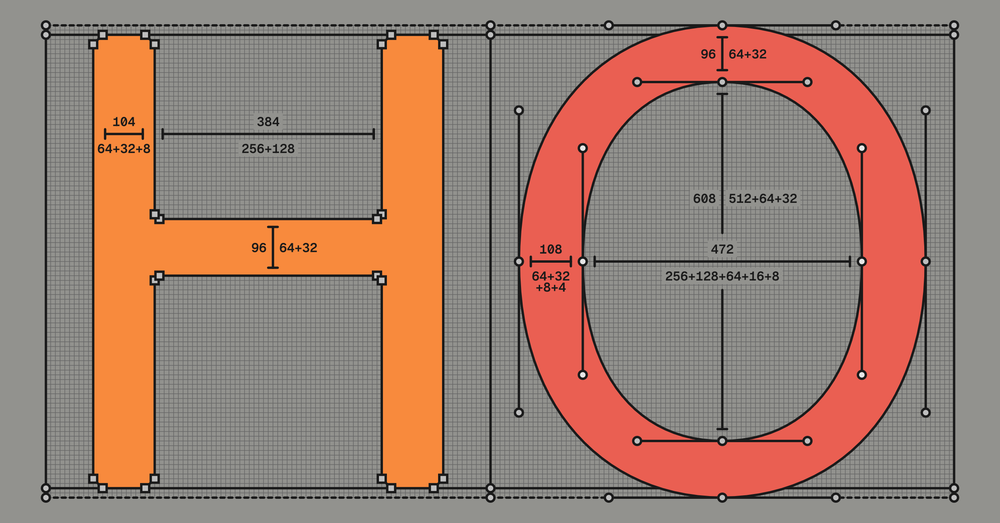
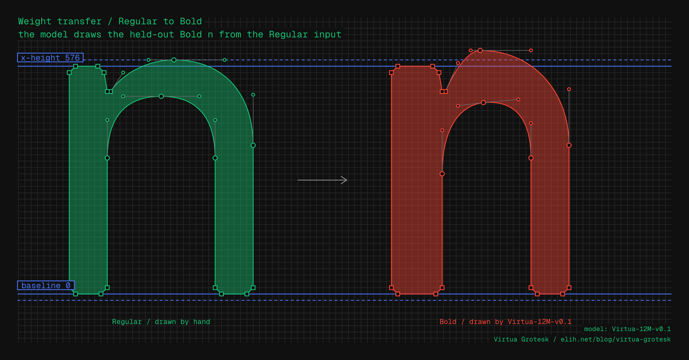
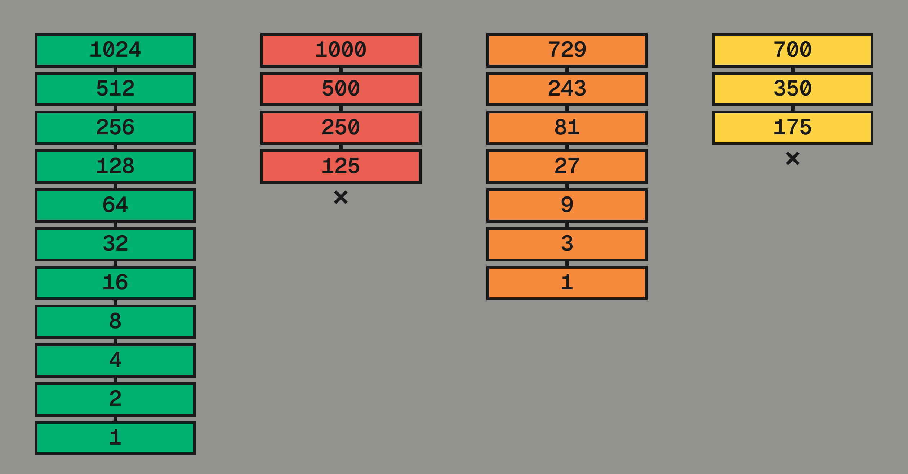
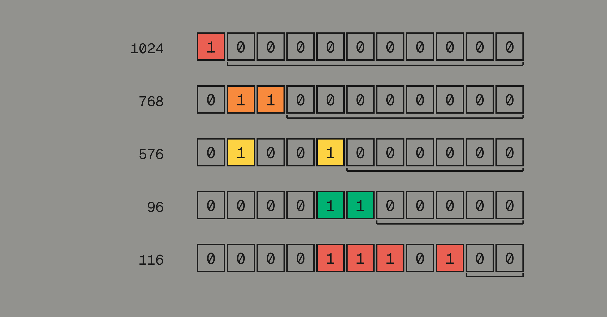

<p class="draft-notice">This is a draft until the model is on Hugging Face.</p>

Virtua Grotesk is a typeface drawn on a **dyadic self-labeling grid
system**: nested grids built on powers of two. Point placement
defaults to an 8-unit grid, with small optical corrections dropping to
a 2-unit subgrid. The grids record most
of the drawing intent automatically, so the source files are labeled training data
without extra work. This system makes the project a machine-learning and
data-engineering project as much as a design project. If you are reading this on [elih.net](/), you are
reading Virtua Grotesk.

A small language model, Virtua-12M-v0.1, is learning to draw using
this grid system. It will soon be on Hugging Face as an open-weight
release that runs locally and can be fine-tuned. The font sources and
harness are already on
[GitHub](https://github.com/eliheuer/virtua-grotesk). Virtua Grotesk
is free and open-source under the SIL Open Font License (OFL) v1.1.


### Section Index

<nav class="section-index" aria-label="Contents">
<ol>
<li><a href="#01-the-modernist-impulse"><span class="n">01</span>The Modernist Impulse</a></li>
<li><a href="#02-replica-and-the-coarse-grid"><span class="n">02</span>Replica and the Coarse Grid</a></li>
<li><a href="#03-dyadic-self-labeling-grid-systems"><span class="n">03</span>Dyadic Self-Labeling Grid Systems</a></li>
<li><a href="#04-aesthetic-discipline--machine-legibility"><span class="n">04</span>Aesthetic Discipline &amp; Machine Legibility</a></li>
<li><a href="#05-glyphs-as-sentences"><span class="n">05</span>Glyphs as Sentences</a></li>
<li><a href="#06-a-small-model-learns-to-draw"><span class="n">06</span>A Small Model Learns to Draw</a></li>
<li><a href="#07-weight-transfer-as-delta-prediction"><span class="n">07</span>Weight Transfer as Delta Prediction</a></li>
<li><a href="#08-the-designspace-is-a-data-factory"><span class="n">08</span>The Designspace Is a Data Factory</a></li>
<li><a href="#09-the-mathematics-of-2n"><span class="n">09</span>The Mathematics of 2ⁿ</a></li>
</ol>
</nav>

### 01. The Modernist Impulse

Designing the system instead of the final object is an old modernist
impulse. Karl Gerstner argued for it in his 1964 book *Designing
Programmes*, a foundational text of systematic Swiss design. In
practice, the idea ran into limits. Computers were procedural, and
strict rules made type stiff. They missed the optical corrections the
eye needs.

Neural networks might change that. A neural network is not a
procedural program; it interpolates and tolerates nuance where a rule
is brittle. It also
answers a modernist ideal that the rigid version betrayed: technology
people can live in harmony with, not technology that extinguishes human dignity.
The old impulse is worth another look.

Most fonts were never built as training data. Their coordinates land
wherever the designer put them. Their contours are as individual as
handwriting. That is fine for a rasterizer, but it is a problem for
data engineers working with font sources. Many font AI/ML projects
train on exactly this accidental data: scraped fonts and Google
Fonts, heterogeneous in every dimension that matters.

A typeface is not a collection of characters drawn in isolation. It
is many drawings that work as one system. Font datasets need the same discipline.
A collection assembled without it is not training data capable of
delivering useful models in 2026.

Modernist design was born a little more than a century ago out of
similar frustrations in a similar time of technological change. I
think the way forward is not a return to the dogma and rigidity of
modernist design (the culture of design that replaced modernism is equally if not more dogmatic and rigid, just in
different ways), but a rediscovery, with fresh eyes and new technology, of the
loftier goals of early modernism that were unachievable with the
technology of the previous century.

### 02. Replica and the Coarse Grid

The clearest precedent for Virtua Grotesk is [LL Replica](https://lineto.com/typefaces/replica)
(Norm: Dimitri Bruni and Manuel Krebs; Lineto, 2008). Norm took the
drawing grid in their font editor and made it ten times coarser.
FontLab's standard cap height is 700 units. Instead of 700 positions
across it they had 70, a step of 10 units, and every node and Bézier
control point had to land on one.

Two details make Replica more than a constraint exercise. First, the
bevels: its corners are cut exactly one grid unit wide, so the grid is
*visible* in the letterforms. Second, the cut diagonals: A, K, and R
have no pointed apexes, so the letters can be set tight. The constraint
produced the aesthetic, and the aesthetic advertises the constraint.

### 03. Dyadic Self-Labeling Grid Systems

Virtua Grotesk uses two related hierarchies. The grid hierarchy
classifies point positions. The measurement hierarchy labels distances
between points by popcount. Both use powers of two, but they record
different parts of the drawing.

The coordinate space of a font is called the em, and its size is given
in units per em (UPM). Virtua Grotesk uses 1024 UPM, or 2¹⁰, rather
than the industry's usual 1000. This is less exotic than it sounds.
TrueType commonly uses a power-of-two em: 2048 is standard, and
[Inter](https://rsms.me/inter/) uses it.

The first hierarchy is positional. Every point must land on the
2-unit grid. The 8-unit grid is the default for structural points. A
point on the 2-unit grid but off the 8-unit grid records a fine optical
correction. Large corrections can still land on the 8-unit grid, so
grid membership records most, but not all, drawing intent.


The second hierarchy describes measurements. Every integer has a
unique binary decomposition: a sum of powers of two, each used once.
The number of powers is its Hamming weight, or popcount. Virtua
Grotesk uses popcount to label handle lengths and structural spans. A
popcount of one is a pure power, such as 64, 128, or 256. Two is a
short sum, such as 96 = 64 + 32. Three combines another increment, as
in 104 = 64 + 32 + 8. Four or more uses a longer decomposition. The
count is descriptive. A higher popcount often marks an optical
adjustment or another fine detail. The value provides this label
without additional annotation.

Popcount adds information that grid membership cannot. Both 96 and
112 are multiples of 8, but their decompositions record different
design decisions. A 64-unit stem is too light and a 128-unit stem too
heavy, so the Regular stem is 96 = 64 + 32. Where 96 is too light, the
font uses 112 = 64 + 32 + 16. The additional term records a finer
adjustment. Both measurements are valid.



[Runebender](https://runebender.org) makes this hierarchy visible while
I draw. It labels each measurement with its power-of-two decomposition
and colors it by popcount: green for pure powers, yellow for two-power
sums, orange for three, and red for values that use four or more. The
colors identify the count. They do not indicate errors.

<video src="/videos/popcount.mp4" poster="/videos/popcount-poster.jpg" controls playsinline preload="metadata" aria-label="Screen recording of the Runebender font editor showing a glyph on a grid. Every measurement is labeled with its power-of-two decomposition and colored on a gradient by popcount: green for pure powers such as 64 = 2⁶, 128 = 2⁷, and 256 = 2⁸; yellow for two-power sums like 96 = 64 + 32 and 80 = 64 + 16; orange for three-power sums like 104 = 64 + 32 + 8; red for values with four or more terms, such as 23 = 16 + 4 + 2 + 1. The colors label measurement complexity rather than errors. A MEASURE panel on the left toggles colorize outline, handle lengths, segment lengths, stems and counters, and side bearings."></video>

The coordinate rules and measurement labels live in
[`DESIGN.md`](https://github.com/eliheuer/virtua-grotesk/blob/main/DESIGN.md)
and are implemented programmatically. From the repo root, `make grid-qa`
runs [a Python
script](https://github.com/eliheuer/virtua-grotesk/blob/main/scripts/grid_qa.py)
that reports coordinate-grid compliance and labels measurements by
popcount. The AI agent harness uses that report to correct grid
violations, render the result, and run the script again.

The coordinate rules also apply to spacing. Sidebearings and kerning
default to the 8-unit grid. Of Regular's 84 kerning pairs, all but two
sit on it. The two exceptions use the 2-unit grid for finer optical
adjustment. The coarse default also gives the spacing a consistent
rhythm: a small set of recurring intervals, tightened only where
needed.



Together, the two hierarchies turn drawing conventions into data. Grid
level exposes fine corrections. Popcount exposes where measurements
become more specific. The defaults remain easy for tools to generate,
while human adjustments remain visible for QA and later model
training.

### 04. Aesthetic Discipline & Machine Legibility

Andrej Karpathy describes a large language model as [a zip file of the
internet](https://www.youtube.com/watch?v=zjkBMFhNj_g). Billions of
parameters compress terabytes of text into a smaller, lossy
representation. He
[argues](https://x.com/karpathy/status/1814038096218083497) that models
can become "very very small" if they no longer need to memorize the
internet. He calls this smaller model a [cognitive
core](https://x.com/karpathy/status/1938626382248149433): a model that
keeps "the algorithms for thought" and retrieves the rest.

Virtua-12M-v0.1 has a narrow task. It does not learn the entire Google
Fonts catalog. It learns the rules and grid of one design system. This
limited scope supports a model with 12.54 million parameters and a
48 MB checkpoint.

Type designers already use compact representations. A variable font
stores a base outline and interpolation deltas, then reconstructs each
weight on demand. A neural network instead learns an internal
representation of the design and can generate shapes that were not
drawn explicitly. The grid helps in two ways:

1. **Consistency provides signal.** The same stroke logic, chamfer
   sizes, and start-point conventions recur across the glyph set. The
   model can spend its capacity learning one design instead of
   reconciling different drawing habits.
2. **Constraints make outputs measurable.** Every coordinate must be
   even, and the 8-unit grid establishes a structural default. Scripts
   can check these properties. The checks do not determine overall
   quality, but they provide objective feedback during evaluation.

The token encoding does not explicitly label the 8-unit grid. Every
coordinate token represents a position on the 2-unit grid. All
positions are available to the model, but the training data does not
use them equally. If both coordinates were selected at random, a point
would have a 6 percent chance of landing on the 8-unit grid. Points in
the human-drawn sources land there 85 percent of the time. The grid is
therefore implicit in the distribution of coordinates. When drawing
held-out glyphs whose Bold outlines were excluded from training,
Virtua-12M-v0.1 places 68 percent of its points on the 8-unit grid.

The model also learns where corrections occur. When a source outline
leaves the 8-unit grid, the model often leaves it at the corresponding
point. The training data contains no explicit tier labels, and no
auxiliary loss rewards them. They emerge from the coordinate
statistics.

One caveat about where the win comes from. The model reads each
coordinate as a single token and never sees its binary digits. Base two
is therefore invisible at the token level. The model learns recurring
values, nested grid tiers, and rare corrections against a regular
background. A base-ten grid with the same regularity could provide
similar statistical structure.

The power-of-two em provides a separate benefit. A 1000 UPM font could
still use 96- and 192-unit stems and interpolate them cleanly because
the arithmetic operates on the stem width, not the em. A 1024-unit em
helps when a coordinate is divided by the em, as in rasterization.
Section 09 covers this arithmetic.

### 05. Glyphs as Sentences

A glyph is already a sentence: an ordered list of drawing commands.
Transformers predict sequences. I give the model each glyph in that
form and train it to predict the next token.

Virtua Grotesk uses the [UFO](https://unifiedfontobject.org/) source
format: one XML file per glyph, with each outline stored as an ordered
set of points. A transformer reads a flat token sequence rather than an
XML tree. A small codec converts each outline into a sequence of drawing
commands and coordinates.

Virtua-12M-v0.1 uses a small vocabulary. Conditioning tokens set the
glyph name, Unicode codepoint, and weight. Four commands draw the
outline: `MOVE`, `LINE`, `CURVE`, and `CLOSE`. Each legal grid position
has its own token, so each coordinate occupies one token. Here is the
Regular numeral **2**, exactly as the codec emits it:

```
BOS N_two U_0032 W400 ADV 592
MOVE 48 0
LINE 528 0
LINE 544 16
LINE 544 72
LINE 528 88
LINE 160 88
LINE 152 96
CURVE 152 136 232 216 356 276
CURVE 492 342 560 422 560 552
CURVE 560 676 494 784 304 784
CURVE 150 784 48 680 48 524
LINE 64 508
LINE 136 508
LINE 152 524
CURVE 152 620 210 692 304 692
CURVE 402 692 464 632 464 552
CURVE 464 460 394 390 280 336
CURVE 116 258 32 146 32 32
LINE 32 16
CLOSE
EOS
```

Read the sequence from top to bottom. `BOS` and `EOS` mark its
boundaries. `N_two` names the glyph, `U_0032` gives its codepoint,
`W400` gives its weight, and `ADV 592` gives its advance width. The
remaining tokens describe the outline. `MOVE` begins a contour, `LINE`
adds a line segment, `CURVE` adds a cubic Bézier segment, and `CLOSE`
ends the contour. Each numeric value occupies one token.

The codec is reversible. It converts UFO glyphs into sequences for
training and converts generated sequences back into editable UFO
glyphs. The round trip is lossless when every coordinate lies on the
token grid. Virtua Grotesk already meets that condition, so the codec
does not need to snap its points. The exactness comes from using the
same grid in the sources and the codec, not from the grid's coarseness.
A 1-unit grid would round-trip just as cleanly.

The model trains directly on source outlines. It needs no
rasterization, image encoder, or diffusion process. Each glyph uses
about 90 tokens. Quantizing an existing font after the fact can discard
coordinate precision. Designing on the grid makes each coordinate part
of the source.

Representing vector drawings as sequences or code is not new. Prior
systems include [SVG-VAE](https://arxiv.org/abs/1904.02632),
[DeepSVG](https://arxiv.org/abs/2007.11301),
[DeepVecFont](https://arxiv.org/abs/2110.06688),
[IconShop](https://arxiv.org/abs/2304.14400), and
[StarVector](https://arxiv.org/abs/2312.11556). Their architectures
range from sequential generators and hierarchical networks to
raster-vector models and autoregressive transformers.

The difference here is the source data. Virtua Grotesk was designed on
the same grid used by the tokenizer. Existing datasets often normalize
or quantize fonts drawn under different conventions. Preprocessing can
remove information, while mixed sources add variation unrelated to the
target design. This project starts with one internally consistent
typeface and asks how small the model can be.

[Simon Cozens](https://simoncozens.github.io/state-of-ai-font-generation/)
notes that "vectorization of glyph images has been historically very
bad." His own experiment with Google Fonts "completely failed." These
failures suggest that different approaches are needed. In the short
term, I think the best results will come from high-quality font datasets
designed from the ground up as training data, like what i am trying to do with this project.

### 06. A Small Model Learns to Draw

Virtua-12M-v0.1 is a 12M-parameter decoder-only transformer trained from
scratch on one machine. It does not require cloud compute or a GPU cluster.
The model has two implementations: an
[MLX](https://github.com/ml-explore/mlx) build for an M4 Mac and a PyTorch
build for a Linux PC with a gaming GPU.

The model card:

| Virtua-12M-v0.1 |   |
| --- | --- |
| architecture | decoder-only transformer: 6 layers, 384 dims, 8 heads |
| parameters | 12.54M |
| context | 1,368 tokens |
| vocabulary | 1,784 tokens: commands, names, coordinates, deltas |
| pretraining | 28,770 Regular-Bold pairs traced from Google Fonts |
| fine-tuning | 50 human-graded Virtua Grotesk Bold pairs; 463 glyphs in the corpus |
| optimizer | AdamW, lr 3e-4, 200-step warmup, cosine decay, batch 24, dropout 0.1 |
| compute | one Apple M4 Pro laptop (MLX); the full training session in 3h20m |
| checkpoint | 50 MB fp32 safetensors |

Decoder-only transformers use the same architecture as GPT. Each token
becomes a vector. The model's six layers use *attention* to combine each
position with relevant earlier tokens. A final layer converts the result
into probabilities for the next token. During training, the model adjusts
its weights toward the correct next token across the glyph corpus. The
resulting model captures the sequence patterns used to encode outlines.

The implementation follows Karpathy's from-scratch projects:
[char-rnn](https://karpathy.github.io/2015/05/21/rnn-effectiveness/),
[makemore](https://github.com/karpathy/makemore), and
[microgpt](https://karpathy.github.io/2026/02/12/microgpt/). Each project
trains a small model from scratch on one narrow corpus with a limited
vocabulary. Microgpt uses 27 tokens: the lowercase alphabet and a newline.
Virtua-12M-v0.1 applies the same approach to glyph outlines by predicting
one drawing command at a time. Each training stage takes 45 minutes to
two hours on an M4 Pro or a gaming GPU.

The model runs inside [Runebender](https://runebender.org), a free and
open source font editor I work on. Below, I sketch a lowercase e with a
brush. Virtua-12M-v0.1 redraws it in the font's conventions using the
green-graded glyphs in the sources as reference:

<video src="/videos/e-draw.mp4" poster="/videos/e-draw-poster.jpg" controls playsinline preload="metadata" aria-label="Screen recording of the Runebender editor: a lowercase e is sketched with a brush and redrawn by Virtua-12M in the font's conventions using the Draft with Virtua tool."></video>

### 07. Weight Transfer as Delta Prediction

For most variable fonts every glyph drawn once must be drawn again
heavier, with the same structure. Given the Regular, the model draws the
Bold. The goal is a workflow where a designer draws a few control glyphs
by hand and the model bootstraps the rest, corrected on the grid system.

The approach is delta prediction: rather than generate a whole Bold glyph
at once, the model predicts, one point at a time, the offset from each
Regular point to its Bold, the delta. Each delta is a small, bounded move
rather than an open-ended shape, and that is what lets a small model do
the job.

It is starting to work, and will get there in a few more training runs.
To check it, ten glyphs were held out, their Bolds never shown to the
model. The bar is a no-model baseline: take each Regular and shift it by
the average Regular-to-Bold change. On every metric in the table below,
Virtua-12M-v0.1 beats that baseline. (MAE is average coordinate error,
Chamfer scores the outline shape, IoU the overlap in filled ink.)

| predicting a held-out Bold | MAE ↓ | Chamfer ↓ | IoU ↑ |
| --- | --- | --- | --- |
| no-model baseline | 31.3 | 37.4 | 0.564 |
| Virtua-12M-v0.1 | **24.0 ± 1.6** | **22.4 ± 1.3** | **0.745 ± 0.016** |



The output is a draft, not a finished Bold; a person still corrects it on
the 2-unit grid. This is a small test, and the numbers will change as the
work grows.

### 08. The Designspace Is a Data Factory

Two masters hold more data than they seem to: every interpolation between
them is a real instance of the family, as Multiple Master fonts have
done since 1991. The space between the masters is the synthetic data factory: pick a
weight, interpolate, and snap the result to the grid.

An interpolation is not a master, but it is still clean, usable data. The
sheet below shows the real "n" at Regular, the 1/2 interpolation, and
Bold, points colored by grid level (green on the 8-unit structure grid,
red on the 2-unit correction grid). The middle glyph was never drawn by
hand, yet every point lands on the grid and its stem steps evenly through
96, 144, 192. It reads as a real glyph, not a degraded in-between, which
is why the model can train on it.


The reason is arithmetic: the stems differ by 96, which keeps splitting
evenly as the weight halves, so every interpolated stem lands back on the
grid. The glyph between the masters sits on the grid as cleanly as the
masters do. Coordinates such as 90 and 180 do not close this way (below).


Interpolation gives volume, not variety: every batch is one design.
Variety takes more families, which [img2bez](/blog/img2bez) provides: a
Rust autotracer that puts any raster (a rendered font, a scan, an AI-drawn
glyph) onto the dyadic grid, with
[img2ufo](https://github.com/eliheuer/img2ufo) assembling a UFO. This is
how v0.1's pretraining data was made: OFL families traced onto the grid.

The OFL families from Google Fonts are a grab-bag of unrelated designs.
The model needs one coherent design system, so the dataset is now original
work on the dyadic self-labeling grid system only: Virtua Grotesk across
weights first, then expanding to a Plantin-like oldstyle and other designs
using the same grid system. The goal is a general model that knows one
method for converting shapes to outlines and nothing else, not confined to
the neo-grotesk style, even to the point where it can be used for logos,
icons, and other font-adjacent kinds of vector graphics.

This is the first step in what I see as a decade-long transformation of digital typography.
The aim is fonts that are models, not tables of
outlines, freed from the per-glyph boxes digital type inherited from
metal. An outline font is a compression scheme for the Latin letter, one
fixed shape reused everywhere, and it strains on other scripts: Arabic in
its manuscript forms is one continuous, context-dependent stroke, and the
current workaround uses thousands of glyphs and substitution rules to fake
what a hand does in one motion. A post-OpenType generative font model draws each glyph in
context. I think the first ones will be built on grid systems like this, and I hope to play a part in building that technology.

<h3 id="09-the-mathematics-of-2n">09. The Mathematics of 2ⁿ</h3>

<div class="pl-6 my-8 [&>*]:text-muted-foreground">
<p>“TeX represents all dimensions internally as an integer multiple of the
tiny units called sp. Since the wavelength of visible light is approximately
100 sp, rounding errors of a few sp make no difference to the eye. However,
TeX does all of its arithmetic very carefully so that identical results will
be obtained on different computers.”</p>

<p>—Donald Knuth, [The TeXbook](https://www-cs-faculty.stanford.edu/~knuth/abcde.html), 1984.
The sp is the scaled point, TeX's atomic unit of distance:
65,536 sp = 2¹⁶ sp = 1 printer's point.</p>
</div>

<div class="pl-6 my-8 [&>*]:text-muted-foreground">
<p>“every good outcome I’ve seen has been from finding a secret and doubling,
tripling down on it in a way that compounds over time. not necessary that it
even remains a secret because nobody ever believes you anyways”</p>

<p>—roon ([@tszzl](https://x.com/tszzl)), 2026.</p>
</div>

Readers of an early draft of this post pushed back on the powers-of-two
focus. The narrow objection is correct: any grid shrinks the vocabulary,
and a decimal grid tokenizes as cleanly as a binary one. I find no
evidence that a neural network prefers one base to the other. The field usually quantizes coordinates to
[256 positions](https://arxiv.org/abs/2002.10880), and that is because
256 values fit in one byte, not because networks work better in
binary.

The strongest case for the industry standard 1000 is not arbitrary.
It is PostScript's coordinate system, and four decades of font
software expect it as the default. It is also legible to the designer: on a 1000 em every coordinate
reads as a percentage of the body, so a cap height of 700 is seventy
percent, while on 1024 it is 0.684.

If the model were the whole
pipeline, the objection would make sense: this project is basically
trading the font industry's default conventions for the ML field's.

But the model is not the whole pipeline, and the rest of it imposes
two constraints:

1. **Normalize exactly.** Dividing a coordinate by the em must give a
   number the machine holds exactly, and the design's proportions (cap
   height, x-height) must land on whole coordinates. A fraction is
   exact only when its denominator is a power of two; everything else
   rounds.
2. **Close under the operations.** Halving, subdividing, and
   interpolating at the weights the format can store must land back on
   the grid. Exactness lasts only until an operation produces a point
   off the grid, and the pipeline interpolates and subdivides
   constantly.

**1. Normalize exactly.** Virtua Grotesk's 96-unit stem over its 1024
em is 0.09375, exact. Over 1000 it is 0.096, which has no finite
binary form, so the machine holds 0.09600000000000000200.

The clearest failure is the vertical metrics. Cap height and x-height
are defined as fractions of the em. On 1024 they come out whole: 3/4
of the em is 768, and 9/16 is 576. On 1000, 9/16 is 562.5, and font
coordinates must be
[whole numbers](https://learn.microsoft.com/en-us/typography/opentype/spec/glyf),
so that x-height cannot exist; the designer settles for 562. The
difference is that 1024 halves all the way down, ten times, while 1000
stops after three: 500, 250, 125.



None of this is new. Knuth built TeX and METAFONT on binary fractions,
and the OpenType spec notes that outline scaling ["will be
fastest"](https://learn.microsoft.com/en-us/typography/opentype/spec/ttch01)
on a power-of-two em. Base two buys no thirds, but neither does ten.

**2. Close under the operations.** The numbers reachable from the
integers by taking midpoints are exactly the dyadic rationals, and the
midpoint is the pipeline's own operation: interpolating halfway
between masters is a midpoint, and bézier subdivision, which every
rasterizer performs, is midpoints of midpoints. And a variable font stores an
in-between weight as a
[count of 16,384ths](https://learn.microsoft.com/en-us/typography/opentype/spec/otff#data-types):
16,384 is 2¹⁴, so every weight the format can store is a binary
fraction. A weight exactly one-third of the way between masters falls
between two marks; the format cannot write it.


A midpoint of two multiples of 2ᵏ is a multiple of 2ᵏ⁻¹: each round
drops one rung, and a ten-rung ladder absorbs the whole operation. A
decimal grid fails at the second halving: 10, 5, 2.5.

Both constraints force the same grid: the dyadic ladder, 1024, 512,
256… down to 2, ten nested levels.

Write a coordinate in binary and its label is already there. 576 is
1001000000; the six zeros at the end mean it divides by 64. 116 is
1110100; the two zeros mean it divides by 4 but not 8. The label costs nothing to store because it
is part of the number. The first figure below brackets these trailing
zeros for the design's key values. The second shows the labels on the
lowercase a, structural points green, corrections red.




The grid levels are not just labels for the model: the rasterizer's
own arithmetic respects the same tiers. A rasterizer maps a coordinate
to pixels by multiplying it by the pixel size and dividing by the em, on
a grid of [1/64 of a
pixel](https://freetype.org/freetype2/docs/glyphs/glyphs-2.html). On a
1024 em the device value of a coordinate *c* at pixel size *p*, in
sixty-fourths, is

$$
\frac{64 \, c \, p}{1024} = \frac{c \, p}{16}
\;\in\; \mathbb{Z}
\quad \text{whenever} \quad
\nu_2(c) + \nu_2(p) \geq 4,
$$

an integer, no rounding, whenever the trailing zeros of the coordinate
and the pixel size sum to four or more. The vertical metrics on the
64-grid never round at any pixel size. The 8-grid structure is exact
at every even size. The 2-grid corrections dissolve into antialiasing
first. At 16 pixels, the web's default, every coordinate is exact. On
a 1000 em the same value is an integer only when 125 divides the product.

$$
\frac{64 \, c \, p}{1000} = \frac{8 \, c \, p}{125},
$$

The figure below runs this arithmetic for five values from the design
at pixel sizes 12 through 18: the x-height 576, the a's 116
correction, the 96 stem, the o's left edge at 40, and the 64 metric
step. Green cells are exact; a red × rounds. On the 1000 em every
value rounds at every size (562 stands in for the x-height, 9/16 of
1000).


One more alignment is particular to this pipeline. Render a 1024-em
glyph at 1024 pixels and one font unit is one pixel; the specimen at
the top of this post is drawn that way. The image models feeding
img2bez downsample by eight, so the 8-unit structure grid reappears as
their 128 × 128 latent lattice. The design grid, the pixel grid, and
the model's grid are one lattice.

Now the rivals, each against the constraints.

**Decimal, em 1000.** Fails normalization (0.096, held forever wrong)
and closure (10, 5, and stop).

**Balanced ternary, em 729 = 3⁶.** The strongest rival, Knuth's
favorite, and on ternary hardware it would win. On the hardware that
exists, 1/3 has no finite binary form, and every constraint after the
first collapses.

**The rest.** Ems like 720 and 2520, multiples of 60, divide cleanly by
three and five, but a binary computer cannot hold 1/720 exactly. The golden section is built
on φ, which is irrational: no ratio of whole numbers equals it, so
golden proportions can only ever be approximated. Letting a neural
network learn its own quantization (a VQ-VAE) gives a codebook no
person can draw on, no rule can check, and no retraining leaves
unchanged; the field is
[moving back](https://arxiv.org/abs/2309.15505) to small fixed grids
anyway. And dropping the grid entirely changes nothing: a 64-bit float
is itself a power-of-two grid, just one nobody designed.

Given the two constraints, the grid system is forced: the dyadic
ladder of a power-of-two em, unique up to the exponent. Practice fixes
the exponent: four decades of digital type say roughly a thousand
units per em is enough, and 1024 is the power of two that lands there.
(2048 is also a good choice and I plan to experement with it as I continue 
to train small language models on font sources.)

For the model, this pays out twice. The synthetic data is noise-free:
section 08's factory is a + t * (b − a), and with masters on the
2-grid and binary-fraction weights every machine computes the
identical corpus; on a decimal em, float error enters every
coordinate, differently per machine, and the model learns the design
plus the noise. 

When the engineering is settled, the tiebreaker is aesthetics.
Powers of two would deserve the job on beauty alone.
