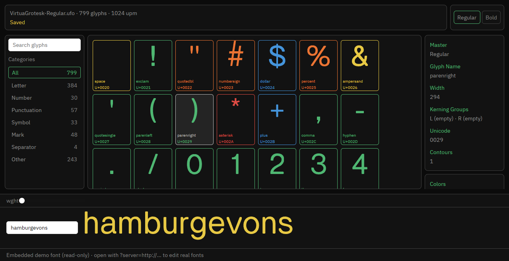

import Callout from '../../../components/Callout.astro'

<Callout variant="warning" title="Work in progress">
This post is a live build log for a project under active development.
Parts of it are drafted with AI assistance and may contain unedited AI
slop. Details can change as the work continues.
</Callout>

I maintain a font editor called Runebender. The version I use for
real work is [runebender-web](https://github.com/eliheuer/runebender-web),
a Rust core compiled to WebAssembly with a Vue 3 shell. Two native
ports exist:
[runebender-xilem](https://github.com/eliheuer/runebender-xilem),
built on [Xilem](https://xilem.dev/), and
[runebender-gpui](https://github.com/eliheuer/runebender-gpui),
built on [GPUI](https://gpui.rs/), the framework extracted from
[Zed](https://zed.dev/).

Both ports are behind runebender-web. The plan is to bring both up
to feature parity with it and log what each framework makes easy
and hard along the way. This post is that log. It will grow until
the comparison feels done.



The GPUI editor above is running in Chrome over WebGPU, on the
same theme file and mark colors as runebender-web. How it got
there is most of the log below.

The two frameworks take opposite positions on most design
questions. Xilem is declarative and diff-based: the app rebuilds a
view tree from single-owner state on every update, and the
framework diffs it against a retained widget tree (Masonry).
Callbacks get a direct `&mut` to app state. GPUI is closer to an
immediate-mode layout DSL over retained entities: views are
entities with interior state, layout is Tailwind-style method
chains on `div()`, and state changes call `cx.notify()` to request
a re-render. Xilem renders with Vello (GPU compute). GPUI renders
with its own quad and path pipeline over Metal, with lyon for path
tessellation.

## Where each port stands, 2026-08-17

runebender-xilem has most of the editor: three path types
(cubic, quadratic, hyperbezier), the full tool set, designspace
support, Arabic shaping, a multi-glyph text buffer, kerning, and
undo. It was dormant from spring until August while runebender-web
moved ahead. The Masonry upgrade (to the kurbo 0.13 stack) landed
this month, and two phases of a six-phase UI parity plan are done.
It lacks anchors, components UI, layers, feature-file shaping,
Glyphs import, and the panels that runebender-web grew this year.

runebender-gpui was created today. It opens a window, loads a UFO
with [norad](https://crates.io/crates/norad), and renders a glyph
grid with click selection and a status bar. Nothing else.

That asymmetry is the point of the log format. The Xilem entries
will mostly be about upgrading and porting into a mature codebase.
The GPUI entries will mostly be about building from zero. By the
end both should be at parity with runebender-web, and the notes
will show what each path cost.

## Log

### 2026-08-17: GPUI from zero to a glyph grid

GPUI publishes to crates.io as `gpui`. `cargo add gpui` works.
This is recent: for years the only way to use GPUI was a git
dependency on the Zed monorepo. The crate is at 0.2.2.

First friction: the build failed on my machine with six errors in
`pathfinder_simd`, a transitive dependency. My default toolchain
is nightly, and `pathfinder_simd` detects nightly and turns on
unstable SIMD intrinsics that current nightlies renamed. On stable
it uses a portable path and builds fine. One `rust-toolchain.toml`
pinning stable fixed it. Xilem has no equivalent problem; it
builds on stable with no toolchain opinions.

Build times, measured today on my MacBook, debug profile, no
sccache. Cold (`cargo clean` first): runebender-gpui 31 seconds,
run twice with the same result; runebender-xilem, a much larger
application, also 31 seconds. Incremental after touching
`main.rs`: about 1 second for the gpui app, 4 seconds for the
xilem app. The lockfiles are the same order of size: 718 crates
for the gpui app, 612 for the xilem app. The frameworks cost
about the same to build; the difference in the incremental
numbers is the application on top (the gpui app is 500 lines
right now).

The hello-world to glyph-grid distance was short. The layout DSL
is Tailwind vocabulary as method chains:

```rust
div()
    .flex()
    .flex_col()
    .size_full()
    .bg(theme::window_bg())
    .child(self.header())
    .child(grid)
```

If you have written Tailwind, you already know this API. `.p_4()`,
`.gap_2()`, `.flex_wrap()`, `.overflow_y_scroll()` all mean what
you expect. For a font editor the interesting part is custom
painting, and GPUI's escape hatch is the `canvas()` element: two
closures, prepaint and paint, with direct access to the window's
paint API. Glyph outlines go through `PathBuilder` (lyon
underneath): `move_to`, `line_to`, `curve_to`, `cubic_bezier_to`,
then `window.paint_path(path, color)`. Mapping kurbo `PathEl`s to
those five calls is mechanical.

Small annoyances so far: gpui's `rgb()` is not `const`, so a theme
module is functions instead of constants. `curve_to` takes the end
point before the control point, the reverse of kurbo's argument
order, which is easy to get wrong silently. And a `canvas` closure
captures everything by move, so per-cell paint data (outline,
advance, metrics) gets cloned into an `Arc` per cell.

State handling: a view is a struct owning its state, render
borrows it mutably, and event handlers go through
`cx.listener(|this, event, window, cx| ...)` which hands back
`&mut Self`. Mutation plus `cx.notify()` triggers re-render. It is
closer to classic object-oriented UI than Xilem's rebuild-the-tree
model, and for this first milestone it was frictionless, but the
grid is one entity. The comparison gets interesting when the
editor canvas, panels, and tools need to share font state.

Performance note to verify properly later: the grid paints all
799 glyph cells with no virtualization and scrolling feels smooth
in a debug build. GPUI has `uniform_list` for virtualized rows if
this stops holding.

Second milestone, same day: a view-only editor. Double-click a
cell to open the glyph with metrics lines, a stroked outline over
a dim fill, and control points; Esc returns to the grid. Two
framework notes from it. Keyboard input requires a `FocusHandle`:
an element only receives key events if it tracks a focused
handle, so shortcuts mean managing focus explicitly from the
start. And view switching is just an enum match inside `render`,
the same shape as Xilem's, since both frameworks rebuild the
element tree from state on every update. The difference is what
the tree is diffed against: Masonry's retained widgets in Xilem,
GPUI's own layout tree in GPUI.

### 2026-08-17: Xilem status, and a compositing blocker

The Masonry upgrade in runebender-xilem is done: the repo now
builds against xilem git main (kurbo 0.13, parley 0.8, peniko
0.6), which unblocks sharing code with runebender-web's core. The
port surfaced roughly 300 errors in four buckets (import reorg,
the new `Length` unit type, context and view renames, and a new
`measure` requirement on 17 custom widgets).

The current blocker is a live-rendering fault. The app renders
pixel-perfect in Masonry's headless test harness: every custom
widget, the full grid tab, the full editor tab, and the whole app
root render correctly to PNG through `masonry_testing`. The same
build misrenders in a real window: toolbars, panels, and grid
cells missing. The initial suspicion was the live
masonry_winit/wgpu compositing path at the pinned rev. That
suspicion was wrong; see the next entry.

The headless harness itself is worth noting as a framework
difference: Masonry ships `masonry_testing` with a `TestHarness`
that renders any view to an image without a window. That made it
possible to verify the whole port pixel by pixel before touching
the live pipeline. I have not found an equivalent in the gpui
crate.

### 2026-08-17: screenshots find two bugs in one evening

I granted the agent Screen Recording permission, so it can now
run either editor and read a screenshot of the live window. The
first screenshot of the GPUI grid found a bug within minutes: the
window chrome, cell borders, and labels rendered, but every cell
was empty. GPUI's `canvas()` element has no intrinsic size.
Without an explicit `.size_full()` it lays out at zero by zero
and paints nothing, silently. One line fixed it, and the next
screenshots showed the full Virtua Grotesk grid and the editor
view rendering correctly.

The same loop then dismantled the Xilem blocker hypothesis.
Masonry's own `gallery` example renders perfectly live at the
pinned rev, so the compositing path is fine. Runebender-xilem's
grid tab mostly renders live too; its right-side panels overflow
off the window edge. The editor tab is the broken one: file tile
and canvas background grid only. A one-line paint probe printed
the editor canvas layout size in the live window: 10000 by 8784
logical pixels. The 10000 comes from the app itself. The preview
panel declares a `multi_glyph_view` at 10000 by 10000 and relies
on a fit-to-bounds transform. The headless harness always passes
bounded constraints, so it clamps and renders correctly. The
live measure path asks widgets for min and max content sizes,
takes the declared 10000 at face value, and the flex layout
hands out absurd lengths, pushing siblings offscreen. The fix is
an audit of the custom widgets' `measure` responses.

Two lessons for the comparison table. A headless render harness
that passes only bounded constraints can hide a whole class of
layout bugs while proving paint correctness. And screenshot
access for the agent converts "renders wrong, cannot iterate"
into a normal debugging loop in both frameworks.

### 2026-08-17: the Xilem fix, and a feedback loop

The fix took two changes. The preview widget's `measure` now
fills the offered space in fit-to-bounds mode instead of
reporting its declared size. And each tab is pinned to 100% of
the window with `sized_box(...).dims(Dimensions::new(
Dim::Ratio(1.0), Dim::Ratio(1.0)))`.

The second change closes a feedback loop that made the bug worse
than a one-frame glitch. The app reads its own layout size
through a tracker widget and uses it to decide the glyph grid's
column count. Masonry's `IndexedStack` sizes the active tab from
its fit-content measurement, so a tab whose natural width
exceeded the window was laid out oversized, the tracker reported
the oversized width (1494 in a 1280 window), and the next
rebuild made the grid wider still. It stabilized in a state
where the right panel sat outside the window on every frame.
With the tab pinned to the window the tracker reports 1280, the
column count converges, and everything fits.

One API gotcha cost a debugging round: xilem's `Style::width()`
and `Style::height()` each reset the other axis to `Auto`, so
chaining them keeps only the last call. The combined `.dims()`
setter is the only way to set both. The docs state this; I did
not read them until the probe said the width was still wrong.

Both tabs now render correctly in a live window, verified by
screenshots, and all 72 tests still pass. Total time from "the
compositor is broken" to fixed: one evening, most of it spent
proving the compositor was fine.

### 2026-08-17: one feature into each editor

With the blocker gone, parity work proper started, one feature
per editor.

Xilem got the editor left sidebar from runebender-web: a search
input and a windowed four-column mini glyph grid, so switching
glyphs no longer requires leaving the editor. Almost everything
was assembled from parts the app already had: the glyph preview
widget, the scroll-handler widget from the main grid, and the
`button` view, which accepts any child view. Two notes. The
windowing pattern (only visible rows get outlines built) matters
because Xilem rebuilds the view tree on every state change, and
building 799 outlines per keystroke would be felt. And the
`button` widget's default padding had to be stripped with
`.padding(0)` to fit four cells in a 220px tile.

GPUI got its first real editing: drag a control point to move it
(rounded to integer units), wheel pans, Cmd+wheel zooms about the
cursor, Cmd+S saves the UFO through norad. The interesting
plumbing problem was coordinates. Mouse events arrive in window
space, and the design-space transform depends on the canvas
element's bounds, which only exist during paint. The workaround
is an `Arc<Mutex<Bounds>>` the paint closure writes and the event
handlers read. Xilem's custom-widget model hands the widget its
own bounds in both paint and event contexts, so this problem does
not exist there; GPUI's div-plus-canvas model makes you carry the
bounds yourself. A unit test covers the edit-save loop: copy the
demo UFO to a temp dir, move a point, save, reload, check the
numbers.

The two editors now overlap on: glyph grid, glyph switching
without leaving the editor (sidebar in Xilem, Esc + double-click
in GPUI), and point editing (Xilem has the full tool set; GPUI
has bare point dragging).

### 2026-08-18: one geometry, three editors

The port-everything-twice problem now has a fix: `runebender-core`,
the shared crate both native editors already depend on, took its
first real geometry module. The web editor's curve mathematics
(cubic continuity classification, the curvature comb,
SuperTool-style harmonize, Tunni balance, and the popcount-aware
contour optimizer) moved there with its tests. The web editor's
`curve.rs` went from 824 lines to a 106-line adapter that converts
its path type to cubic segments. The Xilem editor consumed it the
same day: a new Curve panel applies harmonize, balance, and
optimize to the selection through the shared functions, ported
with their unit tests.

The core crate was kurbo-free until now, a rule from the era when
Xilem's Masonry pinned kurbo 0.12 while the web editor needed
0.13. Every consumer is on 0.13 now, so the rule retired.

Two web-platform notes from the same day. Zed's repository has
grown an experimental `gpui_web` crate, a wasm platform backend
with a hello-web example, so "GPUI is native-only" is now
"GPUI's web support is embryonic". Both frameworks have early
paths to the browser. And
[gpui-component](https://longbridge.github.io/gpui-component/)
(Apache-2.0, 60+ components: dock panels, inputs, virtualized
lists and tables) looks like the fastest route to a full editor
shell on the GPUI side. It requires GPUI from Zed's git rather
than crates.io, so adopting it is a dependency-base switch; that
gets a dedicated spike.

### 2026-08-18: GPUI adopts gpui-component; editing grows up

The gpui-component spike took under an hour and ended in adoption.
Switching from crates.io GPUI to the Zed git repo cost exactly two
API changes (`window.focus` gained a context argument;
`Application::new` became `gpui_platform::application()`) plus the
library's `Root`/`init`/theme bootstrap. The first component in
use is a themed search input above the glyph grid, wired through
the library's entity-and-subscription pattern. Numbers for the
table: cold build went from 31 to 40 seconds, the debug binary
from 29MB to 82MB. For a maintained 60-component shell that
seems a fair trade.

Two Zed-side discoveries from reading the new dependency tree.
`gpui_platform` exists because the platform layer was split out of
GPUI, and it exposes `application_with_web_backend(...)`: the
experimental wasm backend is a selectable option, not a fork. The
browser story for GPUI is closer than its reputation says.

On top of the new base, the editor gained its editing
infrastructure: selection is a set (click, shift-click toggle,
marquee over empty space), dragging any selected point moves the
whole selection with positions computed from gesture-start
originals so rounding never drifts, arrows nudge by 1 or 10, and
per-glyph undo/redo works as contour snapshots pushed at gesture
start. The snapshot model is crude next to runebender-web's
grouped undo, but it is correct, and it took twenty lines.

An accidental usability test: the QA launch stole focus while I
was doing real font work in the web editor, and my in-flight drag
landed in the new window, marquee-selecting 45 points. The
feature worked. The agent now checks system idle time before
opening windows.

### 2026-08-18, continued: the GPUI grind

One sitting, nine features, each committed with tests. The stated
goal shifted from "compare the frameworks" to "make the GPUI
editor usable for real work," so the day went to the daily-work
list: designspace loading with a master switcher (open glyph
follows by name across masters, Cmd+S saves every dirty master),
a pen tool (click for lines, click-drag pulls symmetric handles,
click the start point to close), point deletion with proper
segment surgery, smooth/corner toggling, the smooth-point handle
constraint (dragging one handle rotates its sibling around the
shared point), a Width/LSB/RSB metrics bar, Cmd+O through GPUI's
native path prompt, a text preview strip, anchors (drag, add,
delete), and kerning: group-fallback lookup, applied in the
preview, click a gap to select the pair, comma/period to adjust.

Two observations that belong in the comparison. First, almost none
of this was framework code. The day's work was font-domain logic
on norad types plus thin event wiring; the framework surface it
touched (mouse handlers, one more Input, paint calls) was learned
on day one. That matches the Xilem experience and suggests the
real cost in both frameworks is the first two days, not the next
twenty features. Second, curve operations arrived nearly free:
harmonize, balance, and optimize came from `runebender-core` and
needed only a norad-side adapter, the third consumer of geometry
written once.

Undo went from per-glyph contour snapshots to full glyph
snapshots (contours, anchors, advance) when metric and anchor
edits joined. The snapshot model keeps absorbing new state kinds
without new code, which is the argument for it over command-based
undo at this stage.

### 2026-08-18, later: interpolation and the second batch

`var_model` (the fontTools VariationModel port) became the fourth
module in `runebender-core`, moved verbatim with its tests; the
web editor's copy is now a one-line re-export. The GPUI editor
consumed it within the hour: designspace projects normalize their
source locations, build the model, and an axes bar with
gpui-component sliders drives a live interpolated ghost outline on
the editor canvas. Point-incompatible glyphs simply produce no
ghost, and a compatibility map (contour point-type signatures
compared across masters) puts a red dot on incompatible glyphs in
the grid.

The rest of the batch: shapes tool (rectangles and ellipses with
on-grid extremes), measure tool (dx/dy/length/angle readout),
components rendered as a distinct translucent fill with
Cmd+Shift+D decompose (recursive, affine-resolved, undoable),
contour copy/paste across glyphs and masters, and remove overlap
through linesweeper with a BezPath-to-UFO converter that restores
smooth flags on points that kept their positions.

Undo snapshots absorbed components without ceremony, the same way
they absorbed anchors and metrics. Sixteen unit tests now cover
the model layer; the union test checks the merged area of two
overlapping squares against arithmetic.

### 2026-08-18, evening: what a QA window buys

A two-minute idle gap opened and the screenshot loop ran over
everything the day's grind had produced. It caught four bugs the
sixteen unit tests could not see, all in one pass.

On the GPUI side: gpui-component's `SliderState` starts life with
max 100, and every builder setter clamps the current value, so
`.min(400)` before `.max(700)` panicked inside `f32::clamp` and
took the app down on any designspace load. And flex children
default to content min-height, so the editor sidebar's unbounded
mini grid quietly pushed the canvas, metrics bar, axes bar,
preview, and status bar below the window; `min_h(0)` clamps on the
scroll containers fixed it, the same disease the Xilem editor had
with its 10000-unit measurement, wearing different clothes.

On the Xilem side: the new curve panel's stock buttons measured
enormously wide under the overlay zstack's max-content sizing and
stretched across the whole window (an explicit width pins it), and
the comb and continuity rings never painted at all because every
editor session carries a text buffer, so the single-glyph paint
branch they hooked into never runs. They now paint in buffer mode
at the active sort's offset. One real limitation surfaced:
hyperbezier contours convert to straight chords (their curvature
lives in the spline solver), so the comb only shows on cubics.

The pattern across all four: layout and lifecycle bugs live where
unit tests don't reach, and a screenshot loop finds them in
minutes. Also verified end to end: the GPUI live-reload loop (edit
a `.glif` on disk, watch "Reloaded from disk" appear) and the full
editor at an interpolated location with metrics, axes, and kerned
preview all rendering. Xilem finished the day with its system
menu: New, Open, five recents, Save, Save As, Close.

### 2026-08-18, night: the engine drops out of the shells

The stated goal became explicit: the UIs should be swappable.
That means `runebender-core` is the editor engine and the three
frontends are adapters. One session moved most of the way there.

Everything the GPUI editor's model layer did turned out to be
UI-free, so it moved down wholesale: `glyph_ops` now holds point
moves, deletion with segment surgery, the smooth-handle
constraint, pen primitives, shape contours, recursive component
resolution, remove overlap with the BezPath-to-UFO converter,
metrics shifts, kerning with group fallback, undo snapshots, and
compatibility signatures, all on plain norad types, unit-tested
on synthetic glyphs. The GPUI app kept its exact public surface
and all sixteen integration tests while shedding five hundred
lines; every editing method is now a one-line delegation through
a single `edit_glyph` helper.

The viewport followed. Xilem and web carried the same
design-to-screen transform (web's was a port of Xilem's); it now
lives once in core, grew the fit and cursor-anchored-zoom helpers
each editor had reimplemented, and all three consume it: GPUI
replaced its private zoom/pan math, the other two re-export.

Then the payoff move: web's `.glyphs` importer (Glyphs 3 →
UFO + designspace, via glyphslib) moved into core, and both
native editors gained "open a .glyphs file" the same hour: the
converter writes the masters into a sibling directory and the
project opens from there, end-to-end tested. Porting cost per
editor: one function. That is what the shared-engine architecture
is for: the fourth, fifth, and sixth consumers of a feature are
nearly free.

Core is at fifty unit tests. The remaining duplication is the big
one: web and Xilem each still carry their own editable path model
and edit session. Unifying those is the long project that would
make the shells truly thin.

### 2026-08-18, late: the GPUI editor runs in a browser

The question was whether runebender-gpui could ever replace
runebender-web on runebender.org. The answer stopped being
speculative in one evening.

`cargo check --target wasm32-unknown-unknown` passed on a recent
nightly with zero dependency changes: gpui, gpui-component,
norad, linesweeper, glyphslib, and runebender-core all compile
for wasm, because Zed's `gpui_web` backend (WebGPU rendering,
embedded fonts, a real text system) ships in the same tree. Four
web-specific fixes later the editor was rendering in headless
Chrome: `std::time::Instant` doesn't exist on wasm (`web-time`
does), the file watcher is native-only, gpui-component's
`SliderState` needed its builder-order workaround, and on the web
the browser owns the event loop, so `run_embedded` returns a
handle that must be kept alive in a thread-local (dropping it
tears the app down, which reads as a mysteriously blank canvas).

Feeding it a font took one new core module: `font_memory`
assembles a norad `Font` from (path, bytes) pairs, no filesystem
involved, and `Project::from_designspace` now takes a
master-loader closure, so the filesystem host and the embedded
host share every line of project assembly. The demo designspace
compiles into the wasm via `include_dir`, and the browser shows
the real thing: 799 glyphs of Virtua Grotesk in the grid, both
masters in the switcher, the axis slider, the kerned preview
strip. Same codebase as the native app, boot path excepted.

What still separates this from replacing runebender-web in
production: a host data layer (fetch fonts from the workspace
server and save over HTTP; the serve protocol already exists on
the web side), bundle size (the debug wasm is 184MB against
web's 6.4MB; release measurement pending), COOP/COEP headers on
GitHub Pages (solvable with the service-worker shim), and input
polish. Real work, but a list, not a research question.

### 2026-08-18: from demo to editor, the honest version

The first browser build deserved the criticism it got: it
rendered, and I called that "running." Rendering is not a port.
An editor that cannot open your fonts or save your work is a
screenshot that compiles.

Two things fixed the discipline problem. First, real input
testing: a small Chrome DevTools Protocol driver now dispatches
actual clicks, drags, and keystrokes at the web build and
screenshots each step, which immediately found what static
screenshots never could (double-click is timing-sensitive under
dispatched events; the grid had no keyboard way to open a glyph,
Xilem had Enter, GPUI didn't, it does now).

Second, the host data layer, which is the actual port: the web
build speaks the same workspace-server protocol as
runebender-web. Open the page with `?server=http://…` and it
fetches the whole workspace (designspace, every UFO file, each
file's ETag), assembles the project through `font_memory`, and
Cmd+S writes back exactly the modified glifs with `If-Match`
guards. The round-trip test is the proof: dispatched input opened
A, marquee-selected its points, nudged twice, saved, and the
glif on disk changed by exactly two units, one file written,
nothing else touched. Release bundle: 27MB wasm, 7.4MB gzipped,
against web's 6.4MB core.

Still missing before this could genuinely replace runebender-web:
SSE live reload in the browser, conflict recovery UI on 409s,
clipboard and shortcut polish, and the long feature tail the
native grind is already walking. But the architecture claim is
now tested end to end: one engine, four hosts (native Xilem,
native GPUI, Vue+wasm, and GPUI-in-browser), and the newest host
edits real files on disk.

### 2026-08-18: one theme file, three editors

The GPUI port looked nothing like runebender-web. Same data, same
tools, different application. The fix was not a restyle in GPUI
code. It was moving the design system into the engine.

runebender-web generates its colors from one JSON file: hues and
steps in OKLCH, resolved to sRGB at build time with Björn
Ottosson's Oklab matrices and chroma-reducing gamut mapping. That
file now lives in runebender-core, with the resolver ported to
Rust. The port is pinned by tests against the web generator's
output, byte for byte: `#0b0b0b` app surface, `#4fb772` accent,
`#8a6fe1` off-curve points, thirteen values in all. A theme
change edits one JSON file and every editor follows.

With the tokens shared, the GPUI restyle was mechanical: stroked
outlines instead of filled shapes in the editor, hollow points
with colored rings (circles for smooth, squares for corners),
handle lines, the bento panel layout, the yellow save status.
Screenshots of the two apps now read as the same product.

Mark colors came through the same door. A glyph's mark is stored
twice in the UFO: `public.markColor` (the "r,g,b,a" string other
editors read) and `com.runebender.markLabel` (the palette name it
means). Core now owns both: resolving the palette from the theme
file, reading label-first with hue-snapping for unlabelled colors
from older palettes, and writing the two keys together. GPUI
gained mark-colored grid cells and a Colors panel; Xilem dropped
its private hardcoded palette (which wrote different rgba strings
than the web, a real interop bug) for the shared one. The
dispatched-input test: click a swatch in the browser build, the
cell border turns red, the file is marked dirty.

The toolbar icons followed the same path as the colors. The web
toolbar's icons are generated from a UFO of icon glyphs; the
generated outlines now sit in core as JSON, parsed with kurbo's
SVG path parser, and the GPUI toolbar paints them as tiles. Same
session: flip, rotate, and reverse-contour landed as core ops
(`transform_selection` about the selection's bounding-box center,
`reverse_contours` through kurbo's `reverse_subpaths`) with
buttons in the GPUI editor. Xilem already had its transform
panel, so both editors now cover it. Each button was verified
with dispatched clicks against the browser build before commit.

### 2026-08-18: the menu bar, where native should act native

Running the GPUI build on macOS gave an empty menu bar. This is
not a bug: GPUI does not populate the menu bar at all unless the
app declares menus with `cx.set_menus`, and Zed itself declares
its own. The web editor obviously has no native menus, and their
absence is one of the things I dislike about it, so this is a
place where the native ports should diverge from the web version
rather than copy it.

The fix was also the idiomatic-GPUI port of the app's commands.
Save, open, undo, redo, copy, paste, remove overlap, and
decompose moved out of a hand-rolled key handler into GPUI
actions with a keymap. The menus dispatch the same actions, so
menu items show their key equivalents for free, and a real bug
died in the move: with the old handler, Cmd+V while typing in
the search box also pasted contours into the selected glyph.
Actions dispatch along the focus path, so a focused text input
now wins.

Xilem has no path to this today: it runs on winit, winit has no
menu API, and Masonry does not fill the gap. The Xilem editor's
"system menu" is drawn inside the window. That is now a row in
the comparison table.

### 2026-08-18: docked panels, and a focus change

Two decisions. First, the log narrows: Xilem work pauses so the
GPUI editor can reach daily-usable faster. The Xilem entries
resume when it does. Second, another deliberate divergence from
the web version: the floating panes are gone. The new layout is
the Glyphs 4 shape, three docked panes with draggable dividers,
sidebars made of flat sections separated by hairline rules, no
floating containers.

gpui-component earns its adoption again here: `h_resizable` with
`resizable_panel` gave the divider dragging for free, including
per-panel min and max widths and state that persists across
re-renders. Tools moved from a floating overlay into the header
bar; transformations, layers (which switch masters), and mark
colors became right-sidebar sections. The dispatched-input test
dragged a divider eighty pixels left and the grid reflowed with
an extra column.

### 2026-08-18, late: what dispatched-input testing is worth

The docked layout got a follow-up feature: a Selection section in
the right sidebar with editable X and Y fields for a single
selected point, committing through the shared engine with undo.
Verifying it in the browser build turned into a long debugging
session, and the session is worth logging for what it says about
the test method.

Two separate problems fell out. First, a test-harness artifact:
after a headless Chrome page sits idle for about 25 seconds, the
first dispatched click or two vanish while the rendering loop
wakes up. Every "dead button" that reproduced only on a cold page
was this. The driver now sends sacrificial clicks after long
waits. Second, a real bug that is still open: in the wasm build,
text inputs cannot take focus by click while the editor view is
open. The same widgets focus and type correctly in the grid view
(typing in search live-filters 799 glyphs), and non-input clicks
in editor mode all work. A status-bar probe showed gpui's
focus-on-click never fires for the inputs in that mode. The cause
is not yet found; the native build needs checking before blaming
the web backend.

The method note: none of this is visible in unit tests, and none
of it was visible in screenshots either. Only dispatched input
against the real build distinguishes "renders correctly" from
"works."

### 2026-08-19: one theme file for the widgets too, and menus everywhere

Two convergence items and one divergence item. Convergence: the
gpui-component widgets (inputs, sliders, popovers) were still on
the library's default light theme, the last surfaces in the app
not resolved from the shared OKLCH file. A `ThemeConfig` generated
from the tokens at startup fixed that; every pixel now traces back
to one JSON file, web and native alike.

Divergence, continued: the menu bar grew from three entries to a
full application menu (Glyph operations, curve operations, view
and master switching), and it now works on every platform from
one definition. macOS gets the native bar via `cx.set_menus`. On
Windows and Linux GPUI only stores the menus, so apps draw their
own; gpui-component ships an `AppMenuBar` for exactly this, and
Runebender renders it in the header on any platform without a
native bar, the browser included. The browser build shows
Runebender / File / Edit / Glyph / View with per-platform key
equivalents in the dropdowns.

Still open in the wasm build only: the same focus-transfer bug
that keeps editor-mode text inputs from taking clicks also keeps
the in-window menu items from activating. Hover states work,
dropdowns open, actions never fire. Native menus are unaffected.
This needs a minimal reproduction against `gpui_web` upstream.

### 2026-08-19: the sidebar learns Glyphs tricks

The docked panels grew the interactions that make the Glyphs 4
sidebar pleasant. Section headers fold, with a disclosure triangle
painted as a four-line canvas path because the UI font turned out
to lack every triangle codepoint (the tofu boxes in the first
screenshot were a fun surprise). A Navigate section steps through
masters. Layer rows gained visibility eyes: toggling one draws
that master as a dim reference underlay in the editor, resolved
through the theme's reference role. And the header has a sidebar
toggle that collapses the left panel entirely, the grid reflowing
to full width - `ResizablePanel::visible` made that a one-liner.

Every one of these was verified with dispatched input against the
browser build before its commit: fold, unfold, eye on (Bold's
wider exclam ghosting behind Regular), master step, collapse,
reflow.

### 2026-08-19: the text engine moves into core, and GPUI plugs in

The biggest single move of the project so far. runebender-web's
text system - the sort buffer, cursor and bidi runs, kerning with
group fallback, manual kern drags, layout, hit testing, and real
OpenType shaping through a minimal font compiled on the fly from
the UFO's own features.fea - turned out to be UI-free already. It
moved into runebender-core nearly verbatim, 88 tests included, plus
new `from_font` constructors so native hosts build the font models
straight from norad instead of JSON. Core is at 151 tests.

Then GPUI plugged in, twice. The preview strip dropped its
placeholder input widget: it now renders the engine buffer
directly - click places the caret through engine hit testing,
typing inserts with kerning and shaping applied, comma and period
kern the pair at the caret straight into the font. And the editor
gained the text tool: the open glyph is the buffer's active sort,
typing composes text around it, and clicking another sort switches
the editor to that glyph with points, metrics, and panels
following. One glyph-space offset in the editor transform keeps
every existing tool working on the active glyph at its layout
position.

Two notes for the comparison. First, the port cost: the engine
moved in an afternoon because it never referenced a UI type - the
discipline of keeping web's core wasm-API-shaped paid off exactly
as hoped, and the same plug-in seam is waiting for Xilem. Second,
an irony: because the buffer takes keys from the app's own handler
rather than a focused widget, text entry works perfectly in the
wasm build where widget focus is still broken.

### 2026-08-19: the path model comes home, and two more tools

The project's longest-standing duplication is gone. Web and xilem
each carried a copy of the editable path model (cubic, quadratic,
and hyperbezier paths with entity ids for selection); the copies
had drifted by a few hundred lines of refactoring. The web copy,
being the daily driver, moved into runebender-core with its tests,
along with the slim glyph data model it converts through. Core is
at 176 tests, and the hyperbezier type being in core is what will
make the HyperPen tool portable next.

On top of it, the knife tool's slicing moved over: multi-hit
recursion along the cut line, per-type slicing that keeps
quadratics quadratic, hyperbeziers converting to explicit cubics
when actually cut, and the nested single-hit join that turns a
sliced O into two Cs. Nine tests came along, plus a fixture test
cutting the real Virtua Grotesk zero into four contours, and a
norad bridge so norad-based editors cut glyphs directly.

GPUI gained the last two missing edit modes short of HyperPen:
Knife (drag a line, crossing dots preview the cut, release slices
with undo - verified live splitting the slash), and Preview (hold
space for the filled outline with all editing chrome hidden,
release returns to the previous tool). The web editor's tool set
is now Select, Pen, HyperPen, Knife, Measure, Shapes, Sketch,
Preview, Text; GPUI has all of them except HyperPen and Sketch.

### 2026-08-19: HyperPen, and the tool set is complete

The last edit mode landed. Hyperbezier contours follow the
convention the other editors share - a contour identifier marks
them, every point is on-curve, curve means smooth and line means
corner - so the norad layer in core learned that convention once
and three things fell out of it: the glyph renderer draws hyper
contours through the spline solver instead of connecting the dots,
the knife slices them with correct solver geometry, and the new
pen primitives (start, append, close) are three small functions.
GPUI's HyperPen is a thin shell over them: click for smooth,
shift-click for corner, click the start to close, with the
solver-drawn curve updating live and hyper points in their own
color from the shared palette.

With that, GPUI has every edit mode the web editor has except
Sketch (deliberately parked): Select, Pen, HyperPen, Knife,
Measure, Shapes, Preview, and Text. The remaining parity work
inside the modes is refinement, not structure - the web Select
tool's segment hover, click-to-insert-point, and line-to-curve
conversion are the notable gaps.

### 2026-08-19: text mode, the faithful version

The first GPUI text mode was structurally wrong in ways a feature
list would not have caught, so this round started with a deep dive
into runebender-web's renderer and editor state instead of a diff
of features. The differences were the point: line height is the
sort metric box (max of UPM and ascender down to descender), not a
multiplier; a single click only places the caret; activating a sort
is a double-click and works with every tool; the active sort draws
as a plain fill while the text tool is up, and only turns back into
points and handles when you switch to select; Escape stays in text
mode; typing the active sort's own character reuses its live,
possibly just-edited advance width.

The rendering came over exactly: quiet metric boxes on every sort
with inward corner ticks sized off the sort's on-screen height,
the orange caret with its inward triangles, kern-colored marks
during a manual kern drag. Shift-dragging a sort kerns it against
its neighbor through the engine's kerning session and writes back
into the font's kerning on release. A LTR/RTL/Auto toolbar appears
with the text tool. An engine regression test now pins the layout
positions when typing around a seeded active sort - the class of
bug that made the first version overlap glyphs.

The lesson repeats from earlier entries: the web editor is the
spec, and the spec lives in its code, not in screenshots of it.

### 2026-08-19: the select and pen tools get the same treatment

Same method as the text mode: read the web tool's code end to end,
port the behaviors, not an approximation of them. Core gained a
segment_ops module - nearest-segment hit testing, insert point on
segment with exact curve subdivision, line-to-curve conversion with
thirds handles (wrap-around closing segments included), and
delete-last-pen-point, six tests.

On top of it, the select tool learned the web moves: alt-click
converts a line to a curve and leaves the new handles selected,
alt-drag pans, alt-hover highlights the nearest segment, clicking a
segment selects its points as a draggable group, and double-click
toggles a point's type or selects the whole contour before falling
through to activating a text sort. The pen learned its counterparts:
click a segment to insert a point, alt-click to convert, Backspace
to walk back the path being drawn, and a rubber band from the last
point with a close indicator on the start. Arrow nudges now use the
web's grid steps - 2 units, 8 with shift, 32 with ctrl - instead of
the 1 and 10 I had guessed.

### 2026-08-19: sidebearings, components, booleans, and a wasm landmine

Core gained the remaining glyph ops: `boolean_contours` (union
merges every contour; subtract, intersect, and exclude apply the
first contour against the rest combined, through linesweeper),
`set_contour_start`, and component hit-testing, translation, and
deletion. Core is at 187 tests.

The editor wired them up the web way. Sidebearing edges drag: the
right edge snaps its landing position to the zoom-matched grid step
and adjusts the width; the left edge snaps the applied delta, shifts
the ink, and offsets the viewport in the same motion so the outline
holds still on screen. Components click-select with a distinct fill,
drag by their transform offset, delete with Backspace, and
double-click opens the base glyph beside the sort being edited, the
same move the web calls openTextGlyphBesideActive. Four boolean
tiles joined the Transformations panel, with menu commands to match,
plus Set Start Point. Tab and shift-Tab cycle the point selection in
contour order.

Tab is where the day went sideways. Pressing it in the wasm build
killed the app with "time not implemented on this platform" - and so,
it turned out, did cmd-z, and every other bound shortcut. The chain:
gpui-component force-enables gpui's `profiler` feature, the profiler
stamps every action dispatch with `std::time::Instant::now()`, and
std's Instant has no wasm implementation. Native apps never notice
because dispatch works fine there; on the web every menu item and
keyboard shortcut is a panic. The workaround is
`cx.intercept_keystrokes`, which runs before any binding: the
interceptor handles Tab everywhere (parity wants it for point
cycling anyway) and, on wasm only, every cmd shortcut, so nothing
reaches the action dispatcher that would panic. The real fix belongs
upstream - the profiler should use `web_time`, or gpui-component
should stop enabling the feature unconditionally.

Everything above was verified with dispatched input in headless
Chrome: edge drags moving width and LSB with the ink pinned,
intersect collapsing a zero to its counter and undo restoring both
contours, a component dragged, deleted, restored, and its base
opened beside it with a double click.

### 2026-08-19: the design grid, and what neighbours look like up close

One more pass before a testing break. The zoom-dependent design
grid came over from the web renderer: an 8-unit lattice fades in
past 0.8x zoom, and past 8x a 2-unit fine grid joins underneath,
skipping every fourth line so the 8s read as one grid at every
level. It anchors to the active sort's origin, so the baseline
always lands on a gridline.

The grid marks a mode change - at that zoom you are drawing, not
reading - and the neighbours follow suit: inactive sorts thin from
a solid fill to a third strength, gain a hairline outline, and show
their points greyed out, the same read-only treatment an
interpolated instance gets. The glyph being edited keeps a ghost
fill at a tenth strength underneath its outline so counters read
as counters.

Cmd+V also routes like the web now: copied contours paste when the
outline clipboard holds something, otherwise the system clipboard's
text types itself into the buffer, line breaks included. One catch
found on the way: gpui_web's read_from_clipboard is a stub (browsers
only expose an async clipboard read), so text paste works natively
but not in the wasm build yet.

### 2026-08-19: UI cleanup begins

First feedback from real testing: the wght slider had a full-width
strip to itself between the grid and the preview. It is now an Axes
section in the sidebar - left pane under Categories in grid mode,
right pane in the editor - the way the web editor and Glyphs treat
axis controls: a pane item, not a layout row.

### 2026-08-19: the sidebar becomes the web sidebar

The glyph-grid sidebar was a search box and eight category rows.
The web editor's is a browsing tool: script groups with per-glyphset
coverage, filters, subcategories, and a sort toggle. Porting it
followed the house rule - data and matching logic into
runebender-core first, UI second.

Core gained a sidebar module: the script groups (Arabic's two
name-list filters with their positional forms, Hebrew's target
lists, each script's Unicode blocks), the 27 Google Fonts glyphsets
as JSON parsed once, the builtin filters, and the category
subfilter classifier. Tests pin the fixture font's coverage to what
the web sidebar displays: Basic Shapes 79, Basic 152, GF Arabic
Core 360/383, GF Latin Core 322/324.

The GPUI panel consumes it: Languages and Filters sections with
counts and n/m coverage, expandable category subfilters, and a
Name/Unicode sort toggle above the search. Counts are computed once
per font state and cached; the active filter keeps a hash set of
matching names so grid filtering stays a lookup. Verified in the
browser build: clicking Arabic filters the grid to the Arabic
glyphs and expands to the same four rows with the same numbers the
web shows.

One wasm-only blemish: the script icons (Arabic, Hebrew) are tofu
in the browser build because the bundled UI font has no Arabic and
there is no system-font fallback there. Native macOS falls back
fine.

### 2026-08-20: the bottom bar earns its keep

The grid's bottom bar was a static hint line. It now does what the
Glyphs bar does: add and remove glyph buttons on the left, the
selection count in the center ("1 selected, 320/799 glyphs",
tracking the active sidebar filter and search), and a cell-size
zoom slider on the right. Adding a glyph inserts an empty one into
every master, rechecks interpolation compatibility, and selects
it; removing deletes it from every master. The Name/Unicode toggle
also got honest: the font order was already unicode order, so
Unicode is the default and Name now actually sorts by name.

### 2026-08-20: the preview strip stops being a second text editor

The bottom preview strip was visible in the glyph grid and had its
own typeable buffer, seeded with "hamburgevons" at launch. Neither
matches the web editor or Glyphs: there the preview belongs to the
edit view and just shows what the text tool composed. The strip now
mounts only in editor mode and renders the edit buffer read-only,
kerning and shaping included. The separate preview buffer and its
input plumbing (click-to-caret, typing, kern-pair status) are gone,
and the grid gets the recovered height.

### 2026-08-20: a Font tab, the Glyphs way

The only way back to the glyph overview from the editor was
Escape. A tab strip now sits under the header, following Glyphs: a
Font tab that returns to the grid, and a tab for the edit session
titled with its text (codepoints as themselves, unencoded glyphs
as /name). Switching tabs keeps the session intact - the same
buffer, tool, and undo stack are there when you come back, and
Escape parks the session in the strip instead of abandoning it.

### 2026-08-20: one top bar, and the right panel settles down

Feedback round: two top bars (header and tab strip) merged into
one, with the Font and session tabs sitting between the menus and
the font title. The master switcher had two homes - top-right
buttons and a right-panel section - so the top-right one is gone,
and the section is now honestly titled Masters instead of Layers.

The grid's right panel follows runebender-web's arrangement now:
glyph info, Masters, then a live preview of the selected glyph
filling the leftover space (metric frame, stroked outline, handle
lines, colored control points), with Colors pinned at the bottom
instead of floating awkwardly in the middle.

### 2026-08-20: small cuts

Three details from testing. The Font and session tabs moved to the
right end of the top bar. The Name/Unicode sort toggle left the
sidebar for the View menu, which returns its row to the panel. And
focused inputs now draw a single accent-green border: the widget
library's default paints a translucent ring outside a tinted
border, which read as two outlines, so the ring is off and the
border carries the accent.

### 2026-08-20: accents follow their base, and glyph data opens up

Two parity items from the top of the priority list. First,
component anchor alignment: core gained a composites module porting
the web's realign logic - marks with `_top` anchors snap to the
most recent `top` in front of them, outgoing anchors accumulate so
marks stack, and the Glyphs lib key opts a component out. Every
glyph edit now realigns the edited glyph's own components and every
composite that places it, so dragging an A's outline carries the
grave in Agrave live. Anchor-locked components refuse drags (the
Glyphs contract: unlock first), with a Locked/Free toggle in the
Selection panel. Verified in the browser: unlock, drag the A, the
grave rides along; undo restores both the drag and the lock.

Second, the Glyph panel's data rows became editable: rename (which
follows through components in other glyphs, kerning group
memberships, direct kerning keys, and the open text session),
unicode assignment, and kerning groups on both sides, committing to
every master on Enter. Testing this surfaced a sharper statement of
the browser input bug: no input except the left-panel search can
take focus in the wasm build, grid mode included. The data editing
is native-only until that upstream bug is fixed.

### 2026-08-20: drawing-op muscle memory

Three more checklist items. Cmd+D duplicates the selection the web
way (contours holding selected points clone at a 20-unit offset,
clones selected; components and anchors duplicate when one is
active), and Cmd+Shift+T repeats the duplicate with the last
flip/rotate re-applied - the rotated-repeat workflow. Rotate 180
joined the menu. And shift now constrains drags: shapes come out
square or circular, knife and measure lines lock to an axis. Point
drags stay free, which is also what the web does - shift is the
selection modifier there.

### 2026-08-20: the right-click menu

The editor canvas grew the web's contour context menu as an
in-canvas overlay: lock or unlock the component under the cursor,
decompose one or all, add a component by name, set the start point,
reverse the contour, round corners, move the contour in draw order,
and add or delete anchors. Items appear conditionally the way the
web's do. One gpui lesson from it: the menu must swallow its own
mouse-downs, or the canvas underneath dismisses the menu before the
item's click event ever fires - and starts a marquee for good
measure.

Round corners came along too: line-line corners become cubic
fillets whose size and handle ratio are inferred from the glyph's
existing rounded corners, so new fillets match the drawing.

### 2026-08-20: the grind continues

Six more checklist items in one sitting. The Selection panel became
the web's coordinate panel: a 9-point reference picker with X/Y
(move the selection so the reference lands there) and W/H (scale
about it), working on points, components, and anchors. Hyperbezier
contours convert to cubics through the solver from the Glyph menu.
Anchors rename from a field in the Selection panel. And the Curves
section arrived with the Speedpunk-style curvature comb and G-level
continuity rings, both riding on the shared analyses in
runebender-core - the comb's sample strips paint as filled quads
along the same teal-to-amber ramp the web uses.

### 2026-08-20: backgrounds

The Background section from the web editor: send the outline to the
UFO background layer, show it as a quiet outline behind the
drawing, swap the two, clear it. Where the web build shuffles glif
bytes and layer contents.plist files by hand, norad just owns the
layer set - public.background is one get_or_create_layer call and
the background rides the normal font save. A Reference field ghosts
any other glyph behind the drawing for comparison.

One checklist correction along the way: font-info editing came off
the parity list, because the web editor cannot edit fontinfo either
- its setFontInfo only feeds the renderer's metrics.

### 2026-08-20: coverage that fills itself in

The language rows' n/m coverage badges grew the web's + button:
target-bearing filters (the Hebrew sets, with their name and
codepoint lists) generate their missing glyphs on click - empty,
correctly named and encoded, added to every master. Hebrew letters
went 30/33 to 33/33 in one click during verification. The search
box gained the web's scope, regex, and match-case toggles, and the
header now stamps the save time.

### 2026-08-20: multi-select, thumbnails, and File → New Font

The grid selects like the web now - cmd-click toggles, shift-click
ranges through the visible order, marks apply to the whole
selection, and the sidebar footer copies the selection as text.
Master rows show the current glyph rendered in each master. And
Cmd+N builds a new font: an Untitled UFO with GF metrics and the
Latin Core set as 324 empty encoded glyphs, assembled through norad
where the web hand-writes plists, with Save As picking where it
lands on disk.

The new-font path also surfaced two wasm crashes worth recording:
std::env::temp_dir panics on wasm, and swapping a designspace for a
single UFO left the axis sliders indexing an axis that no longer
existed. Both fixed.

### 2026-08-20: live at runebender.org/gpui

Two findings closed the day. First, the browser lag that made the
wasm build feel unusable was nothing but a missing --release flag -
every browser session so far had served debug wasm, and bezier math
at opt-level 0 is 10-50x slower. The release build feels fine.

Second, with performance solved, the GPUI editor went live at
runebender.org/gpui as an experimental preview beside the main
editor. GitHub Pages cannot send the COOP/COEP headers wasm atomics
need, so a vendored coi-serviceworker adds them client-side (the
first visit reloads once). The 30MB wasm travels as 8.7MB gzipped.
The known browser limitations still stand - inputs other than
search cannot take focus, menu items do not activate, no paste -
all upstream gpui_web issues. It is a toy for now, and that is the
point.

### 2026-08-20: the checklist runs out of easy items

Three items closed the editing side of the parity list. The
measure HUD came over almost for free: the web module that finds
handle lengths, segment lengths, and stem/counter spans was
written render-free on the shared path type, so it moved into
runebender-core verbatim. The GPUI canvas draws the rest -
popcount-tiered colors, dimension lines with outward arrowheads,
and text labels that dodge each other. GPUI shapes the labels as
real text lines inside the paint closure, which beat the plan of
absolutely-positioned overlay divs.

Image trace landed as Glyph → Trace Image: pick a file, img2bez
vectorizes it into the current glyph, undoable. Same tracer crate
and defaults as the web editor, so a trace is byte-identical.

Multiple edit tabs turned out to be beyond-web work: the web
TopBar component with its tab strip is an unmounted orphan - the
live Vue UI has exactly one session. The GPUI editor now does it
the Glyphs way: + spawns a tab, x closes, and each tab parks its
own buffer, tool, selection, viewport, and undo stack. Tabs track
their glyph by name, so they survive renames and master switches.

What remains on the list is the parked Sketch tool, font info
editing (which web cannot do either), and the browser blockers
that live upstream in gpui_web.

### 2026-08-20: switching the daily driver

With the checklist done, the question became practical: can the
GPUI editor replace the web one for real work on Virtua Grotesk?
The blocker to check was save fidelity. The web editor patches
individual .glif files over HTTP; the native editor saves the
whole UFO through norad. On a font whose UFOs came out of Glyphs,
that first whole-font save reformats every file the web editor
never touched.

Measured on a scratch copy under git: the first save is a one-time
normalization (sorted plist keys, no redundant zero advance), and
a second save changes zero files. So the sources got a deliberate
cleanup commit: strip every com.schriftgestaltung key the Glyphs
export left behind - keeping the ufo2ft propagateAnchors filter,
the component-alignment key, and runebender's own mark labels -
and rewrite everything in norad's canonical form. fontc builds of
the sources before and after are byte-identical in every table
except the head timestamp, which is as close to proof as a font
cleanup gets.

From here, git diffs after an editing session show exactly the
glyphs that changed. The editor installs with cargo install and a
one-line launcher script sits beside the web one in the font repo.

### 2026-08-30: the BezPath boundary

A question from reading the code this week: the engine does all of
its geometry in kurbo `BezPath`, font units, Y-up. Which framework
is better at putting one of those on screen?

Here the two stacks are not close. Masonry paints through Vello,
and Vello's scene API takes kurbo shapes directly. The Xilem
editor's paint code is lines like
`painter.fill(&(affine * sort.path), color)`: the same `BezPath`
the engine computed, with one affine doing the zoom and the Y
flip. Core and renderer share one geometry crate, one coordinate
convention, and `f64` end to end.

GPUI has its own path type: `f32`, pixels, Y-down, built through a
`PathBuilder` and tessellated with lyon. So the GPUI editor
carries a conversion layer, `view/paint.rs`, 372 lines, and the
editing canvas calls it at 31 sites to turn every outline into a
`gpui::Path` each frame. GPUI paths are also fills only, so
strokes are widths we expand ourselves before converting.

What does the conversion actually cost? Less than it sounds.
Outlines are cached as `Arc<BezPath>` per glyph, the mapping is
linear, and `f32` is plenty at screen scale. The build has been
fast and stable. The real cost is conceptual: one program, two
geometry vocabularies, and a seam where a reader must know which
side of it they are on.

So the honest verdict is split. For the drawing canvas of a curve
editor, Vello is the better fit, and it is not subtle: the
renderer speaks the engine's native type. For everything around
the canvas, panels, text, menus, the log above says GPUI has been
faster to build. A fair one-line framing: GPUI treats vector paths
as one more UI primitive; Vello treats them as the point.

## Running comparison

Updated as the log grows.

| | Xilem | GPUI |
| --- | --- | --- |
| Install | crates.io, but the editor tracks git main | Zed git repo (needed for gpui-component); started on crates.io `gpui 0.2.2` |
| Toolchain | stable | stable for native (current nightlies break `pathfinder_simd`); pinned nightly plus build-std for the wasm target |
| Layout API | typed view combinators (`flex`, `sized_box`, `portal`) | Tailwind-style method chains on `div()` |
| Custom painting | custom Masonry widget with Vello scene access | `canvas()` element + `PathBuilder` + `paint_path` |
| Geometry at the paint boundary | kurbo end to end: Vello fills a `BezPath` directly | own path type (`f32`, Y-down); every outline converted per frame |
| State model | single-owner `AppState`, rebuild + diff | entities with interior state, `cx.notify()` |
| Component library | none yet | gpui-component (60+ widgets, Apache-2.0) |
| Headless render testing | `masonry_testing::TestHarness`, pixel-perfect | none found; we drive the wasm build in headless Chrome over CDP instead |
| Browser target | not yet (Vello and winit support wasm; Masonry's winit shell has no web platform today) | runs today via `gpui_web` over WebGPU |
| Native macOS menu bar | no (winit has no menu API); in-window menu instead | yes, declared via `cx.set_menus` + actions |
| Docs | rustdoc + examples | rustdoc + examples; most real-world reference is the Zed source |
| Windowing | winit | its own platform layer |

## What parity means

The target is runebender-web's feature set: the seven editing
tools plus the hyperbezier pen, anchors, components, layers,
kerning, designspace interpolation with live axis sliders, Arabic
shaping, feature-file support, Glyphs import, and the panel stack
(select, curve, layers, anchors, transform). The xilem repo has a
six-phase checklist for this. The gpui editor covers most of the
tool set already; its remaining tail is the hyperbezier pen,
knife, layers, background images, and shaping.
