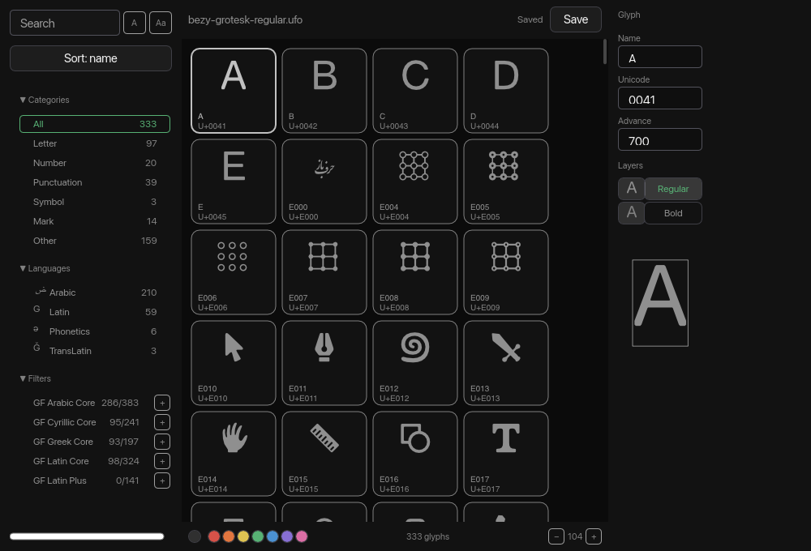
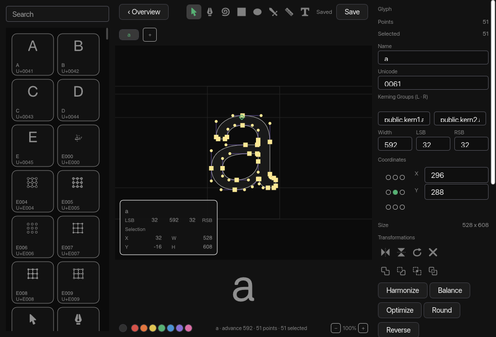

import Callout from '../../../components/Callout.astro'

<Callout variant="warning" title="Work in progress draft">
This post is an unfinished draft, published early for feedback. Parts
of the text are drafted with AI assistance and may contain unedited slop.
Comments and corrections are welcome, especially corrections.
</Callout>

This is a late summer review. It is written for the people who work on
Xilem, and the short version is that Masonry is good and the distance
between Masonry and a shipped application is longer than it looks.

I maintain a font editor called Runebender, and I have now built the
same editor twice on top of the same engine. One build is on upstream
Xilem, pinned at `ce7b04d2`. The other is on GPUI, the framework Zed
extracted. Both share `runebender-core`, so the outline math, the
shaping, the kerning, the measure analyses and the theme are identical.
What differs is the framework and nothing else, which is the only reason
any of the numbers below mean anything.

Everything here is a snapshot of late August 2026. Xilem is moving, and
some of this will be wrong by the time you read it. I would rather be
corrected than vague.

## What Xilem gets right

Masonry is the good part, and it is good in ways that are easy to miss
from outside.

The widget tree is an arena addressed by id, not a graph of pointers.
Passes walk it in a defined order. Properties are typed values attached
per widget, with a stack of selectors that includes user-defined class
strings and the pseudo-classes you would expect, and a per-widget cache
that records *which* selector inputs a resolution depended on, so a
hover change invalidates only the widgets whose appearance actually
depended on hover. That is a small cascade with precise invalidation,
already built, and I do not think it is advertised enough.

It is on every part of the stack the ecosystem converged on this year:
wgpu, parley with harfrust underneath, AccessKit. The GPUI build's
accessibility is unreleased and disabled, and its text quality differs
per operating system. For a font editor that is not a detail.

It builds on stable Rust with no toolchain opinions. The GPUI port
needed a pinned toolchain because a transitive dependency breaks on
current nightlies.

And there is a layer system: a widget can put another widget above the
tree in window coordinates, receiving pointer events first. Masonry's
own tooltip and selector menu use it.

## The pain points

In the order I would fix them.

### 1. There is no menu bar, and no way to build one

Xilem is on winit, which has no menu API of any kind, so Masonry never
inherited menus and neither did Xilem. That is one half. The other half
is that there is no action layer: key events go to the focused widget
and bubble up the ancestor chain, so there is nowhere to register a
window-level shortcut.

The application therefore invents one. Mine is a widget that wraps the
entire interface, catches whatever the focused widget did not consume,
matches a keymap, and submits an action. It is 263 lines and it is a
fake.

The native menu bar is now working in my build, through `muda`, and it
only works because of an accident: on macOS `init_for_nsapp` attaches
the menu to the *application* rather than to a window, and Xilem hands
out no window handle. Windows needs the HWND and Linux needs a GTK
window, so those platforms need an in-window menu bar instead, drawn on
the layer system. Menu clicks also do not arrive through winit's event
loop, so a `task` view has to drain muda's channel and post them back.

A font editor with no File menu and no working Cmd+S is not a font
editor anyone will use. This is the single largest difference in how the
two builds feel.

### 2. There is no headless render path, and the obvious substitute lies

Every visual decision in this project is made by rendering a PNG and
looking at it. It is also the only way an agent can see what it built,
which matters to me because most of this code is written by agents under
review.

Xilem offers nothing here, so the application builds its own: create a
`ViewCtx`, build the root view, hand the widget to something that can
rasterize, run one rebuild so views that fill their scene during rebuild
are drawn, then render with Vello CPU.

The obvious way to do that is `masonry_testing::TestHarness`, and it is
subtly wrong. The harness creates its `RenderRoot` with
`use_system_fonts: false` and a fixed test font, because a snapshot test
wants to be deterministic. The real window sets it to `true`.

So the screenshots render different text than the running application,
silently. I found this by adding script icons to a sidebar. The Arabic
and Hebrew ones came out as nothing at all, and I was one commit away
from writing up a font-fallback bug in Xilem that does not exist. The
tool I was using to look for bugs was the bug.

The fix in my build is to drive a `RenderRoot` directly with the winit
runner's options. Everything needed is public, so this is not a
capability gap. It is a missing convenience with a trap where the
convenience should be.

### 3. Popups are reachable from widget code only

I wrote in an earlier draft that Masonry could not do in-window popups.
That was wrong, and the correction is more interesting than the mistake.
`create_layer` exists and works: my right-click menu is now a real
layer, rooted in window space, so it can hang past the edge of the
canvas it belongs to.

But `create_layer` is a method on the widget context. Only a
hand-written Masonry widget can call it. There is no Xilem view for
layers, so an application assembled out of views cannot open a popup at
all. Mine manages only because its canvas is already a custom widget.

Two smaller edges come with it. A layer is not a child of its creator,
so it cannot report a choice with an ordinary action: it has to reach
back through `mutate_later` and a downcast to the creating widget's
type. Dismissal is a second round trip of the same shape.

### 4. Every measurement is a raw number, so applications drift

This is the one I care about most, because it is about what the output
looks like rather than what it can do.

Xilem takes an `f64` wherever a measurement is needed. Every gap, inset,
corner and text size is therefore a decision, made separately, by
whoever or whatever is typing. A person makes those decisions
consistently for about a hundred lines. An agent does not make them
consistently at all.

Measured on my own port: it drifted to **twenty distinct spacing values
and four text sizes** before I noticed. Nothing looked wrong in any
single line. The screen looked unfinished.

The GPUI build does not drift, and not because I was more careful there.
Its vocabulary is closed: `px_1` to `px_4`, `text_xs`, `text_sm`,
`rounded_md`. There is no value between the steps to land on by
accident. That is an API difference, and it is copyable.

What I did about it is the interesting part. I added a scale, and then a
second layer that removes the remaining choice: a container states what
it *is* (`column(Region::Panel, ..)`, `row(Region::Toolbar, ..)`,
`column(Region::List, rows)`) and its gap and inset follow from that.
How much space a toolbar puts between its buttons does not vary from
screen to screen, so asking is what produces drift. Rebuilding the
panels on it took the number of places that state a gap or an inset
**from 54 to 4**, and all four survivors say "no gap".

The cost of not having this, in my build, is 410 lines of design system
in application code, none of it about fonts, and about 996 lines of
scaffolding in total that exist only because the framework does not
carry them. The equivalent files do not exist in the GPUI build.

### 5. Composing views can fail to build, and the failures are opaque

Views are monomorphized and nest their types, so the type of a root view
is the whole tree written out. Two failures come from that, and both are
found by hitting them.

The first is a link error. Three ordinary combinators around an
application-sized tree, a file watcher around a menu pump around a
shortcut host, produced this:

```
ld: Assertion failed: (name.size() <= maxLength),
    function makeSymbolStringInPlace, file SymbolString.cpp, line 74.
```

Not a compile error. A link error, on a clean build, after everything
compiled. The mangled symbol name grew past what the macOS linker
accepts. `.boxed()` on the root fixes it in one line, and you have to
work that out from a linker assertion.

The second is worse, and it is why this pain point moved up. I wanted a
metrics panel floating over the canvas, the way the GPUI build has one.
In view-land that is a `zstack` around the editor pane: one container,
two children. That build ran **over thirty-five minutes** on a single
`rustc` process at full CPU and never finished. I killed it. The same
tree without the `zstack` builds in well under a minute.

So one extra container around an application-sized view tree took the
build from under a minute to unbounded. There was no diagnostic, because
nothing failed. It simply did not stop.

What I did instead is the part worth reporting. The metrics panel is now
painted inside the editor's Masonry widget, in screen coordinates, in
about sixty lines. It looks right and it costs nothing. But the way I
got there was to leave view-land, and that is the same pressure that
produced the 996 lines of hand-written widgets in this build. When
composition is the expensive path, applications stop composing.

### 6. The layout model has sharp edges that are found by looking

None of these are hard once known. All of them cost an afternoon.

- A child with `Dim::Stretch` inside a flex row claims the whole width
  and pushes its siblings off the edge. I lost a button that way, then
  lost the same button again because a control-sized version of it put
  the row's intrinsic width past the sidebar and clipped it.
- A text input sizes to its content and nothing constrains it to its
  parent. A kerning group name like `public.kern1.A` pushed my entire
  inspector past its 250px column and clipped every row to its right.
- The flex child tuple runs out at sixteen. The seventeenth is a type
  error with no useful message, and the fix is to nest a container for
  no reason.
- Style props are order sensitive: `.color()` before `.text_size()`
  does not compile, because the first property wrapper hides the
  inherent methods of the widget under it.
- Writing a reusable container helper fails on a missing bound, and the
  bound is `Seq: Send + Sync`. The error lists unrelated types that
  implement the trait and never says that.

That last one matters more than it looks. If an application cannot
cheaply write its own vocabulary of containers, it will inline the flex
calls at every site instead, and then the numbers drift, which is
pain point 4 again.

### 7. Views must be `Send + Sync`, which the ecosystem does not always allow

Runebender's text engine holds a shaping-font cache and a run cache
behind `Rc` and `RefCell`. It is neither `Send` nor `Sync`, and a Xilem
view must be both. So the view carries plain data and the widget builds
the buffer on the other side.

That split is fine, and arguably better. It was forced rather than
chosen, and it is worth knowing that any library holding an `Rc` cannot
travel through a view.

### 8. There is no list row, field, section, panel, dialog, or table

Xilem has a widget set, not an application parts list. The GPUI build
imported sixty-plus components from `gpui-component` and spent its lines
on font editing. Mine hand-builds six of them. An icon button, a square
tile that paints a vector icon and reports clicks, is 175 lines here
because the stock button brings its own padding and minimum size and
has to be fought.

I want to be careful here, because I checked this rather than assuming.
The GPUI port imports **four** things from `gpui-component`: text input,
slider, one resizable split, and the native menu bar. Everything else,
175 separate `div()` compositions, is hand-written. So the parts library
is not where GPUI's advantage comes from. The advantage is that `div()`
is a styled, clickable box by default, and the scale is closed.

## Where GPUI is worse

To keep this honest, since I ship on both.

GPUI moved the whole object graph to runtime-checked shared ownership.
The team is straightforward about the trade: capturing `self` in an
event listener "is the opposite of straightforward" in Rust, so
everything lives in one `App` with entity handles, and reentrant updates
are a hazard they watch for by hand.

Its accessibility support is unreleased and disabled in Zed. Its text
layout is its own, and quality differs per operating system, while
Xilem is on parley and harfrust with the rest of the ecosystem. It has
no canvas primitive either, so both of my builds hand-write the same
viewport, screen-to-document conversion and drag state machine, roughly
150 lines each, which is the largest gap the two frameworks share.

And it is a Zed internal that tracks Zed main.

## What I would ask for

Small and additive, in the order that would help most.

1. **A headless render on the application builder**, with system fonts
   on, so that the tool people use to look at their own work shows what
   the window shows.
2. **A view for layers**, so an application built from views can open a
   popup without hand-writing a widget.
3. **A window-level action and keymap layer**, and a shell facade
   outside Xilem for menus, tray and hotkeys. The ecosystem survey this
   month reached the same conclusion independently: a maintained
   winit-compatible facade "would give every winit-based framework that
   for free". This is not an Xilem problem, it is the ecosystem's
   missing layer, and Xilem is the framework best placed to define it.
4. **A closed scale for measurements**, even a small one, taken by the
   styling APIs in place of a number. This is the cheapest change on the
   list and the one that changes what applications look like.
5. **A bound on how much a view tree can cost to build.** The
   `Send + Sync` bound on view sequences needs a better message, the
   linker assertion needs to be a diagnostic, and the compile time of a
   deep tree needs a ceiling. A container that never finishes compiling
   is the hardest failure on this list to work out from the outside.

None of this touches the reactive layer, which is where the interesting
disagreement is and where I have no strong opinion worth publishing yet.

## The state of my build





Both builds share `runebender-core`. The Xilem one has the grid, the
editor with eight tools, point editing, undo, save, boolean operations,
anchors, components, designspace masters with live interpolation, marks,
the sidebar, the inspector, tabs with independent sessions, native menus
on macOS, `.glyphs` and `.glyphspackage` import, file-watch reload, the
curve and measure analyses, and a text tool on the shared engine.

The GPUI one is further along and, more to the point, it looks better.
Closing that gap is the work this review came out of, and the next post
will be about what closing it costs.
